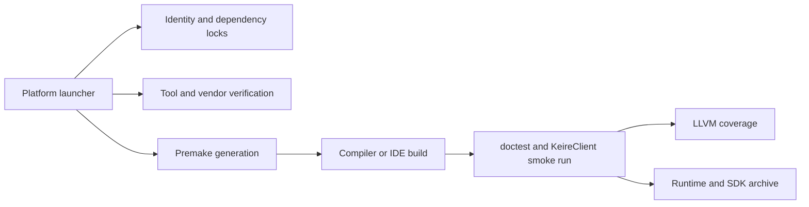

# Architecture

## Shared architecture foundations

`Application` owns the scheduler, memory tracker, string interner, diagnostic catalog/sink, source-module registry,
streaming manager, and replay service. They are constructed before services that consume them. Shutdown proceeds in
the opposite direction: managed generations and subsystem scopes cancel and drain, renderer and streaming references
retire, modules stop in reverse dependency order, and the scheduler closes last. Asynchronous work captures reference-
counted or weak state; reusable slots use typed generational handles so an old completion cannot address a replacement.

`JobSystem` has bounded priority-aware injection queues, local LIFO worker deques, FIFO stealing, configurable compute
workers, and a separately bounded two-worker blocking lane. Dependencies are immutable and scheduler-qualified.
Failure and cancellation propagate without hiding the originating exception; continuations can explicitly observe a
terminal result. A worker wait cooperatively executes ready work. `JobScope` supplies the cancellation-and-drain
boundary used by asset loading/cooking, navigation, managed builds and managed callbacks, thumbnails, material work,
VFX warmup, and physics. Jolt worlds share the application scheduler through a barrier adapter. Renderer submission,
filesystem monitoring, process reaping, audio callbacks, and the logger retain their required dedicated threads.
Strict simulation domains use submission order and deterministic partitions instead of stealing. Editor and tool asset
databases inject the same process-owned scheduler into catalog cooking; the small internal scheduler remains only as a
source-compatible fallback for standalone database consumers that do not provide one.
Dependency registration is serialized against dependency completion, so a dependent cannot become runnable until its
entire immutable dependency set is attached. Submission and close share one lifecycle gate, worker-initiated close
never self-joins, and overflow from each job's fixed scratch arena uses the configured upstream memory resource.
Stable-handle slot creation is transactional for both new and reused indices, so a throwing value constructor cannot
strand an unreachable slot or consume configured capacity.

## Hub product runtime and package workers

`KeireHubRuntime` is a private, engine-independent product library. Its owner-thread stores publish immutable settings,
project, installation, task, and notification snapshots through atomic JSON replacements. `HubTaskManager` derives a
deterministic dispatch set from those snapshots: downloads are bounded by the configured concurrency (two by default),
tasks that overlap a package are not dispatched together, and mutations sharing an installation ID are serialized.
Claiming a task records its worker PID and first phase in one store commit. Restart reconciliation preserves queued and
paused work, requeues resumable downloads, and turns interrupted mutation phases into retryable typed failures.

Optional Hub identity is a separate adapter boundary. `SupabaseAccountClient` owns bounded Auth/PostgREST request and
response contracts over the private native HTTP transport; `HubAccountWorkflow` owns asynchronous session rotation and
publishes immutable account snapshots. Only publishable desktop configuration enters packages. Refresh-token
persistence is delegated to a platform secure store (DPAPI on Windows, session-only fallback elsewhere), and no account
state participates in package trust, editor ownership, task authorization, or project locking.

`EditorInstallationManager` verifies schema-2 editor manifests, their canonical fingerprints, host identity, complete
declared file inventory, and confined entrypoints outside the UI layer, then publishes immutable health snapshots.
Managed repair and removal remain two-phase: the manager checks the exact registered root and unforgeable marker,
rejects running editors and installations with active tasks, and emits a typed plan that must be revalidated immediately
before a worker mutation. Running state combines Hub-tracked processes with a bounded native executable-path probe on
Windows, Linux, and macOS. An operating-system query failure for a process with the relevant executable name fails
closed, so an editor launched outside the current Hub session cannot be verified, repaired, or removed concurrently.
Native process handles remain confined to the private probe. The manager never deletes an installation itself. External
removal deletes only the atomic Hub registry entry and leaves every editor file untouched. A changed marker, health
result, or repair inventory invalidates a prepared plan instead of widening its authority.

The Hub's editor-management coordinator captures value-owned registrations and activity before sending manifest,
receipt, and file-inventory work to a bounded background operation. Its owner-thread poll rejects results after any
registry-generation, security-identity, root, tracked-process, or targeted-task change. Only that poll persists verified
health or hands a still-current repair/removal plan to the package task system; UI components consume immutable busy,
result, and failure snapshots and never hash an editor installation inside a frame.
Refresh health is committed as one bounded registry update so installed cards and catalog availability share a single
state generation. A separate missing-managed-registration operation checks the exact registered identity and root, then
requires the filesystem object to be definitively absent before removing only the registry entry; it never authorizes
or performs filesystem deletion.

Managed-editor repair is a distinct persistent task kind and worker protocol mode. Catalog planning requires every
signed package manifest to reproduce the exact receipt-bound editor/component versions, artifact digests, dependency
metadata, and file inventory already registered for that installation. The worker permits an existing destination
only in repair mode, rechecks its marker and executable activity before mutation and again at the atomic publication
boundary, and requires the newly staged receipt and ownership marker to reproduce the authorized aggregate identity.
New installs publish with an explicit no-clobber policy even if a destination appears after preparation. Repair
publication and recovery reauthorize both the registered destination and its same-parent backup under the publication
lock before proceeding; persisted worker mode must agree with task kind, and the completion snapshot retains the exact
fingerprint, tree identity, receipt digest, and nonce needed for non-mutating reconciliation.
This permits recovery of a missing or malformed on-disk receipt without treating an ordinary install as repair, while
leaving the old tree intact on cancellation, authorization drift, or package mismatch. Completion reuses the normal
managed-package registration path, preserving installation identity and refreshing its verified health snapshot.

`ProjectWorkflowManager` owns Hub-only project mutations while `Project` and the editor lock remain authoritative. A
duplicate is copied into a same-parent staging directory with generated output omitted, bounded file and byte counts,
portable case-collision checks, no symbolic links, a fresh schema-3 identity, and optional selected-editor validation;
only a fully re-inspected tree is atomically published and registered. Duplicate preparation captures an owner-thread
plan, bounded recursive copy and validation run in one cancellable background operation, and owner-thread commit
rechecks the catalog, source lock, staging identity, and destination immediately before publication. The coordinator
publishes immutable operation-ID snapshots and joins and discards unpublished staging during shutdown. Locate verifies
the descriptor's original project identity before replacing the catalog path. Display-name changes require a closed,
supported-schema project and update the descriptor and catalog transactionally. Removing a project affects only the Hub
catalog and never project files. The Hub routes pinning and last-opened updates through that same catalog, making it the
sole `projects.json` writer. Its legacy Core `ProjectRegistry` projection is reconstructed as a read-only presentation
snapshot after each mutation, so refreshing visible lock/status data cannot strip the runtime catalog's cached metadata.
Metadata scanning performs bounded lock and interrupted-upgrade probes on its worker before publishing status. The
owner thread validates the complete result set and persists every cached-metadata replacement with one atomic registry
write; a missing, duplicate, or invalid result leaves all prior metadata intact. The UI then overlays live
tracked-process state and derives missing-editor state through the same semantic editor selector used for launch. That
selector rejects unhealthy or entrypoint-less installations, out-of-range project schemas, versions
below the project minimum, and versions older than the last save; preferred-installation metadata is only a preference
inside that compatible set. Launch uses version-neutral descriptor inspection so the Hub can safely dispatch a newer
project to a validated newer editor without attempting to open it through the Hub build itself.
Upgrade-and-reopen dispatch skips a pre-launch metadata scan that could race the new editor's lock. A tracked process
exit requests a coalesced follow-up scan, ensuring the persisted lock state is refreshed without performing filesystem
work on the UI thread. Hub modal styling is centralized around semantic appearance tokens, including frame, button,
header, border, text, and status colors, so every project and recovery dialog follows the selected Hub appearance.

Package transfer runs in `KeireHubWorker`, not in UI components. The Hub creates one confined operation directory with
atomic request, status, result, and control documents; the worker rejects aliased or escaping protocol paths. The
runtime's transport interface streams bounded chunks into a SHA-256-addressed cache. A sibling `.partial` file and
atomic metadata document bind resumable bytes to package ID, URL, expected size and digest, and ETag; an If-Range
mismatch discards stale bytes before restart. Pause and cancellation leave valid partial data, while publication occurs
only after exact size and SHA-256 verification. Retry delays use bounded deterministic jitter and remain responsive to
worker control. The initial concrete worker transport handles offline `file://` imports; authenticated HTTPS package
streaming is supplied through the same interface rather than changing cache or task semantics.

Windows launches that worker with `CreateProcessW`, and the worker consumes `wmain` arguments directly so operation
roots containing non-ASCII characters never pass through the active ANSI code page. SDL-provided user directories are
decoded as UTF-8 before becoming `std::filesystem::path` values. Startup migrates the exact legacy `Kéire` component
produced by older builds, moving Hub-owned preference, cache, temporary, and task-journal trees without merging
unrelated non-empty roots. The task-to-notification tracker observes state transitions on the owner thread: first
observation is silent, new/retried work emits one start event, and successful or cancelled terminal transitions emit
durable activity history while progress remains an immutable task snapshot.
Terminal package tasks are removed only by the coordinator's serialized control queue; bulk removal atomically erases
terminal records while preserving active work. Read notifications use the notification store's atomic removal path.

The general process boundary prepares owned POSIX argument storage before `fork`; the child performs only descriptor
redirection, directory change, `execv`, and `_exit`. Windows capture launches use an explicit process-thread handle
list containing only the standard-input null handle and output pipe writer, preventing an unrelated inheritable engine
handle from escaping into a child. Native handles and partial launch setup remain under immediate RAII ownership.

Local Build Support inventory enumeration and verification use a separate owner-thread coordinator whose worker
publishes immutable component snapshots. Verified-cache clearing likewise runs through an exclusive maintenance
coordinator: it validates that no package task is active, stops the idle package workflow before deletion, projects its
state into the task center, and recreates package coordination only after completion. Neither operation performs
filesystem traversal or hashing in a UI frame.

Legacy Build Support Asset Tool processes use a separate schema-1 `BuildSupportOperationStore`, preserving schema-1
`.keireplayersupport` package compatibility without pretending those operations use the generic package worker. A
launching record is atomically committed before spawn and immediately amended with the child PID; failure to persist
that PID terminates the still-owned child. Restart recovery validates the exact target installation, Asset Tool,
operation root, status path, and cancel path. It combines PID liveness with the bounded exact-executable probe, but takes
no destructive ownership of a surviving child. Import/repair terminal state comes only from the atomic Asset Tool status;
removal terminal state comes from a fresh background inventory pass plus a bounded schema-1 root-journal inspection.
An indeterminate process probe stays conservatively busy. A crash in the narrow interval between spawn and PID commit is
recovered through the exact executable path; PID reuse can delay reconciliation but cannot authorize mutation or
termination. Recent terminal history is bounded and task-center visibility is reconstructed from the durable records.
Inventory refresh requests made while a scan is active coalesce into one owner-thread-scheduled follow-up worker, so a
pre-install scan cannot become the final snapshot after a successful import or repair.

`MemorySystem` exposes hierarchical domains, tracked PMR resources, immutable current/peak/allocation/external-byte
snapshots, an owner-thread frame arena, per-job scratch arenas, and fence-owned renderer upload storage. It does not
replace global allocation. The editor Architecture dashboard reports scheduler queues, memory domains, streaming
budgets, active and retired renderer bytes, module order, replay state, and structured diagnostic counts.
Application domains cover assets, renderer residency and fence retirement, physics, audio, animation, scripting,
navigation, editor, replay, streaming, jobs, and registered source modules. Asset CPU residency and renderer transient,
VFX GPU, and fence-retired bytes are refreshed from their authoritative subsystem counters.

`DiagnosticId` values use `KEIRE-<DOMAIN>-NNNN`. Definitions are registered transactionally before the catalog freezes;
reports carry severity, optional source location, and stable context. The Diagnostics panel resolves a packaged Markdown
page first and the configured repository documentation URL second. `StringInterner` IDs remain process-local and are
never serialized. Persistent assets continue to store canonical UTF-8 paths or UUIDs, while `AssetDatabase` maintains
transactional identity and canonical-path indexes and reports portable case-fold collisions.

## Streaming and frame-safe resources

Cooked catalog schema 3 retains schema-1/2 monolithic readability and adds semantic segment tables over independently
compressed, SHA-256-verified pages. New texture cooks publish metadata plus tail-first mip ranges, meshes publish
metadata plus per-LOD vertex/index ranges, audio publishes metadata plus time-windowed pages, and animation publishes
independently addressable time windows. Old catalogs surface one whole-resident compatibility segment.
Whole-asset `LoadAsync` remains compatible, while `ReadRangeAsync` and `StreamingSystem` expose explicit texture-mip,
mesh-LOD, audio-page, animation-window, and general residency requests. Priority follows metadata, reads, decode, and
publication; bounded aging in the shared scheduler prevents starvation. Each class has independent CPU/GPU soft budgets,
100/90 percent eviction hysteresis, pins, stale-handle cancellation, latency/miss/eviction counters, and retired-byte
accounting. Audio underruns are reported atomically; the callback emits silence without waiting, allocating, decoding,
locking a completion, or performing file I/O.

Request creation and `Pump` remain construction-thread operations because they coordinate with the application frame
boundary. Cancellation, release, pin/touch, snapshots, statistics, retirement reports, and idempotent close are
synchronized and may be issued by worker consumers. Handle/free-list storage is reserved to the configured request
capacity, so `noexcept` release and close do not allocate. Successful completion count is the denominator for reported
load latency; failures and cancellations have separate counters. Aggregate streaming bytes, failures, and evictions
are also published to the Assets profiler category.

Renderer resource replacement uses the fence retirement queue. GPU bytes remain charged until their submission fence
signals, and CPU pages remain owned by snapshots, jobs, or consumers until their last reference releases. The compiled
frame graph publishes an immutable inspection snapshot containing deterministic pass order, resource lifetimes,
transitions, estimated bytes, and physical alias slots. The Render Graph panel reads that snapshot rather than compiling
a second graph and performs JSON or Graphviz export only after an explicit atomic-save action.

## Fixed-tick replay and deterministic profiles

Gameplay input is latched at fixed-tick boundaries. Digital edges remain pending until a tick consumes them, analog
absolute values use the latest sample, and relative mouse/scroll values accumulate across render frames and are consumed
once. Actions are sorted by stable context/map/action/user identity and replay encoding stores exact floating-point bit
patterns plus the input-map fingerprint. Playback replaces only gameplay input; editor-control contexts remain live.

`.keirereplay` is a versioned chunk stream with build/project/module/content/deterministic fingerprints, SHA-256 chunk
and footer integrity, zstd checkpoints, an initial checkpoint, and a configurable 300-tick checkpoint interval. Seeking
restores the closest checkpoint and deterministically simulates intervening ticks. `StrictVerified` enables ordered
simulation scheduling and rejects any simulation-affecting module or serializer without a deterministic path.
`PerformanceCapture` retains complete input/checkpoints and divergence reporting without promising identical
intermediate GPU results. Runtime flags support record, play, verify, headless execution, startup-scene override, tick
limits, profile selection, and atomic JSON result reports. Checkpoint restoration validates every serializer before
mutation and rolls all restored serializers back if a later one fails. Runtime checkpoints include the scene graph,
Jolt transforms/velocities/sleep state, animator layers and transitions, managed behaviour state, presentation focus and
queued UI events, logical audio voice frames/pause state, and VFX emitter/random/spawn state. Strict replay selects the
canonical CPU VFX path and stores CPU particles; performance captures retain GPU emitter progress without claiming
cross-device bit identity. Networking and rollback transport remain outside this layer.
Replay input and checkpoints are decoded under the configured total-size and rewind budgets before allocation, and
variable-count fields are bounded before reservation. Recording charges the exact metadata, input, compressed
checkpoint, header, and footer sizes as data is captured, so it fails before retained tick data can exceed the eventual
file limit. Playback advances on the recorded logical tick rather than the host frame's tick argument. While playback
is paused, host-produced fixed steps are discarded without advancing `Time::FixedTime` or `FixedTickCount`; Step commits
exactly one replay and clock tick before the remaining host backlog is discarded. Recording, decoding, restore,
verification, and finalization faults transition the session to `Failed` and emit
`KEIRE-REPLAY-0002`; `Close` remains non-throwing without hiding that terminal state.

## Project upgrades and source modules

Project descriptors are schema 3 and include creation time, created-with and last-saved editor versions, optional
template provenance, and a sorted required source-module catalog. Schema-1 and schema-2 projects inspect as
`UpgradeAvailable`; they are not treated as corrupt, while version-neutral inspection can still dispatch a newer
schema to a compatible installed editor. `ProjectUpgradeService` produces a pure ordered plan, applies under the
project lock through path-confined staging and before-images, durably journals publication, validates each step and the
staged project, can recover or roll back an interrupted transaction, and retains the three newest successful backups
under `Library/ProjectUpgrades`. The Hub's upgrade coordinator performs inspection, apply, recovery, and rollback on a
worker and publishes immutable state; the owner thread only renders confirmation and consumes the terminal action.
`upgrade-project` is dry-run unless `--apply` is explicit and also exposes recovery and rollback.

Upgrade journals are written before snapshot work begins and use explicit initializing, snapshotted, prepared, ready,
publishing, and completed phases. Recovery rebuilds staging from the immutable before-image before rerunning a step,
so callbacks need not tolerate a half-written prior attempt. Journal schema, step continuity, affected-file sets, and
transaction IDs are validated before use. Canonical confinement rejects symbolic links and Windows reparse points;
the same check covers the editor lock, journal, snapshots, staging, and backup storage below `Library`, not only affected
project files. An orphaned `Active` directory is recognized as interrupted state and can be safely cleared.

`EngineModule` is a source-level interface. The registry deterministically resolves versions and dependencies, rejects
duplicates/cycles/mismatches before service startup, collects components, importers, decoders, replay serializers,
diagnostics, upgrade steps, and memory domains through one transactional registration context, freezes afterward, and
stops modules in reverse order. The same static source-module pack links into editor/client, runtime, AssetTool, and the
asset worker. Its ordered catalog is embedded in cooked manifests and replay fingerprints. There is deliberately no
`LoadLibrary`, `dlopen`, runtime unloading, or public binary plugin ABI.
The editor composes built-in asset importers with the registry's ordered module importers before constructing its asset
database; existing duplicate-name and duplicate-extension validation rejects collisions. Caret version ranges follow
SemVer's pre-1.0 compatibility rules and reject an unrepresentable overflowing exclusive bound.

## Persistence boundary

First-party settings, scene/project documents, thumbnails, input overrides, asset metadata/cache objects, catalogs,
and package manifests use one private atomic-publication service. It creates same-volume temporaries, durably flushes
data and containing directories where supported, publishes with bounded transient retry, and removes abandoned
transaction files during recovery. Callers do not implement private rename/write protocols.

Development and cooked asset payloads are immutable content-addressed packs. A publication installs packs before
atomically switching the small catalog, so open or queued reads retain valid generation paths across an editor reimport.
Retired packs use delayed best-effort collection rather than participating in the success boundary.

## Ownership

`KeireCore` is a static C++20 library and owns reusable application behavior, including projects, scenes,
reference-counted ownership, logging, and the Kéire UI runtime. `KeireClient` is the project editor, `KeireHub` owns
project discovery/creation and editor process launch, `KeireAssetTool` owns headless import/cook validation, and
`KeireTests` is independent. `DearImGui` is a private static-library build dependency
grouped under `Dependencies`; its reviewed definition lives in `Scripts/Premake/DearImGui.lua`, while generated project
metadata lives below ignored `Build/Projects/DearImGui`. First-party targets retain local `premake5.lua` files, and
the root file defines workspace identity, dependency grouping, and project load order.

First-run discovery and import preparation are bounded Hub worker-thread operations. The worker re-inspects every
discovered project descriptor and editor manifest, then publishes immutable prepared project/editor records. The owner
thread only preflights and commits those records through the runtime's batched stores. Both store plans are validated
before persistence; if the editor-registry write fails after the project-registry write, the controller restores the
exact prior project snapshot and durable file contents before returning the typed failure.

`Config/Project.conf` defines names and folders. `Config/Dependencies.lock` defines immutable external inputs. Premake and launchers read these files so renaming and dependency verification have one source of truth.

`Application` creates `RenderSystem` after Windowing and before UI. RenderSystem exclusively owns the SDL_GPU device,
window claim, swapchain, bounded submission thread, command recording, fences, viewport front/back resources, and
deferred retirement. Owner-thread scene snapshots cross the private queue by value; GPU recording and submission run
on the renderer thread and complete before the next owner-thread frame boundary. UI records through a private renderer
bridge rather than owning presentation. Scene/Game panels exchange only Kéire `RenderView` and `RenderSurface` handles;
backend resources remain private. Dynamic skinning, instance, and Forward+ transfers are recorded before their consumers
on the frame command buffer; the fallback upload queue is reserved for resource publication that cannot join that
ordered recording path. The renderer applies the configured frames-in-flight policy to SDL's 1–3 frame presentation
queue while retaining the full configured bound for fences and transient-resource retirement. Higher applied queue depths
favor throughput at the cost of additional presentation latency. Profiling attributes command recording to skinning, VFX,
draw preparation, frame-graph passes, and residual orchestration overhead.

The public `RenderSystem.cpp` PImpl facade delegates to separately compiled private backend units for device/frame
lifecycle, resource caches, surface/pipeline management, and scene recording. `RenderBackendInternal.h` is an internal
coordination boundary only; SDL handles and backend state remain absent from supported headers.

Offline spatial lighting follows the same ownership boundary. `LightingBaker` consumes an immutable scene definition,
validated public asset values, transitive content digests, and explicit bake settings; it does not own an editor, scene,
or GPU device. The asset worker owns process isolation and cancellation, atomically replaces the scene's lighting-set
reference only after every artifact is published, and returns progress through the existing worker protocol. The editor
Lighting panel queues that operation but never writes cache or scene files directly. Runtime rendering loads only typed
lighting assets, publishes replacements transactionally, and fence-retires superseded GPU arrays. Cache manifests are
content-addressed, digest-verified, and disposable; source scenes retain only stable asset identities.

`Application` also owns one `UndoService` before layer attachment. Editors create bounded contexts per document rather
than retaining process-global history. Commands own forward/inverse behavior and availability checks; nested
transactions preserve all-or-nothing semantics. Contexts close during layer teardown, and the service closes before
scene and asset services so no history callback can observe a partially destroyed document service.

Prefab source editing swaps in a dedicated `SceneDocument` and retains the active scene document, including its undo
context, until Prefab Mode closes. Stable-ID source replacement validates imported bytes before atomic publication and
rolls back source plus metadata on failure. Apply-to-source computes a canonical source-ID view of the selected instance,
preserves scene-owned root placement, and records the source replacement and scene metadata update in one scene undo
command. Variant saves regenerate overrides against the composed base; unsupported nested-owner flattening fails before
publication.
Hierarchy-to-Project drops cross the Asset Browser controller as an object ID plus destination folder and reuse the
same prefab extraction transaction as named creation. Prefab thumbnails compose source assets on the UI owner thread,
resolve asynchronous mesh handles, then transfer immutable mesh references and world matrices to the bounded CPU
thumbnail worker.

Managed IDE generation consumes the same validated `.keireasm` graph and C# project generator as managed builds.
Persistent solution/project files are conveniences derived from canonical assembly assets and source roots; they do
not become build authority or expose runtime-host implementation state.
Each collectible managed load context receives its own Coral internal-call table. Calls cross an application-owned
`IScriptRuntimeServices` boundary, retain only value handles, validate the currently executing script generation, and
route gameplay logging, frame time, input actions, and transform access back to owner-thread engine services.
Managed build generations contain both the engine API and gameplay outputs. Source checkouts incrementally compile the
API project into generation-local storage, while packaged editors copy their bundled API; candidate reloads consume
that immutable pair transactionally rather than resolving a process-global API artifact.

## GPU VFX And Media Import Boundaries

Play Mode treats VFX backend rejection as a recoverable failure. When a GPU-incompatible effect compiles for CPU,
`SceneRuntimeSession` transactionally rebuilds its scene-owned VFX world on CPU and restarts the emitters. Effects
invalid on both backends are isolated: the runtime logs the entity/effect identity once, suppresses repeated activation
attempts for the same asset revision and Blackboard override set, and retries after publication of a new revision. The
scene remains `Playing` in both cases; only a failure of the shared VFX world update remains a session-level fault.

`VfxWorld` remains the backend-neutral scene facade. Render-capable scene sessions select the GPU backend; headless
tests and explicit compatibility policy select deterministic CPU simulation. GPU snapshots contain only immutable
per-emitter work descriptors, cumulative spawn sequences, per-handle simulation revisions, a world simulation-step
revision, a world reset revision, and aggregate limits, including resolved bounded custom instructions. They never
contain per-particle CPU snapshots. The renderer owns persistent particle, free-list, alive-list, counter, event,
dispatch, and indirect-draw buffers and mutates them only inside an active render frame. Each emitter additionally owns
a bounded filtered-index buffer and an indexed-compatible indirect-argument buffer. A handle-filtering pass rebuilds
that view every frame; spawn allocation uses its atomic count to enforce the effect's authored capacity before
committing a shared-pool particle.
The renderer treats the world's maximum as a logical safety ceiling rather than an eager allocation request. It sums
the capacities of immutable live-system descriptors, selects an amortized power-of-two physical pool with a bounded
minimum, and only grows that pool during the world's lifetime. This keeps capacity diagnostics and million-particle
effects intact without making small scenes allocate or scan a million 160-byte particle records. Newly accepted spawn
indices are compacted through the per-emitter output buffer, so the ordered Initialize, first Output, and strip-link
kernels dispatch by spawn count. Post-simulation compaction is also reused when an emitter has no new particles.
Physical growth is an explicit simulation-layout restart and produces a capacity diagnostic; pools never shrink while
the world remains resident, avoiding allocation churn when emitters stop.
The prior frame's per-emitter filtered indices are the next frame's simulation work list. Update and Output therefore
dispatch by bounded emitter capacity and reject threads beyond the prior live count, while all emitters finish reading
their views before compaction overwrites them. The global alive list cannot exceed the saturating sum of active emitter
capacities, so handle-filtering dispatches use that aggregate bound rather than the larger amortized physical pool.
Generation-qualified kill passes retire particles for one stopped, restarted, naturally completed, or incompatibly
reloaded handle without clearing unrelated emitters. A transform pass applies Local-space emitter position/rotation
deltas to that handle's existing position, velocity, and acceleration state. Only `VfxWorld::Clear` advances the
world-wide reset revision. Compute world initialization, handle retirement, Local transforms, alive-list reset,
handle-filtered per-system simulation, bounded spawn, compaction, and indirect argument finalization precede one
indirect output draw per system. Sprite and Ribbon output bind either the authored texture or the procedural fallback;
Ribbon segments connect consecutive live identities inside each bounded strip, and generation-qualified links prevent
recycled pool slots from joining unrelated strips. Volumetric uses an analytic density impostor. Sprite, Ribbon, and
Volumetric output compose particle tint with the assigned material Tint, primary texture, and alpha state through the
built-in particle surface contract. Mesh output binds asset vertex/index buffers and compatible composed material
shaders with per-particle size, full Euler rotation, tint, and Forward+ lighting. Mesh-surface and sparse-volume
spawn resources are uploaded as weighted tables, and GPU Depth collision receives sampled scene depth plus camera
matrices. Immutable constants and live parameters share one value table, while shape headers and samples share one
fixed-stride table, keeping execution within SDL's eight-readonly-storage-buffer compute contract. Cable-ordered Module
and Custom operations execute together in the relevant spawn or simulation dispatch. Update and Output evaluation use
separate compute kernels so large schema-4 programs retain ordered semantics without exceeding practical D3D12 register
pressure. Spawn, Initialize, and initial Output evaluation likewise run as three ordered kernels; deterministic module
random state is carried in particle state until the particle is committed to the alive list, so a rejected stage returns
the allocation exactly once without publishing a partially initialized particle.
Each active system adds one filtered dispatch over the world particle capacity; this explicit cost avoids
effect-specific pipeline creation while retaining deterministic cross-backend semantics. Shutdown releases pipelines
before the device and treats repeated close as inert.

The editor requests GPU VFX pipeline warmup when its rendered workspace attaches. A low-priority compiler thread creates
the complete backend pipeline set and publishes it atomically, so render recording never observes a partial set and Play
Mode does not wait on driver pipeline creation. Shutdown joins that worker before releasing the GPU device. Clients that
own a loading screen can request the same non-blocking work through `RenderSystem::RequestGpuVfxPipelineWarmup`; clients
that do not request it retain synchronous first-use creation for source compatibility. `RenderStatistics` exposes the
pending/ready state and elapsed warmup time. While an explicitly requested warmup is pending, GPU VFX presentation is
deferred without blocking the frame; simulation and unrelated rendering remain live.

Schema-4 `.keirevfx` documents make execution explicit with `LegacyModules` or `Graph`. The graph compiler accepts
multiple particle systems with Spawn or named Event sources and canonical Initialize, Update, and Output contexts;
stable-ID Block, Operator, and Parameter references; typed, single-driver, forward `ParticleStream` flow; and a directed
acyclic topology. Context stacks lower every Block occurrence to its own execution ID even when payload references
repeat. Blackboard parameters and SSA-style value expressions lower into typed slots/registers, and a generic property
ABI connects defaults, literals, parameters, or particle-varying registers to CPU and GPU Block execution. Activation,
component, live-world overrides, reload, transform, Stop, and events are transactional through one root handle that
owns bounded internal system slots.

Portable Custom HLSL is a bounded backend-neutral instruction language, not arbitrary shader compilation. The compiler
accepts up to 4,096 verified assignments to Position, Velocity, billboard Rotation, Tint, or Size using `=`, `+=`, or
`*=`, a literal or typed expression operand, and optional trailing `* DeltaTime`. Both simulation backends consume the
dynamic lowered instruction stream. Unrestricted Unity-style HLSL, arbitrary resources, branches, loops, subgraphs,
decals, and froxel injection remain explicit capability tiers.

CPU texture, mesh, buffer, and attribute-map expressions cross a separate renderer-neutral `ResourceQuery` callback on
`VfxWorldSpecification`. Requests carry only a stable `AssetId`, operation kind, coordinate, integer index, and level;
results use bounded value lanes, dimensions, count, and transform data. Renderer handles, SDL types, and asset-system
ownership never enter the public graph or compiled-program ABI. A missing provider, rejected query, callback exception,
or invalid returned value fails the affected expression and records `SimulationValueInvalid`. These descriptors remain
explicitly CPU-only until the renderer exposes an equivalent cross-platform resource-table contract.

Schema 1-3 module documents remain readable and always decode as `LegacyModules`. Explicit Save publishes schema 4 without
changing their execution source; the explicit deterministic conversion operation replaces previous presentation
systems with one canonical graph while preserving emitter, payload, and Blackboard stable IDs. CPU-incompatible
features produce diagnostics rather than implicit substitutions. Managed VFX calls cross `IScriptRuntimeServices`,
validate entity/world/script generations, and enqueue component state for the scene-safe render boundary.

Asset import output may declare an effective primary type, but only from the importer's registered compatible type set.
The database validates that declaration before atomically publishing metadata, catalog records, dependencies, generated
subassets, and cache entries. Animation-only model containers use this path to become `AnimationSourceAsset` records
without mesh validation while retaining the parent asset ID and stable generated clip IDs.

Native WAV, Ogg Vorbis, FLAC, and MP3 probing remains on miniaudio's in-process fast path. Broad media conversion is
keyed by source digest, stream selection, importer version, and codec configuration, and cached worker output is
validated before restoration. FFmpeg is pinned as the signed `n8.1.2` source submodule and source-built as private
shared libraries linked only by `KeireAssetWorker`. Custom AVIO reads the staged source and writes bounded FLAC output
in-process; FFmpeg types never enter public headers or runtime/editor processes.

## Public Binary Boundary

Public classes and free functions with KeireCore-owned out-of-line symbols use `KEIRE_API`. Exception types that cross the managed-client boundary are annotated as well so their type identity remains consistent in a same-toolchain shared-library build. Header-only value types, templates, IDs, and aggregates do not own exportable symbols and remain unannotated. `GetApplicationCommandLineDescription` and `CreateApplication` are the deliberate reverse boundary: the managed executable defines them for KeireCore, so they must not be marked as library imports. Script regressions keep this policy explicit as the API grows.

`noexcept` is reserved for operations whose complete implementation is non-throwing. Snapshot observers that acquire a standard mutex allow `std::system_error` to propagate; destructors, shutdown helpers, and other mandatory cleanup paths instead contain synchronization failures and preserve any exception already in flight.

## Automation Flow

The scripts resolve `default` to a concrete compiler before generation. Architecture defaults to the native host and may
be overridden with x86_64 or ARM64. A generation stamp covers generator, architecture, toolset, CI warning policy,
Premake/config content, and the first-party source inventory, so adding or removing translation units regenerates stale
IDE/Ninja metadata automatically.

## Project Ownership

Project identity is separate from repository/template identity. `Project` validates the fixed marker, owns the canonical
root and exclusive editor lock, and supplies derived paths for Assets, catalogs, workspace state, input overrides, scene
recovery, logs, and builds. `Application` opens a project before logging and all project-backed services, then releases it
after layers, Input, Scenes, and Assets stop. No service consults the process working directory as an implicit project.

`ProjectRegistry` is Hub-owned per-user discovery state. `KeireHub` may inspect and launch projects but never owns editor
assets or the exclusive lock. Each detached KeireClient process revalidates and locks its requested project. The packaged
`samples/KeireSandbox` is a complete project and is validated through the same asset tool contract as user projects.
KeireClient keeps native window placement below project-local `Library/UserSettings`: normal bounds remain separate from
maximized/fullscreen state, restore occurs before the window becomes visible, and minimized state is never persisted.
The Hub coordinates one primary process per canonical executable identity. Secondary launches send one typed Show,
Navigate, Open Project, Import Package, Install Version, or Build Support action and exit without creating a window or
tray handle. The binary activation frame has an explicit magic value, protocol version, total length, action, field
count, and length-prefixed UTF-8 fields, with a 512-byte limit chosen to preserve atomic FIFO writes on Unix. Windows
shares the explicit frame length under the existing named-mutex channel. Decoding rejects unknown versions/actions,
truncation, trailing bytes, invalid UTF-8/control text, relative or traversing paths, invalid identifiers, and surplus
fields. The primary polls validated actions on its owner thread. `WindowSystem` tracks weak tray ownership and closes
every surviving native tray before SDL shutdown. Activation dispatch reuses normal page navigation, project opening,
and compatible Build Support import paths. An unavailable editor catalog ID, unsupported offline package type, or
missing version-specific Asset Tool records a warning notification and queues nothing. Layer teardown, explicit Quit,
and exceptional application shutdown therefore converge on the same idempotent cleanup path.

## Scene Ownership

`SceneAsset` is immutable imported data. `Scene` is an owner-thread mutable instance with weak object handles, validated
transactional hierarchy mutation, and explicit dirty/open lifecycle. `SceneSystem` owns loaded runtime instances and
pending operations. Asset workers decode immutable data; `Application` pumps completions, then Scenes commit loads,
unloads, and active changes at a safe frame boundary before Input and layer updates. Failed loads never replace the
last-good loaded set.

The editor owns authoring selection, undo/redo, atomic source writes, dirty decisions, and recovery files. Runtime scene
activation is refreshed only after source validation/import succeeds. JSON remains private to the scene importer.

Scene schema v5 stores stable entities and component records, prefab instance/override state, entity layers, scene
lighting-bake settings, and an optional baked-lighting identity. The public ECS surface owns stable IDs, weak `Entity`
handles, reference-counted `Component` instances, registration metadata, and Kéire math values. EnTT owns native entity
storage privately and GLM implements matrix/quaternion operations privately. A component registry is application-owned
through `SceneSystemSpecification`; duplicate IDs and incomplete registrations are rejected before a scene uses them.
Schemas v1-v4 migrate in memory, while unknown component records remain round-trippable Missing Components.

`SceneRuntimeSession` clones the in-memory authored scene for Play while retaining entity IDs. Pause suppresses update
callbacks, Step advances one fixed tick, and Stop destroys the clone. Component callback exceptions fault the session
and preserve the edit scene. Detailed contracts live in [ECS And Components](ECSAndComponents.md).

Managed entities use an opaque identity derived from the owning `SceneState`, shared by every Behaviour in that
runtime scene. Internal calls resolve an entity through any live Behaviour anchor in the same world and then through
the scene's stable entity table; stale worlds and destroyed entities therefore become inert without exposing native
pointers. Managed physics queries are routed through the application-owned runtime-services boundary and map
`PhysicsBodyId` values back to stable entity IDs. Collider and Rigid Body components remain serializable scene data,
while the Play adapter owns the isolated physics world and tears it down before the runtime scene closes.

The same boundary owns entity names, active-in-hierarchy state, hierarchy traversal, component registration lookup,
enabled state, and deferred component mutations. Managed native-component classes are stable-ID markers whose
`ComponentHandle<T>` values contain only world, entity, and component identities. Managed Behaviour lookup is resolved
from a generation-local weak registry, so one Behaviour can reference another without retaining an obsolete load
context after hot reload.

Managed field discovery projects primitives, enums, entities, typed asset references, and bounded nested
`[SerializableType]` members into ordinary `ComponentProperty` descriptors. Stable field IDs remain the serialized
identity while dotted property paths address nested Inspector leaves. Range, tooltip, and group metadata flow through
the same descriptor path used by native components. Canonical state JSON stores entity IDs without runtime-world
identity; restoration rebinds them to the owning Behaviour's current world before lifecycle callbacks run.

Audio playback crosses `IScriptRuntimeServices` as a value request containing the validated clip asset ID, output bus,
gain, pitch, priority, loop/spatial flags, and attenuation distances. The Play adapter creates or updates the scene
Audio Source and presentation runtime at the safe boundary. Editor-only asset preview uses a separately tracked voice
on the `EditorPreview` bus and is stopped when selection changes or the workspace detaches.

Audio asset import probes WAV, Ogg Vorbis, FLAC, and MP3 in-process through miniaudio. Other registered codecs and
media containers are normalized to lossless FLAC by an injected asset-worker backend using private FFmpeg shared
libraries. Custom AVIO callbacks avoid process creation and temporary source/output files; packet decoding and
resampling remain bounded, stream selection is explicit, and only the asset worker loads FFmpeg.

Weapon simulation is data-driven and split between deterministic command/state logic, a bounded ballistic projectile
pool, collision/damage adapters, and presentation springs. Physical magazine instances and loose-shell inventories are
runtime state; reserve counts are derived views rather than independently serialized values. Stable shot IDs include
shooter, weapon instance, sequence, and simulation tick so a future authority layer can reuse the same commands
without moving networking into the weapon implementation.

`SceneDocument::ActiveScene` is the editor authoring target: it resolves to the clone during Play and the edit scene
otherwise. Play edits have an isolated undo context. A snapshot-derived change set compares entity identity, hierarchy,
component presence/enabled state, and registered property bags before Stop; selected changes produce one validated
replacement definition and one authored-scene undo command. `ScenePlayChangeTracker` records the exact structural or
component path and editor-produced value before simulation advances again, so the review can distinguish Editor,
Runtime, and Mixed final values. Its dependency graph locks required created ancestors/components and rejects
delete/edit or remove/edit contradictions before definition validation.

Play-stop decisions are queued from UI callbacks and executed at the next update safe boundary. Render submission
captures camera, lighting, transforms, mesh/material identities, and tint into an immutable frame-local packet, so
device recording never queries a Scene that another lifecycle transition has closed. Docked panel focus is requested
through `UiPanelRegistration` without exposing Dear ImGui: Play selects Game, review/cancel retains Game, and a completed
Stop selects Scene.

## Reference Ownership

Project-owned shared objects derive from `RefCounted` and are constructed with `CreateRef`. `Ref` and `WeakRef` point at an external atomic control block containing a type-erased deleter. The last strong release destroys the object; the implicit weak owner then releases the control block when no explicit weak references remain. `WeakRef::Lock` uses atomic increment-if-nonzero, so it cannot resurrect an object or race its destruction. Cyclic graphs must contain at least one weak edge.

## Logging Lifecycle

KeireCore owns a private spdlog thread pool and two asynchronous loggers inside a reference-counted `LogState`. Public
headers expose only `LogLevel`, `FormatArgument`, `LogMessage`, and logger handles. Kéire parses its supported `{}`
formatting subset before crossing the implementation boundary, so neither spdlog nor fmt types, headers, or compile
levels are part of the SDK contract. The implementation does not register global names, replace the spdlog default, or
shut down unrelated state. Handles keep the state storage valid but take operation locks only while making calls.
Shutdown detaches the global state, takes its exclusive operation lock, flushes pending work, and closes it. It may wait
for an active call but not for a handle's lifetime; detached handles observe the closed state and become safe no-ops.
Accepted Core and Client writes also enter a bounded structured record history under a separate short lock. The editor
polls that history from its owner thread and advances an opaque sequence, so startup and worker messages reach the
Console panel without invoking UI from logging threads or exposing spdlog across the boundary. Coral's host callback is
adapted to the Core channel instead of writing around this path.

File paths are intentionally relative to the process working directory. Scripts and generated IDE targets set that directory to the repository root, producing consistent `Logs/Core.log` and `Logs/Client.log` paths.

## Window Platform Boundary

Public headers contain only Kéire value types. SDL pointers, flags, identifiers, headers, and raw events live in `Window.cpp`. `WindowSystem` owns SDL video state and is unique while active; each abstract `Window` delegates through a reference-counted private implementation. The creating thread owns SDL calls. Native window creation remains under an RAII guard until the handle and both internal indexes commit as one transaction. A final window release on another thread adds its opaque ID to a destruction queue, which event polling and shutdown drain on the owner thread.

The polling translator updates cached state before returning each `WindowEvent`, preserving SDL ordering. A private
tokenized router forwards every native event to application-owned UI and Input sinks before public translation, so
neither subsystem can consume events away from the other. Logical dimensions, pixel dimensions, display scale, and
requested cursor mode remain distinct and observable without exposing SDL.

Configuration is a separate typed boundary. nlohmann/json parses implementation-side input into `WindowSpecification`; callers never depend on JSON types. Strict keys and bounds make configuration mistakes deterministic rather than silently accepting typos.

## Application And Layer Runtime

`Application` is an explicit, single-run orchestrator for logging, event/time services, the SDL window system, the primary window, and an application-bound `LayerStack`. Construction is side-effect free; `Run` initializes services in dependency order and unwinds them in reverse order even when client callbacks throw. The construction thread owns `Run` and layer mutations, while `RequestExit` is the cross-thread application control. KeireCore owns the executable entrypoint, dependency-free help/version handling, the top-level exception boundary, application lifetime, and the `Run` call. A managed client defines a static `GetApplicationCommandLineDescription` and `CreateApplication`, keeping option documentation and validation client-owned. Because the entrypoint is an unreferenced member of the static library, tests and low-level SDK consumers that define their own `main` do not pull it into their executables.

`LayerStack` owns layer records and lifetimes, the overlay partition, pending structural operations, activation, traversal, and reverse-order teardown. Fixed and variable updates traverse bottom-to-top, while events traverse top-to-bottom. A depth-counted traversal guard keeps push/remove operations deferred through nested dispatch and callback re-entry until an application safe boundary. Ownership is unique, attachment is exactly once, automatic subscription creation is disabled once detachment begins, tokens disconnect before `OnDetach`, and shutdown detaches in reverse order before client shutdown and service teardown. `Application` coordinates safe boundaries and delegates its convenience layer methods to the stack.

## UI Runtime

`UiSystem` is an application-owned private implementation. `UiMode::Disabled` preserves the pre-UI runtime, `Headless`
creates a deterministic context without platform or graphics state, and `Rendered` initializes Dear ImGui's SDL3
platform backend plus a private bridge into the application-owned `RenderSystem`. RenderSystem owns the SDL_GPU device,
window claim, swapchain, and presentation lifecycle described above. Partial initialization unwinds in reverse order.
Shutdown removes event forwarding, persists the active layout when configured, closes the UI renderer/platform bridges,
and destroys the context before RenderSystem releases GPU and window resources.

Scene submissions carry a Kéire-owned `RenderEnvironmentSettings` value. JSON persistence stays private in
`ProjectSettings/Rendering.keiresettings`; public headers expose only colors, scalar values, paths, and validation
functions. Fragment-stage lighting consumes that environment together with the deterministic active Directional Light.
`ProjectSettingsDocument` owns the editor draft, validation, dirty lifecycle, atomic save, and coalesced undo command;
the workspace consumes its immutable settings for Scene and Game submissions instead of retaining a mutable copy.
Every primary editor panel owns its registration and persistent UI state. `SceneViewportPanel` owns its render view,
camera, framing, picking, marquee selection, gizmos, toolbar, and viewport drops; `HierarchyPanel` owns traversal and
structural commands; `InspectorPanel` owns component inspection while its `AssetInspectorPanel` composition owns asset
dispatch, diagnostics, naming actions, and material content; and the input-actions, project-settings,
asset-browser, console, and diagnostics panels own their respective tools. Panels receive document data, frame-value
snapshots, and named commands through narrow contracts; none retain, friend, or inspect `EditorWorkspaceLayer`.
`UiPanelRegistration` supplies a common session-local view lock. The UI boundary prevents locked panels from moving,
resizing, or collapsing, while selection-driven client panels retain only stable entity or asset IDs and validate them
before each draw.
During Play Mode, Scene and Game retain separate camera and input ownership: Scene always renders through its persistent
editor camera. The editor disables automatic input-user joining and explicitly pairs the fixed keyboard and mouse to its
owned user; pairing failures are fatal during workspace initialization instead of producing a zero-valued gameplay
context. The `Player` map and UI-capture override are validated before the Play session starts. Game input engages from
hover or a runtime capture request, even while dock focus is settling, and remains latched while its panel owns focus.
Losing application focus releases native capture without changing the requested runtime mode. Escape has a global,
editor-owned safety release when managed input fails; clicking the Game image re-engages that suspended capture without
warping the pointer. Hovering Scene therefore routes navigation exclusively to the editor camera without mutating
runtime camera state.
The workspace implementation is kept below 1,500 lines and is limited to service construction, frame order, command
binding, notices, and modal arbitration.
All authoring mutations, including menu primitives and viewport mesh/material drops, cross `SceneDocument`; workspace
code may inspect an active scene for presentation and picking but does not create, destroy, or edit scene objects itself.
Hierarchy multi-moves validate every source, destination, insertion sibling, cycle, and preserved world transform before
mutation. Selected descendants collapse under their selected root, and the validated roots move in payload order as one
editor transaction.
KeireClient owns the separate Scene gizmo controller and uses only the public UI drawing facade, so neither ImGui draw
lists nor GPU handles cross into client code.

Raw SDL events are forwarded through an implementation-only sink inside `WindowSystem::PollEvent` before Kéire's existing typed translation. Neither the sink, native window, SDL event, GPU device, nor swapchain appears in a public header. `UiCaptureState` is copied out as Kéire values for future input routing.

After fixed and variable updates, `Application` begins one UI frame, creates the root dockspace, and delegates
bottom-to-top UI traversal to `LayerStack`; overlays execute last and structural changes remain deferred. `UiFrame`
validates owner thread and active generation. Its RAII scopes balance backend begin/end calls during normal returns and
exception unwinding. Typed color and scalar/vector style scopes map semantic public roles to private backend slots and
restore them through the same generation-safe stack, so product UI code never owns a Dear ImGui style stack. Scene/Game
declarations and UI draw data are recorded into one coordinated RenderSystem frame.

`SceneTransitionCoordinator` is the editor-only serialization point for Open, New, Close, and Exit. UI, shortcuts,
Project actions, internal drops, and post-import external drops enqueue requests; the next update preflights the target
before replacing the document. Dirty-scene and Play-change decisions approve or cancel that same request, and duplicate
requests remain non-destructive. Panels use `Scene::IsOpen()`-filtered document views so an obsolete reference is inert.
Minimized or unavailable swapchain textures are skipped safely. Docking is active, while multi-viewports are forced off
because detached native windows require a separate ownership milestone.

`UiWorkspace` is an optional application-owned profile service layered above `UiSystem`. Panels register stable IDs and receive move-only registrations; the workspace owns visibility and submitted backend names without exposing Dear ImGui. The Default layout is an immutable factory recipe expressed through `UiLayoutBuilder`, while named layouts capture docking state plus known and unknown panel visibility. Changes autosave to a current-session document and the active custom profile. Explicit reset reapplies the factory recipe; custom profiles support save-as, rename, delete, and portable import/export.

Workspace catalogs, layouts, and custom themes use versioned, bounded JSON documents. Unknown or duplicate keys, invalid types, unsafe names, non-finite theme values, and oversized input are rejected before activation. Writes use a temporary file and recoverable backup replacement. Normal storage lives below `SDL_GetPrefPath(ProjectName, ProjectName)/Editor/Workspace`; an explicit directory supports tests and tools, and ephemeral workspaces perform no disk writes. Native file dialogs are asynchronous: callbacks copy results into a synchronized mailbox and the UI owner thread applies them at the next frame boundary. Shutdown makes late callbacks inert.

Themes cross the public boundary only as stable semantic tokens: canvas, panel surfaces, text, accent states, selection, status colors, spacing, borders, and rounding. Private code maps these tokens to backend style slots. Kéire Dark, Kéire Light, and Classic are immutable; custom themes persist as `.keiretheme` documents. Preview applies at a safe frame boundary, while persistence remains explicit. The client editor enforces Save/Discard/Cancel when a dirty theme would be switched or closed.

Opaque `UiImage` values extend that boundary for editor thumbnails. RGBA uploads happen only on the UI owner thread;
GPU texture identity and release remain private. The client asset browser owns a bounded thumbnail worker and deterministic
project-local cache, then transfers completed pixels through the façade. See [Asset Browser](AssetBrowser.md) and
[Editor Panels And Commands](EditorPanels.md).

Configuration examples, application-facing workflows, storage details, and troubleshooting live in the
[UI Workspace Guide](UiWorkspace.md).

## Asset Runtime And Pipeline

## Scene Presentation Runtime

`ScenePresentationRuntime` is the per-Play-session boundary for retained runtime UI and scene audio. It maps stable
scene entity IDs to generation-safe UI nodes and audio voices, synchronizes component changes after managed `Update`,
and clears every node, event, asset handle, and voice during scene replacement or Play Mode teardown. Editor Play Mode
and cooked runtime use the same synchronization and input path.

The retained tree owns layout, focus, hit testing, clipping, batching metadata, and bounded events. `UiFrame` currently
adapts its draw commands to the SDL_GPU-backed application UI pass; managed code reaches the presentation runtime only
through Coral internal calls and `IScriptRuntimeServices`, never through native pointers.

Editor material authoring has three deliberate workflows. `MaterialDocument` and `MaterialInspectorPanel` own compact
Direct Material editing. `MaterialGraphDocument` and `MaterialGraphPanel` own the Unreal-style artist surface graph,
template-derived Material Output, the shared Shader Graph expression catalog, instance/static parameters, composition
diagnostics, compatibility bindings, dirty lifecycle, and bounded undo/redo.
`MaterialInstanceAsset` stores only inherited property and surface overrides and is edited through the Inspector. All
three preserve a tagged raw-Shader or Shader-Graph reference behind the same runtime material boundary. Material file
snapshots enter the project-assets undo context; the workspace and asset-operation service coordinate persistence.
Continuous numeric/color edits update a development-only in-memory asset revision for immediate rendering and share a
property-scoped undo command until the UI edit boundary. The final serialized source is written once and its catalog
refresh runs in the background. Startup mounts a current development catalog directly; stale non-startup sources are
refreshed after the editor becomes usable.

`ShaderGraphDocument` is a separate authoring document layered on the shared stable node-graph canvas rather than a
second graph interaction implementation. It owns graph validation, undo/redo, compile options, generated diagnostics,
and the last-good preview definition and compilation. `ShaderGraphPanel` owns only transient selection, inspector
buffers, searchable node-palette state, graph gestures, output/preview controls, bounded adaptive software-preview
pixels, and presentation. The preview evaluates the validated built-in graph per shaded sample using the same coercion,
UV, procedural, shaping, surface, and neutral texture-semantic rules as generated shaders; unsupported custom functions
retain a bounded node-default fallback. The shared stable canvas installs an RAII draw-list clip covering the exact
canvas rectangle, so nodes and connection feedback cannot escape into adjacent preview or inspector regions. The graph
schema-v3 descriptor catalog assigns stable node type IDs, canonical pin contracts, cost metadata, legal shader
stages, graph purpose, and stable referenced-asset identities. Schema-v1/2 data is upgraded through deterministic
derived pin IDs and an explicit Shader purpose, so migration does not dirty the same asset
differently across machines. The compiler computes endpoint-aware reverse reachability from the single Master node
before lowering vertex and fragment expressions; structured Material Attributes and BSDF values remain typed through
validation and preview, then lower into private generated-shader structs rather than entering the renderer property ABI.
The resulting immutable statistics and advisory diagnostics expose unused work, texture samples, estimated ALU, and
variant pressure without weakening compile success. Built-in nodes are validated against canonical pin contracts even
when disconnected, while legacy Master nodes accept neutral defaults for later surface and attributes inputs. Graph
compilation is revisioned, debounced, and performed away from the owner thread; stale completions are discarded and only
the newest valid result can replace the last-good preview. The workspace supplies confined include reads, nonblocking
custom-mesh resolution through the asset system, and persistence.

Reusable Material Function, Shader Function, Material Layer, and Material Layer Blend assets wrap the same typed graph
model behind distinct immutable asset types. Their editor document runs in purpose-aware reusable mode: it validates
and persists the body without invoking standalone shader publication or representing the asset as a material. Parameter
nodes define typed call inputs and output-node inputs define call outputs. The compiler resolves references through a
callback rather than taking asset-system ownership, detects missing/wrong-purpose assets, interface drift, recursion,
and excessive depth, then deterministically clones reachable bodies from stable call-site/source identities before
ordinary stage analysis and lowering. Importers publish sorted dependency edges so changing a function invalidates its
consumers. Material Parameter Collections remain renderer-neutral asset/value definitions plus a revisioned,
thread-safe runtime state object; renderer-wide collection buffers and world ownership are deliberately not hidden in
the asset layer. Dynamic Material Instances similarly expose typed snapshots and revisions without exposing GPU or
backend handles.
Successful graph revisions bake parameter defaults into the stable generated material and publish that material through
the owner-thread development-asset boundary, giving scene renderers immediate immutable revisions without accepting an
invalid graph. Save stages the complete deterministic shader directory under `Library/Transactions`, preserves metadata
for retained variants, moves the previous generated directory aside, and publishes the canonical graph source only
after the staged directory is live. Any source-publication failure restores the previous generated directory while
preserving the original exception. The asset scanner ignores engine atomic-write temporaries and editor backups, so a
concurrent scan cannot assign identities to files that will disappear at commit. A successful save then queues a
targeted import of the parent graph, every generated shader/material subasset, and dependent loaded assets. Runtime
`MaterialGraphAsset` and `MaterialInstanceAsset` remain immutable data. Schema-3 Material Graph import loads the selected
Shader Graph template, applies compatibility defaults, replaces matching template-output branches with the material's
typed surface expressions, prunes unreachable template work, validates the composed graph, and publishes stable
material-owned shader variants plus one runtime material. Schema-1/2 graphs upgrade deterministically and retain their
previous value-binding behavior. Material Instance resolution starts from a Direct Material or Material Graph root
before applying at most 16 ancestors; it rejects cycles, unknown properties, and type changes without introducing
mutable renderer-global state. Instance import publishes its own stable ordinary `MaterialAsset` subasset referencing
the inherited shader variant; editor pickers and viewport drops alias the authoring instance to that renderer-safe
identity. Legacy `ShaderGraphInstanceAsset` remains registered for 0.1.x project compatibility but is not offered for
new creation.
Catalog-producing editor work is isolated in the private `KeireAssetWorker` executable. `AssetOperationService` owns
one child at a time, prioritizes external imports and explicit actions ahead of cook and coalesced material refreshes,
and exchanges versioned request/progress/result documents under `Library/AssetOperations/<operation-id>`. A worker
publishes a validated source-index snapshot beside the development catalog; the editor reloads that immutable snapshot
instead of hashing the project again. Cancellation is cooperative until publication. Shutdown waits 250 ms, terminates
an unresponsive worker, and lets the existing publication journal recover before another operation exposes records.
Native process handles and protocol JSON remain implementation details.
Every database owner also acquires the same crash-released project file lock for publication and source mutation. Cooked
directory swaps carry a versioned sibling journal, so startup either finalizes a fully published catalog or restores the
previous directory. New scene, material, and input-action sources use the external-import staging transaction rather
than becoming visible before validation and catalog publication succeed.
The asset database implementation is divided into source indexing/import preparation, external-import journals,
source mutation/trash transactions, and dependency cooking. Public methods acquire one non-recursive operation mutex;
explicit private unlocked helpers are used only while that boundary is already held, so nested publication no longer
depends on recursive-lock behavior. `AssetPipeline.cpp` remains the small stable API facade.
Scene picking consumes catalog metadata through `AssetSystem` and does not own an importer or source-model cache.
`SceneCameraController` owns navigation persistence and entity locking. `ViewportAssetDropRouter` dispatches scene,
input, mesh, and material drops through narrow commands, leaving the workspace responsible for composition and modal
coordination.

`AssetSystem` is optionally created after `EventBus` and closed before it. Its bounded priority scheduler owns worker
threads, while handles own reference-counted shared state and immutable payload revisions. Workers perform I/O,
decompression, integrity verification, and decode; `Application` commits completions and dispatches typed events at a
safe owner-thread frame boundary. Typed fallbacks cover queued and initial-failure states. Reload failure preserves the
last committed payload and records diagnostics rather than replacing working content.

Catalog mounts are transactional resolved views over versioned packs. Explicit priority and override permission prevent
silent identity replacement; bounded ranges, dependency closure/cycle checks, Zstandard result sizes, and SHA-256
protect decode inputs. Core owns Binary/Text lifecycle types only. No GPU, audio, model, scene, or native backend type
crosses this boundary.

`AssetDatabase` owns source-side identity through adjacent `.keiremeta` files, a content-addressed import cache, and
confined rollback-capable file operations. `AssetCooker` sorts stable IDs, writes deterministic sharded packs and a
versioned build profile into staging, then atomically publishes the directory. The editor and `KeireAssetTool` call the
same public APIs. Detailed contracts live in [Asset Runtime](AssetRuntime.md) and [Asset Pipeline](AssetPipeline.md).

Standalone player builds add a second transaction above cooking. Public value types own player identity and persistent
profile policy; internal Build Support code owns immutable native-template discovery, archive verification, branding,
signing-hook isolation, staged layout validation, and atomic directory publication. The editor only persists saved
profile choices and supervises `KeireAssetTool build-player`; it does not duplicate build logic or pass unsaved scene
state to the child. `KeireRuntime` retains explicit `--content` mounting while packaged startup discovers a validated
relative layout from `PlayerBuild.json`. Platform packs remain separate from projects and install transactionally under
the per-user preference root. Packaged runtime views are designated as native presentation surfaces and blitted directly
to the swapchain. `RuntimeUiTree` remains the shared Game UI layout, interaction, and draw-command model: editor previews
adapt those commands to editor UI, while standalone players submit them to a dedicated SDL_GPU compositor and do not
initialize or frame Dear ImGui. Windows assembly patches the copied PE template to the GUI subsystem without changing
the low-level console runtime used by tests and SDK consumers. Windows-host assembly also replaces the executable icon
resource with the selected or generated multi-resolution ICO; the template's linked resource supplies the fallback on
other assembly hosts. See [Desktop Player Builds](PlayerBuilds.md).
Contextual importers may publish typed generated sub-assets. Their IDs are derived from the parent identity plus a
semantic importer key, reconciled into the parent's metadata, validated with their own dependencies, and flattened into
the same transactional catalog as the parent. Model materials and embedded texture variants use this path. Material
extraction reimports the model in the isolated asset worker, transactionally creates editable source assets, and only
then publishes the replacement development catalog and source index.

Shader Graph import uses the same generated-subasset boundary: each keyword variant becomes a compiled `ShaderAsset`.
Its default `MaterialAsset` is an internal preview and legacy-compatibility artifact, not a user-facing assignable
material. Direct Material, Material Graph, and Material Instance sources sit above the shader interface. They store
tagged shader references plus property, keyword, surface, and baked-lighting state, then import to an ordinary immutable
`MaterialAsset`. Editor assignment resolves only those user-facing material sources to the runtime identity before
writing scene data, so `RenderSystem` continues to consume only its material/shader asset contract. Shader generation,
material binding, reload, dependency closure, and cooking remain asset transactions without teaching Mesh Renderer
components about authoring graph types.

Shader properties carry optional stable IDs. Material Graph resolves a binding by stable ID before its display name,
which preserves values through source-level renames and reports unknown or type-incompatible bindings explicitly. Raw
Shader manifests without stable IDs retain name-based compatibility. Renderer-specific shader generation remains
behind `ShaderAsset`; neither Material Graph nor direct Material public data exposes backend handles or compiler types.

Generated material shaders obey the fixed six-lane mesh vertex ABI and the renderer's complete pixel-interpolator ABI,
including variants whose graph does not consume every lane. Their vertex stage applies world-position offset before
projection; the fragment stage applies bounded pixel-depth offset and evaluates metallic/roughness PBR, Forward+ local
lights, shadows, image-based lighting, clear coat, sheen, subsurface, anisotropy, transmission, and refraction. Hair and
Eye outputs are authored through the same ABI with output-specific neutral defaults and raster state. Graph parameters
are packed into the ordinary material-property block; a zero-property sentinel keeps resource layouts valid on strict
graphics backends.

Shader Graph authoring separates serialized editor metadata from runtime-affecting edits. Node layout uses the
document host's validated metadata transaction and preserves undo/redo without invoking preview publication. Exposed
parameter defaults patch the last-good material compilation and publish immediately; topology, pin defaults, keywords,
and other shader-affecting changes use the generation-checked background compiler. Live shader imports request only the
host runtime format plus SPIR-V reflection, while ordinary asset imports continue to emit every supported platform
format. CPU preview jobs own immutable graph/property snapshots, are canceled by a shared generation token, publish a
quick reduced-resolution image first, and refine only when the graph remains unchanged; UI resources are created only
on the editor thread.

Windowing translates SDL drop sessions into an engine-owned event containing only opaque window identity, logical
position, and filesystem paths. Editor hit-test adapters resolve Project folders or the Scene viewport. External import
then moves to a worker, stages confined source/metadata pairs, validates with UI-independent importer option values,
and publishes or rolls back the batch without exposing SDL, ImGui, or JSON through public headers.

`RenderSystem` holds an owned `AssetSystem` reference and resolves renderable IDs only on the render owner thread.
Revisioned mesh, material, shader, texture, sampler, and attachment-format pipeline caches publish complete GPU
replacements at frame-safe boundaries. Buffers, textures, and pipelines replaced in flight retire behind the submitted
frame fence; failed rebuilds leave the prior revision active.

Asset code is grouped by subsystem: supported headers live in `KeireCore/Include/Keire/Assets`, implementation sources
live in `KeireCore/Source/Assets`, and implementation-only declarations live in
`KeireCore/Include/KeireInternal/Assets`. SDK packaging copies only the `Keire` public include tree, so internal headers
remain available to first-party builds without becoming part of the SDK contract. No first-party header is stored under
a `Source` directory.

## Input Runtime And Authoring

`InputSystem` is constructed after Assets and Windowing and before UI. It owns logical keyboard/mouse devices, SDL
gamepad RAII handles, users, pairing, control-scheme selection, action contexts, frame snapshots, and interactive
rebinding. Action definitions are immutable `InputActionAsset` revisions; runtime state and per-profile overrides stay
outside source assets. Stable IDs preserve context state across rename and hot reload. Input shuts down before Windowing
and Assets. Full contracts live in [Input System](InputSystem.md).

`.keireinput` is the first registered typed source importer. It validates bounded versioned JSON and emits deterministic
canonical bytes into the normal content-addressed cache and cooker. The dockable editor exposes every schema-owned
action type, value type, control scheme, composite, interaction, and processor while owning only mutable authoring
documents and uses the public Kéire UI facade. Details live in [Input Actions Editor](InputActionsEditor.md).

## Event And Time Runtime

`EventBus` uses exact C++ payload types without a base-event hierarchy. Typed and generic listeners share one priority/registration order; inactive tombstones allow safe unsubscribe and nested dispatch without allocating on the immediate path. Owner-thread dispatch and subscription keep callback mutation deterministic. A bounded mutex-protected queue accepts owned events from any thread, rejects overflow without blocking, and drains a fixed snapshot so producers cannot starve a frame. Closing a bus makes retained references and subscription tokens safely inert.

`Time` is application-owned rather than process-global. A monotonic frame sample feeds raw, clamped unscaled, scaled, smoothed, and elapsed clocks. Scaled time feeds a 60 Hz accumulator with a fixed per-frame tick cap; excess whole ticks are recorded as dropped simulation time while the fractional interpolation remainder is retained. Pause and minimized suspension stop scaled simulation without losing real/unscaled time.

## Dependency Build Boundary

Assimp and stb are immutable private asset-import dependencies. Coral d53b268 with the versioned Kéire patch set,
.NET 10, Jolt 5.6.0, Recast/Detour 1.6.0, and miniaudio
0.11.25 are immutable private gameplay dependencies resolved into compiler-keyed source and build caches from exact
commits in `Config/Dependencies.lock`. The dependency bridge builds Assimp statically with
only OBJ, FBX, glTF, and GLB importers and no tools, tests, samples, or exporters; stb_image has exactly one private
implementation translation unit. SDKs retain the Assimp/stb license notices and the static Assimp link closure, but do
not redistribute either dependency's headers or add a general third-party include directory for consumers.

Premake remains the Kéire build authority. A dependency-only CMake invocation builds and installs pinned SDL3 Debug
and Release variants into ignored, compiler-keyed caches. A generated Lua manifest supplies Premake with the selected
include/archive paths and platform requirements. SDK packages preserve SDL's official CMake target and make
`Keire::Core` transitively depends on the private ImGui, Zstd, Assimp, Jolt, Recast/Detour, miniaudio, Coral.Native,
and nethost libraries
followed by `SDL3::SDL3-static`. Gameplay middleware headers never cross the supported include tree.

On Windows, every generated final executable that links KeireCore stages `nethost.dll` beside itself as part of its
own build rather than relying on a launcher side effect. The editor's generated Visual Studio, Xcode, and Make projects
also stage the Coral assemblies, first-party managed API, and bundled hostfxr/CoreCLR tree through the same scripts used
by repository launcher builds.

The pinned Dear ImGui docking sources, standard-string adapter, SDL3 platform backend, and SDL_GPU renderer compile in
the dedicated `DearImGui` static-library project. It emits `KeireImGui.lib` on Windows and `libKeireImGui.a` on Unix,
uses the workspace runtime/configuration/architecture/sanitizer policies, and alone disables compiler warnings for its
third-party translation units. KeireCore retains private include access for its UI implementation and links the archive;
KeireClient remains free of Dear ImGui includes and symbols. KeireTests may include ImGui privately only for dependency
and lifecycle verification. The internal link closure preserves `KeireCore` → `KeireImGui` → SDL3 for final binaries.
SDL_GPU selects D3D12 or Vulkan on Windows, Vulkan on Linux, and Metal on macOS; SDL_Renderer remains disabled.

Pinned Zstandard sources compile in the dedicated warning-isolated `Zstd` project as `KeireZstd.lib` or
`libKeireZstd.a`. KeireCore privately includes `zstd.h` for pack compression/decompression. Neither its headers nor
implementation types cross the public API. SDK targets preserve the Core → ImGui → Zstd → SDL static link order.

Pinned EnTT 3.16.0 and GLM 1.0.3 are header-only private dependencies. Their IDE utility projects live in the
`Dependencies` solution group, generated metadata stays below `Build/Projects`, and only their utility projects disable
third-party warnings. KeireCore treats their include roots as external. SDKs package their license texts and locked
commits but not source trees because no supported header exposes either dependency.

Pinned SDL_shadercross and its exact recursive DXC, SPIRV-Cross, SPIRV-Headers, and SPIRV-Tools gitlinks build a
host-native `KeireShaderCompiler` during bootstrap. The compiler and runtime libraries are SDK asset tools, never Core
link dependencies. Shader import produces DXIL, SPIR-V, and MSL canonical variants and validates Kéire's fixed resource
ABI through reflection before publication.

## Release Shape

Packages include KeireHub, the KeireClient editor, KeireRuntime, KeireAssetTool, KeireShaderCompiler and its runtime libraries, KeireCore plus private KeireImGui/KeireZstd archives,
public `Keire/<header>` APIs, the SDL static SDK, complete dependency license texts, notices, README, and a
complete `samples/KeireSandbox` project, canonical `Docs/` release guidance, and a separate transitive cooked-content
tree. First-party declarations originate in project `Include/` trees, implementation units remain in `Source/`, and
packaging never relies on case-insensitive path aliases. The packaged asset tool cooks
and validates the sample startup graph, then `KeireRuntime --content <path> --frames 12` renders it as a bounded smoke
from a tracked-file allowlist. Generated workspace and recovery data is rejected in the stage, archive, and extracted
validation copy
before archive publication. Dear ImGui and Zstd headers/sources are not redistributed because Kéire's public facades own
the supported contracts. Direct validation links Core, ImGui, Zstd, then SDL; the generated CMake package carries those
private archives through `Keire::Core`, so low-level and managed consumers still name one Kéire target.
Packaging extracts the archive and compiles, links, and runs both consumers. CMake builds SDL and serves consumers;
Premake builds Kéire. Release debug symbols are uploaded separately where a platform toolchain emits them; Dist is
intentionally stripped. Export annotations describe same-toolchain shared-library preparation only, not a
compiler-independent C++ ABI.

The separate editor distribution is a Dist-only, host-native projection of that validated release stage. It retains
the editor, runtime/asset/shader companions, media libraries, sample, manifests, and notices; replaces the
runtime-only managed payload with the complete .NET 10 SDK; and removes SDK headers, archives, CMake metadata, and
consumer sources. Editor artifacts also remove the Hub executable, its private HubWorker, Hub content catalogs,
templates, fonts, launchers, and desktop integration; those belong to the standalone Hub artifact. Windows, macOS, and
Linux packages are produced on their respective hosts. Editor companions remain sibling native executables under
`bin`; the macOS Editor `.app` and top-level launch scripts delegate into that same layout.

The standalone Hub is a separate Dist artifact boundary. It contains the Hub executable, the private `KeireHubWorker`
task process, and private load-time runtime,
branding, licensed fonts, documentation/learning content, the validated `KeireHubContent/Templates` catalog and
declared payloads, and license material; it rejects the editor-specific AssetTool/AssetWorker/runtime/shader
companions, the
full .NET SDK, and SDK development trees. Editor and Hub schema-2 manifests share project-schema compatibility, module
and canonical metadata fingerprints, optional packaged-template/toolchain/license references, SHA-256 file inventories,
and exact installed sizes while exposing product-owned entrypoints only. Editor manifests preserve their schema-1
top-level fields so existing combined installers and discovery code can migrate without an atomic format cutover.

The distribution-service package also owns a runtime-dependency-free static `Website/` boundary. Caddy serves it for
human routes and forwards only `/v1`, `/v1/*`, `/health`, and `/health/*` to the loopback .NET origin, so site deployment
cannot reinterpret signed catalog bytes, package range requests, or readiness semantics. The `DocumentationSite/`
build validates an exact inventory of every canonical `Docs/**/*.md` source, requires a live code/configuration
authority per guide, resolves local links and heading fragments, and checks key format versions against code. It then
transforms those sources into branded Astro Starlight pages beneath `Website/docs/`, renders GitHub-compatible Mermaid
fences as responsive accessible SVG at build time, and creates Pagefind's same-origin search index plus a documentation
sitemap. Generated pages contain no inline executable code or style values: a deterministic finalizer extracts them
into content-hashed `_astro` assets so Caddy's self-hosted CSP remains enforceable. The Downloads page is an untrusted
catalog consumer: it validates the stable host matrix and exact `hubInstaller` fields before offering a content-addressed
link, while the installed Hub remains the authority for signature verification and managed update installation. An
unsigned development preview is a separate static deployment boundary: it is never inserted into a stable catalog,
must be labeled unsigned, uses a digest-suffixed immutable URL, and is offered only after same-origin metadata and a
matching content-length HEAD probe pass. HTML, CSS, JavaScript, and preview metadata revalidate independently so a new
page cannot execute against stale presentation or release-control assets.
Documentation HTML revalidates on every visit, content-hashed `_astro` assets are immutable, and Pagefind/runtime assets
use bounded revalidation. Pagefind's WebAssembly execution is the only CSP evaluation exception; worker execution is
limited to same-origin and blob workers, and all documentation scripts, styles, fonts, and indexes remain same-origin.
The public Contact form calls a narrowly scoped Supabase Edge Function. That function enforces exact origins, bounded
streamed input, strict UTF-8/object JSON, a honeypot, and a keyed-IP-hash rate limit before writing with server-only
credentials. Only the edge-provided Cloudflare client-address header participates in the rate key; caller-controlled
forwarding headers are ignored. Anonymous and authenticated browser roles have explicit deny policies and no table
privileges. The function's npm graph is committed in `deno.lock` and checked with frozen restore semantics.

macOS release binaries share the deployment target pinned by `MACOS_DEPLOYMENT_TARGET` in the dependency lock. The
package boundary verifies each non-.NET Mach-O load command against that target before publication. Native installers
sign individual Mach-O files and nested code bundles from the inside out, then seal the outer application. The bundled
Microsoft .NET tree remains an independently signed third-party boundary whose signatures and bytes are verified but
never rewritten. Only the managed editor host receives the reviewed JIT/runtime entitlements; the standalone Hub does
not.

A KeireCore prebuild step refreshes version and source-control identity under `Build/Generated` immediately before compilation, including tracked and untracked dirty state. The generator C-escapes configured strings and only rewrites the header when its content changes. The compiler supplies configuration, compiler, platform, and architecture identity. Packaging regenerates identity and verifies the staged binary's commit prefix and dirty marker against its manifest. The resulting `Keire::BuildInfo` describes the binary itself rather than the machine inspecting it.

## Performance Observation And Background Work

The application-frame profiler stores one bounded full frame plus a ring of lightweight summaries. Spans carry stable
thread identifiers and monotonic microsecond timestamps, allowing the editor to present hotspot and chronological
thread-lane views without instrumenting editor code through private APIs. `LatestChromeTrace()` emits a
Perfetto/Chrome-trace-compatible snapshot. Renderer timings remain explicitly CPU-side until SDL_GPU exposes portable
timestamp queries; `GpuTimingSupported` prevents recording or displaying synthetic GPU measurements. The renderer also
records submit-to-observed-fence-completion latency for all frames and for frames containing GPU VFX. That value is a
queue-completion observation, not elapsed GPU execution time, and is deliberately named and gated separately. Managed callback
timing uses fixed per-instance accumulators on the owner thread. The editor performs bounded type/lifecycle aggregation
only at its throttled presentation refresh and limits default-open row submission to reduce profiler observer overhead.
The renderer separately reports oldest-frame GPU fence wait, swapchain acquisition wait, VFX physical particle
capacity, compute dispatches, and compute thread groups. Fence wait is measured at the frames-in-flight boundary, so a
large `Render begin` span can be attributed to GPU/present back-pressure without misclassifying it as scene-recording
CPU time.

Reference-hardware gates live in `Config/PerformanceGates.json`. The validation tool independently recomputes frame
percentiles from exported history, validates capture metadata and driver identity, and applies renderer/VFX counter
budgets. Profiles that require GPU timestamps reject a backend without real timestamp support; fence latency is never
substituted. Production validation always tests the gate machinery and can consume an explicit snapshot, history, and
metadata triplet on a named graphics worker.

Development `AssetDatabase` instances own a stoppable monitor thread. The monitor performs metadata/signature
reconciliation away from the application thread and publishes a complete immutable candidate tagged with the source
revision. The owner thread discards stale candidates, debounces changed identities, and atomically updates its record
snapshot. Explicit asset mutations advance the revision and wake reconciliation, preventing an older background scan
from overwriting a newer editor transaction.

Forward+ retains its deterministic CPU fallback while caching the projected grid and GPU storage uploads by viewport,
camera, and local-light content. The capability flag keeps a future GPU-compute implementation ABI-compatible without
claiming support on backends that cannot provide it. The editor hierarchy builds prefab membership and parent-child
adjacency once per snapshot, preserving scene order while avoiding recursive full-scene searches.

## Animator Controller Authoring

Animation graph execution remains owned by `KeireCore`: stable local IDs identify parameters, layers, state-machine
subgraphs, states, transitions, conditions, and blend-tree children, while `AnimatorInstance` owns typed runtime values
and immutable debug snapshots. Subgraphs are authoring/navigation groups with validated per-group entry states; the
runtime graph stays flat by stable state ID so transitions can deterministically cross subgraph boundaries. The editor
owns only an `AnimatorControllerDocument` draft and panel selection state. Drafts may be
temporarily incomplete, but Save canonicalizes and validates the complete graph before atomically replacing the source;
failed validation therefore cannot replace the last-good imported asset.

Animator state presentation reuses `StableNodeGraphCanvas`; the panel maps serialized string IDs to deterministic local
canvas IDs, then translates completed node drags, typed pin connections, cable deletion, and context actions back into
one document transaction. Canvas selection and popup state never enter the asset. Runtime state order and transition
evaluation are therefore independent of layout, zoom, pan, or editor interaction state. Edit-mode preview evaluates a
private `AnimatorInstance` against the selected scene object's target skeleton and writes only its transient runtime
pose; teardown clears that pose. Transition visualization, pose/trajectory inspection, and profiling consume the same
immutable debug snapshot as live playback.

## Skeletal Deformation And Rig Authoring

`SkeletonAsset`, `RigDefinitionAsset`, `SkinnedMeshAsset`, and `AnimationClipAsset` are independent immutable assets.
Stable generated-subasset IDs let a model reimport replace payloads without invalidating controller, prefab, or scene
references. Model import either preserves embedded skinning, generates a deterministic profile, or disables rigging.
Embedded skeletons pass through deterministic semantic inference so authored Mixamo, Blender, Unreal, humanoid, biped,
and quadruped names participate in the same retargeting and IK contracts. Unknown bones remain ordered, retained, and
unclassified rather than being discarded.

The scene runtime samples animation into local bone transforms, applies named IK goals, optionally performs scene-owned
ground raycasts and transactional foot grounding, computes the palette, and then submits deformation. The standalone
ragdoll transition blends animation and physics-provided local poses but does not own physics bodies or constraints.
Linear-blend skinning uses the SDL_GPU compute cache when available. Dual-quaternion skinning and
unsupported compute paths use the deterministic CPU implementation; both paths produce an engine-owned transient
deformed stream reused by scene, depth, and shadow recording. No native pointer or graphics allocation crosses the
managed boundary.

`RiggingStudioPanel` owns only draft import settings and retarget selection. `AssetDatabase::SetImportSettings` commits
validated metadata atomically, `RequestReimport` advances the source generation, and the isolated asset worker publishes
the complete model/subasset transaction. Import-time animation compression reduces keys against explicit translation,
rotation, and scale tolerances and reports measured errors. Retargeting produces a bone-by-bone exact/semantic/conflict
diagnostic before it writes a standalone `.keireanim` source. Strict cooking decodes every rig, clip, and skinned mesh and validates declared
dependency types, mesh/influence cardinality, and influence bone bounds before publication.

Runtime IK goals are persistent named `AnimatorComponent` state. They are resolved after graph sampling and before
palette generation at the scene-safe animation boundary. Managed calls carry world/entity generations and value data;
the bridge validates animator existence, goal space, solver limits, and stale scene state before mutating the component.

Controller node positions are optional schema-v2 authoring metadata and never affect runtime evaluation. Project-panel
clip drops resolve through typed asset records before creating states. Undo commands retain complete graph values but
are scoped to the open asset identity, preventing stale document commands from mutating a newly opened controller.
Managed Animator reads consume the component's immutable runtime debug snapshot, while writes remain queued
generation-safe commands applied by the scene presentation runtime.

## Shared Asset Documents

`AssetDocumentHost<T>` owns typed draft/baseline state, bounded undo/redo, validation, preview, atomic persistence,
discard, and revision-aware reload conflict handling. The host never owns runtime objects: system-specific documents
translate validated definitions into development-asset previews and cancel transient preview state when they close.
Stable local IDs, rather than display names, identify authored graph nodes and connections. `Curve1D`,
`ColorGradient`, stable-node canvases, and selection-aware scene handles are shared value/editor primitives; ImGui and
backend implementation types remain inside KeireClient.

Builtin importer and decoder construction is centralized in `BuiltinAssetRegistry`. The editor, isolated worker,
AssetTool, runtime catalog, and tests request the same registrations, preventing an authored extension from importing
in one process but failing in another.

## Physics Runtime And Authoring

`SceneRuntimeSession` eagerly creates one `PhysicsWorld` for each Play or cooked scene. Its fixed boundary is gameplay
`FixedUpdate`, incremental body/controller synchronization, Jolt stepping, dynamic Transform pullback, then stable
contact dispatch. Body identities are generation-safe and never expose Jolt types. Layer/mask filtering is applied by
the configured 32-slot collision matrix in body broad-phase filters and query paths.

The editor writes collider handle changes through `SceneDocument`, so a drag is one undoable authoring operation.
`PhysicsDebugSnapshot` copies bounded body, contact, and query-ring state only when capture is enabled; the shipping
default records nothing. Physics Material and collision-mesh references remain ordinary asset dependencies.

Character movement queues value displacements from scripts and consumes them at the scene physics boundary. The runtime
uses closest-hit capsule casts with the controller body excluded, skin padding, bounded sweep/slide iterations,
walkable-normal tests, and an up/forward/down stair transaction. Authored capsule height is total tip-to-tip height;
Jolt receives the derived cylinder half-height. Ground state and resolved velocity are copied back to the component
after stepping. Managed code receives only values through `CharacterControllerHandle`; no Jolt shape or body handle
crosses the scripting boundary.

## Managed Scripting

`ScriptSystem` owns managed build orchestration, runtime hosting, reflection, generation-safe reload, Behaviour
instances, and the native call bridge. Private `ManagedSdk` support owns persisted SDK selection and cross-platform
dotnet discovery, keeping filesystem and process-environment policy out of the runtime implementation. Configuration
writes preserve unrelated scripting settings, and custom SDK resolution requires a .NET 10 SDK before it can become an
active build dependency.

## Managed Data Assets

`.keiredata` stores the authoritative stable managed type ID, a diagnostic type name, stable-field values, and sorted
dependencies. Script generation preparation discovers concrete runtime `ScriptableObject` types and validates their
property graphs before publishing descriptors. The application-owned `AssetSystem` performs real cancellable loads,
while `ScriptSystem` hydrates objects in generation order and transactionally retains the previous script/asset
generation on failure. Asset-only reload copies supported serialized state into the active object so cached managed
references retain identity.

Strict cooking builds and loads runtime managed assemblies before decoding the managed type catalog and validating
managed-data semantics. Scene Behaviour and managed-data references participate in the normal cook graph, so closure
is scene to managed data to referenced managed/native assets. Test assemblies are excluded from runtime discovery.

## Audio Mixer And VFX Assets

`AudioMixerAsset` is an immutable authored definition with stable bus/effect/send/snapshot/ducking IDs and explicit
AudioClip dependencies for convolution. Audio Source schema 2 forwards legacy string buses while carrying a mixer,
stable local bus ID, and `Curve1D`. Scene presentation resolves revisioned mixer assets, while `AudioSystem` owns
immutable compiled routing snapshots behind generation-safe registrations. Each presentation releases its
registrations when a mixer is no longer referenced or the presentation clears, so multiple presentations cannot
invalidate one another or reuse stale project state. A valid stable bus ID wins over the compatibility name and
applies its authored fader, mute, solo, and parent hierarchy to existing and new voices; invalid replacement leaves
the last snapshot active. Headless rendering executes ordered effects, sends, parent routing, ducking, and bounded
automatic meters. Reverb Zones select against the primary listener, blend one priority-resolved mixer snapshot and
send scale, and restore the immutable source definition after exit. Legacy string gain and stop controls forward
through the currently resolved authored bus name, while voice diagnostics report the resolved mixer, bus ID, and
registration. The editor's typed `AudioMixerDocument` publishes transient live routing/fader previews; complete
stateful device-callback DSP and decoded convolution IR binding remain an explicit later phase.

`VfxWorld` owns fixed-capacity effect and particle storage. Activation is transactional, handles include generations,
and revision-aware replacement preserves bounded lifecycle behavior. Non-looping GPU effects advance through their
particle-drain interval after emission stops so generation-safe handles release at the actual last-death time. The CPU
path publishes immutable sprite/mesh render packets into the transparent pass and records explicit diagnostics when GPU
depth or scene-physics requests select CPU simulation. Each activation compiles the selected execution source, resolves
typed Blackboard defaults and stable-ID overrides, materializes only the scheduled module payloads, applies canonical
property bindings, and resolves portable custom operands. `SetParameterOverrides` swaps the complete resolved value set
transactionally; `SetParameter` and `ResetParameter` are single-value conveniences. Reload preserves compatible
same-ID/type exposed overrides and reports rejected values without compromising unrelated handles. GPU Force,
Size, Color, and Renderer state is baked per particle; a live change advances only that handle's simulation revision so
old baked state is retired without clearing the shared world. Portable Update/Output operand changes remain live.
Immutable render snapshots publish separate document and simulation-step revisions. GPU resources apply mutation-only
snapshots for lifecycle, transform, restart, and spawn sequencing, while consuming each positive world update at most
once. Newer mutation-only snapshots rebuild visible alive indices with a zero simulation delta; equal or stale
snapshots leave the newer persistent buffers and indirect arguments unchanged.

`VfxEffectDocument` owns transactional systems, nodes, pins, connections, blackboard properties, module payload
records, curves, and gradients without exposing ImGui. All graph edits preserve stable IDs; removing a node or pin
removes its incident links in the same validated undo command. The panel projects those values into a context-colored
node canvas and commits graph positions only when a drag finishes. New documents use schema-v3 Graph execution.
Legacy documents display their compatibility execution source until the user invokes the undoable deterministic
conversion. In Graph mode, `ParticleStream` topology supplies the module/custom schedule, Module nodes retain stable
payload references, Parameter nodes retain stable Blackboard references, and Portable Custom HLSL lowers to bounded
CPU/GPU instructions. Built-in module types retain canonical stage semantics while cable topology defines deterministic
Module/Custom order within those stages. The separate Runtime Modules tab is a payload editor, not an alternate
implicit schedule.

The editor owns one shared, transient `VfxWorld` for asset-authoring and scene edit-mode previews. It defaults to CPU
for deterministic authoring and can be rebuilt for GPU runtime inspection. Checked `VfxEmitterComponent` instances are
synchronized by edit-scene identity, entity, effect/revision, compatible serialized parameter overrides, seed, enabled
state, simulation speed, and decomposed world position/rotation. When an open draft matches an eligible scene emitter,
its transient handle replaces one selected or deterministic matching scene handle and is routed to that emitter
transform and compatible override set. This preserves unsaved draft preview while preventing a second copy at world
origin; unrelated emitters retain independent handles. World-space editor previews restart after authored gizmo
relocation so old particle history is not displayed beside the new emitter position, while runtime World-space
semantics remain unchanged. GPU retirement is generation-qualified, so restarting that editor handle preserves the
particles and spawn progress of unrelated preview emitters. Local-space particles follow synchronized
position/rotation changes on both CPU and GPU. Asset preview pause affects only its handle; scene emitters continue
advancing. Handles are stopped on uncheck, disable, deletion, scene replacement, Play transition, panel close where
applicable, and shutdown. Capturing that world for the Scene viewport never creates entities or mutates authored scene
state.
