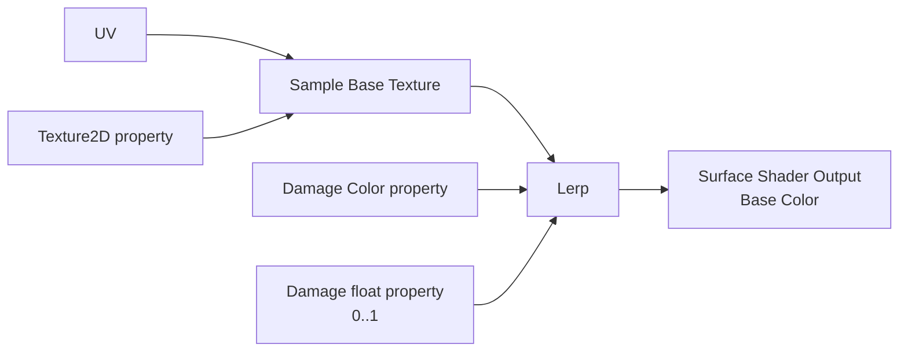
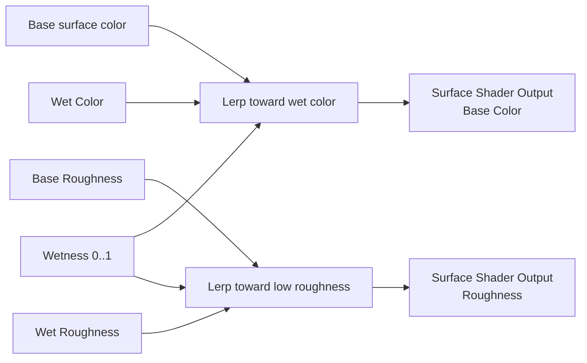
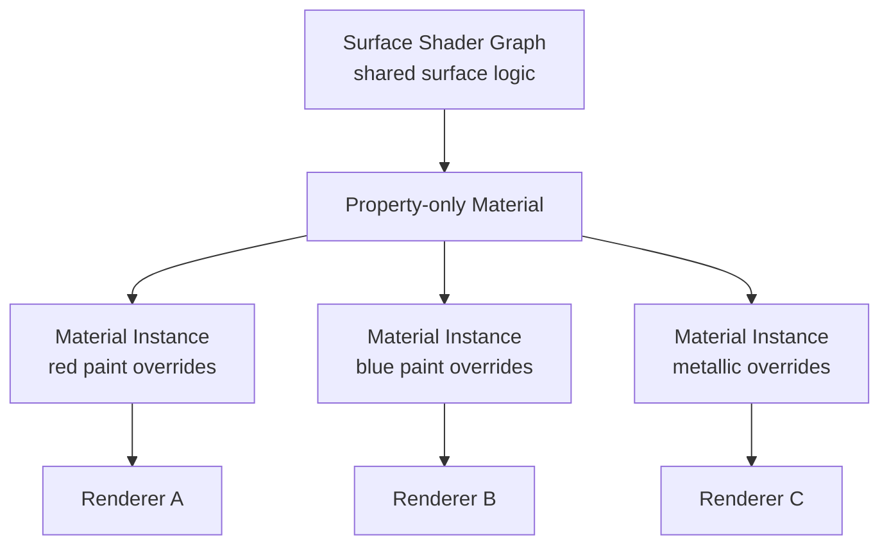

# Material Graph Examples

For new assets, author these expressions in a **Shader Graph > Surface / Lit** graph, then create a property-only
Material using that shader. Existing graph-owned Materials can use the equivalent Material Output inputs. The
pin-filtered palette is authoritative for the open graph.

## Example 1: Base Texture With Damage Flash



1. Create a Surface / Lit Shader Graph and open it.
2. Add Base Texture, Damage Color, and Damage properties.
3. Sample Base Texture and interpolate toward Damage Color using Damage.
4. Connect the result to Base Color and save. Select the shader, choose **Material from Shader**, and assign that
   Material to a Mesh Renderer.
5. In Play Mode, drive the reflected `Damage` value on one renderer without mutating the shared asset:

```csharp
MeshRenderer? renderer = Entity.GetComponent<MeshRenderer>();
if (renderer is not null)
{
    renderer.PropertyBlock.SetColor("Damage Color", new Color(1.0f, 0.1f, 0.05f, 1.0f));
    renderer.PropertyBlock.SetFloat("Damage", 0.75f);
}
```

The names passed by managed code must match compatible reflected properties. Use `Reset(name)` after the flash or
`Clear()` when all per-renderer overrides should return to material values.

## Example 2: Wetness Layer



Package the wet surface contribution as a Material Layer when several materials need it. Keep Wetness as the shared
blend control and expose artist-friendly defaults. A Material Function is better when only the typed math is reusable
and no surface contribution boundary is needed.

## Example 3: Many Props, One Graph



Use instances for persistent authored variants. Use `MaterialPropertyBlock` for small renderer-local runtime changes.
Use `GetMaterialInstance(slot)` only when gameplay needs slot-specific dynamic material control. These choices prevent a
single hit flash from changing every object that shares the source material.

## Global Parameters

For a value such as global wind, weather wetness, or time-of-day tint, create a Material Parameter Collection and read
it in compatible graphs. Managed gameplay can open the live collection through
`GlobalMaterialParameters.Open(collection)`. Prefer one coherent global value over updating hundreds of renderer-local
blocks every frame.

## Validation Checklist

- The Material selects the intended surface Shader Graph.
- Every required Shader Output branch is connected with a compatible type.
- Exposed property stable IDs survive display-name changes.
- Transparent and lighting behavior is tested on scene geometry, not only the preview mesh.
- The target player cooks the needed shader permutation and referenced textures.

Continue with [Shader Graph Examples](ShaderGraphExamples.md) for shader contracts and [Graph Editing](GraphEditing.md)
for reusable functions, layers, comments, collapse, and clipboard behavior.
