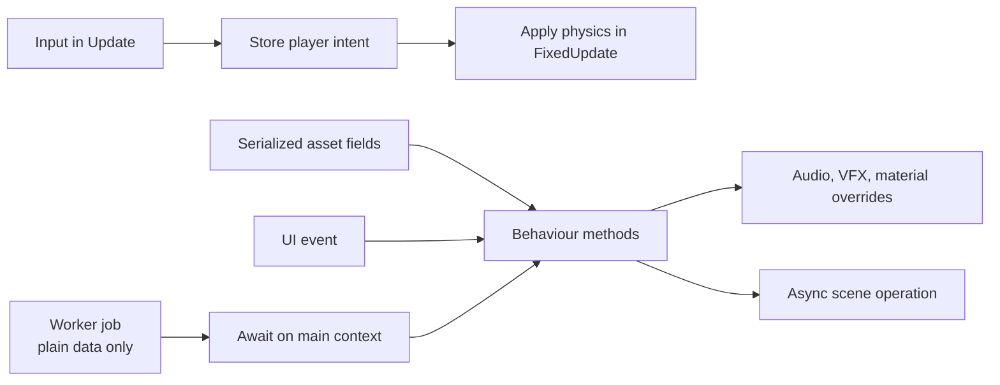

# C# Scripting Recipes

These recipes use the Kéire 0.4.0 managed API and are included in the manual's compile-checkable example project where
noted. Add scripts below an assembly source root, let compilation finish, then attach each `Behaviour` from the Add
Component picker.

## Recipe Map



Keep engine objects on the owner thread. A job may prepare plain arrays or other owned data; apply the result to
entities, components, UI, or assets only after awaiting its completion on the managed synchronization context.

## Move With An Input Action

This complete example is compiled from `Examples/ManualExamples.cs`. Create a `Move` action with a two-dimensional
binding, attach the script, and tune Speed in the Inspector.

```csharp
[StableComponentId("7b5ac27e-4531-4a42-97b8-9a643661660e")]
public sealed class Mover : Behaviour
{
    [SerializeField, StableFieldId("4cf59f74-236e-43c2-bb37-863a0ee5500c")]
    private float _speed = 4.0f;

    protected override void Update()
    {
        Vector2 input = Input.Axis2D("Move");
        Vector3 movement = new(input.X, 0.0f, input.Y);
        Entity.Transform.Position += movement * (_speed * Time.DeltaTime);
    }
}
```

For a Rigidbody-driven character, collect the action value in `Update` and consume it in `FixedUpdate` rather than
writing Transform and Rigidbody motion from competing paths.

## Subscribe Safely Across Reload

UI controls expose managed events. Use a symmetrical bind/unbind pair so disable, destruction, and hot reload cannot
leave a duplicate handler:

```csharp
protected override void OnEnable() => Bind();
protected override void OnDisable() => Unbind();
protected override void OnBeforeReload() => Unbind();
protected override void OnAfterReload() => Bind();

private void Bind()
{
    if (_button is not null)
        _button.Clicked += Resume;
}

private void Unbind()
{
    if (_button is not null)
        _button.Clicked -= Resume;
}
```

## Load A Scene Through A Portal

The following recipe is also compile-checked. Assign a cooked Scene asset and use a trigger Collider on the portal.
The first contact starts one asynchronous single-scene load; failure is reported to Console.

```csharp
[StableComponentId("b26374c3-54e7-41a3-ae24-24dbbc10f0e6")]
public sealed class ScenePortal : Behaviour
{
    [SerializeField, StableFieldId("eed8ed79-02a9-4d23-881c-a7751913cd08")]
    private SceneAsset? _destination = null;

    private bool _loading;

    protected override void OnTriggerEnter(CollisionContact contact)
    {
        if (_loading || _destination is not { IsValid: true })
            return;

        _loading = true;
        _ = StartCoroutine(LoadDestination());
    }

    private System.Collections.IEnumerator LoadDestination()
    {
        SceneLoadOperation operation = SceneManager.LoadSceneAsync(_destination!, SceneLoadMode.Single);
        yield return operation;

        if (!operation.Succeeded)
            Debug.Error($"Scene load failed: {operation.Error}");
        _loading = false;
    }
}
```

Include the destination scene in Build Settings. A valid source reference can still fail in a player if the scene was
not cooked.

## Spawn A Prefab Safely

Prefer a serialized `Prefab` field and validate it before instantiation:

```csharp
public Entity? Spawn()
{
    if (_prefab is not { IsValid: true })
        return null;

    return _prefab.Instantiate(Entity.Transform.Position, Entity.Transform.Rotation);
}
```

The returned entity belongs to the current runtime world. Do not retain it after destruction or a scene replacement
without checking `IsValid` again.

## Pair Audio, VFX, And Material Feedback

One gameplay decision can drive separate presentation services. Check every optional asset, use a spatial playback
request for world audio, set bounded per-renderer overrides through `MaterialPropertyBlock`, and treat a rejected VFX
request as a recoverable diagnostic. The full `PresentationExamples` implementation in the example project demonstrates
all three calls.

## Choose The Next Example

| Goal | Continue with |
| --- | --- |
| Input, raycasts, collision callbacks, and audio | [Input, Physics, and Audio](InputPhysicsAndAudio.md) |
| Prefabs, assets, ScriptableObjects, and scene loading | [Entities, Prefabs, Assets, and Scenes](WorldAndAssets.md) |
| UI events, jobs, and structured diagnostics | [UI, Jobs, and Diagnostics](UiJobsAndDiagnostics.md) |
| Complete type and member lookup | [C# API Quick Reference](CSharpApiQuickReference.md) |
