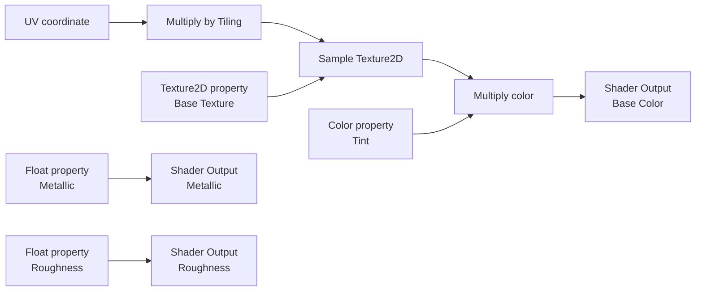
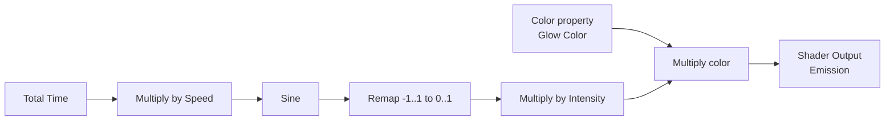
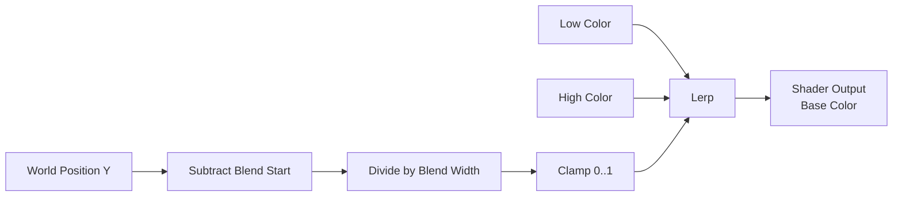

# Shader Graph Examples

These examples describe supported graph shapes without depending on a screen position or undocumented node. Open the
search-first palette and choose the compatible texture, coordinate, math, color, or procedural node shown by the open
template. Pin-started search is the quickest way to see only valid choices for a destination.

For ordinary scene surfaces, create a Material to edit values against the shared Kéire/Lit shader. To change shader
logic, use the Surface Shader Graph examples below and create a Material from the resulting shader. Specialized Shader Graph
targets such as UI expose their own output pins and display their target in the graph header.

## Example 1: Tint A Tiled Surface

Use this as the first Lit/PBR graph because every connection has an obvious preview result.

1. Create a **Shader Graph > Surface / Lit** asset.
2. Add exposed Base Texture, Tint, Tiling, Metallic, and Roughness properties with durable stable IDs.
3. Scale UV by Tiling, sample Base Texture, multiply its color by Tint, and connect the result to Base Color.
4. Connect the two scalar controls to the compatible surface pins exposed by the template.
5. Save, select the shader, choose **Material from Shader**, and assign that material to scene geometry.

If a pin is named differently for the selected renderer/template, the open Shader Output and compatible picker are
authoritative. Do not force a conversion simply to reproduce the diagram.

## Example 2: Animated Emissive Pulse

Expose Speed, Intensity, and Glow Color. Remapping the sine wave prevents negative emission. Keep default values modest,
then test the material in scene lighting and in the target player; the thumbnail alone is not a lighting validation.

## Example 3: World-Space Height Blend

This produces a stable vertical transition for terrain, water edges, or stylized props. Guard Blend Width with a safe
non-zero default. If the desired result must move with the object, choose the corresponding object-space coordinate
instead of world position.

## Example 4: Camera Tint Effect

1. Choose **Create > Shader Graph**, select **Fullscreen Effect**, name it, and open it.
2. Add **UV0** and **Scene Color**. Connect UV0 to Scene Color's UV input.
3. Add an exposed Color parameter named `Tint`, initially white, and a color Multiply node.
4. Multiply Scene Color's Color output by Tint; connect the result to **Fullscreen Shader Output.Color**. Save.
5. Select the shader in Project and choose **Material from Shader**. Open the material and set Tint to a pale blue.
6. Select the entity with the Camera component. Under **Fullscreen Effects**, assign the material to **After Tonemapping**.
7. Open Game view or camera preview. The camera image should become blue-tinted; a white Tint should restore its colors.
8. Save the material and scene. Reopen the scene and confirm the camera assignment and tint remain.

Use **Before Tonemapping** for an operation on linear HDR scene color. **After Tonemapping** changes the tone-mapped
scene before camera UI. **After UI** also changes camera overlay UI. One material is accepted per stage, with stages
executed in that order. Clearing a slot disables only that stage. Changing the graph's injection metadata does not
move an explicitly assigned camera slot.

The graph's flat thumbnail has no camera framebuffer and cannot demonstrate this effect. Use the actual camera image.
Scene Color is a fragment-only input for Fullscreen graphs. Scene Depth sampling is not implemented. If assignment
does nothing, check the material's target, pending import diagnostics, and which camera is rendering; an unavailable
or incompatible effect preserves the existing image. An invalid reload keeps the last executable shader.

## Turn A Working Graph Into A Contract

- Rename exposed properties without changing their stable IDs.
- Keep renderer/stage choices in Shader Graph and object-specific appearance in materials.
- Move repeated typed expressions into a Material Function; use Material Layers for reusable surface contributions.
- Use keywords only for genuine structural variants, then verify the material's canonical permutation is cooked.
- Fix the first candidate diagnostic when preview remains on the last-good result.

Continue with [Material Graph Examples](MaterialGraphExamples.md) to turn the shader contract into assignable surfaces,
or [Graph Editing](GraphEditing.md) for comments, collapse, clipboard, routing, and reusable assets.
