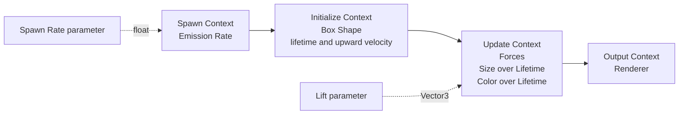
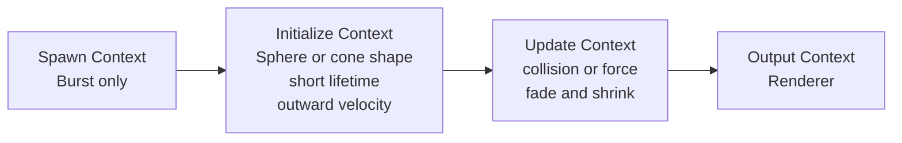
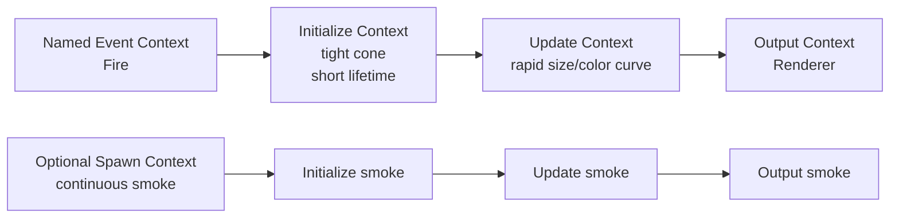
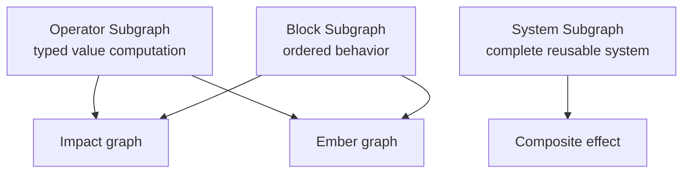

# VFX Graph Examples

VFX Graph combines ordered particle-stream Contexts with typed value cables. Blocks run top-to-bottom inside a Context;
Operators calculate values. A connected Spawn or Event source, Initialize, Update, and Output path must remain acyclic
and forward-only. Spawn systems need enabled emission, and every executable effect needs an enabled Renderer.

## Example 1: Looping Campfire Embers

1. Start from the default graph so the canonical Context chain, Emission Rate, and Renderer are present.
2. Enable Loop and choose a moderate capacity and emission rate.
3. Add a Box Shape in Initialize, then use a multi-second lifetime and a small randomized upward velocity range.
4. Add Forces, Size over Lifetime, and Color over Lifetime Blocks in Update.
5. Compile after each stage. Tune capacity and emission together while watching alive counts in the Profiler.

Place the effect on a VFX Emitter entity at the fire. Simulation space determines whether existing particles follow a
moving emitter; entity scale does not scale VFX shapes in the current transform contract.

## Example 2: One-Shot Impact Burst

1. Add and enable a Burst, then remove or disable Emission Rate.
2. Initialize a short lifetime with an outward velocity range.
3. Fade color/alpha and reduce size over lifetime in Update.
4. Keep capacity close to the maximum simultaneous impacts multiplied by particles per burst.
5. Attach a VFX Emitter or invoke `Vfx.Play(Entity, effect, restart: true)` from a validated serialized `VfxEffect`.

If `Vfx.Play` returns `null`, the runtime scene, entity, capacity, or budget rejected the request. Log that as a
recoverable presentation failure rather than assuming an effect started.

## Example 3: Event-Driven Muzzle Flash

A system uses one Spawn or named Event source. When flash and smoke need different source behavior, author them as
separate systems inside the effect. Send the documented event through the emitter wrapper and keep event names stable
between gameplay and the graph.

## Example 4: Reuse With Subgraphs

Choose the explicit subgraph purpose before authoring its boundary:

- Operator Subgraph returns typed computed values through cables.
- Block Subgraph packages ordered executable Block behavior.
- System Subgraph packages a complete reusable system graph.

Kéire validates typed boundaries, dependencies, recursion, and bounded expansion. Collapsing a selection or wrapping it
in a comment does not create a subgraph, and 0.4.0 has no general selection-to-subgraph conversion command.

## Compile And Performance Checklist

- Particle-stream flow is forward-only: Spawn/Event to Initialize to Update to Output.
- Every input has at most one driver and both cable endpoints have compatible `VfxValueType` values.
- Spawn systems contain enabled Emission Rate or Burst work; every system reaches an enabled Renderer.
- Portable Custom HLSL uses only the documented grammar and runs in the intended Context.
- Capacity, alive count, compute groups, CPU work, and fence latency are checked in scene and in a cooked player.
- A failed draft is repaired from the first diagnostic; the last-good preview is not mistaken for the new graph.

Use [VFX Graph](VfxGraph.md) for the authoring workflow and [VFX Authoring and Runtime](../Vfx.md) for the full current
catalog, Blocks, Context semantics, custom HLSL grammar, backend behavior, and budgets.
