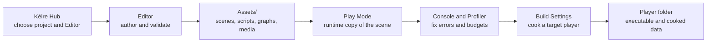
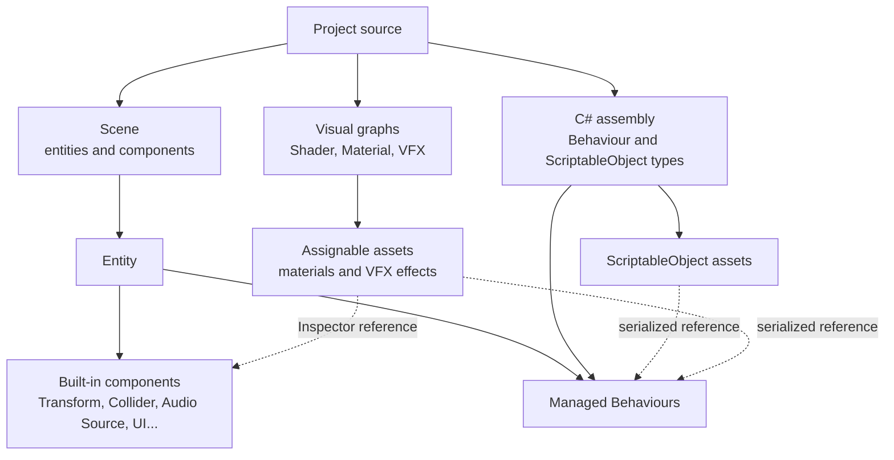
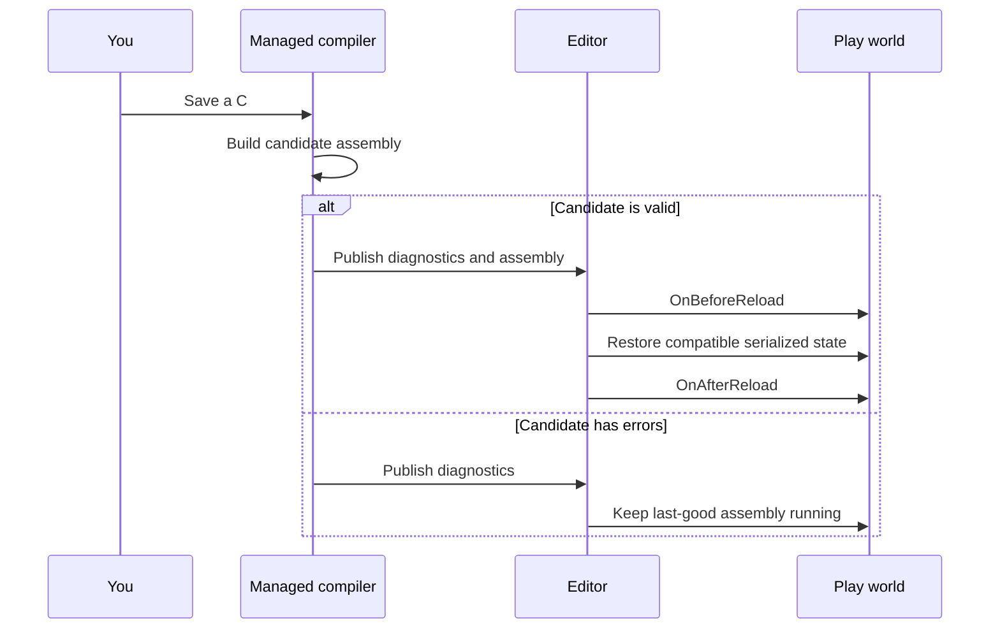
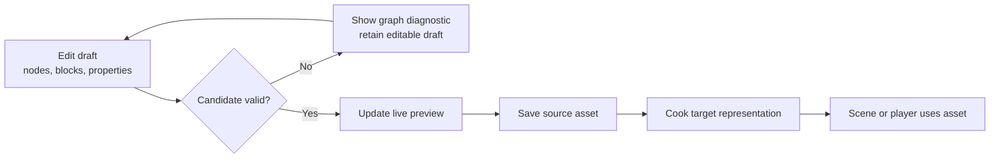
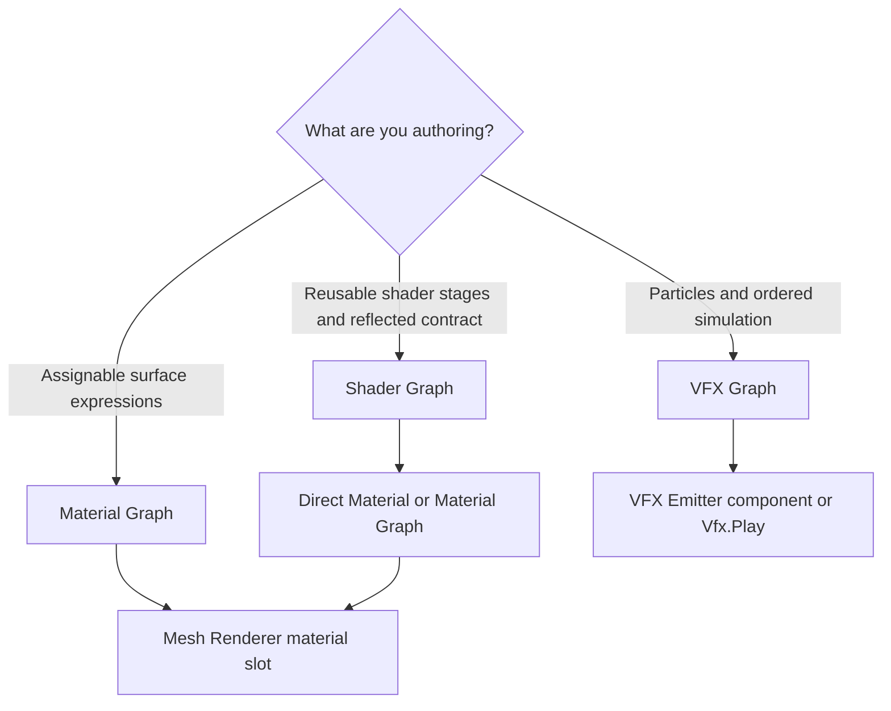

# Visual Workflow Maps

Use these maps as a quick orientation when a task crosses Hub, Editor, graphs, scripts, assets, and player builds. Each
box is a user-visible product boundary; generated `Library/` state is deliberately absent because it is owned by the
Editor rather than authored by the project.

## From Project To Player

The safe loop is author, wait for imports and script compilation, play, profile, stop, review Play Mode Changes, save,
and build. A Play Mode edit is not automatically a source-scene edit.

## What Owns What

Scripts should hold asset references through serialized fields rather than project-relative strings. Moving an asset
inside `Assets/` preserves its stable identity.

## Script Change And Reload

Unsubscribe from external events in both `OnDisable` and `OnBeforeReload`, then restore subscriptions in `OnEnable` or
`OnAfterReload`. See [C# Scripting Recipes](ScriptingRecipes.md) for a complete pattern.

## Visual Graph Publication

An older-looking preview commonly means the latest candidate failed and the last-good result is still displayed. Fix
the first graph diagnostic before changing unrelated nodes.

## Choose A Graph

Continue with [Shader Graph Examples](ShaderGraphExamples.md), [Material Graph Examples](MaterialGraphExamples.md),
and [VFX Graph Examples](VfxGraphExamples.md).
