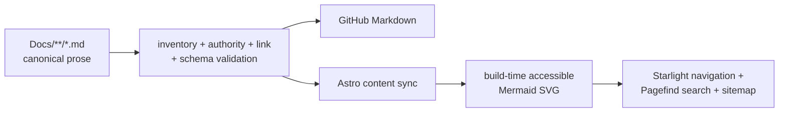

# Kéire Documentation

This library is the canonical technical documentation for Kéire Engine. It covers the supported workstation,
authoring, runtime, scripting, packaging, and release workflows implemented by the repository. The public
[Kéire documentation site](https://keireengine.duckdns.org/docs/) is generated from these exact Markdown files; GitHub
and the website therefore present one maintained body of documentation rather than parallel copies.

Kéire is currently version 0.1.0 and pre-1.0. Guides describe the checked-in implementation and identify unfinished
release work honestly. Roadmap material is labeled as roadmap material and does not redefine the supported API.

## Choose a Starting Point

| Goal | Start here | Continue with |
| --- | --- | --- |
| Build or evaluate Kéire | [Getting Started](GettingStarted.md) | [Project Hub](ProjectHub.md), [Testing and Release](TestingAndRelease.md) |
| Understand engine ownership | [Architecture](Architecture.md) | [Runtime Lifecycle](RuntimeLifecycle.md), [ECS and Components](ECSAndComponents.md) |
| Author a project | [Project System](ProjectSystem.md) | [Scene Authoring](SceneAuthoring.md), [Asset Browser](AssetBrowser.md), [Project Settings](ProjectSettings.md) |
| Write C# gameplay | [C# Scripting](Scripting/README.md) | [Scripting Getting Started](Scripting/GettingStarted.md), [Managed API Index](Scripting/ApiIndex.md) |
| Build rendering content | [Asset Pipeline](AssetPipeline.md) | [Rendering](Rendering.md), [Shaders and Materials](ShadersAndMaterials.md), [VFX](Vfx.md) |
| Package a game or SDK | [Desktop Player Builds](PlayerBuilds.md) | [Package Archives](PackageArchives.md), [Testing and Release](TestingAndRelease.md) |
| Investigate a diagnostic | [Structured Diagnostics](Diagnostics/README.md) | The matching `KEIRE-*` remediation page |
| Assess release maturity | [Production Readiness Review](ProductionReadinessReview.md) | [Performance Gates](PerformanceGates.md), [Maintainability](Maintainability.md) |

## Complete Guide Library

All 52 published guides are listed below in the same groups used by the documentation website.

### Start Here

| Guide | Use it for |
| --- | --- |
| [Documentation Overview](README.md) | Library orientation, source-of-truth rules, and documentation maintenance. |
| [Getting Started](GettingStarted.md) | Prerequisites, clone, bootstrap, generation, builds, tests, launch, cleanup, and workstation diagnosis. |
| [Project Hub](ProjectHub.md) | Project creation/opening, editor compatibility, installed versions, launch behavior, and smoke modes. |
| [Project System](ProjectSystem.md) | Descriptor schema, stable identity, directory isolation, locking, templates, recent projects, and upgrades. |
| [Project Settings](ProjectSettings.md) | Tracked rendering and authoring settings, validation, defaults, editor transactions, and persistence. |

### Engine Foundations

| Guide | Use it for |
| --- | --- |
| [Architecture](Architecture.md) | Product boundaries, dependency policy, public/private APIs, ownership, and release shape. |
| [Runtime Lifecycle](RuntimeLifecycle.md) | Startup, frame order, thread affinity, layers, events, time, UI, failure, and shutdown. |
| [ECS and Components](ECSAndComponents.md) | Entity handles, component registration/lifetime, transforms, layers, scene serialization, and Play Mode. |
| [Scene System](SceneSystem.md) | Scene schema, validation, instances, asynchronous loading, activation, mutation, and events. |
| [Gameplay Foundations](GameplayFoundations.md) | Prefabs, managed builds, physics, audio, navigation, animation, and cooked runtime manifests. |
| [Input System](InputSystem.md) | Devices, users, actions, snapshots, rebinding, overrides, focus, and cursor modes. |

### Editor and Authoring

| Guide | Use it for |
| --- | --- |
| [UI Workspace](UiWorkspace.md) | Panel registration, docking, layouts, themes, persistence, migration, and recovery. |
| [Editor Panels and Commands](EditorPanels.md) | Panel boundaries, command routing, play controls, Inspector behavior, and UI image ownership. |
| [Scene Authoring](SceneAuthoring.md) | Hierarchy and Inspector workflows, dirty prompts, undo, save, recovery, and lighting authoring. |
| [Asset Browser](AssetBrowser.md) | Folder navigation, list/grid views, thumbnails, selection, search, and recoverable file operations. |
| [Input Actions Editor](InputActionsEditor.md) | Templates, maps/actions/bindings, validation, undo, live monitor, and Listen mode. |
| [Input Debugger](InputDebugger.md) | Live action testing, capture bypass, devices/users, and Console diagnostics. |
| [Undo and Redo](UndoRedo.md) | Contexts, commands, transactions, merging, limits, threading, and editor routing. |
| [Animation and Rigging](AnimationRigging.md) | Skeleton/clip/graph assets, Animator authoring, rig constraints, preview, and runtime contracts. |
| [Weapon Authoring](WeaponAuthoring.md) | Production weapon definitions, managed runtime behavior, validation, and authoring workflow. |

### Assets, Rendering, and Builds

| Guide | Use it for |
| --- | --- |
| [Asset Runtime](AssetRuntime.md) | Handles, fallbacks, asynchronous loading, mounts, integrity, reloads, and thread contracts. |
| [Asset Pipeline](AssetPipeline.md) | Metadata, identities, import cache, workers, mesh/texture import, cooking, validation, and CLI operations. |
| [Rendering](Rendering.md) | Render ownership, frame order, viewports, cameras, static submission, spatial lighting, and diagnostics. |
| [Shaders and Materials](ShadersAndMaterials.md) | Shader manifests, compilation, reflection, material graphs, instances, fallback, and target cooking. |
| [VFX Authoring and Runtime](Vfx.md) | Graph mental model, effects, scene emitters, C++/C# control, CPU/GPU execution, diagnostics, and budgets. |
| [VFX Beyond-Parity Roadmap](VfxBeyondParityRoadmap.md) | Explicit future VFX milestones and acceptance evidence; not a current capability contract. |
| [Generated VFX Capabilities](generated/VfxCapabilities.md) | Generated feature/evidence matrix derived from the reviewed VFX parity manifest. |
| [Desktop Player Builds](PlayerBuilds.md) | Build profiles, platform support, output layouts, automation, branding, signing hooks, and launch. |

### C# Scripting

| Guide | Use it for |
| --- | --- |
| [C# Scripting Overview](Scripting/README.md) | Managed model, minimal behavior, learning path, guide map, and core safety rules. |
| [Scripting Getting Started](Scripting/GettingStarted.md) | `.keireasm` roots, project layout, compilation, editor discovery, attachment, and first script. |
| [Behaviours and Lifecycle](Scripting/BehavioursAndLifecycle.md) | Callback order, execution order, enable/disable, exceptions, cleanup, reload, and async lifetime. |
| [Serialization and the Inspector](Scripting/SerializationAndInspector.md) | Serialized fields, stable IDs, supported values, attributes, events, migration, and validation. |
| [Entities, Components, and Transforms](Scripting/EntitiesComponentsAndTransforms.md) | Handle validity, hierarchy, transforms, component access, cloning, and destruction. |
| [Assets and ScriptableObjects](Scripting/AssetsAndScriptableObjects.md) | Managed asset references, data assets, loading, cloning, serialization, and validation. |
| [Gameplay Services](Scripting/GameplayServices.md) | Time, input, physics, navigation, prefabs, VFX, cursor, logging, and profiling. |
| [Audio](Scripting/Audio.md) | Audio clips, source components, playback, mixers, buses, parameters, and status. |
| [Animation](Scripting/Animation.md) | Animator state, parameters, layers, events, playback, root motion, and IK. |
| [UI and Events](Scripting/UiAndEvents.md) | Scene UI, buttons, text, typed events, subscriptions, and cursor ownership. |
| [Async, Reload, and Diagnostics](Scripting/AsyncReloadAndDiagnostics.md) | Synchronization context, cancellation, hot reload, state transfer, failure isolation, and troubleshooting. |
| [Managed API Index](Scripting/ApiIndex.md) | Compact lookup for public types, callbacks, components, attributes, and services. |
| [Managed Scripting Internals](ManagedScripting.md) | Native hosting, discovery, schema publication, build transactions, runtime load, reload, and packaging. |

### Production and Release

| Guide | Use it for |
| --- | --- |
| [Profiling](Profiling.md) | Native/managed markers, frame captures, counters, export, editor tooling, and ownership. |
| [Performance Gates](PerformanceGates.md) | Reference hardware, capture provenance, CPU/GPU requirements, budgets, and automated validation. |
| [Testing and Release](TestingAndRelease.md) | Test matrix, sanitizers, smoke modes, regression scripts, packages, and final handoff checks. |
| [Package Archives](PackageArchives.md) | Deterministic archives, manifest validation, extraction safety, package identities, and publisher workflows. |
| [Production Readiness Review](ProductionReadinessReview.md) | Evidence-based subsystem grades, known gaps, release blockers, and closure criteria. |
| [Maintainability Boundaries](Maintainability.md) | First-party source budgets, exclusions, decomposition seams, and enforcement. |

### Structured Diagnostics

| Guide | Use it for |
| --- | --- |
| [Structured Diagnostics Overview](Diagnostics/README.md) | Diagnostic identity, registration, packaged remediation, links, validation, and authoring rules. |
| [KEIRE-AUDIO-0001](Diagnostics/KEIRE-AUDIO-0001.md) | Diagnose and remediate audio-device initialization failure. |
| [KEIRE-EXAMPLE-0001](Diagnostics/KEIRE-EXAMPLE-0001.md) | Reference diagnostic showing the required remediation-page structure. |
| [KEIRE-REPLAY-0001](Diagnostics/KEIRE-REPLAY-0001.md) | Diagnose replay compatibility or validation rejection. |
| [KEIRE-REPLAY-0002](Diagnostics/KEIRE-REPLAY-0002.md) | Diagnose replay integrity or read failure. |

## Sources of Truth

Documentation explains the repository but does not supersede its authoritative inputs:

| Authority | Owns |
| --- | --- |
| `AGENTS.md` | Repository-wide engineering, compatibility, validation, and completion policy. |
| `Config/Project.conf` | Display identity, semantic version, target names, namespace, and artifact prefix. |
| `Config/Dependencies.lock` | Immutable third-party repositories, revisions, downloads, and checksums. |
| `.clang-format` | First-party C++ formatting. |
| `premake5.lua` and `Scripts/Premake/` | Native targets, configurations, compiler policy, and build graph. |
| `Scripts/project.ps1` and `Scripts/project.sh` | Supported developer commands and platform workflow. |
| Public headers under `KeireCore/Include/Keire/` | Supported native API and lifecycle contracts. |
| Sources under `KeireManaged/` | Supported managed gameplay API. |
| Version constants and parsers | Current content schemas and compatibility behavior. |
| Focused tests and validation scripts | Executable behavior and release evidence. |

When prose and an authority disagree, update the prose in the same change that resolves or acknowledges the difference.
Do not preserve an inaccurate statement merely because an older release once behaved that way; move genuinely
historical material into a clearly dated review or changelog entry.

## One Source, Two Presentations

The repository Markdown is canonical and remains readable directly on GitHub. The documentation website adds a
presentation layer without forking content:



The site build performs the following drift checks:

- The declared inventory exactly matches every `Docs/**/*.md` file and every route is unique.
- Every guide has one level-one heading and at least one mapped implementation, configuration, or test authority.
- Local Markdown targets and fragments resolve, including links from nested scripting and diagnostics guides.
- Published project, scene, mesh, VFX, and cooked-runtime schema statements match their code constants/parsers.
- Mermaid source fences remain intact for GitHub, while the site converts them to responsive, accessible inline SVG
  during the static build; no browser-side diagram library or external font request is required.
- The generated site contains every guide, required metadata, full-text search data, internal links, assets, sitemap
  entries, strict-CSP-compatible output, and the branded 404 route.

Never hand-edit synchronized files under
`Services/KeireDistributionService/DocumentationSite/Source/content/docs/reference/` or an installed host’s
`Website/docs/` directory. Change the repository guide and regenerate the site.

## Documentation Maintenance

Documentation is part of the implementation. A change is complete only when the relevant guide, public overview,
examples, tests, packaging notes, and changelog impact have been considered.

Use these rules when editing a guide:

1. Verify behavior against public headers, parsers, launchers, and focused tests—not memory or generated output.
2. Lead with the supported workflow, then explain ownership, failure behavior, compatibility, and troubleshooting.
3. Keep commands executable from the documented working directory and use the platform launchers for normal work.
4. Use stable public `Keire/` headers in C++ snippets and the public `Keire` namespace in C# snippets.
5. Label roadmap, platform-native validation, and unavailable functionality explicitly.
6. Prefer links over duplicating a long contract owned by another guide.
7. Preserve one level-one heading, meaningful heading hierarchy, image alternatives, and GitHub-compatible Mermaid
   fences. Avoid raw HTML that only one presentation can render correctly.
8. Update `CHANGELOG.md` when engine, SDK, Hub, website, or release users will observe the change.

Run the documentation-site checks after editing repository guides:

```powershell
Set-Location Services/KeireDistributionService/DocumentationSite
npm test
npm run build
npm run test:search
```

The complete release-facing validation matrix is maintained in [Testing and Release](TestingAndRelease.md).
