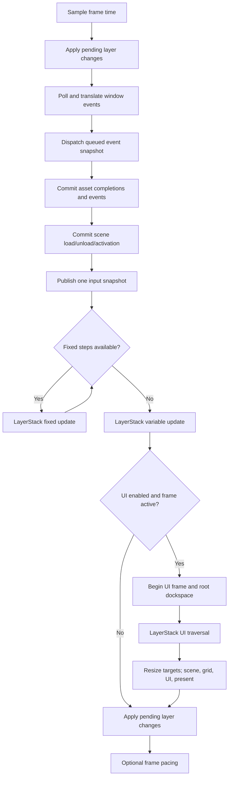

# Runtime Lifecycle

Kéire uses explicit application-owned services and one construction-thread owner. Understanding the lifecycle is
required before adding layers, event producers, windows, time behavior, or editor UI.

## Application States

An `Application` begins in `Constructed`, transitions to `Running` exactly once through `Run()`, and finishes in
`Stopped`. Calling `Run()` more than once is an error. Destroying an application while it is still running terminates
the process because service teardown cannot be made deterministic from an arbitrary destructor context.

The application construction thread owns `Run()`, immediate event dispatch and subscription, window operations, layer
mutations, and UI workspace operations. `RequestExit()` and owned queued-event enqueue are the deliberate cross-thread
entry points.

## Startup Order

Startup is transactional inside the top-level exception boundary:

1. Open and exclusively lock an editor project when requested, rebasing all project-local service paths, then initialize
   managed logging when requested.
2. Create the event bus, optional profiler, diagnostic catalog and sink, memory domains, string interner, and job system.
3. Create the module registry, validate project requirements, register module diagnostics and memory domains, then
   freeze the diagnostic catalog.
4. Create Undo before any layer can attach.
5. Register built-in and module asset decoders, then create optional Assets and Streaming.
6. Create optional Scripting, Physics, Navigation, Audio, and Scenes in dependency order.
7. Create the application-owned time service, window system, and primary window.
8. Resolve the render mode, create optional RenderSystem, then create optional Input.
9. Create Replay and register module replay serializers.
10. Create the optional UI system and workspace, bridging presentation through RenderSystem.
11. Connect the layer event listener and activate the layer stack.
12. Start modules, call client `OnInitialize()`, and apply pending layer operations.

If any step fails, shutdown runs for the resources that were acquired. The original exception is rethrown after cleanup.

The standalone player and Editor Play Mode create a `SceneRuntimeWorld` after these services are available. It owns one
runtime session per additive scene plus any unloaded persistent carriers. Scene load, unload, and active-handle changes
commit only at application safe boundaries. Fixed/update traversal covers every session in stable load order; closing
the world stops all sessions in reverse ownership teardown before application services close.

The standalone player and Editor Game viewport snapshot those sessions in the same stable order into one bounded render
request per surface. A session without a presentation still contributes scene and VFX content. Presentation trees are
composited in session order, while pointer delivery traverses the same snapshot from newest to oldest so visual and
input precedence agree. A failed additive load never enters the snapshot, and unload/reload changes only requests
captured after the world commits that lifecycle boundary.

## Frame Order

Window events are pumped before simulation. Queued events drain a fixed snapshot, so events enqueued during that drain
wait for the next frame. Fixed simulation consumes scaled time before variable update. UI runs after simulation and is
skipped when the application is suspended by a minimized primary window. Rendering and fixed simulation always remain
suspended; an application may explicitly keep low-rate variable layer updates active for essential background services.

Minimized suspension is sampled with the time advance at the outer-frame boundary. If a minimize event arrives while
that frame is being pumped, the fixed and variable work already produced for the frame completes, rendering is skipped,
and suspension begins on the next frame. This guarantees that no pending fixed tick can be abandoned across a minimize
transition. A restore event similarly resumes simulation at the following frame boundary.

`UpdateLayersWhenMainWindowMinimized` defaults off, preserving full suspension for games and ordinary clients. Hub opts
in so its owner-thread account refresh, marketplace lease, editor tracking, and task reconciliation continue at
`MinimizedPumpRate` while its window is hidden in the tray. This opt-in does not submit UI or rendering work.

An editor `SceneRuntimeSession` receives fixed and variable updates from its owning layer. Playing dispatches component
lifecycle callbacks against a private scene clone. Paused sessions receive neither update phase unless Step explicitly
requests one fixed tick. Faulted sessions retain their diagnostic until Stop and never mutate the authored scene.

Exit requests are checked between phases. A request does not force callbacks already on the stack to unwind, but later
frame phases are skipped as soon as the loop reaches a safe check.

## Layer Ownership And Traversal

The application creates `UndoService` before layers attach. A layer may create document contexts in `OnAttach`, but all
history mutation remains owner-thread-affine. `LayerStack::Deactivate` gives panels an opportunity to close those
contexts before the application closes the service and continues subsystem teardown.

`LayerStack` owns every layer through `std::unique_ptr`. Layers attach exactly once after activation and detach in
reverse order. The stack maintains a layer partition followed by an overlay partition.

- Fixed update, variable update, and UI traverse bottom-to-top.
- Events traverse overlays and layers top-to-bottom.
- Handled events stop propagation.
- Automatic layer subscriptions disconnect before detachment.
- `OnDetach()` is `noexcept` and cannot create new automatic subscriptions.

Traversal depth is RAII-managed. Push and remove requests made during attach, detach, event, fixed-update, update, or UI
callbacks are queued until the next application safe boundary. Nested callbacks do not flush the queue early.
Insertion reserves ownership in the stack before `OnAttach()` runs. If attachment fails, the provisional layer and any
nested structural requests from that callback are rolled back before the original exception escapes.

## Events

Immediate dispatch is synchronous and construction-thread-affine. Typed and generic listeners share priority and
registration order. Subscription removal during dispatch creates an inactive tombstone without invalidating traversal,
and nested dispatch remains deterministic.

Worker producers use the bounded owned queue. Enqueue either transfers the event into the queue or rejects it without
blocking when capacity is exhausted. Closing the bus makes retained references and subscription tokens inert.

Window events originate in the private SDL boundary, are translated into Kéire value types, and then enter the same
event bus. Unhandled quit and primary-window close requests become application exit requests.

## Time

`Time` is application-owned. Every frame records raw, clamped unscaled, scaled, smoothed, and elapsed values. Scaled
time feeds the fixed-step accumulator; pause and minimized suspension stop scaled simulation without erasing real time.

The fixed-step cap prevents a slow frame from running unbounded simulation work. Excess whole ticks are recorded as
dropped time, while the fractional remainder remains available for interpolation. Changes to clamping, scaling,
smoothing, tick caps, or remainder behavior are observable and require deterministic tests. A scheduler that rejects
already-produced work can explicitly discard pending fixed steps; discarding drains only the pending count and never
advances committed fixed time, fixed tick count, or dropped-time accounting.

## UI

`UiSystem` owns the Dear ImGui context while application-owned `RenderSystem` exclusively owns SDL_GPU and presentation.
`UiFrame` is valid only during
`Layer::OnUi()` on the owner thread. Its move-only scopes balance backend begin/end operations during normal returns and
exception unwinding; a scope cannot escape its frame or close out of nesting order.

The root dockspace is submitted before layer UI. `UiWorkspace` applies queued layout and theme changes at safe frame
boundaries and autosaves after rendering. Raw SDL events, GPU resources, backend types, and native handles never cross
the public UI boundary.

## Shutdown Order

Shutdown is deterministic and idempotent at service boundaries:

1. Deactivate the layer stack and detach layers in reverse order.
2. Call client `OnShutdown()` if initialization completed.
3. Disconnect the application layer-event listener.
4. Close the undo service after document panels have released their contexts.
5. Shut down UI event forwarding, workspace, renderer bridge, and context.
6. Close Replay, RenderSystem, Input, and Scenes.
7. Close Audio, Navigation, Physics, and Scripting. Exceptions from these potentially throwing close operations are
   contained because shutdown itself is `noexcept`.
8. Close the event bus so retained subscriptions and event references become inert.
9. Release the primary window, shut down WindowSystem and tray ownership, then release Time.
10. Close Streaming before Assets, then close the module registry.
11. Release the project lock, close the job system, and release strings, tracked memory, and diagnostics.
12. Close the profiler, release the event bus, and shut down managed logging.

Cleanup that is required to be `noexcept` contains secondary failures. A failure from application work remains the
exception observed by the caller rather than being replaced by a teardown diagnostic.

## Extension Checklist

Before adding a runtime subsystem, define:

- its explicit owner and construction thread;
- the startup point after every dependency is available;
- the frame phase in which it runs;
- safe behavior during nested callbacks and deferred mutation;
- the cross-thread operations, if any;
- reverse-order shutdown and partial-initialization rollback;
- behavior of retained handles after the service closes;
- deterministic, failure, Release, and sanitizer tests.
