# VFX Authoring And Runtime

Kéire's VFX system combines an executable visual graph, bounded modular particle payloads, typed Blackboard
parameters, Portable Custom HLSL, scene components, native C++ control, and managed C# playback control. This guide
covers the complete supported workflow and identifies the deliberately bounded parts of the graph runtime.

Related guides cover [Scene Authoring](SceneAuthoring.md), [Rendering](Rendering.md), and
[managed Gameplay Services](Scripting/GameplayServices.md).

The execution and backend badges in the VFX Effect panel are authoritative:

> **Schema-4 Graph assets execute their connected value graph and ordered Context Blocks. LegacyModules assets execute
> the compatibility module stack.** Schemas 1–3 migrate in memory and are only written as schema 4 on explicit Save. A
> node marked Disabled or GPU Required never degrades into a silent no-op.

A **CPU + GPU** badge means the node's lowering opcode and packed pin types have implementations on both value
interpreters. It is not a blanket promise that every downstream Block, resource, or Context placement is available on
GPU. Compilation still validates the complete graph and reports an unsupported consumer or ABI limit at its stable ID.
A **CPU** badge is reserved for executable nodes that do not have a shader-side lowering. The current packed core value
catalog has no such entries: every executable Operator in that catalog is available to both interpreters.

## Mental Model

Every `.keirevfx` asset contains one `Keire::VfxEffectDefinition` with an explicit
`VfxExecutionSource`:

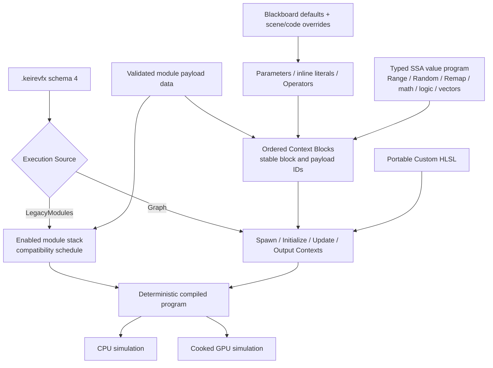

The graph and compatibility payload list are related, but they are not interchangeable:

- A Graph asset can contain multiple executable particle **systems** behind one root handle. Connected Event contexts
  route named spawns, and Particle Strip systems preserve strip-scoped identity and sequence-qualified Ribbon topology.
  Operator, Block, and System Subgraph assets remain a separate disabled authoring milestone.
- **Context nodes** delimit Spawn, Initialize, Update, and Output. Their `Blocks` vectors are executable order; Blocks do
  not need decorative flow cables between one another.
- A **Block** references validated payload data by stable ID, owns canonical typed input pins, and runs only because it
  is present and enabled in a connected Context stack. Free-floating compatibility Module nodes remain readable during
  migration, but new schema-4 authoring should prefer Blocks.
- Free-floating **Operator** and **Parameter** nodes produce typed values; Block and Operator pins also provide inline
  literals. Attribute, Constant-card, and Subgraph nodes remain disabled milestones. Executable value cables feed Block
  inputs and are lowered into a bounded SSA-style register program.
- `ParticleStream` cables connect Contexts and establish the system path. Data cables never imply particle execution.
- A **Parameter node** references a Blackboard property by stable ID. Renaming the property cannot break a binding.
- **Portable Custom HLSL** remains the deterministic CPU/GPU subset. Full Unity-style Custom HLSL is catalogued as a
  separate GPU-required milestone and cannot silently run through Portable HLSL semantics.
- LegacyModules mode ignores graph scheduling and lowers enabled payloads directly for historical compatibility.

## Schema-4 Core Value Release

Schema 4 separates stable machine identity from presentation. `VfxNodeTypeId` values such as
`keire.operator.random-range` stay ASCII and stable while the editor displays familiar labels such as **Random Range**.
The compiler-owned `VfxNodeDescriptor` catalog is shared by validation, lowering, the right-click palette, backend
badges, search synonyms, canonical pins, settings, and tests. Hand-authored unknown IDs are rejected during import and
compile.

The current executable value catalog includes:

| Family | Operators |
| --- | --- |
| Range and random | Range, Random Number, Random Range, Remap |
| Scalar arithmetic | Add, Subtract, Multiply, Divide, Modulo, Power, Square Root, Minimum, Maximum, Absolute, Fractional, Negate (-x), Sign, One Minus, Reciprocal, Clamp, Saturate, Discretize |
| Trigonometry | Sine, Cosine, Tangent, Asin, Acos, Atan, Atan2 |
| Exponential and logarithmic | Exp, Log, Log2, Log10 |
| Rounding | Ceiling, Floor, Round |
| Interpolation | Lerp, Inverse Lerp, Smoothstep, Step |
| Logic | Compare, Branch, And, Or, Not, Nand, Nor |
| Bitwise unsigned integer | And, Or, Xor, Complement, Left Shift, Right Shift |
| Vector2 | Combine Vector 2, Split Vector 2 |
| Vector3 | Combine, Split, Dot Product, Cross Product, Normalize, Length, Squared Length, Distance, Squared Distance |
| Vector4 | Combine Vector 4, Split Vector 4 |
| Color | Combine Color, Split Color, Color Luma, HSV to RGB, RGB to HSV |
| Casts | To Float, To Integer, To Unsigned Integer |
| Inline and constants | Color, Direction, Position, Vector, Vector2, Vector3, Vector4, bool, float, int, uint, Epsilon (Ɛ), Pi (π) |
| Built-ins and attributes | Total Time, Delta Time, Age, Age Over Lifetime, Lifetime, Particle ID, Spawn Index, Frame Index, System Seed, 16 Get Attribute nodes, Ratio Over Strip |
| Coordinates and rotation | Polar to Rectangular, Rectangular to Polar, Rectangular to Spherical, Spherical to Rectangular, Rotate 2D, Rotate 3D |
| Procedural noise | Value, Perlin, and Cellular Noise plus their Curl Noise variants |

Pure literal subgraphs are folded during compilation. Unreachable Operators are eliminated. One output fanning out to
several inputs evaluates once and shares its register. The shared compiler bounds a graph to 4,096 live value
registers; the current GPU interpreter has a tighter cooked-program limit of 64 live registers and 64 instructions,
with at most 512 sources and 256 deduplicated constants. A single instruction accepts at most eight typed inputs. Limit
diagnostics retain the responsible node. The GPU
compiler packs supported Boolean, integer, scalar, vector, color, and range values into a cooked expression program.
Its shader interpreter implements the current opcode interval from `Constant` through `Rotate3D` (0–108); compile-time and
uniform work may still be folded or hoisted before upload. The complete executable packed Operator catalog now carries
CPU + GPU support, including deterministic Random/identity sequencing, Delta Time and Lifetime, contained Power,
overflow-resistant Lerp/Waves, and saturating 64-bit integer conversions.

Trigonometric inputs and outputs use radians; `Atan2` receives Y followed by X. `Lerp` is intentionally unclamped,
`Step` returns one when Input equals Edge, `Fractional` follows shader `frac` behavior for negative values, and `Round`
uses deterministic ties-to-even semantics. Invalid scalar math never injects NaN or Infinity into particle state:
out-of-range Asin/Acos, negative Square Root, non-positive logarithms, invalid or overflowing Power/Exp, and a
zero-width Smoothstep all resolve to zero. These rules apply identically during literal constant folding and CPU
runtime evaluation. Operators promoted to CPU + GPU apply the same containment contract within documented
floating-point tolerances.

The Unity utility tranche follows the pinned 6.3 formulas: **Inverse Lerp** is unclamped, **Modulo** uses shader
`frac(x / y) * y` behavior, **Discretize** uses `floor(value / granularity) * granularity`, and zero-width divisions
resolve to zero. **Color Luma** uses the `0.299 / 0.587 / 0.114` RGB weights; **HSV to RGB** returns Vector4 with alpha
one, while **RGB to HSV** ignores input alpha. **Age Over Lifetime**, **Frame Index**, and **System Seed** are evaluated
in their explicit particle, per-frame, and per-effect domains. Kéire's unsigned graph value is 64-bit, so the Bitwise
Operators deliberately process all 64 bits rather than Unity's 32-bit `uint`; shifts of 64 or more resolve to zero on
both CPU and GPU. The currently fixed Scalar and Vector3 signatures are recorded as **Kéire Equivalent** rather than
claiming Unity's broader Unified/adaptive-pin surface.

| Unity utility family | Executable Kéire nodes | Canonical graph contract |
| --- | --- | --- |
| Scalar utility | Inverse Lerp, Modulo, One Minus (1-x), Reciprocal (1/x), Discretize | Scalar inputs and Scalar output; division and granularity zero are contained to zero. |
| Boolean utility | Nand, Nor | Two Boolean inputs and one Boolean output. |
| Bitwise | And, Or, Xor, Complement, Left Shift, Right Shift | Unsigned Integer inputs/output; Complement is unary and shift counts use the second input. |
| Color conversion | Color Luma, HSV to RGB, RGB to HSV | Color to Scalar, Vector3 HSV to Vector4 RGBA, and Color RGBA to Vector3 HSV. |
| Vector metrics | Squared Distance, Squared Length | Vector3 inputs and Scalar output, without the square-root cost of Distance/Length. |
| Runtime identity | Age Over Lifetime, Frame Index, System Seed | Read-only outputs with no input pins; valid evaluation domains are compiler-owned. |

All 21 nodes participate in ordinary right-click search, typed cable filtering, inline literal editing, constant
folding where pure, dead-node elimination, block-property binding, canonical schema-4 serialization, and CPU/GPU
backend diagnostics. Their packed signatures are renderer-validated before dispatch, so a corrupt or hand-authored
program is rejected with its instruction index rather than reaching the shader interpreter.

Particle-varying Operator inputs are scheduled for Portable Custom HLSL and every numeric Runtime Block property through
the same typed register ABI. Structural enum and resource settings remain compiler-reflected settings rather than
numeric particle values.

### Attributes, Inline values, constants, coordinates, and noise

The next production slice adds 42 Unity-labelled rows without enabling data the simulation does not actually store.
The editor creates each node through normal right-click and wire search, preserves stable IDs and output ordering, and
rejects malformed signatures during asset validation and again before GPU dispatch.

**Inline** nodes are typed identity Operators. Color, Vector2/3/4, Boolean, float, signed integer, and unsigned integer
retain their exact graph type and fold away when driven by a literal. Direction, Position, and Vector are explicit
Vector3 semantic aliases in Kéire, so their parity rows are recorded as **Kéire Equivalent**. **Epsilon (Ɛ)** returns
`0.00001`. **Pi (π)** exposes stable `Pi`, `2 Pi`, `Pi / 2`, and `Pi / 3` outputs; fan-out shares the selected constant
without allocating a runtime register.

The enabled **Get Attribute** nodes read live simulation state on CPU and GPU:

| Attribute | Graph type and contract |
| --- | --- |
| `alive` | Boolean. Evaluation only visits live particles, so the result is true. |
| `alpha`, `size`, `spawnTime` | Scalar. Spawn time is contained `effectTime - age`. |
| `angle` | Vector3 Euler degrees, matching particle rotation storage. |
| `axisX`, `axisY`, `axisZ` | Vector3 basis directions derived from particle rotation. |
| `color` | Vector3 RGB; alpha remains independently addressable. |
| `oldPosition`, `position`, `velocity` | Vector3 authoritative current/previous simulation values. |
| `particleCountInStrip` | Unsigned Integer configured `ParticlesPerStrip`, clamped to at least one. |
| `particleIndexInStrip` | Unsigned Integer stable position inside the configured strip. |
| `stripIndex` | Unsigned Integer stable strip identity. |
| `seed` | Unsigned Integer deterministic 32-bit particle seed carried in Kéire's 64-bit unsigned graph value. |
| Ratio Over Strip | Scalar normalized index; a one-particle strip returns zero. |

The portable expansion also exposes derived attributes as explicit **Kéire Equivalent** contracts rather than adding
hidden particle lanes. `direction` is normalized velocity; `scale` is uniform `size`; `targetPosition` is the current
position plus one velocity unit; and `texIndex` is the stable particle index inside its strip. Until independent
simulation lanes are introduced, `angularVelocity` and `pivot` are zero and `mass` is one on both CPU and GPU. **Get
Custom Attribute** is a graph-defined Vector4 identity value, not a lookup into undeclared particle storage. These
semantics are stable, tested, visible in the node catalog, and deliberately differ from Unity's extensible attribute
store.

Structured Inline nodes represent boxes, circles, cones, cylinders, lines, planes, spheres, tori, flipbook layouts,
matrices, transforms, curves, gradients, textures, meshes, and resource references through ordered typed pins. Numeric
structures use the shared CPU/GPU value VM; owned curve/gradient/matrix and asset-resource values are CPU-only.
Geometry Operators cover circle area, point-to-line/plane/sphere distance, primitive volumes, Bezier sampling,
deterministic weighted selection, swizzling, and transform/matrix operations. Invalid zero-length directions and
degenerate line segments resolve deterministically instead of producing NaNs.

Coordinate conversions follow the pinned Unity formulas. **Polar to Rectangular** takes Angle in degrees; spherical
Theta/Phi and Rotate 2D/3D angles use radians. Zero-length rectangular coordinates return zero spherical angles, and a
zero Rotate 3D axis returns the original position. Rotate 3D normalizes nonzero axes before applying the axis-angle
rotation around Rotation Center.

Value, Perlin, and Cellular noise are deterministic fixed-3D Kéire equivalents. Each scalar noise node accepts
Coordinate, Frequency, Octaves, Roughness, Lacunarity, and Range, then exposes Scalar Noise and Vector3 Derivatives.
Curl variants replace Range with Amplitude and return a Vector3 curl field. Execution clamps Octaves to `1..8`,
Roughness to `0..1`, Frequency/Lacunarity to non-negative values, bounds lattice coordinates, and contains every
non-finite result. Cellular noise searches a bounded eight-cell neighborhood selected around the sample point; this
keeps CPU/GPU work deterministic and suitable for the interpreter. Value and Perlin derivatives are evaluated
analytically from the interpolation weights, while Cellular derives the nearest-feature distance gradient. Curl uses
three decorrelated analytic gradient channels, avoiding 18 repeated finite-difference field samples per octave. Use low
octave counts for dense per-particle Update graphs; uniform or literal coordinates are folded or hoisted when their
evaluation domain permits it.

The expression source ABI was expanded from four to eight inputs end-to-end: compiler folding, canonical asset
validation, cooked source limits, CPU execution, GPU packing, renderer validation, and HLSL execution all enforce the
same bound. Six-input Noise nodes therefore cannot save successfully and then fail later at runtime because of a
different backend limit.

### Unity 6.3 LTS parity manifest

The [machine-readable parity manifest](VfxParityManifest.json) freezes Kéire's comparison baseline to Unity 6.3 LTS,
Unity Editor 6000.3, `com.unity.visualeffectgraph` 17.3.0, and Unity Graphics commit
`2d2e78cc9d6254bc6e7c9c5552cea053508e86cb`. It records the exact user-facing label, category, settings, source
provenance, Kéire implementation ID, backend tier, tests, documentation, support state, priority, and disabled reason
for every catalogued Operator, Block, Context, and Output.

The frozen snapshot contains 278 rows: 214 Operators, 46 Blocks, 5 Contexts, and 13 Outputs. Two hundred forty-eight
rows carry the explicit **Kéire Equivalent** tier for tested value, attribute, structured-value, geometry, sampling,
context, event, collision, and renderer workflows; 30 remain `Disabled`. A `keire` implementation mapping alone means
related native functionality exists and does not claim Unity parity. A row is enabled only when its native descriptor,
backend tier, focused tests, documentation, and deliberately documented semantic differences agree. Disabled entries
remain visible to tooling but creation or compilation must reject them with their recorded reason.

The portable expansion starts from the validated 125-row baseline and requires 120 additional evidence-backed rows.
The checked-in ledger closes that expansion gate plus the three Kill Shape P0 rows, for 248 total. It does not imply
full parity. Every disabled row is assigned P0, P1, P2, or Deferred through the checked-in priority policy, and the
validator rejects drifted priorities or milestone counts. The [initiative matrix](VisualAuthoringInitiatives.md)
defines the production scenarios and delivery meaning behind those tiers.

The [VFX Beyond-Parity Roadmap](VfxBeyondParityRoadmap.md) tracks Kéire-specific runtime, networking, debugging,
scalability, streaming, collaboration, and production-operations features. Those items are deliberately excluded from
the 278-row catalog score.

The checked-in runtime catalog contract is consumed by `VfxNodeCatalog()` and the offline validator. Engine startup
rejects any descriptor whose stable ID, label, class, support tier, or backend tier drifts from that contract, while
manifest validation rejects mappings to IDs the runtime does not register. Executable Kéire Blocks, Contexts, and the
generic particle Output are registered alongside Operators, so tooling no longer infers their existence from legacy
switches. Dynamic Unity labels such as `<Attribute>` and `<Mode>` are
preserved verbatim rather than interpreted as HTML.

From the repository root, validate the checked-in manifest without a Unity checkout:

```powershell
python Scripts/Vfx/reconcile_vfx_manifest.py --check
python Scripts/Vfx/validate_vfx_parity_manifest.py
python Scripts/Vfx/generate_vfx_capabilities.py --check
python Scripts/Vfx/test_vfx_parity_tooling.py
python Scripts/Vfx/export_vfx_runtime_catalog.py
```

The generated [VFX capability reference](generated/VfxCapabilities.md) combines the frozen Unity ledger with the live
runtime descriptor catalog. Production slices group enabled rows by a complete tested effect workflow; generation and
release validation fail when an enabled implementation is absent from every slice or the checked-in table is stale.

Maintainers with the pinned Unity Graphics checkout can also verify source coverage and regenerate canonically:

```powershell
python Scripts/Vfx/validate_vfx_parity_manifest.py --unity-source <path-to-pinned-graphics-checkout>
python Scripts/Vfx/generate_vfx_parity_manifest.py --unity-source <path-to-pinned-graphics-checkout> --check
```

The generator verifies the checkout commit and package identity before reading Unity's shipped `Documentation~`
catalog. Remove `--check` only when intentionally updating the checked-in JSON. The optional
[Unity catalog exporter](../Scripts/Vfx/UnityVfxCatalogExporter.cs) provides a second editor-side inventory for audits;
the [generator](../Scripts/Vfx/generate_vfx_parity_manifest.py) and
[validator](../Scripts/Vfx/validate_vfx_parity_manifest.py) remain the checked-in manifest authorities. Unity assets,
source, and icons are not copied or treated as compatible Kéire inputs.

### Range, Random Range, and Remap

Use **Range** when Min/Max should travel through one cable and be reused:

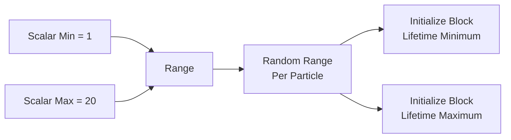

1. Right-click empty canvas space and search for **Range**.
2. Enter inline Min and Max values, or cable Parameters/Operators into those pins.
3. Add **Random Range** in the same evaluation Context and connect `Range` to `Range`.
4. Choose Per Particle, Per VFX Component, or Per Particle Strip scope. Strip scope requires the owning system's
   **Data Type** to be **Particle Strip** and hashes the stable strip index rather than the individual particle index.
5. Enable **Constant** when the sample must remain stable for the effect rather than vary with simulation identity.
6. Enable **Inclusive Maximum** only for Kéire convenience behavior. Unity-labelled integer Random retains its
   maximum-exclusive contract.
7. Fan the output into several Block pins when those pins must receive the same sample. Duplicate the Random node when
   independent samples are required; separate stable node IDs deliberately produce separate random streams.

**Remap** takes one Input, a Source Range, a Destination Range, and optional Clamp. A zero-width Source returns the
Destination minimum. Reversed Clamp bounds are normalized for scalar Clamp, while persisted range values require
component-wise `Minimum <= Maximum`. Divide-by-zero and non-finite intermediate values are contained deterministically
instead of leaking NaN/Infinity into particle state.

### Deterministic random identity

CPU random sampling hashes the effect seed, emitter seed offset, Operator stable ID, system ID, Context, particle or
strip identity, spawn index, simulation step, and channel salt. Reordering cards does not change a node's sequence.
Duplicating a Random node does change it because the duplicate receives a new stable ID. A single Random output with
three cables samples once; three Random nodes sample independently.

### Evaluation domains

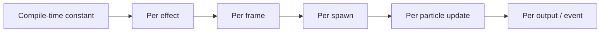

The compiler classifies each value by its earliest valid domain and records that domain in canonical IR. Literals fold
at compile time; Blackboard-driven pure chains are hoisted per effect; Total Time and Delta Time chains are per frame;
Initialize random is per spawn; Age and Lifetime are per-particle updates. The CPU evaluator and GPU value interpreter
both feed the generic typed Block-property ABI, so every numeric property can consume literals, Parameters, or
particle-varying registers without a host approximation. Resource pins remain explicitly reflected rather than being
treated as numeric registers. Operator cables currently stay inside one Context except stable Blackboard Parameter
outputs. A rejected cross-Context data cable leaves the document unchanged.

### Ordered Context Blocks

Schema-4 Contexts own `std::vector<VfxGraphBlock> Blocks`. Vector order is execution order and survives save, reload,
undo, and compilation. `CreateVfxGraphBlock(module)` creates canonical stable pins without particle-flow pins. A Block
input endpoint uses the owning Context node ID plus the Block ID and pin ID; this prevents ID ambiguity while keeping the
Block visually inside its Context.

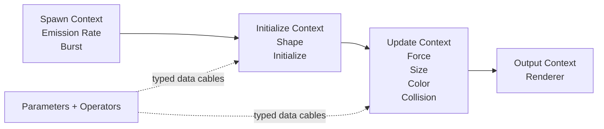

Disabling or removing a Block removes it from execution. Merely retaining its payload in the compatibility list does
not schedule it in a Block-authored graph. Context stacks still require at least one enabled emission Block and one
enabled renderer Block before publication.

## Quick Start

Use this workflow for a first effect:

1. In the Project panel, open the create menu and choose **VFX Effect**.
2. Name the asset. Kéire creates a schema-4 Graph asset with connected Spawn, Initialize, Update, and Output contexts
   and ordered Blocks for its default payloads.
3. Double-click the asset to open the **VFX Effect** panel.
4. Confirm the header says **EXECUTION: GRAPH**.
5. Expand a Context to edit and reorder its Blocks. The compatibility Runtime Modules view remains available for
   payload editing and historical assets, but Context Block order is authoritative for schema-4 Graph execution.
6. In **Graph**, right-click the canvas to open the ranked, context-sensitive palette. Add an Operator, Blackboard
   Parameter, compatible Context Block,
   or Custom HLSL node, then drag between compatible typed pins to connect it.
7. Open **Effect Settings**. Choose Loop, Duration, Simulation Space, Seed, and Capacity.
8. Select **Compile**, then use the default **CPU (Authoring)** preview while tuning the effect.
9. Add a **VFX Emitter** component to a scene entity and assign the `.keirevfx` asset.
10. Enable **Preview In Edit Mode** to see the scene emitter without entering Play Mode.
11. Choose **Local** simulation space for an aura or other effect that must follow the entity. Choose **World** for
    smoke, sparks, or trails that should remain where they were emitted.
12. Enter Play Mode and verify the effect on the intended runtime backend. A CPU + GPU node badge confirms interpreter
    support; the compile result remains authoritative for whether its downstream Block binding is available on GPU.

The default asset already contains an enabled Emission Rate module and Renderer, so it is valid immediately. Saving is
not required to see a transient authoring preview, but it is required to publish changes to the asset source.

## VFX Effect Panel

At a wide dock size, the Graph tab uses a three-column layout:

```text
┌ VFX GRAPH ─ Assets/Effect.keirevfx * ─ Save Discard Reload Undo Redo Compile ┐
│ PREVIEW LIVE  [Restart] [Pause] [Loop Preview] [CPU/GPU] [Speed] [Statistics]│
├ Graph ───────── Runtime Modules ───────── Blackboard ─────── Effect Settings ┤
│ ┌ Systems / Blackboard ┐ ┌──────────── Canvas ────────────┐ ┌ Inspector ┐   │
│ │ Particle System      │ │ Spawn -> Initialize -> Update │ │ Node name │   │
│ │ + Add System         │ │                  -> Output     │ │ Context   │   │
│ │ exposed properties   │ │ pan / zoom / drag / frame all │ │ Pins      │   │
│ └──────────────────────┘ └────────────────────────────────┘ │ Links     │   │
│                                                           └───────────┘   │
└────────────────────────────────────────────────────────────────────────────┘
```

When the panel is narrower than the full three-column layout, the Graph tab presents **Canvas**, **Systems**, and
**Inspector** as nested tabs. No authoring functionality is removed; it is only rearranged.

### Document Header

The header displays the asset path and appends `*` when the document contains unsaved changes.

| Control | Behavior |
| --- | --- |
| **Save** | Validates, encodes, and atomically persists a publishable draft. `Ctrl+S` also saves a dirty document. Save is blocked while the executable graph is incomplete. |
| **Discard** | Restores the last saved definition and its preview. |
| **Reload Source** | Reads the source again. Reload is skipped if unsaved local edits would be overwritten. |
| **Undo** | Reverts the most recent edit in the VFX document's undo context. |
| **Redo** | Reapplies the most recently undone edit. |
| **Compile** | Validates the current definition and produces canonical backend-tagged IR plus diagnostics. |

Edits are transactional. Kéire always validates stable identity, pin ownership, connection direction and type, bounded
document structure, and module data before replacing the current draft. Direct graph manipulation may temporarily
produce a structurally valid but non-executable draft, such as immediately after unlinking a required
`ParticleStream` cable. That incomplete draft remains editable and undoable, but it is not publishable; the last valid
preview remains frozen, a prominent graph diagnostic explains what must be repaired, and **Save** is blocked.

Reconnect the missing cable or choose **Undo** to restore a publishable graph. As soon as the draft validates again,
the transient preview resumes from the repaired definition and Save becomes available. Invalid direction, mismatched
types, unavailable pins, duplicate stable IDs, and other structurally malformed edits are still rejected without
changing the draft. Removing a node or pin removes its incident links in the same undoable transaction.

Compile validates and lowers the selected execution source. For Graph assets it checks canonical node shapes,
references, cable types, stage order, acyclic topology, the connected main particle stream, parameter bindings, and
Portable Custom HLSL before producing a backend-labeled program and canonical IR. `Hash` changes with program values;
`StateLayoutHash` identifies topology/layout compatibility. Runtime GPU-baked value changes can separately require a
handle-local simulation restart.

### Preview Toolbar

The preview toolbar controls the transient preview for the open VFX asset.

| Control | Behavior |
| --- | --- |
| **PREVIEW LIVE / IDLE** | Reports whether the asset-authoring preview handle is currently alive. |
| **Restart** | Stops and reactivates the open asset's transient preview. |
| **Pause / Resume** | Sets the asset preview's simulation speed to zero or restores the selected preview speed. |
| **Loop Preview** | Automatically restarts a completed asset preview. This does not edit the effect's Loop setting. |
| **Backend** | Selects **CPU (Authoring)** or **GPU (Runtime)** preview. |
| **Speed** | Scales the asset preview from `0.05` to `4.0`. |
| **Active / spawned estimate** | CPU reports active particles. GPU reports a spawn-based estimate. |
| **Dropped** | Reports particles rejected by the effect or world capacity. |

Use CPU preview for deterministic authoring and complete debug snapshots. Switch to GPU preview to inspect the current
runtime compute path before shipping. Changing backend rebuilds transient editor preview state.

The open draft and persisted scene emitter previews have coordinated presentation roles:

- Kéire first looks for an eligible scene emitter whose Effect matches the open VFX asset.
- The selected matching emitter is preferred. If selection does not provide a match, Kéire chooses the matching
  emitter with the lowest stable entity ID.
- The open draft preview handle is positioned and rotated at that host emitter. The host's persisted preview handle is
  suppressed so the same effect is not drawn twice.
- The routed draft uses the host's transform and Seed Offset, but its Pause and Speed still come from the VFX Effect
  preview toolbar. Other scene emitters use their component Simulation Speed.
- The host displays the unsaved draft definition. Additional emitters continue to display the last imported/persisted
  asset revision until the draft is saved and reimported.
- Unrelated emitters and additional matching emitters keep their own persisted previews and remain visible.
- If no eligible matching host exists, the open draft remains visible at the authoring origin.
- Pausing the draft preview does not pause other scene emitter previews.
- Hiding the VFX Effect panel stops its transient draft handle; checked scene emitters continue through their persisted
  preview handles.
- Entering Play Mode stops all edit-scene preview handles and lets the runtime scene own VFX presentation.

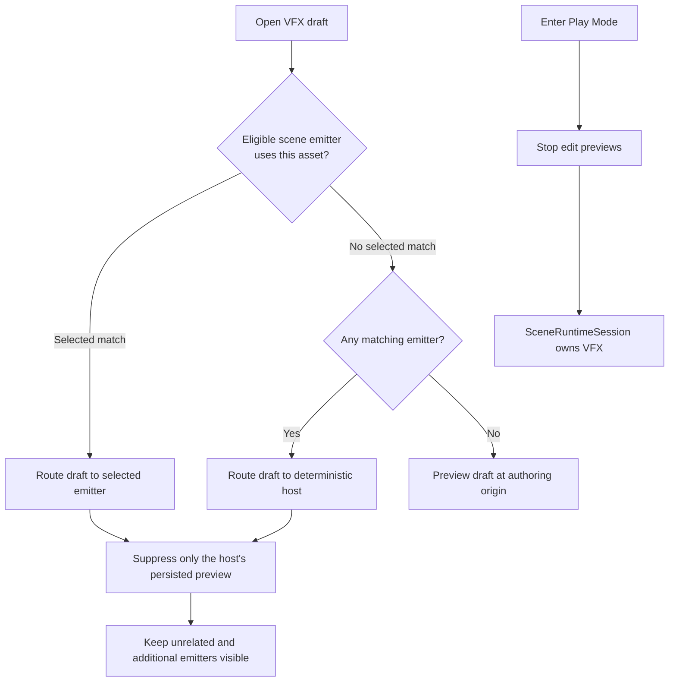

## Graph Workflow

The Graph tab is the executable authoring surface for schema-4 Graph assets. It shows the current schema and execution
source in the Systems pane. If the header says **EXECUTION: LEGACY RUNTIME MODULES**, graph edits remain descriptive
until the asset is explicitly converted.

### Systems And Contexts

The left pane lists systems and node counts and provides undoable **Add System** and **Remove** actions. One effect asset
can compile several particle systems. Each system selects **Particle** or **Particle Strip** data and owns one source:
either a normal Spawn Context or a named Event Context. Initialize, Update, and Output remain canonical downstream
stages. A root `VfxHandle` owns every internal system slot, so Stop, transform, overrides, reload, and lifetime are
transactional for the complete effect:

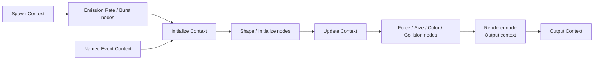

The context colors are consistent throughout the editor:

- Spawn: teal
- Initialize: purple
- Update: blue
- Output: orange
- Event: red

The Context enum is part of executable semantics, not just presentation. `ParticleStream` cables may stay in the same
stage or move forward from Spawn/Event to Initialize to Update to Output; they may not travel backward. `OnPlay` Event
sources receive one automatic activation event. Other names wait without spawning until `SendEvent` is called. One
event call fans out to every system with the exact matching name inside that root effect. Context anchors cannot be
deleted independently of their owning system.

### Execution Source And Migration

New effects are Graph assets. Schemas 1–3 are accepted and migrated in memory. Historical module-stack assets retain
`LegacyModules` execution until explicit conversion; Save publishes canonical schema 4 without silently opting into a
different execution model. Reachable executable nodes in a historical schema-3 Graph are migrated automatically into
ordered Context Blocks. Their node IDs become Block IDs, data-pin and cable IDs are preserved, and the four Contexts
become the only `ParticleStream` path. Disconnected legacy draft nodes remain readable so migration never invents
execution for unfinished work.

Schema 4 records a `VfxCompatibilityMode`. Newly created graphs use `NativeSchema4`, where unsupported authored values
are compile errors. Schema 1-3 migration and explicit Runtime Module conversion use `MigratedLegacyModules`, preserving
historical execution while publishing explicit capability warnings. Duplicate Blocks are legal: the compiler assigns
each Block its own execution identity even when several Blocks reference the same authoring payload, so bindings and
random streams cannot alias after reload or reordering. Bounded program/resource limits remain node-linked errors in
both modes. The mode is serialized so Save/reload cannot silently change compatibility.

Select **Convert Runtime Modules to Graph** in the header to migrate:

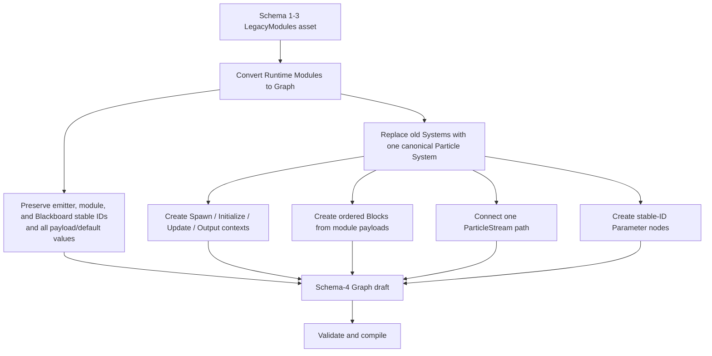

Conversion is deterministic and undoable. It replaces the previous `Systems` collection instead of trying to infer
execution from arbitrary old node names or decorative links. If an older presentation graph contains design notes you
want to retain, duplicate the asset before conversion or inspect the converted draft before saving.

There is no ambiguous automatic mode selection: `VfxExecutionSource::LegacyModules` executes enabled payloads directly,
while `VfxExecutionSource::Graph` executes only the program reachable through the validated graph.
Native import or migration tools can perform the same conversion with
`Keire::ConvertVfxEffectToGraph(legacyDefinition)`.

### Node Kinds

Use **Add Node** above the canvas, or right-click empty canvas space to open the ranked node palette at that graph
position. Results are filtered by Context, requested pin direction/type, backend, and support status:

The search field lives inside each palette and receives focus when it opens. Results update while typing; **Up/Down**
wrap the available entries and **Enter** creates the selected node. Empty searches keep recent/common entries visible
without replacing the categorized Context, Operator, module, and Blackboard menus.

| Node kind | Purpose | Executable requirements |
| --- | --- | --- |
| Context | Delimits Spawn/Event, Initialize, Update, or Output | Canonical `ParticleStream` pins; one source and one of each downstream stage per system |
| Block | Runs one ordered particle operation inside a Context | Canonical payload reference and typed inputs; vector order is execution order |
| Operator | Produces a reusable typed value | Known descriptor ID/version, canonical settings/pins, and a valid evaluation Context |
| Blackboard Parameter | Supplies one typed value | References a Blackboard stable ID and has one typed `value` output |
| Constant / Attribute / Subgraph | Reserved production-parity nodes | Disabled with a visible reason until the corresponding milestone is executable; use inline literals for current constants |
| Portable Custom HLSL | Mutates bounded particle attributes | An ordered Context Block, optional typed value inputs, and valid Portable source |
| Legacy Module node | Reads historical schema-3 flow graphs | Canonical flow/property pins; retained for migration, not preferred for new schema-4 work |

A Block stores the compatibility payload stable ID in `VfxGraphBlock::Reference`, but its enabled state, inline pin
values, incoming value cables, and position in the Context stack are authoritative for Graph execution. The payload
retains structural choices and allows historical readers to preserve the operation. Deleting the Block removes its
incident value cables and stops that operation. Several Blocks may reference one payload: lowering copies the payload,
assigns the Block stable ID as its execution identity, and preserves independent pins, bindings, random identity, and
diagnostics for every occurrence.

Adding payload data does not automatically schedule it. Right-click the target Context or choose its **Add Block**
action, select a compatible payload, and reorder the resulting Block in that Context. Operator and Custom HLSL creation
never rewires an existing cable behind your back: a new free-floating node remains disconnected until you drag its
cables. An unreferenced payload can remain in the asset as inactive compatibility data.

### Canvas Navigation

Use the canvas controls as follows:

- Click a card to select it.
- Left-drag a card to move it. Its new graph position is committed when the drag completes.
- Drag a Block within its Context stack to reorder it; the completed reorder is one undoable transaction.
- Click a cable to select it and inspect its typed source and destination.
- Drag from either end of a compatible typed connection: output to input or input to output.
- Right-click empty space to open the searchable, categorized node palette at the pointer.
- Right-click a node, pin, or cable for actions specific to that target.
- Double-click a cable to add one or more persistent routing knots. Drag a knot to reshape the cable; select it and
  press **Delete**, or double-click it, to remove only that knot.
- Press **Delete** to remove the selected deletable node or selected cable.
- Press **Escape** to cancel a cable drag or dismiss the active creation gesture without editing the document.
- Middle-drag the canvas to pan.
- Use the mouse wheel to zoom. Hovered canvas zoom consumes the wheel instead of scrolling the containing panel.
- Click the background to clear node selection.
- Select **Frame All** to fit every card in the available canvas.

The canvas uses zoom-aware detail levels. At overview zoom it retains card silhouettes, colored typed pins, cables,
selection, and pin hit targets while hiding text that cannot fit a scaled row. Block and cable labels return at medium
zoom, pin labels return when row spacing is readable, and node subtitles return at full-detail zoom. These are visual
levels of detail only: hidden labels do not disable pins, connections, context menus, selection, or drag operations.

The Inspector exposes **Graph Position** for precise node placement. When a cable is selected, it instead presents the
cable's stable identity, source node and pin, destination node and pin, value type, and unlink action.

Every completed gesture is one document command. Moving a node creates one undo entry when the drag ends; creating,
replacing, unlinking, or deleting a cable creates one entry when the action completes. **Undo** and **Redo** therefore
operate on the same meaningful actions visible on the canvas rather than on every intermediate pointer position.

These direct-manipulation behaviors apply to the VFX graph. The shared generic canvas remains backward compatible with
the Audio Mixer's existing pinless, read-only routing presentation; VFX pin interactions do not change Audio Mixer
authoring or runtime routing.

### Editing A Node

Selecting a node or Block opens its stable identity, reference where applicable, stage, graph position/order, typed
pins, settings, backend/support badges, and touching connections. Context and Custom HLSL nodes can be renamed. Block
and Parameter labels come from catalog/payload or Blackboard metadata, so a display rename does not break binding.

Block Context and property semantics are compiler-owned and match the referenced payload type. An Operator's Context
selector lists only the stages permitted by its descriptor; Event remains visibly unavailable until Event execution
lands. The Inspector edits descriptor settings such as Random scope/constant/channel behavior, Compare condition, and
Remap clamping. Custom HLSL nodes may select Spawn, Initialize, Update, or Output. Moving a free-floating card changes
editor layout only; moving a Block changes executable order.

Deleting a Block removes its incident data cables in the same undoable edit. Deleting a legacy Module or Custom HLSL
node removes its incident cables; canonical Context nodes are not deletable. Parameter and Operator nodes may remain
unconnected and are removed by dead-node elimination at compile time.

Right-clicking a node opens its context menu. Deletable nodes offer **Delete Node**; canonical Context nodes explain why
deletion is unavailable. Right-clicking a pin provides its typed connection actions, including disconnecting an
occupied input or its touching cables. Right-clicking a cable selects it and offers **Unlink**. The keyboard
**Delete** command applies to the currently selected node or cable and follows the same validation and undo rules.

### Typed Pins

Each pin has:

- A stable ID
- A display name
- A `VfxValueType`
- An Input or Output direction
- A compiler semantic such as `particles`, `value`, `gravityMultiplier`, or a Custom HLSL input identifier
- An optional typed fallback for a Custom HLSL input

Schema-4 graph types include Boolean, signed/unsigned Integer, Scalar, Vector2/3/4, Quaternion, Matrix, Color, Curve,
Gradient, scalar/integer/vector/color Ranges, Texture/resource types, Mesh, generic Asset, and
`ParticleStream`. `ParticleStream` represents execution flow; it is not a Blackboard value and has no literal default.

Use the typed **Split Vector 2**, **Split**, **Split Vector 4**, and **Split Color** Operators to expose each component as
a Scalar output. Their matching Combine Operators reconstruct the compound value from Scalar inputs. Vector pins use
X/Y/Z/W names; Color uses R/G/B/A. These are exact typed connections on both CPU and GPU, so a Vector2 cable must connect
to Split Vector 2 rather than the existing Vector3-only Split node. Searching for `split`, `components`, `float2`,
`float3`, `float4`, or `rgba` finds the appropriate variant.

Context, Block, Operator, Parameter, legacy Module, and flow pins have canonical compiler-owned shapes. Portable Custom
HLSL value inputs are editable and may use its supported scalar/vector/color subset. Their semantic is the identifier
used in source. An unconnected input uses its typed fallback; a connected Portable input may be driven by a matching
Parameter or executable Operator. CPU execution resolves Operator registers in the Portable Block's Context before the
ordered instruction runs. GPU execution consumes the packed value program in the Portable Block's particle stage, so
particle-varying inputs use the shader interpreter instead of a host approximation. Unsupported types and program
limits fail compilation with the source Operator's stable ID.

Compatibility payload edits can refresh matching Block or legacy Module defaults without replacing stable pin IDs.
Once a Block pin is edited directly, that inline value is compiled as the operation input even if its backing payload
contains a different value. Context, built-in Block, Operator, Parameter, and stream pin shapes are compiler-owned; only
Portable Custom HLSL data inputs can be added, renamed, retyped, assigned a fallback, or removed in this release.

### Creating A Link

Create a link directly on the canvas:

1. Point at either an output or input pin.
2. Left-drag away from the pin. A live cable follows the pointer.
3. Hover the opposite pin. Direction is normalized automatically, so dragging input-to-output is equivalent to
   output-to-input.
4. Release over a compatible destination to commit one connection edit.

The live cable communicates the candidate result before release:

| Feedback | Meaning |
| --- | --- |
| **Green** | The connection is compatible and leaves the graph publishable. |
| **Amber** | The connection is structurally valid, but the draft will remain temporarily incomplete, another executable-graph diagnostic remains, or the destination's existing cable will be replaced. The nearby diagnostic explains why. |
| **Red** | The pins cannot be connected. Direction, type, duplicate-cable, ownership, or other validation details appear beside the gesture. Releasing makes no edit. |

Exact pin types must match, and one input has at most one writer. Dropping onto an occupied input atomically replaces
its previous cable; the old removal and new connection form one undoable command, so the document never exposes a
half-rewired input. An exact duplicate is rejected. Block inputs accept matching Parameter or executable Operator
outputs;
`ParticleStream` flow must ultimately remain acyclic and ordered from Spawn through Output.

Press **Escape** or release over empty or incompatible space to cancel without changing the document. The Inspector's
connection controls remain an accessible alternative, but direct pin dragging is the primary workflow.

Click a cable to select it and inspect both endpoints. Right-click the cable and choose **Unlink**, or press
**Delete** while it is selected. Deleting a node automatically deletes every connection that references it. Unlinking a
required executable cable may intentionally leave a temporarily incomplete draft as described below.

### Temporarily Incomplete Graph Drafts

Direct manipulation must permit multi-step repairs without publishing broken runtime data. For example, you may unlink
a `ParticleStream` cable before reconnecting it to a different node. During that interval:

- The editable draft, selection, node positions, and undo history retain the incomplete topology.
- The authoring preview does not execute the incomplete graph. It remains frozen on the last valid compiled draft.
- A prominent diagnostic identifies the disconnected stream, cycle, backward edge, missing stage, or other remaining
  executable requirement.
- **Save** and `Ctrl+S` are blocked, preventing an incomplete executable graph from being published.
- Structurally invalid gestures, such as connecting two inputs or mismatched value types, are still rejected outright.

Reconnect until the live cable feedback becomes green, or choose **Undo** to restore the previous topology. Once the
diagnostic clears, preview synchronization resumes and the document becomes saveable again. Closing or discarding the
draft follows the normal unsaved-document workflow; it never silently publishes the incomplete graph.

### Building The Main Particle Stream

Every Graph system needs one connected `ParticleStream` path through Spawn, Initialize, Update, and Output Contexts.
Blocks execute inside those Contexts in stored vector order; they do not use flow cables. Free-floating Parameters and
Operators feed typed Block inputs, while screen position remains presentation-only.

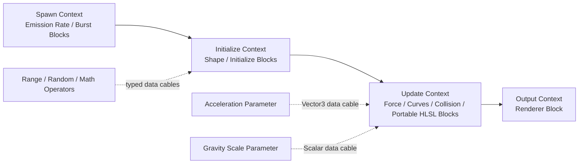

The compiler walks each connected Context in stage order and lowers enabled Blocks in their stored order. It separately
topologically lowers only the value Operators needed by connected, enabled Block inputs; unused Operators are removed.
Graph compilation still requires at least one enabled Emission Rate or Burst Block and one enabled Renderer Block.

Built-in payload types retain their defined stage semantics: emission schedules Spawn, shape/initialization configure
creation, force/collision/curves run Update, and Renderer supplies Output. Within those constraints, Context order and
Block vector order determine the operation schedule. Typed value cables supply inputs; they do not move a Block outside
its canonical Context.

Use Compile before Save. The editor's candidate-preview validation is transactional, so an invalid edit reports an
error and retains the last-good draft instead of publishing half-valid topology.

### Portable Custom HLSL

Portable Custom HLSL is a deliberately small HLSL-like statement language, not unrestricted shader source. It lowers
to verified, backend-neutral instructions and executes on both CPU and GPU. This keeps authoring deterministic and
avoids runtime shader compilation, arbitrary resource access, or backend-specific behavior.

Write semicolon-separated assignment statements:

```hlsl
Velocity += Acceleration * DeltaTime;
Position += float3(0.0, 0.25, 0.0) * DeltaTime;
Tint *= float4(1.0, 0.8, 0.5, 1.0);
Size = 0.75;
Rotation += SpinDegrees * DeltaTime;
```

`Acceleration` and `SpinDegrees` are Custom HLSL input-pin semantics. Cable those inputs from matching Parameter nodes,
or give each input a typed fallback.

The supported grammar is:

```text
Statement := Target Operator Operand [ "*" "DeltaTime" ]
Target    := Position | Velocity | Rotation | Tint | Size
Operator  := "=" | "+=" | "*="
Operand   := InputSemantic | ScalarLiteral | float2(...) | float3(...) | float4(...)
```

Statements are separated by semicolons; a newline by itself is only whitespace. The optional `* DeltaTime` must be the
trailing form shown above. Names and literal constructors are case-sensitive. `DeltaTime * value`, compound
expressions, and multiple operands are not accepted.

| Target | Native value | Accepted operand |
| --- | --- | --- |
| `Position` | `Vector3` | Scalar broadcast or `float3` / Vector3 input |
| `Velocity` | `Vector3` | Scalar broadcast or `float3` / Vector3 input |
| `Rotation` | Particle Z Euler/billboard rotation in degrees | Scalar |
| `Tint` | `Color` | Scalar broadcast or `float4` / Color input |
| `Size` | Scalar | Scalar |

Numeric literals must be finite and have magnitude at most `1,000,000`. Custom inputs may be Scalar, Vector 2,
Vector 3, or Color, but a Vector 2 operand currently has no matching writable target. Input semantics must be unique
identifier names using letters, digits, and underscores, and may not begin with a digit.

An executable Graph effect may contain up to 4,096 non-empty Portable statements across all Blocks. This is a compiler
safety bound, not a constant-buffer ABI limit; the renderer uploads the exact dynamic instruction and operation tables.
Empty programs are invalid. The following are intentionally forbidden:

- Functions, declarations, structs, macros, `#include`, and preprocessor directives
- `if`, `switch`, loops, recursion, and function calls other than the literal forms `float2/3/4(...)`
- Textures, samplers, buffers, atomics, thread IDs, and other resource access
- Swizzles, indexing, arbitrary arithmetic expressions, and chained operators
- Writes to particle age, lifetime, identity, renderer, free lists, or emission counts
- Cables from nodes other than Blackboard Parameters or supported executable Operators

Portable instructions execute at their compiled cable position within the selected stage. Spawn, Initialize, and the
first Output evaluation run when a particle is created; Update and Output run during per-frame simulation. The Delta
Time Operator receives the effect's scaled step in Spawn, Update, and per-frame Output, and zero in Initialize and the
creation Output pass. Portable statements using the trailing `* DeltaTime` modifier receive zero throughout particle
creation and the scaled step in Update/per-frame Output. Local-space Position and Velocity writes
use local semantics on both backends.

On GPU, Custom instructions and built-in Modules execute together in cable order inside that emitter's normal spawn or
simulation dispatch. The world retains its authored logical particle ceiling, but the renderer selects a physical pool
from the summed capacities of live systems, rounds growth up, never shrinks a live pool, and caps it at that ceiling.
Crossing the reserved physical capacity is a storage-layout change: the renderer grows the pool, restarts that world's
GPU simulation, and emits one explicit warning containing the old and new capacities. Author stable production scenes
so their concurrently active system capacities are known at activation and the initial snapshot reserves them together.
Each emitter retains its prior compacted index view. Update and per-frame Output dispatch against that emitter's
authored capacity and early-out at its live compacted count instead of scanning the physical pool. Global render
compaction scans only the sum of active-system capacities, which is a proven upper bound for the shared alive list.
Spawn, Initialize, initial Output, and strip-link setup use a compact list of only the particles requested by that spawn.
Profile **VFX GPU particle capacity**, **VFX compute thread groups**, and **GPU fence wait (ms)** together: the dispatch
count alone does not show how many shader groups ran, while a fence wait identifies GPU/presentation back-pressure
rather than application CPU work.

### Current Graph Limits

Graph execution currently supports:

- Multiple particle systems with Spawn or named Event sources and Initialize, Update, and Output Contexts
- Particle and Particle Strip identities, including deterministic Per Particle Strip Random scope
- Ordered Blocks referencing compatibility payloads for structural data
- Blackboard Parameters and executable core Operators bound to canonical Block inputs
- Independent duplicate Blocks and particle-varying numeric bindings through one typed CPU/GPU property ABI
- Portable Custom HLSL Blocks with typed defaults, Parameter inputs, or executable Operator inputs
- Deterministic CPU lowering and the packed core value-opcode interpreter on GPU
- Sprite, Mesh, adjacency-connected Ribbon, and analytic Volumetric outputs on both backends

It does not currently support the remainder of the Unity Operator/Block catalog, subgraphs, decals, froxel injection,
unrestricted Unity-style Custom HLSL, or arbitrary custom GPU resources. Scene Physics collision remains CPU-required
because it invokes the host physics world. Those entries and
placements remain disabled, GPU-required, or explicit compile errors rather than changing behavior silently.

## Runtime Modules

The Runtime Modules tab edits module payload records. The left pane selects, adds, removes, and reorders them; the right
pane edits the selected payload.

Every module has a stable ID and a compatibility **Enabled** checkbox. In LegacyModules mode, enabled payloads lower
directly in stack order. In Graph mode, the enabled state and order of Context Blocks are authoritative: keeping,
disabling, or reordering a payload record does not independently schedule the operation. A Block references the payload
for structural compatibility while its inline inputs and value cables supply executable values.

### Module Multiplicity

| Module type | LegacyModules count | Schema-4 Graph count |
| --- | ---: | ---: |
| Emission Rate | Bounded by the module limit | Bounded by the graph module limit |
| Burst | 0 to 32 | 0 to 32 |
| Shape | Bounded by the module limit | Bounded by the graph module limit |
| Initialize | Bounded by the module limit | Bounded by the graph module limit |
| Forces | Bounded by the module limit | Bounded by the graph module limit |
| Size over Lifetime | Bounded by the module limit | Bounded by the graph module limit |
| Color over Lifetime | Bounded by the module limit | Bounded by the graph module limit |
| Collision | Bounded by the module limit | Bounded by the graph module limit |
| Renderer | One or more; backend checks apply | One or more; backend checks apply |

LegacyModules execution requires at least one enabled Emission Rate or Burst payload and one enabled Renderer payload.
Graph execution applies the same invariant to enabled Context Blocks; a disabled compatibility payload does not disable
its referencing Block. Removing or disabling the last usable emission Block or renderer Block is rejected
transactionally.

### Emission Rate

Emission Rate continuously requests particles while the emitter is emitting.

| Field | Meaning |
| --- | --- |
| **Particles per Second** | Continuous rate from `0` to `1,000,000`. Fractional particles accumulate deterministically. |

For a one-shot effect driven only by bursts, remove or disable Emission Rate. Multiple scheduled schema-4 Emission Rate
Blocks are additive on both CPU and GPU; the shared fractional accumulator makes their total independent of Block
grouping.

### Burst

A Burst requests a fixed number of particles at one or more times within each effect duration.

| Field | Meaning |
| --- | --- |
| **Time (s)** | First burst time. It must be at least zero and earlier than Duration. |
| **Count** | Particles requested per cycle, from `1` to `1,000,000`. |
| **Cycles** | Number of repetitions, from `1` to `1024`. |
| **Interval (s)** | Delay between cycles. It must be positive when Cycles is greater than one. |

The final cycle must occur before the effect Duration. A burst at time zero is emitted on the first non-zero update.
Looping effects repeat their bursts once per Duration.

### Shape

Shape chooses the initial particle position relative to the emitter.

| Field | Meaning |
| --- | --- |
| **Shape** | Point, Box, Sphere, Cone, Mesh, or Volume. |
| **Box Half Extent** | Positive X, Y, and Z half extents for Box emission. |
| **Radius** | Sphere radius. |
| **Cone Angle** | Cone half-angle in degrees, greater than zero and less than 90. |
| **Cone Length** | Positive Cone length. |
| **Mesh** | Mesh sampled when Shape is Mesh. |
| **Volume Asset** | Asset sampled when Shape is Volume. |

Point needs no shape data. CPU Box, Sphere, and Cone sampling are built in. CPU Mesh and Volume sampling use the
`VfxWorldSpecification::ShapeSample` callback; scene runtime installs an asset-backed implementation automatically.
A directly owned world can install its own sampler. Without one, particles use the emitter origin and report
`ShapeAssetSamplerUnavailable`.

The GPU path supports Point, Box, uniformly distributed Sphere volume, and Cone volume directly. Mesh imports publish a
triangle-area cumulative distribution, and `.keirevfxvolume` assets publish density-by-cell cumulative weights. The
renderer uploads both through the reflected resource table and the spawn kernel draws deterministic weighted samples.
Missing, malformed, empty, or over-budget resources produce an explicit compile/runtime diagnostic and preserve the
last-good preview. Duplicate Shape, Initialize, Force, Size, Color, and Collision Blocks execute in authored order with
separate Block IDs and separate generic property ranges; they no longer alias one fixed payload slot. Renderer remains
the system's single structural output Block.

#### Authoring a sparse volume asset

Create a UTF-8 `.keirevfxvolume` file in the Assets folder. Each axis-aligned cell contributes
`cell volume * density` to the sampling distribution; zero-density cells are valid but the total positive weight must
be non-zero. Bounds and density must be finite, each maximum must be greater than its minimum, and the importer accepts
at most 1,048,576 cells and 64 MiB of source JSON.

```json
{
  "schemaVersion": 1,
  "cells": [
    {
      "minimum": [-1.0, 0.0, -1.0],
      "maximum": [1.0, 0.25, 1.0],
      "density": 0.2
    },
    {
      "minimum": [-0.35, 0.25, -0.35],
      "maximum": [0.35, 2.5, 0.35],
      "density": 1.0
    }
  ]
}
```

After import, assign the asset to **Shape > Volume Asset** and choose **Volume**. Cooking records it as a typed
dependency. CPU and GPU choose the same weighted cell deterministically; each backend then samples a point inside that
cell. Reimport publishes the new table transactionally and keeps the previous loaded asset if validation fails.

### Kill Shape

Kill Shape is an ordered Update Block with axis-aligned Box and Sphere modes. **Solid** releases a particle whose
simulation-space position is inside or on the volume boundary; **Inverted** releases one outside the volume. Center,
Box Half Extent, Radius, and Inverted accept ordinary typed Block inputs on CPU and GPU, while Shape remains a
compiler-reflected setting. Extents and radius must be finite and positive.

Local-space effects evaluate the volume in emitter-local coordinates, so it follows emitter translation and rotation.
World-space effects interpret Center and the volume axes directly in world space. The check runs at the Block's stored
position in Update order, before the runtime's fallback velocity integration; place position-writing Blocks before
Kill Shape when the authored effect requires their result to be tested in the same step. Kéire's single block is the
documented equivalent for Unity's generic Kill Shape, Kill (AABox), and Kill (Sphere) rows; particle-radius expansion,
planes, and collision-attribute writes remain outside this bounded contract. Focused rendered-output acceptance proves
the Solid/Inverted sphere differential on both D3D12 and Vulkan in addition to deterministic CPU semantics and GPU
payload validation.

### Initialize

Initialize chooses each new particle's lifetime, velocity, and Euler rotation from deterministic ranges.

| Field | Meaning |
| --- | --- |
| **Lifetime Minimum / Maximum** | Ordered positive range from `0.001` to `86,400` seconds. |
| **Velocity Minimum / Maximum** | Ordered component-wise initial velocity range. |
| **Rotation Minimum / Maximum** | Ordered component-wise Euler-degree range. |

The effect seed and emitter Seed Offset determine the random sequence. Equal definitions, seeds, offsets, activation
transforms, and update deltas produce equal CPU particle results.

GPU initialization uses lifetime, velocity, and full Euler rotation ranges. CPU and GPU compilation reject non-zero
X/Y initialization rotation when the selected output is Sprite, because billboards consume only Z rotation. Mesh
output accepts and renders all three Euler components on both backends.

### Forces

Forces applies acceleration during Update.

| Field | Meaning |
| --- | --- |
| **Force** | Constant authored acceleration vector. |
| **Gravity Multiplier** | Multiplier applied to Kéire's gravity vector; accepted range is `-1000` to `1000`. |

The final acceleration is the authored Force plus gravity multiplied by Gravity Multiplier.

### Size Over Lifetime

Size over Lifetime evaluates a `Curve1D` using normalized particle age:

```text
normalized age = particle age / particle lifetime
```

The CPU backend evaluates the full curve, including its keys and interpolation. Negative evaluated size is clamped to
zero. GPU snapshots sample the authoritative curve at 64 uniformly spaced normalized-age points; the compute kernel
linearly interpolates adjacent samples and applies the same zero clamp. This bounded lookup supports multi-key,
constant, linear, and cubic curves without changing particle state layout. The maximum temporal quantization interval
is `1 / 63` of normalized lifetime.

The current Inspector lists each existing curve key as editable **Time** and **Value** fields. Key times remain ordered
and are clamped between their neighbors. The UI does not yet add/remove keys or expose interpolation/tangent editing;
multi-key curves created through the native asset API or existing source remain preserved and editable by value.

### Color Over Lifetime

Color over Lifetime evaluates a `ColorGradient` using normalized particle age. The CPU backend evaluates the complete
gradient. GPU snapshots sample the authoritative gradient at 64 uniformly spaced normalized-age points and interpolate
adjacent colors in compute. Multi-key and constant-interpolation gradients therefore remain bounded and deterministic;
sharp transitions are quantized to at most one `1 / 63` lifetime interval.

The current Inspector lists each existing gradient key as **Time** plus **Color**. Times remain ordered from zero to one.
The UI does not yet add/remove gradient keys or expose gradient interpolation selection. Use alpha in existing keys to
fade particles in or out; multi-key gradients authored through the native asset API remain preserved.

### Collision

Collision tests the swept segment from previous to current particle position.

| Field | Meaning |
| --- | --- |
| **Mode** | None, CPU, GPU Depth, or Scene Physics. |
| **Restitution** | Bounce response from `0` to `1`. |
| **Kill on Collision** | Removes the particle at the first valid hit instead of reflecting velocity. |

The CPU implementation sends each non-None collision mode through
`VfxWorldSpecification::CollisionQuery`. A Play Mode `SceneRuntimeSession` installs a physics ray-cast query when a
physics world exists. If no query is available, the effect continues without collision and reports
`CollisionQueryUnavailable`.

The GPU implementation supports **GPU Depth** directly. It samples the current scene depth pyramid input, reconstructs
the hit position and normal from the camera matrices, applies restitution or kill, and uses a bounded swept search to
avoid obvious tunneling. A missing depth input leaves simulation valid but reports the capability at render time.
**CPU** and **Scene Physics** deliberately remain CPU-required because they invoke the host callback/physics world;
selecting them for GPU compilation produces a node-linked error instead of a silent approximation.

### Renderer

Renderer selects particle output.

| Field | Meaning |
| --- | --- |
| **Renderer** | Sprite, Mesh, Ribbon, or Volumetric. |
| **Texture** | Texture asset retained for Sprite or Ribbon output. |
| **Mesh** | Mesh asset required for Mesh output. |
| **Material** | Optional particle material for every output type. |

Only the assets used by the selected Renderer participate in cooking. CPU and GPU Sprite, Ribbon, and Volumetric
outputs use the standard particle-surface contract: particle tint multiplies the material's `Tint`, the material's
primary texture overrides the Renderer texture when present, and alpha mode/cutoff are applied after topology-specific
soft falloff. With no texture, Sprite keeps its procedural soft-circle fallback. CPU Mesh particles enter the
material-aware scene path. GPU Mesh particles use asset vertex/index buffers, vertex color, particle tint, size, full
Euler rotation, Forward+ lighting, and an instancing-compatible material shader through an indexed indirect draw.
Incompatible Mesh shaders emit a once-per-emitter diagnostic and retain deterministic fallback shading rather than
dropping the effect.

Ribbon requires **Particle Strip** data and renders camera-facing segments between consecutive live particles in the
same system and strip. The first particle begins a new strip; a missing, dead, non-consecutive, or generation-mismatched
predecessor breaks the strip instead of connecting recycled particle storage. Volumetric renders an analytic sphere-density impostor with depth-aware soft falloff on
both backends; it is not froxel injection. A particle system owns one Renderer Block because output topology and
resource bindings are structural system state; duplicate simulation Blocks remain independently ordered and bound.

## Blackboard

The Blackboard tab authors typed defaults for graph bindings and per-emitter overrides.

The left pane lists properties. Use **+ Add Property** to create one, select it to edit, and use **Remove Property** to
delete it. The Graph tab's Systems pane also provides a compact list and **+ Parameter** shortcut. Use
**Add Node / Blackboard / _Name_** to create a Parameter node for a property, then cable its output to a same-typed
Module or Custom HLSL input.

| Blackboard type | C++ default-value type |
| --- | --- |
| Boolean | `bool` |
| Integer | `std::int64_t` |
| Scalar | `float` |
| Vector 2 | `Keire::Vector2` |
| Vector 3 | `Keire::Vector3` |
| Color | `Keire::Color` |
| Texture | `Keire::AssetId` |
| Mesh | `Keire::AssetId` |
| Asset | `Keire::AssetId` |

Each property contains:

- A globally stable ID
- A unique, non-empty Name
- A Type
- A type-matching Default value
- An **Exposed** flag that controls whether activation/live overrides are accepted and whether a stored component
  override is applied

Changing Type resets Default to that type's zero value. Texture and Mesh defaults use typed asset filtering; general
Asset accepts any asset type. Asset-valued defaults participate in VFX dependency extraction and cooking.

Renaming or retyping a property updates every referencing Parameter node's output name/type. Incompatible outgoing
cables are removed in the same undoable edit. Removing a property removes its Parameter nodes and all incident cables.

Names are display-only. Parameter nodes, scene components, activation overrides, and live runtime calls all bind by the
parameter's stable `AssetId`, so renaming a property does not break its consumers. Changing or regenerating that ID does.

### Binding A Block Property

Blocks expose canonical typed property inputs. Connect a Parameter or Operator output directly to one of these inputs:

| Module | Bindable property inputs |
| --- | --- |
| Emission Rate | Particles Per Second |
| Burst | Time, Count, Cycles, Interval |
| Shape | Box Half Extent, Radius, Cone Angle, Cone Length, Mesh, Volume |
| Initialize | Lifetime Minimum/Maximum, Velocity Minimum/Maximum, Rotation Minimum/Maximum |
| Force | Force, Gravity Multiplier |
| Size over Lifetime | Size |
| Color over Lifetime | Color |
| Collision | Restitution, Kill On Collision |
| Renderer | Texture, Mesh, Material |

The cable type must match exactly. Shape type, collision mode, renderer type, module Enabled, and other structural
choices are not bindable. A bound Size value replaces the authored size curve with a constant for that emitter; a bound
Color value likewise replaces the gradient with a constant. Leave those inputs unconnected when the full curve or
gradient should remain authoritative.

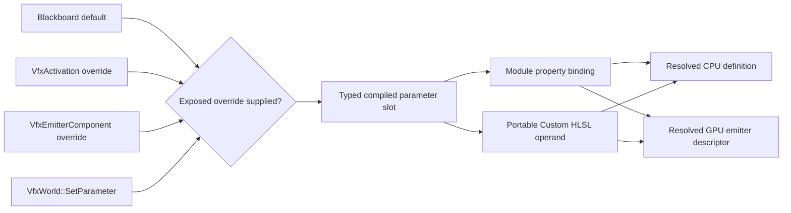

Hidden parameters may still drive graph bindings, but external overrides are rejected. Overrides must use a known,
Exposed stable ID and an exactly matching `VfxParameterValue` alternative. Duplicate IDs, non-finite values, unknown
IDs, hidden parameters, type mismatches, and values that violate the selected backend's renderer or rotation
capabilities are rejected transactionally by direct `VfxWorld` APIs. Activation and live updates revalidate the fully
materialized definition, so an exposed resource parameter cannot bypass the compiler by using an empty default.

### Scene-Component Overrides

`VfxEmitterComponent` stores overrides with the scene and synchronizes them into Edit Mode and Play Mode instances.
Use the native component API for typed authoring:

```cpp
#include <Keire/Core.h>

void ConfigureAura(Keire::VfxEmitterComponent& emitter, const Keire::AssetId intensityParameter,
                   const Keire::AssetId tintParameter)
{
    emitter.SetParameterOverride({intensityParameter, 48.0F});
    emitter.SetParameterOverride({tintParameter, Keire::Color{0.2F, 0.6F, 1.0F, 1.0F}});

    // Remove one value to reveal the asset default again.
    (void)emitter.RemoveParameterOverride(intensityParameter);

    // Or reset every serialized override.
    emitter.ClearParameterOverrides();
}
```

Reading is intentionally split between the authored default and the emitter's optional override. The component does
not duplicate defaults, so code can distinguish "the scene overrode this value" from "use the asset value":

```cpp
#include <Keire/Core.h>

std::optional<Keire::VfxParameterValue>
FindOverride(const Keire::VfxEmitterComponent& emitter, const Keire::AssetId parameter)
{
    const auto values = emitter.ParameterOverrides();
    const auto found = std::ranges::find(values, parameter, &Keire::VfxParameterOverride::Parameter);
    return found == values.end() ? std::nullopt : std::optional{found->Value};
}

const Keire::VfxBlackboardParameter* FindAuthoredParameter(const Keire::VfxEffectAsset& effect,
                                                           const Keire::AssetId parameter)
{
    const auto& blackboard = effect.Definition().Blackboard;
    const auto found = std::ranges::find(blackboard, parameter, &Keire::VfxBlackboardParameter::Id);
    return found == blackboard.end() ? nullptr : &*found;
}
```

Use `std::get_if<T>` on the returned `VfxParameterValue` or authored `DefaultValue` after checking the parameter's
declared type. This is the native read path; live writes use `SceneRuntimeSession::SetVfxParameter` or
`VfxWorld::SetParameter` so the component and active CPU/GPU program update transactionally.

The component schema stores a bounded canonical stable-ID array in its `Parameter Overrides` text property. In the
scene Inspector, assign an effect and use the generated type-appropriate controls for its Exposed parameters. Each
active override shows the authored default and a **Reset** action. Overrides whose stable ID was removed, hidden, or
changed to an incompatible type remain visible as stale entries until **Remove** is selected. Scene loading and preview
synchronization apply only overrides that are still known, Exposed, and type-compatible with the assigned effect.
Asset-valued component overrides participate in scene dependency extraction and cooking.

Managed C# can update exposed range parameters on the Play Mode runtime component and live effect. See
[Runtime Range Parameters](#runtime-range-parameters). Other managed Blackboard value types and managed reset/remove
operations are not exposed in this milestone; use the native component/world
APIs for those workflows.

## Effect Settings

Effect Settings control the emitter-level simulation contract.

| Setting | Meaning |
| --- | --- |
| **Emitter ID** | Stable identity used to decide whether a revision can preserve live state. It is displayed, not edited. |
| **Name** | Non-empty authored effect name, at most 128 UTF-8 bytes. |
| **Loop** | Repeats emission across successive Duration periods. |
| **Duration (s)** | Emission period from `0.001` to `3600` seconds. |
| **Simulation Space** | Local or World particle coordinates. |
| **Deterministic Seed** | Base `std::uint32_t` random seed. |
| **Capacity** | Per-effect live-particle budget from `1` to `1,000,000`. |

Loop controls the effect itself. **Loop Preview** in the toolbar is a separate transport option that can repeatedly
reactivate a completed non-looping asset preview.

### Local Versus World Space

Simulation Space determines what happens to particles that are already alive when the emitter moves.

```text
LOCAL SPACE

Before move:  emitter ★  • • •
After move:                         emitter ★  • • •

Existing particles are stored relative to the emitter and follow its current position/rotation.


WORLD SPACE

Before move:  emitter ★  • • •
After move:   • • •                         emitter ★  •

Existing particles stay where they spawned. New particles use the new position/rotation.
```

Use Local for:

- Character auras
- Weapon glows
- Engine exhaust that must remain attached
- Effects whose complete particle field should follow a parent

Use World for:

- Smoke left behind by a moving object
- Sparks and debris
- Rain or environmental volumes
- Trails built from ordinary particles

In Play Mode and direct runtime use, seeing particles at both the old and new locations after moving a World-space
emitter is expected: old particles remain until their lifetime expires while new particles spawn at the moved emitter.

Edit Mode deliberately favors clear placement authoring. When a gizmo edit changes the position or rotation of a
World-space preview emitter, Kéire restarts that emitter's preview at the new transform. The old cloud is removed instead
of remaining beside the newly positioned cloud. Local-space previews update their transform without needing that
World-space discontinuity restart.

Use Play Mode when the goal is to inspect the runtime trail left by a moving World-space emitter. Use Local space when
following is the intended runtime behavior.

`VfxActivation` and scene synchronization carry position and rotation only. Entity scale does not scale the VFX shape,
particle size, or velocity. Author dimensions explicitly in the Shape, Initialize, and Size over Lifetime modules.

Local-space particles follow `SetTransform` on both backends. The GPU renderer applies the emitter's rigid
position/rotation delta to that handle's existing particle positions, velocities, and accelerations before simulation;
particles belonging to other handles are untouched. Scale is not part of the VFX transform contract on either backend.

### Determinism

The runtime combines the asset and component seeds as:

```text
effective seed = effect Seed XOR emitter Seed Offset
```

Use the same Seed Offset for repeatable copies or different offsets for deterministic variation. A combined zero seed
is replaced internally with a fixed non-zero random state.

## VFX Emitter Component

### Material-aware mesh examples

`Assets/Vfx/EmberShardCyclone.keirevfx` and `Assets/Vfx/ArcaneSigilOrbit.keirevfx` demonstrate mesh output with custom
repository-owned glTF sources. Each glTF embeds its geometry and PBR material; mesh import publishes the material as a
stable generated subasset and records it in the mesh's default material slot. CPU VFX mesh particles enter the ordinary
scene material path, so tint, emissive/metallic/roughness properties, depth, and receiving lights behave like authored
Mesh Renderer geometry.

The templates compile on GPU when their other Blocks satisfy the GPU capability contract. GPU preview renders the same
geometry with vertex color, particle tint, full Euler rotation, composed material parameters/textures, and the normal
Forward+ lighting inputs. Material-shader compatibility is validated before drawing. An unsupported composition keeps
the last-good simulation visible with deterministic built-in shading and emits one actionable emitter/material
diagnostic instead of binding an incompatible pipeline.

Add **VFX Emitter** from the Effects component category. A Transform component is required and is added or enforced by
the component registry.

| Inspector field | Meaning and current status |
| --- | --- |
| **Effect** | Typed reference to a `.keirevfx` asset. |
| **Play On Awake** | Automatically activates the effect in Play Mode. It does not gate edit-mode preview. |
| **Auto Destroy** | Destroys the entire runtime entity after its effect handle finishes. |
| **Simulation Speed** | Per-emitter speed from `0` to `8`; zero pauses simulation. |
| **Seed Offset** | Per-emitter deterministic variation. |
| **Quality Tier** | Low, Medium, High, or Cinematic. Persisted, but not consumed by runtime policy yet. |
| **Culling Mode** | Automatic, Fixed Bounds, or Always Simulate. Persisted, but not consumed by runtime culling yet. |
| **Bounds Center** | Authored culling center. Validated and persisted, but not consumed yet. |
| **Bounds Extent** | Positive authored culling extents. Validated and persisted, but not consumed yet. |
| **Preview In Edit Mode** | Enables transient preview for this scene emitter outside Play Mode. |
| **Parameter Overrides** | Typed controls for the assigned effect's Exposed Blackboard parameters, with default reset and stale-entry cleanup; serialized canonically by stable ID. |

### Edit-Mode Eligibility

A scene emitter is previewed only while all of these are true:

- An editing scene is available.
- The entity is active in its hierarchy.
- The VFX Emitter component is enabled.
- Preview In Edit Mode is checked.
- Effect references a valid asset ID.
- The effect is available as the open matching draft or as a successfully loaded persisted asset revision.
- The entity's world transform can be decomposed into finite position and rotation.

The editor synchronizes scene identity, entity identity, effect and revision, compatible parameter overrides, seed
offset, simulation speed, enabled state, and world position/rotation. It routes the open draft to one selected or
deterministic matching host and suppresses only that host's persisted duplicate. It also restarts a World-space edit
preview when an authored position/rotation change would otherwise leave an old particle cloud behind. It stops the
preview when the emitter is unchecked, disabled, deleted, moved to a different scene, or superseded by Play Mode.

On the GPU preview backend, that restart is handle-scoped. The renderer retires only particles carrying the restarted
handle's index and generation, so moving one World-space editor emitter does not clear, replay, or blink unrelated
emitters in the shared editor world.

### Play Mode

Play Mode clones the edit scene and creates a scene-owned `Keire::VfxWorld`. Every active, enabled VFX Emitter with
Play On Awake and a loaded Effect receives a runtime handle. The session synchronizes effect revisions, world
position/rotation, compatible parameter overrides, Seed Offset, and Simulation Speed.

The current scene session selects the GPU backend when it is constructed with an Asset System and the bounded CPU
backend for its headless compatibility configuration. Use a directly owned `VfxWorld` when a tool or test needs an
explicit backend choice.

Non-looping effects remain alive after emission stops until their final particle dies. If Auto Destroy is checked, the
runtime scene destroys the entire entity after that handle finishes. Do not enable Auto Destroy on a persistent player,
camera, or gameplay entity merely to clean up a one-shot effect. Put disposable effects on disposable child entities.

Looping effects do not finish naturally, so Auto Destroy does not run until playback is explicitly stopped or the
effect becomes non-looping.

## Managed C# Usage

The managed API defines the typed `VfxEffect` asset marker, entity-scoped `VfxEmitterHandle`, and static `Vfx` service
in the `Keire` namespace.

### Serialized Effect And Playback

```csharp
using Keire;

namespace MyGame;

[StableComponentId("aef16be3-bf65-47f9-93f1-d62553a409f4")]
public sealed class ImpactVfx : Behaviour
{
    [SerializeField, StableFieldId("813ae003-fd0d-4e5b-b277-c309ba07f289")]
    private AssetReference<VfxEffect> _impact;

    private VfxEmitterHandle _emitter;

    public void PlayImpact()
    {
        if (!_impact.IsValid)
        {
            Debug.Warn("Impact VFX is not assigned.");
            return;
        }

        _emitter = Vfx.Play(Entity, _impact, restart: true);
        if (!_emitter.IsValid)
            Debug.Warn("VFX playback request was rejected.");
    }

    public void PauseImpact()
    {
        if (!_emitter.Pause())
            Debug.Warn("VFX pause was rejected.");
    }

    public void ResumeImpact()
    {
        if (!_emitter.Resume())
            Debug.Warn("VFX resume was rejected.");
    }

    public void TriggerSecondaryBurst(uint count = 12)
    {
        if (!_emitter.SendEvent("Impact", count))
            Debug.Warn("No live VFX system accepted the Impact event.");
    }

    protected override void OnDisable()
    {
        _emitter.Stop();
    }
}
```

`Vfx.Play` validates the entity and effect, then asks the runtime scene to create or configure a VFX Emitter on that
entity. A valid returned `VfxEmitterHandle` means the request was accepted. Asset loading is asynchronous, so
`handle.IsAlive` may remain false until the native effect instance activates.

### Named Events

`Vfx.SendEvent(entity, name, count)` and `VfxEmitterHandle.SendEvent(name, count)` enqueue the requested spawn count for
every Event Context whose name exactly matches inside that root effect. Event names must contain non-whitespace text and
fit in 256 UTF-8 bytes; counts are bounded to `1..1,000,000`. Invalid arguments throw before native dispatch. A valid
request returns `false` when the entity/effect is not live or no system has that name. Events are owner-thread scene
operations and are consumed on the next positive simulation update.

### Runtime Range Parameters

`VfxRange<T>` is the managed, inclusive Min/Max value used by range-typed Blackboard parameters. The constructor accepts
endpoints in either order and stores component-wise minima and maxima. Floating-point components must be finite. Pass
the Blackboard row's stable `AssetId`, not its display label; renaming a Blackboard property does not break code that
retains the same stable ID. The public `readonly record struct VfxRange<T> where T : unmanaged` exposes
`VfxRange(T first, T second)`, read-only `Minimum` and `Maximum` properties, and
`Deconstruct(out T minimum, out T maximum)`.

The managed API treats the stable `AssetId` as the Blackboard key. It currently exposes transactional live writes,
not reverse readback of the asset default. Keep the gameplay value in a typed field when code owns it; use the Graph
Parameter node when the particle program needs it. For a non-range Blackboard value, pass an exact `VfxRange<T>` whose
two endpoints are equal:

```csharp
private static readonly AssetId EnergyColor =
    new(0xeda50d666ff044de, 0xa8e8481e82a7a6c8);

private Color _energyColor = new(0.08f, 0.72f, 1.0f, 1.0f);

public bool ApplyEnergyColor(VfxEmitterHandle emitter)
{
    // _energyColor is the code-side readable value. The stable ID selects the Blackboard row.
    return emitter.SetParameter(EnergyColor, new VfxRange<Color>(_energyColor, _energyColor));
}
```

```csharp
using Keire;

public bool ConfigureTrailRanges(AssetId lifetimeRangeParameter, AssetId velocityRangeParameter)
{
    // The reversed scalar endpoints are normalized to Minimum = 1 and Maximum = 20.
    VfxRange<float> lifetime = new(20.0f, 1.0f);
    if (!_emitter.SetParameter(lifetimeRangeParameter, lifetime))
        return false;

    VfxRange<Vector3> velocity = new(
        new Vector3(2.0f, 14.0f, 2.0f),
        new Vector3(-2.0f, 8.0f, -2.0f));

    // The entity-scoped service and handle overloads have the same behavior.
    return Vfx.SetParameter(Entity, velocityRangeParameter, velocity);
}
```

The supported element types and exact overloads are:

```csharp
// VfxEmitterHandle instance overloads
public bool SetParameter(AssetId parameter, VfxRange<float> value);
public bool SetParameter(AssetId parameter, VfxRange<long> value);
public bool SetParameter(AssetId parameter, VfxRange<ulong> value);
public bool SetParameter(AssetId parameter, VfxRange<Vector2> value);
public bool SetParameter(AssetId parameter, VfxRange<Vector3> value);
public bool SetParameter(AssetId parameter, VfxRange<Vector4> value);
public bool SetParameter(AssetId parameter, VfxRange<Color> value);

// Vfx static-service equivalents
public static bool SetParameter(Entity entity, AssetId parameter, VfxRange<float> value);
public static bool SetParameter(Entity entity, AssetId parameter, VfxRange<long> value);
public static bool SetParameter(Entity entity, AssetId parameter, VfxRange<ulong> value);
public static bool SetParameter(Entity entity, AssetId parameter, VfxRange<Vector2> value);
public static bool SetParameter(Entity entity, AssetId parameter, VfxRange<Vector3> value);
public static bool SetParameter(Entity entity, AssetId parameter, VfxRange<Vector4> value);
public static bool SetParameter(Entity entity, AssetId parameter, VfxRange<Color> value);
```

The range constructor throws `ArgumentOutOfRangeException` when any floating-point component is NaN or Infinity. It
throws `NotSupportedException` if another unmanaged `T` is constructed. Reversed endpoints are valid and normalized;
they are not an error.

`SetParameter` returns `false` without changing the runtime component or live native effect when any of these conditions
is true:

- The entity is stale, lacks a VFX Emitter, or has no active runtime scene (in the editor, this means outside Play Mode).
- The parameter ID is invalid, unknown, hidden, or not the exact matching range type.
- The effect is still loading, the native handle is not alive, or the component and live effect no longer refer to the
  same asset.
- Native validation rejects the candidate, including a range/finite-value contract violation.

Call from normal Behaviour lifecycle callbacks on the runtime owner thread. Because asset activation is asynchronous,
wait for `handle.IsAlive` before treating a `false` result as a permanent content error. A successful call updates the
runtime-scene component clone and that entity's live effect atomically; it does not modify the `.keirevfx` asset, the
edit-scene component, or another emitter. This milestone does not expose managed `ResetParameter`, so retain the
authored default in content or use native control when reset semantics are required.

### Managed API Reference

```csharp
VfxEmitterHandle handle = Vfx.Play(entity, effectReference);
VfxEmitterHandle restarted = Vfx.Play(entity, effectReference, restart: true);

bool paused = Vfx.Pause(entity);
bool resumed = Vfx.Resume(entity);
bool alive = Vfx.IsAlive(entity);
bool stopped = Vfx.Stop(entity);
bool eventQueued = Vfx.SendEvent(entity, "Impact", 24);

bool handleAlive = handle.IsAlive;
handle.SendEvent("Impact", 24);
handle.Pause();
handle.Resume();
handle.Restart(effectReference);
handle.Stop();

VfxRange<float> lifetime = new(1.0f, 20.0f);
bool rangeApplied = handle.SetParameter(lifetimeRangeParameter, lifetime);
bool entityRangeApplied = Vfx.SetParameter(entity, lifetimeRangeParameter, lifetime);
```

Important behavior:

- `VfxEmitterHandle.IsValid` requires a valid entity that has a VFX Emitter component.
- The managed handle is entity-scoped. The lower-level native `Keire::VfxHandle` contains the generation used to reject
  stale pooled handles.
- `Restart` requires the effect because it can replace the emitter's current Effect.
- Pause sets Simulation Speed to zero.
- Resume currently restores Simulation Speed to `1.0`, not an earlier custom speed.
- Stop disables automatic playback and releases the runtime instance but leaves the component attached.

### FPS VX-9 Plasma Lance Example

The sandbox's `VfxEffect.keirevfx` is an event-driven example named **VX-9 Plasma Lance**. The scene parents its emitter
under the FPS camera at a first-person muzzle offset. Its graph demonstrates this event and value path:

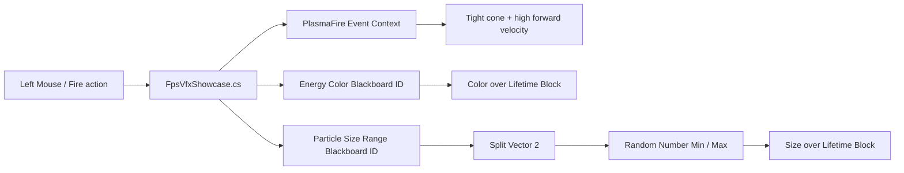

- Holding Fire sends a bounded 30 Hz stream of `PlasmaFire` events; releasing Fire immediately stops new emission.
- Already-fired particles keep moving and fading naturally instead of freezing or disappearing.
- The tight cone and high forward velocity form a camera-aligned plasma line.
- Sustained fire heats the core from cyan toward white and slightly broadens the bolt envelope.
- A generated soft plasma-core texture and transparent emissive material replace square default sprites.
- Stable IDs allow either Blackboard property to be renamed without breaking gameplay code.

Open `Assets/Vfx/VfxEffect.keirevfx` to inspect the graph, then open
`Assets/Scripts/Runtime/FpsVfxShowcase.cs` for the complete managed driver. In Play Mode, use WASD, Shift, and Fire to
see the same live effect respond without graph recompilation or simulation restart.
- SendEvent fans out to every same-named Event system owned by that effect and does not affect another entity.
- Managed Blackboard mutation currently covers only the seven `VfxRange<T>` overloads documented above.
- Range updates require an active, loaded Play Mode effect and return `false` transactionally on lifecycle, exposure,
  or exact-type mismatch.
- Calling `Vfx.Play` with an invalid entity or effect throws `ArgumentException`.

## Native C++ Scene Usage

The public native VFX API is exported through `<Keire/Core.h>`.

### Configure A Scene Component

```cpp
#include <Keire/Core.h>

#include <cstdint>
#include <stdexcept>

namespace MyGame
{
    void ConfigureVfxEmitter(Keire::Entity entity, const Keire::AssetId effect)
    {
        auto emitter = entity.GetComponent<Keire::VfxEmitterComponent>();
        if (!emitter)
            emitter = entity.AddComponent<Keire::VfxEmitterComponent>();

        if (!emitter)
            throw std::runtime_error("The VFX Emitter could not be added.");

        emitter->SetEffect(effect);
        emitter->SetPlayOnAwake(true);
        emitter->SetAutoDestroy(false);
        emitter->SetSimulationSpeed(1.0F);
        emitter->SetSeedOffset(17);
        emitter->SetQuality(Keire::VfxQualityTier::High);
        emitter->SetCulling(Keire::VfxCullingMode::Automatic);
        emitter->SetBounds({}, {5.0F, 5.0F, 5.0F});
        emitter->SetEditModePreview(false);
    }
} // namespace MyGame
```

These setters call the component change notification and validate bounded values. Editing-scene mutations become
persistent only through the normal scene-document save workflow.

### Control A Running Scene Session

`SceneRuntimeSession` controls VFX on the runtime-scene clone:

```cpp
#include <Keire/Core.h>

#include <cstdint>
#include <stdexcept>

namespace MyGame
{
    void PlayImpact(const Keire::Ref<Keire::SceneRuntimeSession>& session, const Keire::EntityId entity,
                    const Keire::AssetId effect)
    {
        if (!session || session->State() == Keire::ScenePlayState::Stopped)
            throw std::runtime_error("A playing scene session is required.");

        if (!session->PlayVfx(entity, effect, true))
            throw std::runtime_error("VFX playback was rejected.");
    }

    void PauseImpact(const Keire::Ref<Keire::SceneRuntimeSession>& session, const Keire::EntityId entity)
    {
        if (!session->PauseVfx(entity, true))
            throw std::runtime_error("VFX pause was rejected.");
    }

    void TriggerImpact(const Keire::Ref<Keire::SceneRuntimeSession>& session, const Keire::EntityId entity,
                       const std::uint32_t count)
    {
        if (!session->SendVfxEvent(entity, "Impact", count))
            throw std::runtime_error("No live Impact Event system accepted the request.");
    }

    [[nodiscard]] bool ImpactIsAlive(const Keire::Ref<Keire::SceneRuntimeSession>& session,
                                     const Keire::EntityId entity)
    {
        return session && session->IsVfxAlive(entity);
    }

    void StopImpact(const Keire::Ref<Keire::SceneRuntimeSession>& session, const Keire::EntityId entity)
    {
        if (session)
            (void)session->StopVfx(entity);
    }
} // namespace MyGame
```

`PlayVfx` creates a VFX Emitter when the runtime entity does not already have one, sets Effect, enables Play On Awake,
restores Simulation Speed to `1.0`, and enables the component. Passing `restart = true` first releases any current
runtime instance. `IsVfxAlive` becomes true only after an actual native `VfxHandle` is active. `SendVfxEvent` targets
the entity's root effect handle and routes to every exact-name Event system inside it.

Scene runtime operations belong to the session's owning application thread.

## Direct Native `VfxWorld` Usage

Most gameplay should use `VfxEmitterComponent` or `SceneRuntimeSession`. A rendering subsystem, headless tool, or focused
test can own a `VfxWorld` directly.

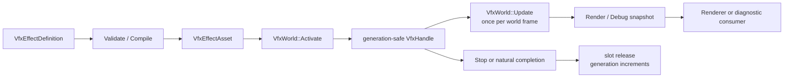

### Build A Parameter Binding In C++

The graph schema is public through `<Keire/Core.h>`. This example adds an exposed Scalar parameter and connects its
Parameter node to the default Emission Rate Block:

```cpp
#include <Keire/Core.h>

#include <algorithm>
#include <optional>
#include <stdexcept>
#include <string>
#include <utility>
#include <variant>

namespace MyGame
{
    // One-time authoring helper: encode and save the result so generated graph IDs remain stable.
    [[nodiscard]] Keire::VfxEffectDefinition MakeRateControlledEffect(const Keire::AssetId rateParameter)
    {
        auto definition = Keire::VfxEffectAsset::DefaultDefinition();
        definition.Name = "Rate Controlled";
        definition.Blackboard.push_back(
            {.Id = rateParameter,
             .Name = "Spawn Rate",
             .Type = Keire::VfxValueType::Scalar,
             .DefaultValue = 24.0F,
             .Exposed = true});

        auto& system = definition.Systems.front();
        const auto emission = std::ranges::find_if(
            definition.Modules, [](const Keire::VfxModuleDefinition& module)
            { return std::holds_alternative<Keire::VfxEmissionRateModule>(module.Payload); });
        if (emission == definition.Modules.end())
            throw std::runtime_error("The effect has no Emission Rate payload.");

        const auto emissionContext =
            std::ranges::find_if(system.Nodes,
                                 [emissionId = emission->Id](const Keire::VfxGraphNode& node)
                                 {
                                     return std::ranges::find(node.Blocks, emissionId, &Keire::VfxGraphBlock::Reference) != node.Blocks.end();
                                 });
        if (emissionContext == system.Nodes.end())
            throw std::runtime_error("The Emission Rate payload is not represented by a Context Block.");

        const auto emissionBlock =
            std::ranges::find(emissionContext->Blocks, emission->Id, &Keire::VfxGraphBlock::Reference);

        const auto rateInput =
            std::ranges::find(emissionBlock->Pins, std::string("particlesPerSecond"), &Keire::VfxGraphPin::Semantic);
        if (rateInput == emissionBlock->Pins.end())
            throw std::runtime_error("The Emission Rate Block has no canonical rate input.");
        const auto emissionContextId = emissionContext->Id;
        const auto emissionBlockId = emissionBlock->Id;
        const auto rateInputId = rateInput->Id;

        Keire::VfxGraphNode parameterNode;
        parameterNode.Id = Keire::AssetId::Generate();
        parameterNode.Type = "Spawn Rate";
        parameterNode.Context = Keire::VfxContextType::Spawn;
        parameterNode.EditorPosition = {-280.0F, -120.0F};
        parameterNode.Kind = Keire::VfxGraphNodeKind::Parameter;
        parameterNode.Reference = rateParameter;
        parameterNode.Pins.push_back({Keire::AssetId::Generate(),
                                      "Spawn Rate",
                                      Keire::VfxValueType::Scalar,
                                      false,
                                      "value",
                                      std::nullopt});

        const auto parameterNodeId = parameterNode.Id;
        const auto parameterPinId = parameterNode.Pins.front().Id;
        system.Nodes.push_back(std::move(parameterNode));
        Keire::VfxGraphConnection connection;
        connection.Id = Keire::AssetId::Generate();
        connection.OutputNode = parameterNodeId;
        connection.OutputPin = parameterPinId;
        connection.InputNode = emissionContextId;
        connection.InputBlock = emissionBlockId;
        connection.InputPin = rateInputId;
        system.Connections.push_back(connection);

        Keire::ValidateVfxEffect(definition);
        return definition;
    }
} // namespace MyGame
```

Stable IDs are serialized program identity. Generate them once while authoring and keep them in the saved asset; do not
regenerate IDs each time a source-built definition loads.

### Create, Activate, Update, And Stop

```cpp
#include <Keire/Core.h>

#include <stdexcept>
#include <string>
#include <utility>

namespace MyGame
{
    class StandaloneVfx final
    {
      public:
        StandaloneVfx()
        {
            auto definition = Keire::VfxEffectAsset::DefaultDefinition();
            definition.Name = "Standalone Sparks";
            definition.Space = Keire::VfxSimulationSpace::World;
            definition.Seed = 42;
            definition.Capacity = 2048;

            const auto compiled = Keire::CompileVfxEffect(definition, Keire::VfxBackend::Cpu);
            if (!compiled.Valid)
            {
                const auto message =
                    compiled.Diagnostics.empty() ? std::string("VFX compilation failed.")
                                                 : compiled.Diagnostics.front().Message;
                throw std::runtime_error(message);
            }

            m_Effect = Keire::CreateRef<Keire::VfxEffectAsset>(std::move(definition));
            m_World = Keire::CreateRef<Keire::VfxWorld>(
                Keire::VfxWorldSpecification{
                    .MaximumEffects = 64,
                    .MaximumParticles = 65'536,
                    .Backend = Keire::VfxBackend::Cpu,
                });

            m_Handle = m_World->Activate(
                {.Effect = m_Effect,
                 .Revision = 1,
                 .Position = {0.0F, 1.0F, 0.0F},
                 .Rotation = {},
                 .SeedOffset = 7});
            if (!m_Handle)
                throw std::runtime_error("The VFX world effect budget is exhausted.");
        }

        void Update(const float deltaSeconds, const Keire::Vector3 position, const Keire::Quaternion rotation)
        {
            if (!m_World->IsAlive(m_Handle))
                return;

            m_World->SetTransform(m_Handle, position, rotation);
            m_World->Update(deltaSeconds);
            m_RenderSnapshot = m_World->CaptureRenderSnapshot();
        }

        void Stop()
        {
            m_World->Stop(m_Handle);
            m_Handle = {};
        }

        [[nodiscard]] const Keire::VfxRenderSnapshot& RenderSnapshot() const noexcept
        {
            return m_RenderSnapshot;
        }

      private:
        Keire::Ref<const Keire::VfxEffectAsset> m_Effect;
        Keire::Ref<Keire::VfxWorld> m_World;
        Keire::VfxHandle m_Handle;
        Keire::VfxRenderSnapshot m_RenderSnapshot;
    };
} // namespace MyGame
```

The renderer consumes the immutable `VfxRenderSnapshot`. CPU snapshots contain `VfxRenderParticle` values. GPU
snapshots contain compact `VfxGpuEmitter` work descriptors and cumulative spawn sequences; the renderer owns the
persistent GPU particle buffers. Call `VfxWorld::Update` once per owning world frame, not once per active handle.
`Revision()` identifies any snapshot-visible change, while `SimulationStepRevision()` advances only after a positive
`Update`. The GPU renderer applies lifecycle, transform, restart, and spawn-sequence changes from each new snapshot, but
consumes a simulation delta only once per Simulation Step Revision. A newer mutation-only snapshot rebuilds the alive
index with a zero delta. Replaying an equal or stale snapshot leaves persistent GPU buffers unchanged, so it cannot
advance or hide newer particles.

### `VfxWorldSpecification`

| Field | Default | Meaning |
| --- | ---: | --- |
| `MaximumEffects` | 256 | Number of simultaneously active root effect handles. |
| `MaximumSystemsPerEffect` | 16 | Maximum compiled systems owned by one root effect. |
| `MaximumParticles` | 65,536 | Global particle budget. |
| `Backend` | CPU | CPU particle storage or GPU emitter-work publication. |
| `CollisionQuery` | Empty | Optional segment query for CPU collision. |
| `ShapeSample` | Empty | Optional Mesh/Volume asset sampler for CPU initialization. |
| `ResourceQuery` | Empty | Optional renderer-neutral provider for CPU texture, mesh, and buffer expression nodes. |

Construction rejects zero capacities, more than `1,000,000` effects, more than 256 systems per effect, more than
`10,000,000` particles, or a root/system product that exceeds the internal bounded slot budget.

`ResourceQuery` receives a bounded `VfxResourceQuery` containing an operation kind, stable asset ID, coordinate,
integer index, and mip/level value. It returns generic value lanes plus optional dimensions, count, and transform data.
The callback never exposes a renderer handle through the public VFX API. Missing resources, a rejected query, a thrown
callback, or a type-mismatched result fails that expression deterministically and publishes `SimulationValueInvalid`;
CPU resource nodes never silently substitute a sampled value. Resource-backed descriptors are marked `CPU Only` until
the renderer owns a matching cross-platform bindless-resource contract.

Point Cache is represented by a stable `PointCache` asset value and sampled through the buffer query lane. Skinned-mesh
topology, vertex sampling, mesh-index sampling, and local/world root transforms use a Mesh asset ID; the provider may
resolve that ID to the current deformed snapshot without exposing skinning handles to the graph. Signed-distance-field
sampling returns the first scalar result lane. These are Kéire-equivalent CPU contracts, not Unity object references,
and each request remains deterministic for a fixed asset revision and simulation step.

### Activation And Handles

`VfxActivation` contains:

- `Ref<const VfxEffectAsset> Effect`
- Non-zero `Revision`
- Finite Position
- Finite, non-zero Rotation
- Seed Offset
- Optional `std::vector<VfxParameterOverride>` values keyed by exposed Blackboard stable ID

The world normalizes Rotation and retains the Effect reference for every internal system slot. `Activate` compiles all
systems first and publishes them as one transaction; failure cannot leave half an effect alive. The returned root
handle controls every system. `SendEvent(handle, name, count)` routes to matching Event sources while Spawn sources keep
their normal scheduling. `Activate` throws for invalid activation data. It returns an empty handle, increments
`DroppedEffects`, and leaves the world unchanged when no effect
slot is available.

`VfxHandle` contains a pool index and generation:

- `IsAlive` returns false for empty, stale, out-of-range, or released handles.
- `Stop` is idempotent for stale handles.
- `SetTransform` and `SetSimulationSpeed` throw for a stale handle.
- Reusing a pool index increments its generation so an old handle cannot target the new effect.

### Activation And Live Parameter Overrides

Supply initial values in `VfxActivation::ParameterOverrides`, or mutate a live handle without restarting it:

```cpp
#include <Keire/Core.h>

#include <array>
#include <cstdint>
#include <stdexcept>
#include <utility>

namespace MyGame
{
    [[nodiscard]] Keire::VfxHandle StartParameterizedEffect(
        const Keire::Ref<Keire::VfxWorld>& world, Keire::Ref<const Keire::VfxEffectAsset> effect,
        const std::uint64_t revision, const Keire::AssetId rateParameter, const Keire::AssetId tintParameter)
    {
        const auto handle = world->Activate(
            {.Effect = std::move(effect),
             .Revision = revision,
             .Position = {},
             .Rotation = {},
             .SeedOffset = 0,
             .ParameterOverrides = {
                 {rateParameter, 40.0F},
                 {tintParameter, Keire::Color{1.0F, 0.35F, 0.1F, 1.0F}},
             }});
        if (!handle)
            throw std::runtime_error("The VFX world effect budget is exhausted.");

        world->SetParameter(handle, rateParameter, 72.0F);
        world->ResetParameter(handle, tintParameter);

        const std::array replacements{
            Keire::VfxParameterOverride{rateParameter, 16.0F},
            Keire::VfxParameterOverride{tintParameter, Keire::Color{0.2F, 0.8F, 1.0F, 1.0F}},
        };
        world->SetParameterOverrides(handle, replacements);
        return handle;
    }
} // namespace MyGame
```

`SetParameter` adds or replaces one override. `ResetParameter` removes one override so the asset default becomes
visible again. `SetParameterOverrides` replaces the complete override set as one transaction. All three require a live
handle. An unknown, hidden, duplicate, or type-mismatched parameter rejects the candidate and leaves the previous
resolved values intact.

Parameter changes immediately rebuild that handle's resolved module values and Portable Custom HLSL operands. They do
not change the source asset or another handle using the same asset. Emission and creation properties affect future
work. CPU simulation reads resolved Force, Size, Color, and Collision module values on later updates. The GPU path reads
Force, the sampled size/gradient tables, Renderer resources, and output metadata on later dispatches/draws, so those
uniform changes affect existing particles without rebuilding world state. Lifetime, velocity, rotation, and shape
creation properties affect future GPU particles. Portable Custom HLSL Update/Output operands are resolved per emitter
and affect existing particles on both backends without a handle restart.

Ranges are ordinary typed Blackboard values and use the same API:

```cpp
const Keire::VfxScalarRange lifetime{1.0F, 20.0F};
world->SetParameter(handle, lifetimeRangeParameter, lifetime);

const Keire::VfxVector3Range launchVelocity{
    Keire::Vector3{-2.0F, 8.0F, -2.0F},
    Keire::Vector3{2.0F, 14.0F, 2.0F},
};
world->SetParameter(handle, velocityRangeParameter, launchVelocity);
```

`VfxRange<T>` is available for scalar, signed/unsigned integer, Vector2/3/4, and Color aliases. Native construction is
an explicit aggregate; persisted/authoring values require component-wise `Minimum <= Maximum` and finite floating
components. `SetParameter` validates the exact Blackboard type and applies the whole candidate transactionally.

### Building A Schema-4 Value Graph In C++

Authoring tools normally create IDs and undo records, but importers and procedural tooling can use the same public
catalog and canonical factories:

```cpp
auto definition = Keire::VfxEffectAsset::DefaultDefinition();
auto range = Keire::CreateVfxGraphOperatorNode("keire.operator.range", {-500.0F, 200.0F});
auto random = Keire::CreateVfxGraphOperatorNode("keire.operator.random-range", {-260.0F, 200.0F});

range.Context = Keire::VfxContextType::Initialize;
random.Context = Keire::VfxContextType::Initialize;

// Pin IDs come from the descriptor factory. Connect the Range output to Random Range,
// then connect Random Range to an Initialize Block input using Context+Block+Pin endpoints.
definition.Systems.front().Nodes.push_back(std::move(range));
definition.Systems.front().Nodes.push_back(std::move(random));

const auto program = Keire::CompileVfxEffect(definition, Keire::VfxBackend::Cpu);
if (!program.Valid)
    throw std::runtime_error(program.Diagnostics.front().Message);
```

Use `FindVfxNodeDescriptor(typeId)` before procedural creation to inspect canonical pins, settings, valid Contexts,
support tier, and backend tier. Never construct a known built-in with hand-invented pin names: schema-4 validation
rejects stale signatures instead of guessing.

On `Reload`, compatible overrides with the same stable ID, exact type, and Exposed status are preserved. Removed,
hidden, or type-changed parameters fall back to the new asset and set
`VfxRuntimeDiagnostic::ParameterOverrideRejected`. Program layout changes can restart that handle's simulation while
value-only changes preserve compatible state except for GPU-baked Force, Size, Color, or Renderer changes, which
intentionally restart only that GPU handle.

### Handle-Scoped GPU Lifetime

`VfxWorld` can be shared by many emitters. `Stop(handle)`, an explicit stop-then-activate restart, and natural completion
retire only the affected GPU handle generation. An incompatible `Reload` keeps the public handle alive but advances its
per-handle simulation revision. In both cases, the renderer kills only particles whose stored handle index and
generation match the affected instance and preserves every unrelated emitter in the world.

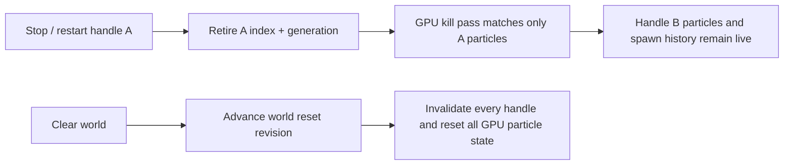

`Clear()` is intentionally different: it is the world-wide operation. It invalidates every handle, advances the GPU
world reset revision, and causes all persistent particle and per-emitter tracking for that world to be rebuilt. Use
`Stop` for an individual effect and reserve `Clear` for scene teardown or an intentional whole-world reset.

### Simulation Speed And Update

`SetSimulationSpeed` accepts a finite value from `0` to `8`. Zero pauses both emission and particle aging for that
handle. `VfxWorld::Update` accepts a finite delta from `0` to `10` seconds. A zero update is inert.

Non-looping CPU effects stop emitting at Duration and remain alive until their last CPU particle dies. Non-looping GPU
effects remain alive through their estimated last-particle death time before releasing their generation-safe handle.

### Revision-Aware Reload

```cpp
const bool reloaded = world->Reload(handle, newerEffect, newerRevision);
```

Reload returns false when:

- The handle is stale
- The effect reference is empty
- The revision is not newer than the active revision

When the old and new definitions have the same Emitter ID and compiled `StateLayoutHash`, the runtime preserves elapsed
time and compatible live particles; the CPU backend also trims particles if Capacity shrank. On GPU, compatible reload
also requires unchanged baked Force, Size, Color, and Renderer state. Changing the Emitter ID, Simulation Space, Seed,
renderer representation/type, graph schedule, parameter layout, binding layout, portable instruction shape, or GPU-baked
state resets emission and random state for the affected handle. CPU particles owned by an incompatible handle are
released immediately. On GPU, the handle's simulation revision advances, so the next render preparation kills only
particles belonging to that handle and resets only its spawn tracking. Other handles in the shared world keep their
particles and progress.

### Render, Debug, And Statistics APIs

| API | Use |
| --- | --- |
| `Statistics()` | Aggregate active effects/particles and dropped effect/particle counts. |
| `CopyRenderPackets(span)` | Copies bounded CPU `VfxRenderParticle` values and reports written/dropped counts. GPU worlds have no CPU particles to copy. |
| `CaptureRenderSnapshot(maximumParticles)` | Immutable CPU render particles or GPU emitter work for rendering. |
| `CaptureDebugSnapshot()` | Bounded effect and CPU particle samples plus diagnostics. |
| `Clear()` | Performs a world-wide reset: stops every effect, releases every particle, and invalidates all handles. |

`VfxRenderSnapshot::MaximumParticles` is `65,536`. `VfxDebugSnapshot` samples at most 256 effects and 2,048 CPU
particles, recording how many samples could not fit. GPU debug effect entries report spawn-based particle estimates and
do not include per-particle CPU samples. The world's aggregate ActiveParticles value is authoritative for CPU storage,
not an exact GPU alive-particle query.

## Collision And Shape Callbacks

Standalone CPU worlds can install collision and asset-shape callbacks:

```cpp
#include <Keire/Core.h>

#include <cstdint>
#include <optional>

[[nodiscard]] Keire::VfxWorldSpecification MakeVfxWorldSpecification()
{
    Keire::VfxWorldSpecification specification;
    specification.CollisionQuery =
        [](const Keire::Vector3 start, const Keire::Vector3 end) -> std::optional<Keire::VfxCollisionHit>
    {
        if (start.Y < 0.0F || end.Y >= 0.0F || start.Y == end.Y)
            return std::nullopt;

        const float time = start.Y / (start.Y - end.Y);
        const Keire::Vector3 position{
            start.X + (end.X - start.X) * time,
            0.0F,
            start.Z + (end.Z - start.Z) * time,
        };
        return Keire::VfxCollisionHit{position, {0.0F, 1.0F, 0.0F}};
    };
    specification.ShapeSample =
        [](const Keire::AssetId shapeAsset,
           const std::uint32_t randomValue) -> std::optional<Keire::Vector3>
    {
        if (!shapeAsset)
            return std::nullopt;

        const float unit = static_cast<float>(randomValue & 0xffffU) / 65535.0F;
        return Keire::Vector3{unit - 0.5F, 0.0F, 0.0F};
    };
    return specification;
}
```

The example ShapeSample returns a simple deterministic line sample. A production callback should resolve `shapeAsset`
and sample the corresponding mesh surface or volume. Callbacks must return finite values. The runtime contains callback
exceptions and invalid results, marks the effect diagnostic, and continues safely. A collision normal is normalized
before reflection.

`SceneRuntimeSession` installs its physics ray-cast collision query when a Physics world is available and installs an
asset-backed Mesh/Volume sampler. Mesh sampling uses imported triangle-area weights; volume sampling uses cooked
`.keirevfxvolume` density-cell weights. A directly owned `VfxWorld` still supplies its own callbacks.

## Diagnostics

### Compile Diagnostics

`Keire::CompileVfxEffect` returns `Keire::VfxCompiledProgram`:

- `Valid` reports whether schema validation and lowering succeeded.
- `Hash` is a deterministic byte hash of canonical executable IR, including current defaults and payload values.
- `StateLayoutHash` identifies topology/layout compatibility for revision-aware reload.
- `Backend` records the requested backend.
- `CanonicalIr` stores the lowered execution source, parameters, payload references, bindings, custom instructions,
  and interleaved operation schedule.
- `Parameters` contains stable-ID slots and typed defaults.
- `Modules` contains lowered Block payload snapshots, or enabled payloads in LegacyModules mode.
- `Bindings` maps parameter or expression sources to canonical Block properties.
- `CustomInstructions` contains verified Portable Custom HLSL operations.
- `Operations` is the authoritative Context/Block-ordered Module/Custom execution schedule.
- `Diagnostics` contains Information, Warning, or Error entries with optional node/module stable IDs.

GPU compilation packs supported value instructions and their literal, Parameter, register, identity, and setting data
for the shader interpreter. It rejects unsupported packed types and bounded opcode/register/source/constant limits.
Constants and live Parameters share one packed value buffer, and resource headers share a fixed-stride table with
weighted shape samples, so the complete evaluator stays within SDL's eight-readonly-storage-buffer compute limit.
Per-frame Update and Output evaluation run as ordered separate kernels; this preserves graph semantics while preventing
large dynamic programs from exceeding practical D3D12 register pressure. Pipeline creation is transactional and names
the failing shader entry point in its diagnostic.
Every numeric Runtime Block property uses the reflected property ABI and can resolve from a default, literal,
Blackboard slot, or particle-varying expression register. Resource-shape tables, collision mode, composed material, and
output topology are validated against their exact backend capabilities. Duplicate Blocks carry their execution ID into
diagnostics and never alias the referenced payload ID. CPU compilation warns when GPU Depth collision must degrade to
the configured CPU collision query. Structural graph, binding, portable-language, and backend-capability errors set
`Valid` to false instead of partially executing the program. Bound Blackboard
defaults are resolved during compilation and must leave every affected Block within both its normal validation range
and the selected backend's capability contract.

### Runtime Diagnostics

Each `VfxDebugEffect` contains a `VfxRuntimeDiagnostic` bit field. Test flags with
`Keire::HasVfxDiagnostic`.

| Flag | Meaning |
| --- | --- |
| `GpuDepthFellBackToCpu` | A CPU-compiled effect requested GPU Depth, so the CPU collision query is used. |
| `ScenePhysicsSelectedCpu` | Scene Physics collision requires the CPU collision-query path. |
| `CollisionQueryUnavailable` | Collision was requested but no query was installed, the callback failed, or it returned invalid data. |
| `ShapeAssetSamplerUnavailable` | Mesh/Volume sampling had no usable shape sampler. |
| `SimulationValueInvalid` | Non-finite particle state was detected; affected particles are dropped safely. |
| `ParameterOverrideRejected` | Reload discarded an override whose stable ID, Exposed status, or type no longer matches. |

Example:

```cpp
#include <Keire/Core.h>

#include <cstddef>

[[nodiscard]] bool HasMissingCollisionQuery(const Keire::Ref<Keire::VfxWorld>& world)
{
    if (!world)
        return false;

    const auto snapshot = world->CaptureDebugSnapshot();
    for (std::size_t index = 0; index < snapshot.EffectCount; ++index)
    {
        const auto diagnostics = snapshot.Effects[index].Diagnostics;
        if (Keire::HasVfxDiagnostic(diagnostics, Keire::VfxRuntimeDiagnostic::CollisionQueryUnavailable))
            return true;
    }
    return false;
}
```

### Dropped Counts

`VfxWorldStatistics::DroppedEffects` increases when `MaximumEffects` is exhausted.
`VfxWorldStatistics::DroppedParticles` increases when:

- An effect reaches its Capacity
- The CPU world reaches `MaximumParticles`
- A newly spawned or simulated particle produces a non-finite position, velocity, rotation, tint, or size

`VfxRenderPacketCopyResult::Dropped`, `VfxRenderSnapshot::DroppedParticles`, and the debug snapshot's dropped-sample
fields separately report values that did not fit their requested presentation or sampling bounds. Those truncation
counts do not mutate the world's aggregate dropped-particle statistic.

Treat sustained dropped counts as content or budget problems, not normal output.

## CPU And GPU Capability Matrix

Core particle execution is shared semantically across CPU and GPU. Inherently host- or render-specific features keep an
explicit tier instead of changing behavior.

| Feature | CPU backend | GPU backend |
| --- | --- | --- |
| Emission Rate and Burst scheduling | Yes | Yes, published as cumulative spawn work |
| Point / Box / Sphere shape | Yes | Yes |
| Cone shape | Full authored CPU cone | Full authored cone angle/length and volume distribution |
| Mesh / Volume shape | Scene asset sampler or custom `ShapeSample` callback | Cooked weighted mesh-surface and sparse-density resource tables |
| Lifetime and velocity ranges | Yes | Yes |
| Initial rotation ranges | Full Euler for Mesh; Z for Sprite | Full Euler for Mesh; Z for Sprite |
| Forces and gravity | Yes | Yes |
| Size curve | Full curve | Deterministic 64-sample lookup with interpolation and zero clamp |
| Color gradient | Full gradient | Deterministic 64-sample lookup with interpolation |
| CPU / Scene Physics collision | Collision callback | Explicit GPU compile error; host physics is CPU-required |
| GPU Depth collision | Uses configured CPU callback with diagnostic | Native swept scene-depth collision |
| Sprite output | Procedural or textured tinted billboard | Per-emitter indirect procedural or textured tinted billboard |
| Mesh particle output | Material-aware scene path | Asset-backed indexed indirect output through compatible composed material shading |
| Ribbon output | Camera-facing adjacency-connected particle strips | Same sequence-qualified strip links through indirect procedural draws |
| Volumetric output | Analytic density impostor | Analytic density impostor through indirect procedural draws |
| Local-space following | Yes | Yes; rigid position/rotation changes transform existing particles |
| Per-handle stop, restart, and incompatible-reload isolation | Yes | Yes; matching handle generation only |
| Exact active particle count | Yes | Spawn-based estimate |
| Per-particle debug samples | Yes | No |
| Schema-4 Context/Block scheduling | Yes | Cooked paths only |
| Module-property Blackboard binding | Yes | Yes |
| Activation/component/live parameter overrides | Yes | Yes |
| Core packed value Operators | Yes | Yes; opcode and pin support is shown by the CPU + GPU badge |
| Particle-varying numeric Block properties | Yes | Yes; typed property records resolve expression registers in each operation |
| Duplicate Blocks | Yes; independent execution IDs | Yes; ordered independent property/sample ranges |
| Live module override on existing particles | Update modules are read on later CPU steps | Force, Size, Color, and Renderer uniforms update without restarting existing particles; creation fields affect future particles |
| Portable Custom HLSL | Yes; bounded instructions run in cable order inside particle loops | Yes; cable-ordered Module and Custom operations share the per-emitter spawn/simulation dispatches |
| Named Event contexts | Yes | Yes |
| Multiple executable graph systems | Yes; one root handle owns all slots | Yes; one root handle publishes per-system emitters |
| Particle Strip identity / strip-scoped RNG | Yes | Yes |
| Sequence-qualified neighboring strip topology | Yes | Yes; MapStrips/LinkStrips connect consecutive live particles in the same system, strip, and generation |
| Arbitrary shader HLSL/resources | No | No |

Author and diagnose on CPU, then deliberately verify the effect on GPU. If a required feature is absent from the GPU
column, keep that effect on a supported compatibility path until parity is implemented.

GPU spawn publication is cumulative, so a render handoff that skips an intermediate snapshot does not discard requested
spawn work. The current render handoff retains only the latest Time, Delta Time, and Simulation Step values, however.
When more than one simulation snapshot is consumed by a single render update, all accumulated work therefore uses that
latest timing tuple. Projects that require exact per-step GPU timing must currently consume every simulation snapshot;
a queued per-step handoff is a remaining backend milestone.

## Production Recipes

### Continuous Smoke

1. Enable Loop.
2. Set Duration to a convenient repeat period such as `2`.
3. Use Emission Rate at a moderate rate.
4. Use Sphere or Cone Shape.
5. Initialize with upward velocity and a multi-second lifetime.
6. Add a small Force and Gravity Multiplier near zero.
7. Fade alpha to zero in Color over Lifetime.
8. Grow Size over Lifetime.
9. Use World space so smoke remains behind a moving source.

### Character Aura

1. Enable Loop and Emission Rate.
2. Use Sphere Shape around the character.
3. Use low velocity and a short lifetime.
4. Choose Local space so every active particle follows the character.
5. Disable Auto Destroy on the character.
6. Use different Seed Offsets for deterministic visual variation between characters.

### One-Shot Impact

1. Disable Loop.
2. Add an enabled Burst at time zero.
3. Remove or disable Emission Rate after the Burst exists.
4. Keep Duration long enough to contain every Burst cycle.
5. Initialize with a short lifetime and outward velocity range.
6. Use World space so debris stays at the impact point.
7. Fade size and alpha to zero.
8. Put the emitter on a disposable entity before enabling Auto Destroy.

### Bouncing Sparks

1. Author a time-zero Burst.
2. Use Cone Shape and a narrow angle.
3. Initialize with upward and outward velocity.
4. Add positive gravity.
5. Add Collision with restitution between `0.3` and `0.7`.
6. Keep Kill on Collision off for bouncing or on for one-hit sparks.
7. Inspect this effect on CPU, where the collision callback is supported.

### Attached Engine Exhaust

1. Use Local space.
2. Enable Loop and Emission Rate.
3. Use Cone Shape aligned with the entity's authored rotation.
4. Use a negative or positive axis velocity appropriate for the model.
5. Fade Color and Size over Lifetime.
6. Parent the emitter entity to the engine socket.

## Troubleshooting

| Symptom | Likely cause and correction |
| --- | --- |
| The effect appears at both the old and new gizmo positions | In Play Mode this is normal World-space behavior. Edit Mode restarts World-space previews on authored position/rotation changes, so a persistent edit-mode duplicate indicates a preview synchronization error rather than expected trail behavior. |
| The open draft appears at world origin | No eligible scene emitter using that asset is available. Assign the open effect to an active, enabled emitter and check Preview In Edit Mode to host the draft at that emitter. |
| No edit-mode particles | Assign Effect, activate the entity hierarchy, enable the component, and check Preview In Edit Mode. |
| No Play Mode particles | Enable Play On Awake or call `Vfx.Play`; then allow the asset to finish loading. |
| Graph changes do not alter the effect | Check the header execution badge. LegacyModules ignores graph scheduling until explicit conversion. In Graph mode, add or enable the operation as a Block in the correct connected Context and Compile. |
| A new Runtime Module has no effect in Graph mode | Adding compatibility payload data does not schedule it. Right-click the matching Context, choose **Add Block**, select the payload, and place the Block in the intended stack order. |
| Blackboard changes do nothing | Add a Parameter node and cable its typed output to a canonical Block or Portable Custom HLSL input. A property existing only in the Blackboard has no consumer. |
| A parameter override is rejected | Use the parameter's stable ID, exact `VfxParameterValue` type, and an Exposed parameter. Direct world APIs also reject duplicate IDs and stale handles. |
| Custom HLSL does nothing | Confirm Graph mode, add or enable the Portable HLSL Block in the intended Context, use only the portable grammar, and Compile. Portable `*DeltaTime` is zero in creation stages; use Update for per-frame motion. |
| GPU effects are expensive with many emitters | Each active emitter uses one handle-filtered, world-capacity simulation dispatch. Reduce active emitters or lower the owning world's particle capacity. |
| Mesh or Volume particles spawn at the emitter origin | The resource is still loading/invalid, or a directly owned CPU world has no `ShapeSample` callback. Scene runtime installs the asset sampler automatically. |
| GPU preview differs from CPU | Consult the capability matrix; several advanced module fields have partial GPU parity. |
| Restarting one GPU effect disturbs another | This is not expected. Stop and restart are isolated by handle generation, while incompatible reload uses a per-handle simulation revision; `Clear()` is the world-wide reset operation. |
| A non-looping preview keeps restarting | Disable Loop Preview in the preview toolbar. |
| A runtime entity unexpectedly disappears | Auto Destroy destroys the entire entity when its effect finishes. |
| Dropped count increases | Reduce emission/lifetime, raise effect Capacity, or raise the owning world's particle budget. |
| Scale has no visible effect | VFX synchronization uses position and rotation only. Author dimensions in VFX modules. |
| GPU Depth collision has no effect | Verify the Game/preview camera produced a valid sampled scene-depth input and inspect render diagnostics. |
| Scene Physics collision has no effect | Use CPU, provide a `CollisionQuery` or Play Mode physics world, and inspect runtime diagnostics. |
| Compile reports an invalid header | Check Name, Duration, Capacity, payload count, and the required enabled emission/renderer payloads or Blocks for the selected execution source. |
| Compile reports duplicate stable IDs | Do not hand-copy IDs between modules, systems, nodes, pins, links, or parameters. |
| Compile exceeds the system budget | Reduce graph systems or raise `MaximumSystemsPerEffect` within its bounded limit before creating the world. |
| Compile reports a disconnected executable node | Connect the four Contexts. Reachable schema-3 Module/Custom nodes migrate into Blocks; new executable work must be an enabled Block in a connected Context. |
| Compile reports a cycle or backward context | Remove the cycle and keep flow ordered Spawn → Initialize → Update → Output. |
| A cable drag stays red | The endpoints have the same direction, different `VfxValueType`, already form that exact cable, or violate pin ownership. Read the live diagnostic and choose a compatible opposite pin. |
| A cable drag is amber | The proposed cable is structurally valid, but the draft still has an executable-graph error. Complete the remaining repair or Undo; preview remains on the last valid graph meanwhile. |
| Preview freezes after unlinking a cable | The editable graph is temporarily incomplete. This is intentional: reconnect the required path or Undo. The diagnostic remains visible and Save stays blocked until the graph is publishable. |
| A link cannot be completed | Output/input direction and `VfxValueType` must match. An input may have only one driver; Block inputs accept compatible Parameter or executable Operator outputs in the valid evaluation Context. Dragging may begin from either endpoint. |
| Reload does not apply | The revision must increase; the editor also refuses source reload over unsaved local changes. |
| Pause then Resume loses a custom speed in C# | Managed Resume currently restores Simulation Speed to `1.0`. |

## Validation And File Limits

VFX assets use JSON source with a bounded schema. The editor and asset importer should be the normal way to create and
modify them; hand editing can easily break stable identity.

| Limit | Value |
| --- | ---: |
| Source document size | 4 MiB |
| Runtime Modules | 128 |
| Graph systems | 64 |
| Graph nodes across all systems | 4,096 |
| Graph connections across all systems | 16,384 |
| Compiled value registers | 4,096 |
| Blackboard parameters | 1,024 |
| Serialized scene-component parameter overrides | 1,024 |
| Portable Custom HLSL instructions per executable Graph effect | 4,096 |
| Burst modules | 32 |
| Cycles per Burst | 1,024 |
| Name, system, node, pin, or parameter name | 128 UTF-8 bytes |
| Effect Capacity | 1 to 1,000,000 |
| Duration | 0.001 to 3,600 seconds |

Stable IDs must be non-empty and globally unique across the emitter, modules, systems, nodes, pins, links, and
blackboard parameters in one definition. Blackboard names must also be unique. Every connection must reference existing
pins, originate at an output, terminate at an input, connect equal `VfxValueType` values, and be the only driver of its
input.

Graph execution adds these publish-time requirements:

- One to 64 systems, each with one Spawn or named Event source plus one Initialize, Update, and Output Context
- No cycles, backward `ParticleStream` stage transitions, or disconnected executable nodes
- One connected source-to-Output particle stream per system
- Unique Block IDs and valid compatibility payload references with canonical Context, property semantics, and types;
  payload references may repeat
- Canonical Operator type IDs, definition versions, resolved signatures, dynamic-pin order, settings, and typed pins
- Valid Parameter references whose output type matches the Blackboard definition
- Parameter or executable Operator value sources for Module/Block and Portable Custom HLSL inputs
- At least one enabled Renderer Block/module; Spawn systems also require emission, while Event systems consume the
  explicit event count
- Block endpoints identify the owning Context, Block, and pin; Context vector order is executable order
- At most 4,096 valid Portable Custom HLSL statements

Schema versions 1, 2, 3, and 4 are readable. Schemas 1–3 migrate in memory and explicit Save publishes schema 4.
Historical compatibility assets retain `LegacyModules`; opening, previewing, or saving does not convert execution. Use
the explicit conversion command to replace old Systems with a schema-4 executable Graph.

Schema 4 also versions individual executable definitions. Older Shape and Renderer Blocks are upgraded in memory when
new resource inputs are introduced: existing pin and cable IDs are preserved, missing canonical pins receive
deterministic stable IDs, and explicit Save writes the current Block definition version. Unknown pins, type changes, or
future definition versions remain hard errors instead of being discarded during repair.

## API And Implementation Reference

Use these files as the final source of truth:

| Area | Source |
| --- | --- |
| Public definitions, modules, graph schema, compiler, world, handles, snapshots | `KeireCore/Include/Keire/Vfx/VfxSystem.h` |
| Validation, schema migration, graph lowering, Portable Custom HLSL, encoding, and dependencies | `KeireCore/Source/Vfx/VfxAssets.cpp` |
| Compiler-owned node descriptors, canonical factories, value defaults, and type validation | `KeireCore/Source/Vfx/VfxNodeCatalog.cpp` |
| SSA value lowering, folding, deterministic RNG, register allocation, and CPU evaluation | `KeireCore/Source/Vfx/VfxExpressions.cpp` |
| Shared compiled-binding resolution and executable payload materialization | `KeireCore/Include/KeireInternal/Vfx/VfxExecutionInternal.h` |
| CPU execution, parameter resolution, pooling, reload, statistics, and snapshots | `KeireCore/Source/Vfx/VfxSystem.cpp` |
| GPU portable-instruction implementation | `KeireCore/Shaders/BuiltinVfx.hlsl` |
| GPU operation schedule upload, per-emitter dispatch, and render handoff | `KeireCore/Source/Rendering/RenderSceneRecording.cpp` |
| Scene component API | `KeireCore/Include/Keire/ECS/Components/VfxEmitterComponent.h` |
| Component validation and serialized Inspector fields | `KeireCore/Source/ECS/Components/VfxEmitterComponent.cpp` |
| Scene and override dependency extraction | `KeireCore/Source/Scenes/SceneAsset.cpp` |
| Play Mode VFX session API | `KeireCore/Include/Keire/Scenes/Scene.h` |
| Play Mode emitter synchronization and C++ control | `KeireCore/Source/Scenes/SceneRuntime.cpp` |
| Transactional editor document | `KeireClient/Include/KeireClient/Editor/VfxEffectDocument.h` |
| Ranked context/type/backend-aware palette search | `KeireClient/Include/KeireClient/Editor/VfxNodeCatalog.h`, `KeireClient/Source/Editor/VfxNodeCatalog.cpp` |
| Graph, module, blackboard, settings, and preview UI | `KeireClient/Source/Editor/VfxEffectPanel.cpp` |
| Typed scene-emitter Blackboard override Inspector | `KeireClient/Include/KeireClient/Editor/VfxEmitterInspector.h`, `KeireClient/Source/Editor/VfxEmitterInspector.cpp` |
| Edit-mode emitter eligibility | `KeireClient/Include/KeireClient/Editor/EditModeVfxPreview.h` |
| Editor asset and scene preview ownership | `KeireClient/Source/Editor/EditorWorkspaceAssets.cpp` |
| Managed VFX API | `KeireManaged/RuntimeApi.cs` |
| Managed VFX component marker | `KeireManaged/BuiltInComponents.cs` |
| Frozen Unity 6.3 LTS parity catalog | `Docs/VfxParityManifest.json` |
| Parity manifest generation and validation | `Scripts/Vfx/generate_vfx_parity_manifest.py`, `Scripts/Vfx/validate_vfx_parity_manifest.py` |
| Runtime and schema tests | `KeireTests/Source/Vfx/VfxTests.cpp` |
| Range, Random, core Operator, Context Block, and expression-runtime tests | `KeireTests/Source/Vfx/VfxExpressionTests.cpp` |
| Executable graph, cable order, binding, Custom HLSL, and component override tests | `KeireTests/Source/Vfx/VfxGraphRuntimeTests.cpp` |
| Editor document and edit-preview tests | `KeireEditorTests/Source/VfxEffectDocumentTests.cpp` |
