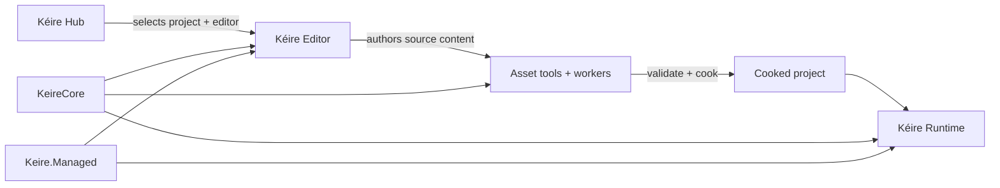

# Kéire Engine

[](https://github.com/hcfgod/KeireEngine/actions/workflows/ci.yml)
[](LICENSE.txt)

**Build worlds. Keep control.**

Kéire is an open-source, cross-platform C++20 game engine built around explicit ownership, deterministic behavior, and
a project-first authoring workflow. The Kéire Hub manages projects and installed editor versions; the editor provides
native scene, asset, rendering, scripting, profiling, and player-build workflows; and the runtime ships only the
systems and cooked content selected by a project.

Kéire is currently **version 0.3.1 and pre-1.0**. Its foundations are production-oriented, but interfaces, content
formats, and release procedures may still change before the first stable release. The project documents current
capabilities and remaining production-readiness work directly rather than presenting roadmap work as complete.

[Website](https://keireengine.duckdns.org/) ·
[Documentation](https://keireengine.duckdns.org/docs/) ·
[Download Hub](https://keireengine.duckdns.org/downloads/) ·
[Release archive](https://keireengine.duckdns.org/downloads/archive/) ·
[Roadmap](https://keireengine.duckdns.org/roadmap/) ·
[Report an issue](https://github.com/hcfgod/KeireEngine/issues/new/choose)

## Product Model

| Product | Responsibility |
| --- | --- |
| **Kéire Hub** | Creates and opens projects, manages editor installations, validates compatibility, and launches the correct editor version. |
| **Kéire Editor** | Authors scenes, assets, input, materials, VFX, animation, C# gameplay, project settings, and desktop player builds. |
| **Kéire Runtime** | Starts from a validated cooked manifest and runs the packaged game without editor-only ownership or UI. |
| **Asset toolchain** | Imports, validates, fingerprints, caches, cooks, and packages content through deterministic command-line and worker boundaries. |
| **KeireCore** | Provides the reusable native runtime foundation: application lifecycle, layers, events, time, assets, scenes, rendering, audio, physics, navigation, scripting, and diagnostics. |
| **Keire.Managed** | Exposes the supported .NET 10 / C# 14 gameplay surface through stable value handles rather than native pointers. |

The Hub is the normal entry point. Direct editor launch remains available for automation and focused development.
Its task and notification centers retain useful history across restarts; finished tasks and read notifications can be
dismissed individually, and the task center can clear all finished work at once. Dismissing a retryable editor removal
hides its recovery record durably while preserving the exact journal identity needed by a later Retry or Remove action.

## What Is Implemented

Kéire already includes substantial, integrated engine and authoring foundations:

- Project identity, locking, templates, recent-project state, compatibility checks, and transactional upgrades.
- Versioned scenes, entities, components, prefabs, undo/redo, hierarchy and Inspector editing, recovery, and Play Mode.
- Stable asset identities, metadata sidecars, dependency tracking, deterministic imports, asynchronous runtime loading,
  hot reload, cooked packs, native player packaging, deterministic `.keireassetpackage` archives, transactional
  project package resolution, selective asset imports, receipts, rollback, and recovery.
- SDL3 multi-window and SDL_GPU rendering, Scene and Game views, cameras, picking, separate Shader and Material Graphs,
  Direct Materials, inherited and dynamic Material Instances, reusable material/shader functions and layers,
  Material Parameter Collections, tagged custom-shader materials, LODs,
  spatial lighting data, animation, rigging, VFX authoring, and performance gates.
- Input actions and rebinding, physics, navigation, audio graphs, production mixer/reverb-zone foundations,
  replay/diagnostic foundations, and profiling.
- Search-first Shader/VFX node menus, portable geometry and structured-value operators, bounded CPU resource
  sampling, asynchronous graph thumbnails, and stable built-in prototype meshes.
- Managed assemblies, component discovery, serialized Inspector fields, lifecycle callbacks, hot reload, gameplay APIs,
  diagnostics, and packaged CoreCLR publication.
- Focused native and managed tests, sanitizer configurations, source-budget enforcement, reproducible dependency locks,
  SDK consumers, distribution validation, signed catalog support, and native installer workflows.

The detailed [production-readiness review](Docs/ProductionReadinessReview.md) distinguishes implemented foundations,
active hardening work, and release gates. Subsystem contracts live in the [documentation library](Docs/README.md).

## Quick Start

### 1. Clone the complete repository

```sh
git clone --recurse-submodules https://github.com/hcfgod/KeireEngine.git
cd KeireEngine
```

If the repository was cloned without submodules:

```sh
git submodule update --init --recursive
```

### 2. Bootstrap, test, and run

Windows PowerShell with Ninja and MSVC:

```powershell
./Scripts/project.ps1 bootstrap -Generator ninja -Toolset msc
./Scripts/project.ps1 test -Generator ninja -Configuration Debug -Toolset msc
./Scripts/project.ps1 run -Generator ninja -Configuration Debug -Toolset msc
```

Linux with distro-aware setup, Ninja, and GCC:

```sh
bash Scripts/setup-linux.sh --generator ninja --toolset gcc --test
bash Scripts/project.sh run --generator ninja --configuration Debug --toolset gcc
```

The clean Linux workflow is validated on Ubuntu 22.04/24.04, Debian 12, current Fedora and Arch, openSUSE
Tumbleweed, and Rocky Linux 9. Ubuntu 26.04 is a setup and container-matrix target pending complete native validation.
`Scripts/setup-linux.sh` detects the host and runs the authoritative bootstrap, workstation doctor, and optional test
gate as one command. The bootstrap supports the `apt`, `dnf`, `pacman`, and `zypper` package families and
installs verified project-private fallbacks when a distribution's Premake, CMake, Ninja, NASM, patchelf, .NET SDK, or
GCC is missing or too old. It also installs the native dialog backend used when a desktop portal is unavailable; the
DEB and RPM Hub installers declare the same runtime dependency. On WSL2, keep the clone in the Linux filesystem (for
example `~/src/KeireEngine`) rather than under `/mnt/c` for correct case-sensitive behavior and substantially better
dependency-build performance.

The setup script intentionally does not upgrade or reboot the operating system, install hypervisor guest additions,
or change DNS, firewall, and network policy. Those host-owner operations remain explicit. A fresh machine needs only
Git and trusted CA certificates before cloning; the complete per-distribution commands, release validation, graphical
smokes, and Hub/editor packaging workflow are in [Getting Started](Docs/GettingStarted.md).

Large dependency builds default to at most four compiler jobs to remain reliable on ordinary workstations and WSL2.
Set `KEIRE_BUILD_JOBS` to a positive integer when the machine can safely support a different limit.

Windows and Linux x86-64 are the currently tested public-preview platforms. Download records show the Hub version and
the corresponding editor version separately, retain complete artifact identity, and link to an append-only previous
versions page. Linux Hub packaging emits native DEB packages for Ubuntu/Debian and RPM packages for Rocky/Fedora;
the download page presents each verified format independently. Arch and openSUSE remain validated source-build
targets. Linux ARM64, Alpine/musl, native macOS, and Metal are not yet claimed as tested download targets.

macOS with Ninja and Clang:

```sh
bash Scripts/project.sh bootstrap --generator ninja --toolset clang
bash Scripts/project.sh test --generator ninja --configuration Debug --toolset clang
bash Scripts/project.sh run --generator ninja --configuration Debug --toolset clang
```

The launchers regenerate project files when required and start the Hub by default. Run `Scripts/project.bat` on
Windows or `bash Scripts/project.sh` on Unix without a command to use the interactive menu.

To open an existing project directly on Windows:

```powershell
./Scripts/project.ps1 run -Generator ninja -Configuration Debug -Toolset msc -Editor -ProjectPath "C:\Projects\MyGame"
```

See [Getting Started](Docs/GettingStarted.md) for prerequisites, supported IDE generators, troubleshooting, and the
complete workstation workflow.

## Supported Launcher Surface

Both platform launchers expose the same top-level workflow:

| Command | Purpose |
| --- | --- |
| `bootstrap` | Validate prerequisites and restore immutable vendor inputs. |
| `generate` | Generate Visual Studio, Ninja, GNU Make, or compile-database files. |
| `build` | Build the selected target, architecture, configuration, and toolset. |
| `test` | Build and run the native doctest suite. |
| `run` | Build and run the Hub, or open the editor directly with explicit flags. |
| `coverage` | Produce Clang source coverage and enforce the configured gate. |
| `package` | Validate and create runtime/SDK archives and checksums. |
| `package-editor` | Create a ready-to-run native editor distribution and archive. |
| `package-hub` | Create a standalone Hub distribution and archive. |
| `package-installer` | Create the platform-native editor installer. |
| `package-hub-installer` | Create the platform-native standalone Hub installer; Linux auto-selects DEB or RPM. |
| `doctor` | Report toolchain, identity, dependency, and environment diagnostics. |
| `clean` | Remove selected disposable build or generated outputs. |
| `vendor-update` | Intentionally advance one locked dependency. |
| `rename` | Transactionally rename the reusable engine template. |
| `help` | Print the authoritative options and supported values. |

Supported build configurations are `Debug`, `Release`, `Dist`, `DebugASan`, `DebugUBSan`, `DebugTSan`, and `Coverage`.
Available generators and sanitizer support vary by host platform and toolchain; `doctor` and `help` report the valid
local combination.

## Architecture

Kéire keeps product policy, reusable runtime systems, private implementation dependencies, and packaged output on
deliberate boundaries:



The key contracts are:

- `Application` owns service startup, the frame loop, safe mutation boundaries, and deterministic shutdown.
- `LayerStack` owns layer storage, traversal, deferred structural changes, and reverse teardown.
- Public native headers expose first-party values and interfaces; SDL, JSON, EnTT, GLM, logging, CoreCLR hosting, and
  other private dependencies stay behind implementation boundaries.
- Immediate UI/runtime work is construction-thread-affine. Worker producers use bounded queues and cancellable jobs.
- Ownership is represented through RAII, `std::unique_ptr`, and Kéire strong/weak references; owning raw pointers are
  not part of the public contract.
- Import, registration, save, packaging, and activation workflows validate first and commit transactionally.

Read [Architecture](Docs/Architecture.md) and [Runtime Lifecycle](Docs/RuntimeLifecycle.md) before changing ownership,
threading, startup, frame order, or shutdown behavior.

## Projects, Content, and Compatibility

A Kéire project is a directory with one `.keireproj` descriptor and isolated project-local state. Source assets live
under `Assets/`; generated and imported state lives under `Library/`; build output follows the selected build profile.
Stable asset IDs allow content to move inside `Assets/` without rewriting every reference.

Current authoring and runtime contracts include:

| Contract | Current schema | Compatibility policy |
| --- | ---: | --- |
| Project descriptor | 3 | Older descriptors are inspected and upgraded transactionally before mutation. |
| Scene source | 5 | Schemas 1–4 migrate in memory; saves emit canonical schema 5. |
| Static mesh | 5 | Earlier payloads remain readable; schema 5 preserves triangle-, line-, and point-list submeshes. |
| VFX source | 4 | Graph and compatibility payloads are validated as related, distinct execution sources. |
| Cooked runtime manifest | 4 | Older builds require a recook; newer unsupported schemas fail before partial startup. |
| Asset package archive | 1 | `KEIRASPK1` archives are deterministic, bounded, inventoried, hashed, and signature-verifiable. |
| Project package lock | 1 | Exact versions, hashes, dependency edges, sources, and signature identities publish atomically. |

These numbers are implementation contracts, not marketing versions. The docs website is generated from the repository
Markdown, and its source validation checks these values against the corresponding code so schema drift fails the build.

## C# Gameplay Scripting

Managed gameplay targets .NET 10 and C# 14. A project declares source roots through `.keireasm` assets; successful
generations publish assemblies for editor discovery and player builds. Gameplay types inherit from `Keire.Behaviour`,
use stable component and field identities, and access runtime systems through validated handles.

Start with [C# Scripting](Docs/Scripting/README.md), then use the
[Managed API Index](Docs/Scripting/ApiIndex.md) as the compact API map. The managed API is intentionally distinct from
the internal native-hosting layer.

## Packaging and Releases

Packaging is performed on the target operating system:

- Windows produces ZIP distributions and native EXE installers.
- macOS produces native application/distribution output and requires platform signing and notarization for release.
- Linux produces native `.tar.gz` distributions on every validated distro and DEB installers on Debian/Ubuntu.

The distribution service uses offline Ed25519 signing, immutable SHA-256 package addressing, transactional snapshot
activation, ETags, conditional requests, and range requests. Public release catalogs publish only artifacts that have
completed the platform’s release-signing requirements. Development previews are labeled separately and do not weaken
the signed stable catalog path.

See [Asset Packages](Docs/AssetPackages.md), [Desktop Player Builds](Docs/PlayerBuilds.md),
[Package Archives](Docs/PackageArchives.md), and
[Testing and Release](Docs/TestingAndRelease.md) before producing or publishing an artifact.

## Repository Layout

| Path | Purpose |
| --- | --- |
| `KeireCore/` | Reusable public C++ API and private engine implementation. |
| `KeireClient/` | Editor application and authoring UI. |
| `KeireHub/`, `KeireHubRuntime/` | Hub product UI and reusable project/install management. |
| `KeireRuntime/` | Cooked desktop player runtime. |
| `KeireManaged/` | Public managed gameplay API. |
| `AssetTool/`, `KeireAssetWorker/` | Command-line asset operations and isolated import work. |
| `SourceModules/` | Project-selectable native subsystem modules. |
| `Services/KeireDistributionService/` | Signed catalogs, packages, website, and generated docs host. |
| `KeireTests/`, `KeireEditorTests/`, `KeireRenderTests/`, `KeireHubTests/`, `KeireManaged.Tests/` | Focused native and managed test products. |
| `Samples/`, `Examples/` | Packaged sample content and SDK consumer validation. |
| `Config/` | Project identity, dependency locks, performance gates, and source budgets. |
| `Scripts/` | Supported bootstrap, build, test, validation, packaging, and release workflows. |
| `Docs/` | Canonical documentation used by GitHub and the public docs website. |

Every first-party C++ project keeps declarations under `Include/` and implementation units under `Source/`.
Private headers use an explicitly internal include namespace, such as `KeireHubRuntimeInternal/`; their location does
not make them part of a supported public API. The SDK consumer examples follow the same layout. The distribution
service and its documentation generator likewise use `Source/`, never a lowercase `src/` directory. Run
`python Scripts/Tests/check-repository-layout.py` to verify directory casing and file placement on any platform.

Generated builds, packages, logs, restored tools, dependency caches, and website output are disposable and are not
documentation authorities.

## Documentation

The [documentation library](Docs/README.md) contains 57 maintained guides grouped around real tasks:

- [Getting Started](Docs/GettingStarted.md) and [Project Hub](Docs/ProjectHub.md)
- [Architecture](Docs/Architecture.md), [Runtime Lifecycle](Docs/RuntimeLifecycle.md), and
  [ECS and Components](Docs/ECSAndComponents.md)
- [Scene Authoring](Docs/SceneAuthoring.md), [Asset Browser](Docs/AssetBrowser.md), and
  [Undo and Redo](Docs/UndoRedo.md)
- [Asset Pipeline](Docs/AssetPipeline.md), [Asset Packages](Docs/AssetPackages.md), [Rendering](Docs/Rendering.md),
  [Shaders and Materials](Docs/ShadersAndMaterials.md), and [VFX](Docs/Vfx.md)
- [Marketplace Launch Runbook](Docs/MarketplaceLaunch.md)
- [C# Scripting](Docs/Scripting/README.md), [Profiling](Docs/Profiling.md),
  [Performance Gates](Docs/PerformanceGates.md), and [Testing and Release](Docs/TestingAndRelease.md)

Repository Markdown is canonical. The public Starlight site synchronizes the complete inventory, renders Mermaid
diagrams to responsive accessible SVG at build time, and adds navigation, full-text search, page outlines, and mobile
presentation without maintaining a second copy of the prose.

## Validation

Use the narrowest relevant test while working, then run the platform regression harness before release-facing changes.
Common Windows checks are:

```powershell
./Scripts/project.ps1 test -Generator ninja -Configuration Debug -Toolset msc
./Scripts/project.ps1 test -Generator ninja -Configuration DebugASan -Toolset msc
./Scripts/Tests/test-windows.ps1
```

Common Unix checks are:

```sh
bash Scripts/project.sh test --generator ninja --configuration Debug --toolset clang
bash Scripts/Tests/test-unix.sh
```

First-party C++ uses the repository `.clang-format`. Script, packaging, managed, website, and documentation changes
have focused regression entry points documented in [Testing and Release](Docs/TestingAndRelease.md).

## Contributing and Security

Read [CONTRIBUTING.md](CONTRIBUTING.md) and the repository [AGENTS.md](AGENTS.md) before changing code. They define the
ownership, compatibility, formatting, testing, and repository-hygiene contracts expected from every contribution.

Use the [issue chooser](https://github.com/hcfgod/KeireEngine/issues/new/choose) for bugs and feature discussions.
Do not open public issues for suspected vulnerabilities; follow the private reporting process in
[SECURITY.md](SECURITY.md).

## License

Kéire Engine is released under the [MIT License](LICENSE.txt). Third-party components retain their own licenses and are
tracked through the immutable dependency manifest and distribution notices.
