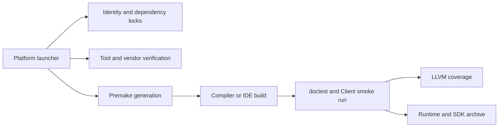

# Architecture

## Ownership

`Core` is a static C++20 library and owns reusable application behavior, including logging. `Client` is the runnable application and depends on Core. `Tests` is a separate executable that depends on Core and doctest. Each project owns a local `premake5.lua`; the root file only defines workspace identity and loads projects.

`Config/Project.conf` defines names and folders. `Config/Dependencies.lock` defines immutable external inputs. Premake and launchers read these files so renaming and dependency verification have one source of truth.

## Automation Flow

The scripts resolve `default` to a concrete compiler before generation. Architecture defaults to the native host and may be overridden with x86_64 or ARM64. A generation stamp prevents reuse with mismatched generator, architecture, toolset, or CI warning policy.

## Logging Lifecycle

Core owns a private spdlog thread pool and two asynchronous loggers. The implementation does not register global names, replace the spdlog default, or shut down unrelated state. A shared lifecycle lock protects logging handles; shutdown takes exclusive ownership and waits for active handles before destroying sinks and workers.

File paths are intentionally relative to the process working directory. Scripts and generated IDE targets set that directory to the repository root, producing consistent `Logs/Core.log` and `Logs/Client.log` paths.

## Release Shape

Packages include the Client runtime, Core static library, public Core headers, required spdlog headers, complete spdlog/fmt/doctest license texts, notices, README, and a validated machine-readable build manifest. Packaging extracts the archive and compiles, links, and runs the checked-in C++20 consumer both directly and through the generated CMake package. CMake is a consumer interface only; Premake remains the sole project build system. Release debug symbols are uploaded separately where a platform toolchain emits them; Dist is intentionally stripped.

Build generation captures version and source-control identity under `Build/Generated`; the compiler supplies configuration, compiler, platform, and architecture identity. The resulting `Core::BuildInfo` describes the binary itself rather than the machine inspecting it.
