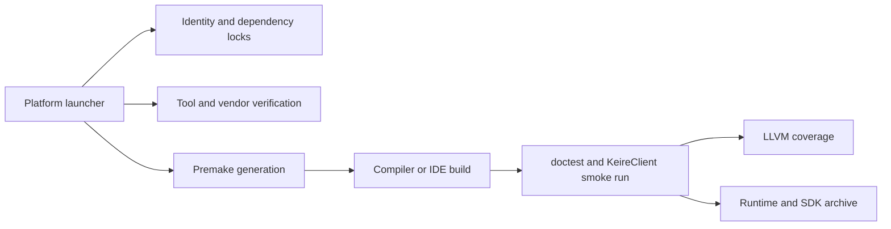

# Architecture

## Ownership

`KeireCore` is a static C++20 library and owns reusable application behavior, including projects, scenes,
reference-counted ownership, logging, and the Kéire UI runtime. `KeireClient` is the project editor, `KeireHub` owns
project discovery/creation and editor process launch, `KeireAssetTool` owns headless import/cook validation, and
`KeireTests` is independent. `DearImGui` is a private static-library build dependency
grouped under `Dependencies`; its reviewed definition lives in `Scripts/Premake/DearImGui.lua`, while generated project
metadata lives below ignored `Build/Projects/DearImGui`. First-party targets retain local `premake5.lua` files, and
the root file defines workspace identity, dependency grouping, and project load order.

`Config/Project.conf` defines names and folders. `Config/Dependencies.lock` defines immutable external inputs. Premake and launchers read these files so renaming and dependency verification have one source of truth.

`Application` creates `RenderSystem` after Windowing and before UI. RenderSystem exclusively owns the SDL_GPU device,
window claim, swapchain, command recording, fences, viewport resources, and deferred retirement. UI records through a
private renderer bridge rather than owning presentation. Scene/Game panels exchange only Kéire `RenderView` and
`RenderSurface` handles; backend resources remain private.

`Application` also owns one `UndoService` before layer attachment. Editors create bounded contexts per document rather
than retaining process-global history. Commands own forward/inverse behavior and availability checks; nested
transactions preserve all-or-nothing semantics. Contexts close during layer teardown, and the service closes before
scene and asset services so no history callback can observe a partially destroyed document service.

## Public Binary Boundary

Public classes and free functions with KeireCore-owned out-of-line symbols use `KEIRE_API`. Exception types that cross the managed-client boundary are annotated as well so their type identity remains consistent in a same-toolchain shared-library build. Header-only value types, templates, IDs, and aggregates do not own exportable symbols and remain unannotated. `GetApplicationCommandLineDescription` and `CreateApplication` are the deliberate reverse boundary: the managed executable defines them for KeireCore, so they must not be marked as library imports. Script regressions keep this policy explicit as the API grows.

`noexcept` is reserved for operations whose complete implementation is non-throwing. Snapshot observers that acquire a standard mutex allow `std::system_error` to propagate; destructors, shutdown helpers, and other mandatory cleanup paths instead contain synchronization failures and preserve any exception already in flight.

## Automation Flow

The scripts resolve `default` to a concrete compiler before generation. Architecture defaults to the native host and may
be overridden with x86_64 or ARM64. A generation stamp covers generator, architecture, toolset, CI warning policy,
Premake/config content, and the first-party source inventory, so adding or removing translation units regenerates stale
IDE/Ninja metadata automatically.

## Project Ownership

Project identity is separate from repository/template identity. `Project` validates the fixed marker, owns the canonical
root and exclusive editor lock, and supplies derived paths for Assets, catalogs, workspace state, input overrides, scene
recovery, logs, and builds. `Application` opens a project before logging and all project-backed services, then releases it
after layers, Input, Scenes, and Assets stop. No service consults the process working directory as an implicit project.

`ProjectRegistry` is Hub-owned per-user discovery state. `KeireHub` may inspect and launch projects but never owns editor
assets or the exclusive lock. Each detached KeireClient process revalidates and locks its requested project. The packaged
`samples/KeireSandbox` is a complete project and is validated through the same asset tool contract as user projects.

## Scene Ownership

`SceneAsset` is immutable imported data. `Scene` is an owner-thread mutable instance with weak object handles, validated
transactional hierarchy mutation, and explicit dirty/open lifecycle. `SceneSystem` owns loaded runtime instances and
pending operations. Asset workers decode immutable data; `Application` pumps completions, then Scenes commit loads,
unloads, and active changes at a safe frame boundary before Input and layer updates. Failed loads never replace the
last-good loaded set.

The editor owns authoring selection, undo/redo, atomic source writes, dirty decisions, and recovery files. Runtime scene
activation is refreshed only after source validation/import succeeds. JSON remains private to the scene importer.

Scene schema v2 stores stable entities and component records. The public ECS surface owns stable IDs, weak `Entity`
handles, reference-counted `Component` instances, registration metadata, and Kéire math values. EnTT owns native entity
storage privately and GLM implements matrix/quaternion operations privately. A component registry is application-owned
through `SceneSystemSpecification`; duplicate IDs and incomplete registrations are rejected before a scene uses them.
Schema v1 loads migrate inline transforms, while unknown v2 component records remain round-trippable Missing Components.

`SceneRuntimeSession` clones the in-memory authored scene for Play while retaining entity IDs. Pause suppresses update
callbacks, Step advances one fixed tick, and Stop destroys the clone. Component callback exceptions fault the session
and preserve the edit scene. Detailed contracts live in [ECS And Components](ECSAndComponents.md).

## Reference Ownership

Project-owned shared objects derive from `RefCounted` and are constructed with `CreateRef`. `Ref` and `WeakRef` point at an external atomic control block containing a type-erased deleter. The last strong release destroys the object; the implicit weak owner then releases the control block when no explicit weak references remain. `WeakRef::Lock` uses atomic increment-if-nonzero, so it cannot resurrect an object or race its destruction. Cyclic graphs must contain at least one weak edge.

## Logging Lifecycle

KeireCore owns a private spdlog thread pool and two asynchronous loggers inside a reference-counted `LogState`. The implementation does not register global names, replace the spdlog default, or shut down unrelated state. Handles keep the state storage valid but take operation locks only while making calls. Shutdown detaches the global state, takes its exclusive operation lock, flushes pending work, and closes it. It may wait for an active call but not for a handle's lifetime; detached handles observe the closed state and become safe no-ops.

File paths are intentionally relative to the process working directory. Scripts and generated IDE targets set that directory to the repository root, producing consistent `Logs/Core.log` and `Logs/Client.log` paths.

## Window Platform Boundary

Public headers contain only Kéire value types. SDL pointers, flags, identifiers, headers, and raw events live in `Window.cpp`. `WindowSystem` owns SDL video state and is unique while active; each abstract `Window` delegates through a reference-counted private implementation. The creating thread owns SDL calls. Native window creation remains under an RAII guard until the handle and both internal indexes commit as one transaction. A final window release on another thread adds its opaque ID to a destruction queue, which event polling and shutdown drain on the owner thread.

The polling translator updates cached state before returning each `WindowEvent`, preserving SDL ordering. A private
tokenized router forwards every native event to application-owned UI and Input sinks before public translation, so
neither subsystem can consume events away from the other. Logical dimensions, pixel dimensions, display scale, and
requested cursor mode remain distinct and observable without exposing SDL.

Configuration is a separate typed boundary. nlohmann/json parses implementation-side input into `WindowSpecification`; callers never depend on JSON types. Strict keys and bounds make configuration mistakes deterministic rather than silently accepting typos.

## Application And Layer Runtime

`Application` is an explicit, single-run orchestrator for logging, event/time services, the SDL window system, the primary window, and an application-bound `LayerStack`. Construction is side-effect free; `Run` initializes services in dependency order and unwinds them in reverse order even when client callbacks throw. The construction thread owns `Run` and layer mutations, while `RequestExit` is the cross-thread application control. KeireCore owns the executable entrypoint, dependency-free help/version handling, the top-level exception boundary, application lifetime, and the `Run` call. A managed client defines a static `GetApplicationCommandLineDescription` and `CreateApplication`, keeping option documentation and validation client-owned. Because the entrypoint is an unreferenced member of the static library, tests and low-level SDK consumers that define their own `main` do not pull it into their executables.

`LayerStack` owns layer records and lifetimes, the overlay partition, pending structural operations, activation, traversal, and reverse-order teardown. Fixed and variable updates traverse bottom-to-top, while events traverse top-to-bottom. A depth-counted traversal guard keeps push/remove operations deferred through nested dispatch and callback re-entry until an application safe boundary. Ownership is unique, attachment is exactly once, automatic subscription creation is disabled once detachment begins, tokens disconnect before `OnDetach`, and shutdown detaches in reverse order before client shutdown and service teardown. `Application` coordinates safe boundaries and delegates its convenience layer methods to the stack.

## UI Runtime

`UiSystem` is an application-owned private implementation. `UiMode::Disabled` preserves the pre-UI runtime, `Headless`
creates a deterministic context without platform or graphics state, and `Rendered` initializes Dear ImGui's SDL3
platform backend plus a private bridge into the application-owned `RenderSystem`. RenderSystem owns the SDL_GPU device,
window claim, swapchain, and presentation lifecycle described above. Partial initialization unwinds in reverse order.
Shutdown removes event forwarding, persists the active layout when configured, closes the UI renderer/platform bridges,
and destroys the context before RenderSystem releases GPU and window resources.

Scene submissions carry a Kéire-owned `RenderEnvironmentSettings` value. JSON persistence stays private in
`ProjectSettings/Rendering.keiresettings`; public headers expose only colors, scalar values, paths, and validation
functions. Fragment-stage lighting consumes that environment together with the deterministic active Directional Light.
KeireClient owns the separate Scene gizmo controller and uses only the public UI drawing facade, so neither ImGui draw
lists nor GPU handles cross into client code.

Raw SDL events are forwarded through an implementation-only sink inside `WindowSystem::PollEvent` before Kéire's existing typed translation. Neither the sink, native window, SDL event, GPU device, nor swapchain appears in a public header. `UiCaptureState` is copied out as Kéire values for future input routing.

After fixed and variable updates, `Application` begins one UI frame, creates the root dockspace, and delegates
bottom-to-top UI traversal to `LayerStack`; overlays execute last and structural changes remain deferred. `UiFrame`
validates owner thread and active generation. Its RAII scopes balance backend begin/end calls during normal returns and
exception unwinding. Scene/Game declarations and UI draw data are recorded into one coordinated RenderSystem frame.
Minimized or unavailable swapchain textures are skipped safely. Docking is active, while multi-viewports are forced off
because detached native windows require a separate ownership milestone.

`UiWorkspace` is an optional application-owned profile service layered above `UiSystem`. Panels register stable IDs and receive move-only registrations; the workspace owns visibility and submitted backend names without exposing Dear ImGui. The Default layout is an immutable factory recipe expressed through `UiLayoutBuilder`, while named layouts capture docking state plus known and unknown panel visibility. Changes autosave to a current-session document and the active custom profile. Explicit reset reapplies the factory recipe; custom profiles support save-as, rename, delete, and portable import/export.

Workspace catalogs, layouts, and custom themes use versioned, bounded JSON documents. Unknown or duplicate keys, invalid types, unsafe names, non-finite theme values, and oversized input are rejected before activation. Writes use a temporary file and recoverable backup replacement. Normal storage lives below `SDL_GetPrefPath(ProjectName, ProjectName)/Editor/Workspace`; an explicit directory supports tests and tools, and ephemeral workspaces perform no disk writes. Native file dialogs are asynchronous: callbacks copy results into a synchronized mailbox and the UI owner thread applies them at the next frame boundary. Shutdown makes late callbacks inert.

Themes cross the public boundary only as stable semantic tokens: canvas, panel surfaces, text, accent states, selection, status colors, spacing, borders, and rounding. Private code maps these tokens to backend style slots. Kéire Dark, Kéire Light, and Classic are immutable; custom themes persist as `.keiretheme` documents. Preview applies at a safe frame boundary, while persistence remains explicit. The client editor enforces Save/Discard/Cancel when a dirty theme would be switched or closed.

Opaque `UiImage` values extend that boundary for editor thumbnails. RGBA uploads happen only on the UI owner thread;
GPU texture identity and release remain private. The client asset browser owns a bounded thumbnail worker and deterministic
project-local cache, then transfers completed pixels through the façade. See [Asset Browser](AssetBrowser.md) and
[Editor Panels And Commands](EditorPanels.md).

Configuration examples, application-facing workflows, storage details, and troubleshooting live in the
[UI Workspace Guide](UiWorkspace.md).

## Asset Runtime And Pipeline

`AssetSystem` is optionally created after `EventBus` and closed before it. Its bounded priority scheduler owns worker
threads, while handles own reference-counted shared state and immutable payload revisions. Workers perform I/O,
decompression, integrity verification, and decode; `Application` commits completions and dispatches typed events at a
safe owner-thread frame boundary. Typed fallbacks cover queued and initial-failure states. Reload failure preserves the
last committed payload and records diagnostics rather than replacing working content.

Catalog mounts are transactional resolved views over versioned packs. Explicit priority and override permission prevent
silent identity replacement; bounded ranges, dependency closure/cycle checks, Zstandard result sizes, and SHA-256
protect decode inputs. Core owns Binary/Text lifecycle types only. No GPU, audio, model, scene, or native backend type
crosses this boundary.

`AssetDatabase` owns source-side identity through adjacent `.keiremeta` files, a content-addressed import cache, and
confined rollback-capable file operations. `AssetCooker` sorts stable IDs, writes deterministic sharded packs and a
versioned build profile into staging, then atomically publishes the directory. The editor and `KeireAssetTool` call the
same public APIs. Detailed contracts live in [Asset Runtime](AssetRuntime.md) and [Asset Pipeline](AssetPipeline.md).

Asset code is grouped by subsystem: supported headers live in `KeireCore/Include/Keire/Assets`, implementation sources
live in `KeireCore/Source/Assets`, and implementation-only declarations live in
`KeireCore/Include/KeireInternal/Assets`. SDK packaging copies only the `Keire` public include tree, so internal headers
remain available to first-party builds without becoming part of the SDK contract. No first-party header is stored under
a `Source` directory.

## Input Runtime And Authoring

`InputSystem` is constructed after Assets and Windowing and before UI. It owns logical keyboard/mouse devices, SDL
gamepad RAII handles, users, pairing, control-scheme selection, action contexts, frame snapshots, and interactive
rebinding. Action definitions are immutable `InputActionAsset` revisions; runtime state and per-profile overrides stay
outside source assets. Stable IDs preserve context state across rename and hot reload. Input shuts down before Windowing
and Assets. Full contracts live in [Input System](InputSystem.md).

`.keireinput` is the first registered typed source importer. It validates bounded versioned JSON and emits deterministic
canonical bytes into the normal content-addressed cache and cooker. The dockable editor exposes every schema-owned
action type, value type, control scheme, composite, interaction, and processor while owning only mutable authoring
documents and uses the public Kéire UI facade. Details live in [Input Actions Editor](InputActionsEditor.md).

## Event And Time Runtime

`EventBus` uses exact C++ payload types without a base-event hierarchy. Typed and generic listeners share one priority/registration order; inactive tombstones allow safe unsubscribe and nested dispatch without allocating on the immediate path. Owner-thread dispatch and subscription keep callback mutation deterministic. A bounded mutex-protected queue accepts owned events from any thread, rejects overflow without blocking, and drains a fixed snapshot so producers cannot starve a frame. Closing a bus makes retained references and subscription tokens safely inert.

`Time` is application-owned rather than process-global. A monotonic frame sample feeds raw, clamped unscaled, scaled, smoothed, and elapsed clocks. Scaled time feeds a 60 Hz accumulator with a fixed per-frame tick cap; excess whole ticks are recorded as dropped simulation time while the fractional interpolation remainder is retained. Pause and minimized suspension stop scaled simulation without losing real/unscaled time.

## Dependency Build Boundary

Premake remains the Kéire build authority. A dependency-only CMake invocation builds and installs pinned SDL3 Debug
and Release variants into ignored, compiler-keyed caches. A generated Lua manifest supplies Premake with the selected
include/archive paths and platform requirements. SDK packages preserve SDL's official CMake target and make
`Keire::Core` transitively depend on the private ImGui and Zstd archives followed by `SDL3::SDL3-static`.

The pinned Dear ImGui docking sources, standard-string adapter, SDL3 platform backend, and SDL_GPU renderer compile in
the dedicated `DearImGui` static-library project. It emits `KeireImGui.lib` on Windows and `libKeireImGui.a` on Unix,
uses the workspace runtime/configuration/architecture/sanitizer policies, and alone disables compiler warnings for its
third-party translation units. KeireCore retains private include access for its UI implementation and links the archive;
KeireClient remains free of Dear ImGui includes and symbols. KeireTests may include ImGui privately only for dependency
and lifecycle verification. The internal link closure preserves `KeireCore` → `KeireImGui` → SDL3 for final binaries.
SDL_GPU selects D3D12 or Vulkan on Windows, Vulkan on Linux, and Metal on macOS; SDL_Renderer remains disabled.

Pinned Zstandard sources compile in the dedicated warning-isolated `Zstd` project as `KeireZstd.lib` or
`libKeireZstd.a`. KeireCore privately includes `zstd.h` for pack compression/decompression. Neither its headers nor
implementation types cross the public API. SDK targets preserve the Core → ImGui → Zstd → SDL static link order.

Pinned EnTT 3.16.0 and GLM 1.0.3 are header-only private dependencies. Their IDE utility projects live in the
`Dependencies` solution group, generated metadata stays below `Build/Projects`, and only their utility projects disable
third-party warnings. KeireCore treats their include roots as external. SDKs package their license texts and locked
commits but not source trees because no supported header exposes either dependency.

Pinned SDL_shadercross and its exact recursive DXC, SPIRV-Cross, SPIRV-Headers, and SPIRV-Tools gitlinks build a
host-native `KeireShaderCompiler` during bootstrap. The compiler and runtime libraries are SDK asset tools, never Core
link dependencies. Shader import produces DXIL, SPIR-V, and MSL canonical variants and validates Kéire's fixed resource
ABI through reflection before publication.

## Release Shape

Packages include KeireHub, the KeireClient editor, KeireAssetTool, KeireShaderCompiler and its runtime libraries, KeireCore plus private KeireImGui/KeireZstd archives,
public `Keire/<header>` APIs, required spdlog headers, the SDL static SDK, complete license texts, notices, README, and a
complete `samples/KeireSandbox` project. The packaged asset tool imports and validates the sample input and scene assets
from a tracked-file allowlist. Generated workspace and recovery data is rejected in the stage, archive, and extracted
validation copy
before archive publication. Dear ImGui and Zstd headers/sources are not redistributed because Kéire's public facades own
the supported contracts. Direct validation links Core, ImGui, Zstd, then SDL; the generated CMake package carries those
private archives through `Keire::Core`, so low-level and managed consumers still name one Kéire target.
Packaging extracts the archive and compiles, links, and runs both consumers. CMake builds SDL and serves consumers;
Premake builds Kéire. Release debug symbols are uploaded separately where a platform toolchain emits them; Dist is
intentionally stripped. Export annotations describe same-toolchain shared-library preparation only, not a
compiler-independent C++ ABI.

A KeireCore prebuild step refreshes version and source-control identity under `Build/Generated` immediately before compilation, including tracked and untracked dirty state. The generator C-escapes configured strings and only rewrites the header when its content changes. The compiler supplies configuration, compiler, platform, and architecture identity. Packaging regenerates identity and verifies the staged binary's commit prefix and dirty marker against its manifest. The resulting `Keire::BuildInfo` describes the binary itself rather than the machine inspecting it.
