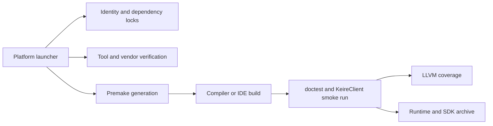

# Architecture

## Ownership

`KeireCore` is a static C++20 library and owns reusable application behavior, including reference-counted ownership, logging, and the Kéire UI runtime. `KeireClient` is the runnable application and depends on KeireCore. `KeireTests` is a separate executable that depends on KeireCore and doctest. Dear ImGui is a private implementation dependency of KeireCore. Each project owns a local `premake5.lua`; the root file only defines workspace identity and loads projects.

`Config/Project.conf` defines names and folders. `Config/Dependencies.lock` defines immutable external inputs. Premake and launchers read these files so renaming and dependency verification have one source of truth.

## Automation Flow

The scripts resolve `default` to a concrete compiler before generation. Architecture defaults to the native host and may be overridden with x86_64 or ARM64. A generation stamp prevents reuse with mismatched generator, architecture, toolset, or CI warning policy.

## Reference Ownership

Project-owned shared objects derive from `RefCounted` and are constructed with `CreateRef`. `Ref` and `WeakRef` point at an external atomic control block containing a type-erased deleter. The last strong release destroys the object; the implicit weak owner then releases the control block when no explicit weak references remain. `WeakRef::Lock` uses atomic increment-if-nonzero, so it cannot resurrect an object or race its destruction. Cyclic graphs must contain at least one weak edge.

## Logging Lifecycle

KeireCore owns a private spdlog thread pool and two asynchronous loggers inside a reference-counted `LogState`. The implementation does not register global names, replace the spdlog default, or shut down unrelated state. Handles keep the state storage valid but take operation locks only while making calls. Shutdown detaches the global state, takes its exclusive operation lock, flushes pending work, and closes it. It may wait for an active call but not for a handle's lifetime; detached handles observe the closed state and become safe no-ops.

File paths are intentionally relative to the process working directory. Scripts and generated IDE targets set that directory to the repository root, producing consistent `Logs/Core.log` and `Logs/Client.log` paths.

## Window Platform Boundary

Public headers contain only Kéire value types. SDL pointers, flags, identifiers, headers, and raw events live in `Window.cpp`. `WindowSystem` owns SDL video state and is unique while active; each abstract `Window` delegates through a reference-counted private implementation. The creating thread owns SDL calls. Native window creation remains under an RAII guard until the handle and both internal indexes commit as one transaction. A final window release on another thread adds its opaque ID to a destruction queue, which event polling and shutdown drain on the owner thread.

The polling translator updates cached state before returning each `WindowEvent`, preserving SDL ordering without callbacks or re-entrancy. Logical dimensions, pixel dimensions, and display scale remain distinct so high-DPI changes are observable. Unknown input events are ignored until a dedicated input subsystem extends this central translator.

Configuration is a separate typed boundary. nlohmann/json parses implementation-side input into `WindowSpecification`; callers never depend on JSON types. Strict keys and bounds make configuration mistakes deterministic rather than silently accepting typos.

## Application And Layer Runtime

`Application` is an explicit, single-run orchestrator for logging, event/time services, the SDL window system, the primary window, and an application-bound `LayerStack`. Construction is side-effect free; `Run` initializes services in dependency order and unwinds them in reverse order even when client callbacks throw. The construction thread owns `Run` and layer mutations, while `RequestExit` is the cross-thread application control. KeireCore owns the executable entrypoint, dependency-free help/version handling, the top-level exception boundary, application lifetime, and the `Run` call. A managed client defines a static `GetApplicationCommandLineDescription` and `CreateApplication`, keeping option documentation and validation client-owned. Because the entrypoint is an unreferenced member of the static library, tests and low-level SDK consumers that define their own `main` do not pull it into their executables.

`LayerStack` owns layer records and lifetimes, the overlay partition, pending structural operations, activation, traversal, and reverse-order teardown. Fixed and variable updates traverse bottom-to-top, while events traverse top-to-bottom. A depth-counted traversal guard keeps push/remove operations deferred through nested dispatch and callback re-entry until an application safe boundary. Ownership is unique, attachment is exactly once, automatic subscription creation is disabled once detachment begins, tokens disconnect before `OnDetach`, and shutdown detaches in reverse order before client shutdown and service teardown. `Application` coordinates safe boundaries and delegates its convenience layer methods to the stack.

## UI Runtime

`UiSystem` is an application-owned private implementation. `UiMode::Disabled` preserves the pre-UI runtime, `Headless` creates a deterministic context without platform or graphics state, and `Rendered` transactionally creates an SDL_GPU device, claims the primary native window, configures an SDR swapchain, and initializes the SDL3 and SDL_GPU Dear ImGui backends. Partial initialization unwinds in reverse order. Shutdown removes event forwarding, waits for the GPU, shuts down renderer and platform backends, persists the active layout when configured, destroys the context, releases the window claim, and destroys the device before the window system closes.

Raw SDL events are forwarded through an implementation-only sink inside `WindowSystem::PollEvent` before Kéire's existing typed translation. Neither the sink, native window, SDL event, GPU device, nor swapchain appears in a public header. `UiCaptureState` is copied out as Kéire values for future input routing.

After fixed and variable updates, `Application` begins one UI frame, creates the root dockspace, and delegates bottom-to-top UI traversal to `LayerStack`; overlays execute last and structural changes remain deferred. `UiFrame` validates owner thread and active generation. Its RAII scopes balance backend begin/end calls during normal returns and exception unwinding. Rendering performs the mandatory SDL_GPU draw-data preparation, records one render pass, and submits the command buffer. Minimized or unavailable swapchain textures are skipped safely. Docking is active, while multi-viewports are forced off because detached native windows require a separate ownership milestone.

`UiWorkspace` is an optional application-owned profile service layered above `UiSystem`. Panels register stable IDs and receive move-only registrations; the workspace owns visibility and submitted backend names without exposing Dear ImGui. The Default layout is an immutable factory recipe expressed through `UiLayoutBuilder`, while named layouts capture docking state plus known and unknown panel visibility. Changes autosave to a current-session document and the active custom profile. Explicit reset reapplies the factory recipe; custom profiles support save-as, rename, delete, and portable import/export.

Workspace catalogs, layouts, and custom themes use versioned, bounded JSON documents. Unknown or duplicate keys, invalid types, unsafe names, non-finite theme values, and oversized input are rejected before activation. Writes use a temporary file and recoverable backup replacement. Normal storage lives below `SDL_GetPrefPath(ProjectName, ProjectName)/Editor/Workspace`; an explicit directory supports tests and tools, and ephemeral workspaces perform no disk writes. Native file dialogs are asynchronous: callbacks copy results into a synchronized mailbox and the UI owner thread applies them at the next frame boundary. Shutdown makes late callbacks inert.

Themes cross the public boundary only as stable semantic tokens: canvas, panel surfaces, text, accent states, selection, status colors, spacing, borders, and rounding. Private code maps these tokens to backend style slots. Kéire Dark, Kéire Light, and Classic are immutable; custom themes persist as `.keiretheme` documents. Preview applies at a safe frame boundary, while persistence remains explicit. The client editor enforces Save/Discard/Cancel when a dirty theme would be switched or closed.

## Event And Time Runtime

`EventBus` uses exact C++ payload types without a base-event hierarchy. Typed and generic listeners share one priority/registration order; inactive tombstones allow safe unsubscribe and nested dispatch without allocating on the immediate path. Owner-thread dispatch and subscription keep callback mutation deterministic. A bounded mutex-protected queue accepts owned events from any thread, rejects overflow without blocking, and drains a fixed snapshot so producers cannot starve a frame. Closing a bus makes retained references and subscription tokens safely inert.

`Time` is application-owned rather than process-global. A monotonic frame sample feeds raw, clamped unscaled, scaled, smoothed, and elapsed clocks. Scaled time feeds a 60 Hz accumulator with a fixed per-frame tick cap; excess whole ticks are recorded as dropped simulation time while the fractional interpolation remainder is retained. Pause and minimized suspension stop scaled simulation without losing real/unscaled time.

## Dependency Build Boundary

Premake remains the Kéire build authority. A dependency-only CMake invocation builds and installs pinned SDL3 Debug and Release variants into ignored, compiler-keyed caches. A generated Lua manifest supplies Premake with the selected include/archive paths and platform requirements. SDK packages preserve SDL's official CMake target and make `Keire::Core` transitively depend on `SDL3::SDL3-static`.

The pinned Dear ImGui docking sources, standard-string adapter, SDL3 platform backend, and SDL_GPU renderer compile directly into KeireCore, following Dear ImGui's source-integration model. Third-party warnings are disabled only for vendor translation units. KeireClient and KeireTests have no direct Dear ImGui includes or symbols. SDL_GPU selects D3D12 or Vulkan on Windows, Vulkan on Linux, and Metal on macOS; SDL_Renderer remains disabled.

## Release Shape

Packages include the KeireClient runtime, KeireCore static library, public `Keire/<header>` headers, required spdlog headers, SDL static SDK, complete license texts including Dear ImGui's MIT license, notices, README, and a validated machine-readable build manifest. Dear ImGui headers and sources are not redistributed because Kéire's public UI facade owns the supported contract. Packaging extracts the archive and compiles, links, and runs both the low-level C++20 consumer and a managed headless-UI consumer that resolves `main` from KeireCore, using direct compiler commands and the generated CMake package. CMake builds SDL and serves consumers; Premake builds Kéire. Release debug symbols are uploaded separately where a platform toolchain emits them; Dist is intentionally stripped. Export annotations describe same-toolchain shared-library preparation only, not a compiler-independent C++ ABI.

A KeireCore prebuild step refreshes version and source-control identity under `Build/Generated` immediately before compilation, including tracked and untracked dirty state. The generator C-escapes configured strings and only rewrites the header when its content changes. The compiler supplies configuration, compiler, platform, and architecture identity. Packaging regenerates identity and verifies the staged binary's commit prefix and dirty marker against its manifest. The resulting `Keire::BuildInfo` describes the binary itself rather than the machine inspecting it.
