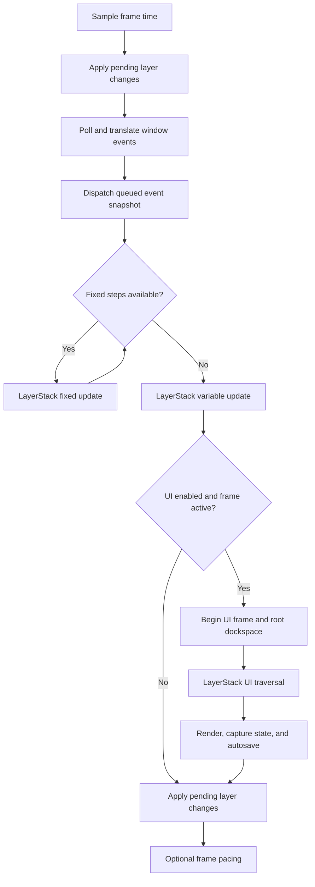

# Runtime Lifecycle

Kéire uses explicit application-owned services and one construction-thread owner. Understanding the lifecycle is
required before adding layers, event producers, windows, time behavior, or editor UI.

## Application States

An `Application` begins in `Constructed`, transitions to `Running` exactly once through `Run()`, and finishes in
`Stopped`. Calling `Run()` more than once is an error. Destroying an application while it is still running terminates
the process because service teardown cannot be made deterministic from an arbitrary destructor context.

The application construction thread owns `Run()`, immediate event dispatch and subscription, window operations, layer
mutations, and UI workspace operations. `RequestExit()` and owned queued-event enqueue are the deliberate cross-thread
entry points.

## Startup Order

Startup is transactional inside the top-level exception boundary:

1. Initialize managed logging when requested.
2. Create the event bus and application-owned time service.
3. Create the window system and primary window.
4. Create the optional UI system and workspace.
5. Connect the layer event listener.
6. Activate the layer stack.
7. Call the client `OnInitialize()` hook.
8. Apply pending layer attachment operations at the first safe boundary.

If any step fails, shutdown runs for the resources that were acquired. The original exception is rethrown after cleanup.

## Frame Order

Window events are pumped before simulation. Queued events drain a fixed snapshot, so events enqueued during that drain
wait for the next frame. Fixed simulation consumes scaled time before variable update. UI runs after simulation and is
skipped when the application is suspended by a minimized primary window.

Exit requests are checked between phases. A request does not force callbacks already on the stack to unwind, but later
frame phases are skipped as soon as the loop reaches a safe check.

## Layer Ownership And Traversal

`LayerStack` owns every layer through `std::unique_ptr`. Layers attach exactly once after activation and detach in
reverse order. The stack maintains a layer partition followed by an overlay partition.

- Fixed update, variable update, and UI traverse bottom-to-top.
- Events traverse overlays and layers top-to-bottom.
- Handled events stop propagation.
- Automatic layer subscriptions disconnect before detachment.
- `OnDetach()` is `noexcept` and cannot create new automatic subscriptions.

Traversal depth is RAII-managed. Push and remove requests made during attach, detach, event, fixed-update, update, or UI
callbacks are queued until the next application safe boundary. Nested callbacks do not flush the queue early.

## Events

Immediate dispatch is synchronous and construction-thread-affine. Typed and generic listeners share priority and
registration order. Subscription removal during dispatch creates an inactive tombstone without invalidating traversal,
and nested dispatch remains deterministic.

Worker producers use the bounded owned queue. Enqueue either transfers the event into the queue or rejects it without
blocking when capacity is exhausted. Closing the bus makes retained references and subscription tokens inert.

Window events originate in the private SDL boundary, are translated into Kéire value types, and then enter the same
event bus. Unhandled quit and primary-window close requests become application exit requests.

## Time

`Time` is application-owned. Every frame records raw, clamped unscaled, scaled, smoothed, and elapsed values. Scaled
time feeds the fixed-step accumulator; pause and minimized suspension stop scaled simulation without erasing real time.

The fixed-step cap prevents a slow frame from running unbounded simulation work. Excess whole ticks are recorded as
dropped time, while the fractional remainder remains available for interpolation. Changes to clamping, scaling,
smoothing, tick caps, or remainder behavior are observable and require deterministic tests.

## UI

`UiSystem` owns the Dear ImGui context and optional SDL_GPU renderer privately. `UiFrame` is valid only during
`Layer::OnUi()` on the owner thread. Its move-only scopes balance backend begin/end operations during normal returns and
exception unwinding; a scope cannot escape its frame or close out of nesting order.

The root dockspace is submitted before layer UI. `UiWorkspace` applies queued layout and theme changes at safe frame
boundaries and autosaves after rendering. Raw SDL events, GPU resources, backend types, and native handles never cross
the public UI boundary.

## Shutdown Order

Shutdown is deterministic and idempotent at service boundaries:

1. Deactivate the layer stack and detach layers in reverse order.
2. Call client `OnShutdown()` if initialization completed.
3. Disconnect the application layer-event listener.
4. Shut down UI event forwarding, renderer state, workspace, and context.
5. Close the event bus.
6. Release the primary window and shut down the window system.
7. Release windowing, time, and event services.
8. Shut down managed logging last.

Cleanup that is required to be `noexcept` contains secondary failures. A failure from application work remains the
exception observed by the caller rather than being replaced by a teardown diagnostic.

## Extension Checklist

Before adding a runtime subsystem, define:

- its explicit owner and construction thread;
- the startup point after every dependency is available;
- the frame phase in which it runs;
- safe behavior during nested callbacks and deferred mutation;
- the cross-thread operations, if any;
- reverse-order shutdown and partial-initialization rollback;
- behavior of retained handles after the service closes;
- deterministic, failure, Release, and sanitizer tests.
