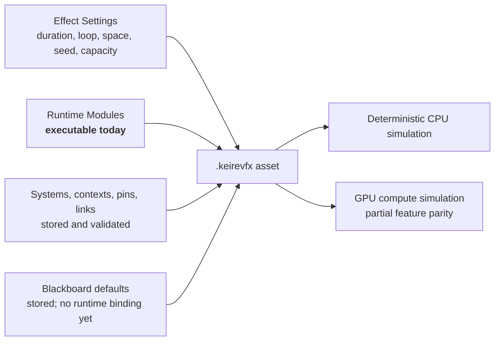
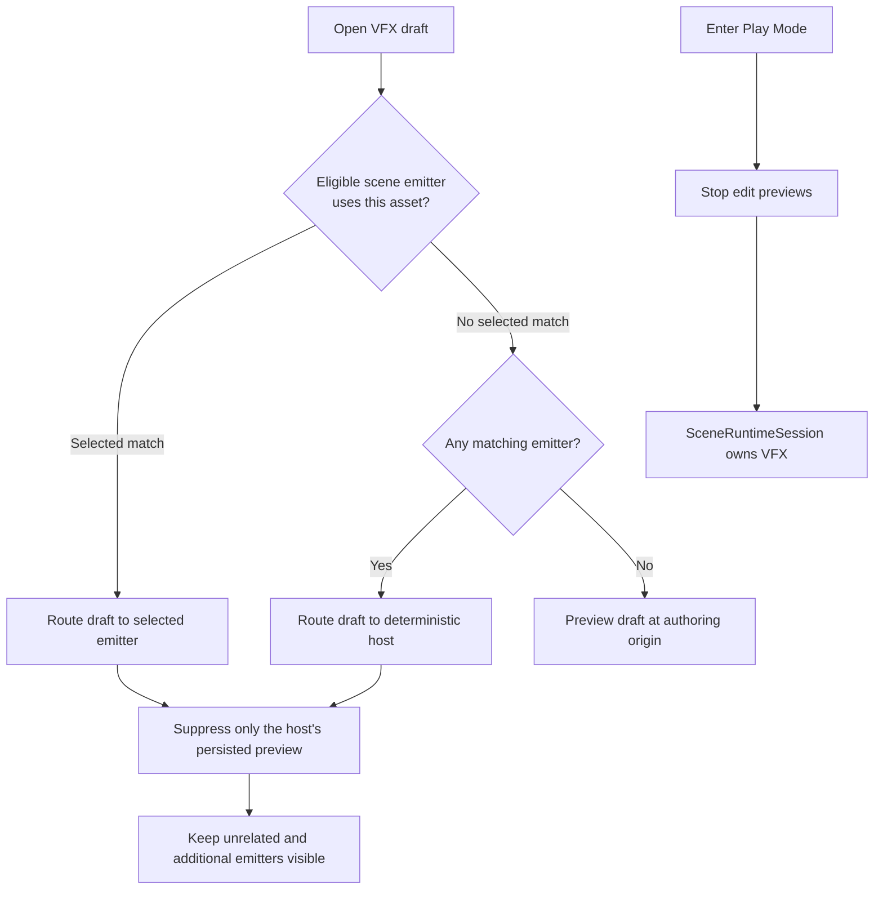
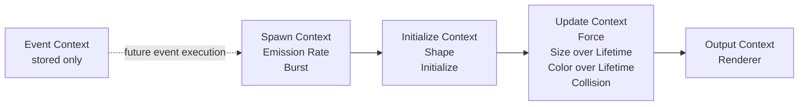
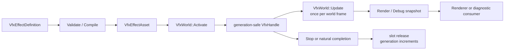
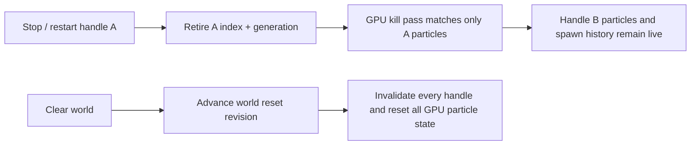

# VFX Authoring And Runtime

Kéire's VFX system combines a visual authoring document, a bounded modular particle runtime, scene components, native
C++ control, and managed C# gameplay control. This guide covers the complete supported workflow and calls out the
features that are authored today but are not executable yet.

Related guides cover [Scene Authoring](SceneAuthoring.md), [Rendering](Rendering.md), and
[managed Gameplay Services](Scripting/GameplayServices.md).

The most important rule is simple:

> **Runtime Modules drive particle behavior today.** Graph systems, context cards, typed pins, links, Custom HLSL, and
> blackboard properties are persisted and validated authoring data, but they do not yet compile into runtime operators.

That boundary keeps saved graph work forward-compatible without presenting unfinished cable execution as working
behavior.

## Mental Model

Every `.keirevfx` asset contains one `Keire::VfxEffectDefinition` with four major parts:



The graph and module stack are related visually, but they are not the same data:

- A graph **system** is an authoring container. Multiple systems do not currently create multiple runtime emitters.
- A graph **context card** describes a stage such as Spawn or Update.
- The card's **Executable Runtime Blocks** list summarizes every Runtime Module whose type belongs to that context.
- A **Runtime Module** is the data the CPU and GPU particle implementations actually read.
- Blackboard parameters, graph links, Event contexts, and Custom HLSL are reserved for the future typed operator
  compiler.

## Quick Start

Use this workflow for a first effect:

1. In the Project panel, open the create menu and choose **VFX Effect**.
2. Name the asset. Kéire creates a `.keirevfx` file with a connected Spawn, Initialize, Update, and Output graph.
3. Double-click the asset to open the **VFX Effect** panel.
4. Open **Runtime Modules**. Configure emission, initialization, lifetime changes, and output here.
5. Open **Effect Settings**. Choose Loop, Duration, Simulation Space, Seed, and Capacity.
6. Use the default **CPU (Authoring)** preview while tuning the effect.
7. Add a **VFX Emitter** component to a scene entity.
8. Assign the `.keirevfx` asset to its **Effect** field.
9. Enable **Preview In Edit Mode** to see the scene emitter without entering Play Mode.
10. Choose **Local** simulation space for an aura or other effect that must follow the entity. Choose **World** for
    smoke, sparks, or trails that should remain where they were emitted.
11. Enter Play Mode and verify the effect on the GPU runtime backend.

The default asset already contains an enabled Emission Rate module and Renderer, so it is valid immediately. Saving is
not required to see a transient authoring preview, but it is required to publish changes to the asset source.

## VFX Effect Panel

At a wide dock size, the Graph tab uses a three-column layout:

```text
┌ VFX GRAPH ─ Assets/Effect.keirevfx * ─ Save Discard Reload Undo Redo Compile ┐
│ PREVIEW LIVE  [Restart] [Pause] [Loop Preview] [CPU/GPU] [Speed] [Statistics]│
├ Graph ───────── Runtime Modules ───────── Blackboard ─────── Effect Settings ┤
│ ┌ Systems / Blackboard ┐ ┌──────────── Canvas ────────────┐ ┌ Inspector ┐   │
│ │ Particle System      │ │ Spawn -> Initialize -> Update │ │ Node name │   │
│ │ + Add System         │ │                  -> Output     │ │ Context   │   │
│ │ exposed properties   │ │ pan / zoom / drag / frame all │ │ Pins      │   │
│ └──────────────────────┘ └────────────────────────────────┘ │ Links     │   │
│                                                           └───────────┘   │
└────────────────────────────────────────────────────────────────────────────┘
```

When the panel is narrower than the full three-column layout, the Graph tab presents **Canvas**, **Systems**, and
**Inspector** as nested tabs. No authoring functionality is removed; it is only rearranged.

### Document Header

The header displays the asset path and appends `*` when the document contains unsaved changes.

| Control | Behavior |
| --- | --- |
| **Save** | Validates, encodes, and atomically persists the current draft. `Ctrl+S` also saves a dirty document. |
| **Discard** | Restores the last saved definition and its preview. |
| **Reload Source** | Reads the source again. Reload is skipped if unsaved local edits would be overwritten. |
| **Undo** | Reverts the most recent edit in the VFX document's undo context. |
| **Redo** | Reapplies the most recently undone edit. |
| **Compile** | Validates the current definition and produces canonical backend-tagged IR plus diagnostics. |

Edits are transactional. Kéire validates a candidate definition and its transient preview before replacing the current
draft. If validation or preview creation fails, the document keeps its last-good state. Removing a node or pin removes
its incident links in the same undoable transaction.

The Compile button does not turn graph cables into executable operators yet. It validates the complete schema, encodes
canonical IR, computes its stable hash, and reports backend compatibility diagnostics.

### Preview Toolbar

The preview toolbar controls the transient preview for the open VFX asset.

| Control | Behavior |
| --- | --- |
| **PREVIEW LIVE / IDLE** | Reports whether the asset-authoring preview handle is currently alive. |
| **Restart** | Stops and reactivates the open asset's transient preview. |
| **Pause / Resume** | Sets the asset preview's simulation speed to zero or restores the selected preview speed. |
| **Loop Preview** | Automatically restarts a completed asset preview. This does not edit the effect's Loop setting. |
| **Backend** | Selects **CPU (Authoring)** or **GPU (Runtime)** preview. |
| **Speed** | Scales the asset preview from `0.05` to `4.0`. |
| **Active / spawned estimate** | CPU reports active particles. GPU reports a spawn-based estimate. |
| **Dropped** | Reports particles rejected by the effect or world capacity. |

Use CPU preview for deterministic authoring and complete debug snapshots. Switch to GPU preview to inspect the current
runtime compute path before shipping. Changing backend rebuilds transient editor preview state.

The open draft and persisted scene emitter previews have coordinated presentation roles:

- Kéire first looks for an eligible scene emitter whose Effect matches the open VFX asset.
- The selected matching emitter is preferred. If selection does not provide a match, Kéire chooses the matching
  emitter with the lowest stable entity ID.
- The open draft preview handle is positioned and rotated at that host emitter. The host's persisted preview handle is
  suppressed so the same effect is not drawn twice.
- The routed draft uses the host's transform and Seed Offset, but its Pause and Speed still come from the VFX Effect
  preview toolbar. Other scene emitters use their component Simulation Speed.
- The host displays the unsaved draft definition. Additional emitters continue to display the last imported/persisted
  asset revision until the draft is saved and reimported.
- Unrelated emitters and additional matching emitters keep their own persisted previews and remain visible.
- If no eligible matching host exists, the open draft remains visible at the authoring origin.
- Pausing the draft preview does not pause other scene emitter previews.
- Hiding the VFX Effect panel stops its transient draft handle; checked scene emitters continue through their persisted
  preview handles.
- Entering Play Mode stops all edit-scene preview handles and lets the runtime scene own VFX presentation.



## Graph Workflow

The Graph tab is the visual authoring surface for systems, contexts, typed pins, and connections.

### Systems And Contexts

The left pane lists graph systems and their node counts. Use **+ Add System** to create another authoring system, select
one to display its canvas, and use **Remove** to delete it. Rename the selected system in the Inspector.

Use **Add Context** above the canvas to add one of the five context types:



The context colors are consistent throughout the editor:

- Spawn: teal
- Initialize: purple
- Update: blue
- Output: orange
- Event: red

A context card subtitle reports its context, pin count, and matching Runtime Module count. That count is a summary, not
proof that the graph topology executes.

### Canvas Navigation

Use the canvas controls as follows:

- Click a card to select it.
- Left-drag a card to move it. Its new graph position is committed when the drag completes.
- Middle-drag the canvas to pan.
- Use the mouse wheel to zoom.
- Click the background to clear node selection.
- Select **Frame All** to fit every card in the available canvas.

The Inspector also exposes **Graph Position** for precise placement.

### Editing A Context

Selecting a context card opens these properties in the Inspector:

- **Node Name**
- **Context**
- **Graph Position**
- **Custom HLSL**
- Typed pins
- Connections touching the selected context
- Matching executable Runtime Modules
- **Delete Context**

Changing the Context changes which Runtime Modules are summarized under **Executable Runtime Blocks**. It does not move
or convert those modules.

Custom HLSL is saved with the node. The CPU compiler reports that it cannot execute Custom HLSL. The current GPU
runtime also does not execute graph-authored HLSL because graph operator compilation is not implemented yet.

### Typed Pins

Each pin has:

- A stable ID
- A display name
- A `VfxValueType`
- An Input or Output direction

Available value types are Boolean, Integer, Scalar, Vector 2, Vector 3, Color, Texture, Mesh, and Asset.

Use **+ Add Input** or **+ Add Output** to add a Scalar pin. Edit its name, type, and direction directly in the
Inspector. Changing a pin's type or direction removes its existing links so the document cannot retain incompatible
topology. **Remove Pin** removes the pin and all incident links in one undoable edit.

### Creating A Link

Links are created from an output pin to a compatible input pin:

1. Select the source context.
2. Click **Start Link** on its output pin.
3. Select the target context.
4. Find an input pin with the same value type.
5. Click **Connect Here**.

The editor disables **Connect Here** when the source is missing, the directions are invalid, the value types differ, or
that exact connection already exists. Use **Cancel Link** above the canvas to abandon an in-progress link.

Connections touching the selected context appear under **CONNECTIONS**. Use **Remove Link** to delete one. Deleting a
context automatically deletes every connection that references it.

### Recommended Current Layout

Use the graph to communicate the intended lifetime of the effect even though the cables do not execute yet:

```text
Spawn Context                Initialize Context           Update Context              Output Context
┌──────────────────┐         ┌──────────────────┐         ┌──────────────────┐        ┌──────────────────┐
│ Emission Rate    │ Asset   │ Shape            │ Asset   │ Forces           │ Asset  │ Renderer         │
│ Bursts           ├────────>│ Initialize       ├────────>│ Size / Color     ├───────>│                  │
│ Output: Particles│         │ In/Out: Particles│         │ Collision        │        │ Input: Particles │
└──────────────────┘         └──────────────────┘         └──────────────────┘        └──────────────────┘
```

New assets create this four-card layout with `Asset`-typed `Particles` pins and three links. A migrated or older graph
may contain context cards without pins. Add the missing input/output pins in the Inspector, set them to the same type,
and link them using **Start Link** and **Connect Here**.

Rename contexts to communicate purpose, such as `Muzzle Spawn`, `Spark Initialize`, or `Smoke Output`, while retaining
the correct Context enum. Keep Event contexts separate until runtime event execution exists. Use Compile before Save to
catch broken pin references or type mismatches.

### Graph Limitations

The following graph data is real, saved, validated, undoable, and available to future compilers:

- Systems
- Context cards
- Typed pins
- Links
- Custom HLSL text
- Event contexts
- Blackboard properties

It does not currently:

- Schedule Runtime Modules according to cable topology
- Evaluate typed operators
- Read blackboard values at runtime
- Dispatch Event contexts
- Compile Custom HLSL into GPU shaders
- Create separate emitters for multiple graph systems
- Support subgraphs, ribbons, trails, decals, or volumetric outputs

Use Runtime Modules for every behavior that must affect the current preview or game.

## Runtime Modules

The Runtime Modules tab contains the executable effect stack. The left pane selects, adds, removes, and reorders module
records. The right pane edits the selected module.

Every module has a stable ID and an **Enabled** checkbox. A disabled module remains in the asset but is ignored by
simulation. The runtime currently resolves modules by type, so Up and Down are useful for organization and future
operator ordering but do not change the fixed Spawn, Initialize, Update, and Output execution stages.

### Module Multiplicity

| Module type | Allowed count |
| --- | ---: |
| Emission Rate | 0 or 1 |
| Burst | 0 to 32 |
| Shape | 0 or 1 |
| Initialize | 0 or 1 |
| Forces | 0 or 1 |
| Size over Lifetime | 0 or 1 |
| Color over Lifetime | 0 or 1 |
| Collision | 0 or 1 |
| Renderer | Exactly 1 |

The effect must contain at least one enabled Emission Rate or Burst and one enabled Renderer. Removing or disabling the
last usable emission source or renderer is rejected transactionally.

### Emission Rate

Emission Rate continuously requests particles while the emitter is emitting.

| Field | Meaning |
| --- | --- |
| **Particles per Second** | Continuous rate from `0` to `1,000,000`. Fractional particles accumulate deterministically. |

For a one-shot effect driven only by bursts, remove or disable Emission Rate.

### Burst

A Burst requests a fixed number of particles at one or more times within each effect duration.

| Field | Meaning |
| --- | --- |
| **Time (s)** | First burst time. It must be at least zero and earlier than Duration. |
| **Count** | Particles requested per cycle, from `1` to `1,000,000`. |
| **Cycles** | Number of repetitions, from `1` to `1024`. |
| **Interval (s)** | Delay between cycles. It must be positive when Cycles is greater than one. |

The final cycle must occur before the effect Duration. A burst at time zero is emitted on the first non-zero update.
Looping effects repeat their bursts once per Duration.

### Shape

Shape chooses the initial particle position relative to the emitter.

| Field | Meaning |
| --- | --- |
| **Shape** | Point, Box, Sphere, Cone, Mesh, or Volume. |
| **Box Half Extent** | Positive X, Y, and Z half extents for Box emission. |
| **Radius** | Sphere radius. |
| **Cone Angle** | Cone half-angle in degrees, greater than zero and less than 90. |
| **Cone Length** | Positive Cone length. |
| **Mesh** | Mesh sampled when Shape is Mesh. |
| **Volume Asset** | Asset sampled when Shape is Volume. |

Point needs no shape data. CPU Box, Sphere, and Cone sampling are built in. CPU Mesh and Volume sampling require a
`VfxWorldSpecification::ShapeSample` callback. Without that callback, particles use the emitter origin and report
`ShapeAssetSamplerUnavailable`.

The GPU path currently supports Point, Box, and Sphere directly. Cone is an approximation and does not consume the full
authored cone parameters. GPU Mesh and Volume asset sampling are not implemented.

### Initialize

Initialize chooses each new particle's lifetime, velocity, and Euler rotation from deterministic ranges.

| Field | Meaning |
| --- | --- |
| **Lifetime Minimum / Maximum** | Ordered positive range from `0.001` to `86,400` seconds. |
| **Velocity Minimum / Maximum** | Ordered component-wise initial velocity range. |
| **Rotation Minimum / Maximum** | Ordered component-wise Euler-degree range. |

The effect seed and emitter Seed Offset determine the random sequence. Equal definitions, seeds, offsets, activation
transforms, and update deltas produce equal CPU particle results.

GPU initialization currently uses lifetime and velocity ranges. Initial rotation-range parity is incomplete.

### Forces

Forces applies acceleration during Update.

| Field | Meaning |
| --- | --- |
| **Force** | Constant authored acceleration vector. |
| **Gravity Multiplier** | Multiplier applied to Kéire's gravity vector; accepted range is `-1000` to `1000`. |

The final acceleration is the authored Force plus gravity multiplied by Gravity Multiplier.

### Size Over Lifetime

Size over Lifetime evaluates a `Curve1D` using normalized particle age:

```text
normalized age = particle age / particle lifetime
```

The CPU backend evaluates the full curve, including its keys and interpolation. Negative evaluated size is clamped to
zero. The GPU path currently publishes and interpolates the curve's values at ages zero and one; intermediate keys and
tangents do not have full parity.

The current Inspector lists each existing curve key as editable **Time** and **Value** fields. Key times remain ordered
and are clamped between their neighbors. The UI does not yet add/remove keys or expose interpolation/tangent editing;
multi-key curves created through the native asset API or existing source remain preserved and editable by value.

### Color Over Lifetime

Color over Lifetime evaluates a `ColorGradient` using normalized particle age. The CPU backend evaluates the complete
gradient. The GPU path currently interpolates the gradient values sampled at ages zero and one.

The current Inspector lists each existing gradient key as **Time** plus **Color**. Times remain ordered from zero to one.
The UI does not yet add/remove gradient keys or expose gradient interpolation selection. Use alpha in existing keys to
fade particles in or out; multi-key gradients authored through the native asset API remain preserved.

### Collision

Collision tests particle movement through the collision callback configured on the `VfxWorld`.

| Field | Meaning |
| --- | --- |
| **Mode** | None, CPU, GPU Depth, or Scene Physics. |
| **Restitution** | Bounce response from `0` to `1`. |
| **Kill on Collision** | Removes the particle at the first valid hit instead of reflecting velocity. |

The CPU implementation sends each non-None collision mode through
`VfxWorldSpecification::CollisionQuery`. A Play Mode `SceneRuntimeSession` installs a physics ray-cast query when a
physics world exists. If no query is available, the effect continues without collision and reports
`CollisionQueryUnavailable`.

True GPU depth collision and GPU scene-physics collision are not implemented by the current compute path. Use the CPU
backend when collision behavior must be inspected precisely.

### Renderer

Renderer selects particle output.

| Field | Meaning |
| --- | --- |
| **Renderer** | Sprite or Mesh. |
| **Sprite** | Texture asset retained for Sprite output. |
| **Mesh** | Mesh asset required for Mesh output. |

Both asset pickers remain visible, but only the asset selected by Renderer is used. CPU rendering supports billboarding
Sprite particles and Mesh particles. The Sprite asset reference is persisted, emitted in CPU render packets, and tracked
as a dependency, but the current built-in billboard path does not sample a custom Sprite texture yet. The GPU compute
path currently produces indirect tinted billboard output; GPU indirect Mesh output is not implemented.

## Blackboard

The Blackboard tab authors typed properties intended for graph operators and future per-emitter bindings.

The left pane lists properties. Use **+ Add Property** to create one, select it to edit, and use **Remove Property** to
delete it. The Graph tab's Systems pane also provides a compact blackboard list and **+ Parameter** shortcut.

| Blackboard type | C++ default-value type |
| --- | --- |
| Boolean | `bool` |
| Integer | `std::int64_t` |
| Scalar | `float` |
| Vector 2 | `Keire::Vector2` |
| Vector 3 | `Keire::Vector3` |
| Color | `Keire::Color` |
| Texture | `Keire::AssetId` |
| Mesh | `Keire::AssetId` |
| Asset | `Keire::AssetId` |

Each property contains:

- A globally stable ID
- A unique, non-empty Name
- A Type
- A type-matching Default value
- An **Exposed** flag

Changing Type resets Default to that type's zero value. Texture and Mesh defaults use typed asset filtering; general
Asset accepts any asset type. Asset-valued defaults participate in VFX dependency extraction and cooking.

Blackboard values do not currently feed Runtime Modules or graph pins. Exposed is persisted, but there is no scene
emitter override or managed/native runtime parameter-binding API yet.

## Effect Settings

Effect Settings control the emitter-level simulation contract.

| Setting | Meaning |
| --- | --- |
| **Emitter ID** | Stable identity used to decide whether a revision can preserve live state. It is displayed, not edited. |
| **Name** | Non-empty authored effect name, at most 128 UTF-8 bytes. |
| **Loop** | Repeats emission across successive Duration periods. |
| **Duration (s)** | Emission period from `0.001` to `3600` seconds. |
| **Simulation Space** | Local or World particle coordinates. |
| **Deterministic Seed** | Base `std::uint32_t` random seed. |
| **Capacity** | Per-effect live-particle budget from `1` to `1,000,000`. |

Loop controls the effect itself. **Loop Preview** in the toolbar is a separate transport option that can repeatedly
reactivate a completed non-looping asset preview.

### Local Versus World Space

Simulation Space determines what happens to particles that are already alive when the emitter moves.

```text
LOCAL SPACE

Before move:  emitter ★  • • •
After move:                         emitter ★  • • •

Existing particles are stored relative to the emitter and follow its current position/rotation.


WORLD SPACE

Before move:  emitter ★  • • •
After move:   • • •                         emitter ★  •

Existing particles stay where they spawned. New particles use the new position/rotation.
```

Use Local for:

- Character auras
- Weapon glows
- Engine exhaust that must remain attached
- Effects whose complete particle field should follow a parent

Use World for:

- Smoke left behind by a moving object
- Sparks and debris
- Rain or environmental volumes
- Trails built from ordinary particles

In Play Mode and direct runtime use, seeing particles at both the old and new locations after moving a World-space
emitter is expected: old particles remain until their lifetime expires while new particles spawn at the moved emitter.

Edit Mode deliberately favors clear placement authoring. When a gizmo edit changes the position or rotation of a
World-space preview emitter, Kéire restarts that emitter's preview at the new transform. The old cloud is removed instead
of remaining beside the newly positioned cloud. Local-space previews update their transform without needing that
World-space discontinuity restart.

Use Play Mode when the goal is to inspect the runtime trail left by a moving World-space emitter. Use Local space when
following is the intended runtime behavior.

`VfxActivation` and scene synchronization carry position and rotation only. Entity scale does not scale the VFX shape,
particle size, or velocity. Author dimensions explicitly in the Shape, Initialize, and Size over Lifetime modules.

Local-space particles follow `SetTransform` on both backends. The GPU renderer applies the emitter's rigid
position/rotation delta to that handle's existing particle positions, velocities, and accelerations before simulation;
particles belonging to other handles are untouched. Scale is not part of the VFX transform contract on either backend.

### Determinism

The runtime combines the asset and component seeds as:

```text
effective seed = effect Seed XOR emitter Seed Offset
```

Use the same Seed Offset for repeatable copies or different offsets for deterministic variation. A combined zero seed
is replaced internally with a fixed non-zero random state.

## VFX Emitter Component

Add **VFX Emitter** from the Effects component category. A Transform component is required and is added or enforced by
the component registry.

| Inspector field | Meaning and current status |
| --- | --- |
| **Effect** | Typed reference to a `.keirevfx` asset. |
| **Play On Awake** | Automatically activates the effect in Play Mode. It does not gate edit-mode preview. |
| **Auto Destroy** | Destroys the entire runtime entity after its effect handle finishes. |
| **Simulation Speed** | Per-emitter speed from `0` to `8`; zero pauses simulation. |
| **Seed Offset** | Per-emitter deterministic variation. |
| **Quality Tier** | Low, Medium, High, or Cinematic. Persisted, but not consumed by runtime policy yet. |
| **Culling Mode** | Automatic, Fixed Bounds, or Always Simulate. Persisted, but not consumed by runtime culling yet. |
| **Bounds Center** | Authored culling center. Validated and persisted, but not consumed yet. |
| **Bounds Extent** | Positive authored culling extents. Validated and persisted, but not consumed yet. |
| **Preview In Edit Mode** | Enables transient preview for this scene emitter outside Play Mode. |

### Edit-Mode Eligibility

A scene emitter is previewed only while all of these are true:

- An editing scene is available.
- The entity is active in its hierarchy.
- The VFX Emitter component is enabled.
- Preview In Edit Mode is checked.
- Effect references a valid asset ID.
- The effect is available as the open matching draft or as a successfully loaded persisted asset revision.
- The entity's world transform can be decomposed into finite position and rotation.

The editor synchronizes scene identity, entity identity, effect and revision, seed offset, simulation speed, enabled
state, and world position/rotation. It routes the open draft to one selected or deterministic matching host and suppresses
only that host's persisted duplicate. It also restarts a World-space edit preview when an authored position/rotation
change would otherwise leave an old particle cloud behind. It stops the preview when the emitter is unchecked, disabled,
deleted, moved to a different scene, or superseded by Play Mode.

On the GPU preview backend, that restart is handle-scoped. The renderer retires only particles carrying the restarted
handle's index and generation, so moving one World-space editor emitter does not clear, replay, or blink unrelated
emitters in the shared editor world.

### Play Mode

Play Mode clones the edit scene and creates a scene-owned `Keire::VfxWorld`. Every active, enabled VFX Emitter with
Play On Awake and a loaded Effect receives a runtime handle. The session synchronizes effect revisions, world
position/rotation, Seed Offset, and Simulation Speed.

The current scene session selects the GPU backend when it is constructed with an Asset System and the bounded CPU
backend for its headless compatibility configuration. Use a directly owned `VfxWorld` when a tool or test needs an
explicit backend choice.

Non-looping effects remain alive after emission stops until their final particle dies. If Auto Destroy is checked, the
runtime scene destroys the entire entity after that handle finishes. Do not enable Auto Destroy on a persistent player,
camera, or gameplay entity merely to clean up a one-shot effect. Put disposable effects on disposable child entities.

Looping effects do not finish naturally, so Auto Destroy does not run until playback is explicitly stopped or the
effect becomes non-looping.

## Managed C# Usage

The managed API defines the typed `VfxEffect` asset marker, entity-scoped `VfxEmitterHandle`, and static `Vfx` service
in the `Keire` namespace.

### Serialized Effect And Playback

```csharp
using Keire;

namespace MyGame;

[StableComponentId("aef16be3-bf65-47f9-93f1-d62553a409f4")]
public sealed class ImpactVfx : Behaviour
{
    [SerializeField, StableFieldId("813ae003-fd0d-4e5b-b277-c309ba07f289")]
    private AssetReference<VfxEffect> _impact;

    private VfxEmitterHandle _emitter;

    public void PlayImpact()
    {
        if (!_impact.IsValid)
        {
            Debug.Warn("Impact VFX is not assigned.");
            return;
        }

        _emitter = Vfx.Play(Entity, _impact, restart: true);
        if (!_emitter.IsValid)
            Debug.Warn("VFX playback request was rejected.");
    }

    public void PauseImpact()
    {
        if (!_emitter.Pause())
            Debug.Warn("VFX pause was rejected.");
    }

    public void ResumeImpact()
    {
        if (!_emitter.Resume())
            Debug.Warn("VFX resume was rejected.");
    }

    protected override void OnDisable()
    {
        _emitter.Stop();
    }
}
```

`Vfx.Play` validates the entity and effect, then asks the runtime scene to create or configure a VFX Emitter on that
entity. A valid returned `VfxEmitterHandle` means the request was accepted. Asset loading is asynchronous, so
`handle.IsAlive` may remain false until the native effect instance activates.

### Managed API Reference

```csharp
VfxEmitterHandle handle = Vfx.Play(entity, effectReference);
VfxEmitterHandle restarted = Vfx.Play(entity, effectReference, restart: true);

bool paused = Vfx.Pause(entity);
bool resumed = Vfx.Resume(entity);
bool alive = Vfx.IsAlive(entity);
bool stopped = Vfx.Stop(entity);

bool handleAlive = handle.IsAlive;
handle.Pause();
handle.Resume();
handle.Restart(effectReference);
handle.Stop();
```

Important behavior:

- `VfxEmitterHandle.IsValid` requires a valid entity that has a VFX Emitter component.
- The managed handle is entity-scoped. The lower-level native `Keire::VfxHandle` contains the generation used to reject
  stale pooled handles.
- `Restart` requires the effect because it can replace the emitter's current Effect.
- Pause sets Simulation Speed to zero.
- Resume currently restores Simulation Speed to `1.0`, not an earlier custom speed.
- Stop disables automatic playback and releases the runtime instance but leaves the component attached.
- Calling `Vfx.Play` with an invalid entity or effect throws `ArgumentException`.

## Native C++ Scene Usage

The public native VFX API is exported through `<Keire/Core.h>`.

### Configure A Scene Component

```cpp
#include <Keire/Core.h>

#include <stdexcept>

namespace MyGame
{
    void ConfigureVfxEmitter(Keire::Entity entity, const Keire::AssetId effect)
    {
        auto emitter = entity.GetComponent<Keire::VfxEmitterComponent>();
        if (!emitter)
            emitter = entity.AddComponent<Keire::VfxEmitterComponent>();

        if (!emitter)
            throw std::runtime_error("The VFX Emitter could not be added.");

        emitter->SetEffect(effect);
        emitter->SetPlayOnAwake(true);
        emitter->SetAutoDestroy(false);
        emitter->SetSimulationSpeed(1.0F);
        emitter->SetSeedOffset(17);
        emitter->SetQuality(Keire::VfxQualityTier::High);
        emitter->SetCulling(Keire::VfxCullingMode::Automatic);
        emitter->SetBounds({}, {5.0F, 5.0F, 5.0F});
        emitter->SetEditModePreview(false);
    }
} // namespace MyGame
```

These setters call the component change notification and validate bounded values. Editing-scene mutations become
persistent only through the normal scene-document save workflow.

### Control A Running Scene Session

`SceneRuntimeSession` controls VFX on the runtime-scene clone:

```cpp
#include <Keire/Core.h>

#include <stdexcept>

namespace MyGame
{
    void PlayImpact(const Keire::Ref<Keire::SceneRuntimeSession>& session, const Keire::EntityId entity,
                    const Keire::AssetId effect)
    {
        if (!session || session->State() == Keire::ScenePlayState::Stopped)
            throw std::runtime_error("A playing scene session is required.");

        if (!session->PlayVfx(entity, effect, true))
            throw std::runtime_error("VFX playback was rejected.");
    }

    void PauseImpact(const Keire::Ref<Keire::SceneRuntimeSession>& session, const Keire::EntityId entity)
    {
        if (!session->PauseVfx(entity, true))
            throw std::runtime_error("VFX pause was rejected.");
    }

    [[nodiscard]] bool ImpactIsAlive(const Keire::Ref<Keire::SceneRuntimeSession>& session,
                                     const Keire::EntityId entity)
    {
        return session && session->IsVfxAlive(entity);
    }

    void StopImpact(const Keire::Ref<Keire::SceneRuntimeSession>& session, const Keire::EntityId entity)
    {
        if (session)
            (void)session->StopVfx(entity);
    }
} // namespace MyGame
```

`PlayVfx` creates a VFX Emitter when the runtime entity does not already have one, sets Effect, enables Play On Awake,
restores Simulation Speed to `1.0`, and enables the component. Passing `restart = true` first releases any current
runtime instance. `IsVfxAlive` becomes true only after an actual native `VfxHandle` is active.

Scene runtime operations belong to the session's owning application thread.

## Direct Native `VfxWorld` Usage

Most gameplay should use `VfxEmitterComponent` or `SceneRuntimeSession`. A rendering subsystem, headless tool, or focused
test can own a `VfxWorld` directly.



### Create, Activate, Update, And Stop

```cpp
#include <Keire/Core.h>

#include <stdexcept>
#include <string>
#include <utility>

namespace MyGame
{
    class StandaloneVfx final
    {
      public:
        StandaloneVfx()
        {
            auto definition = Keire::VfxEffectAsset::DefaultDefinition();
            definition.Name = "Standalone Sparks";
            definition.Space = Keire::VfxSimulationSpace::World;
            definition.Seed = 42;
            definition.Capacity = 2048;

            const auto compiled = Keire::CompileVfxEffect(definition, Keire::VfxBackend::Cpu);
            if (!compiled.Valid)
            {
                const auto message =
                    compiled.Diagnostics.empty() ? std::string("VFX compilation failed.")
                                                 : compiled.Diagnostics.front().Message;
                throw std::runtime_error(message);
            }

            m_Effect = Keire::CreateRef<Keire::VfxEffectAsset>(std::move(definition));
            m_World = Keire::CreateRef<Keire::VfxWorld>(
                Keire::VfxWorldSpecification{
                    .MaximumEffects = 64,
                    .MaximumParticles = 65'536,
                    .Backend = Keire::VfxBackend::Cpu,
                });

            m_Handle = m_World->Activate(
                {.Effect = m_Effect,
                 .Revision = 1,
                 .Position = {0.0F, 1.0F, 0.0F},
                 .Rotation = {},
                 .SeedOffset = 7});
            if (!m_Handle)
                throw std::runtime_error("The VFX world effect budget is exhausted.");
        }

        void Update(const float deltaSeconds, const Keire::Vector3 position, const Keire::Quaternion rotation)
        {
            if (!m_World->IsAlive(m_Handle))
                return;

            m_World->SetTransform(m_Handle, position, rotation);
            m_World->Update(deltaSeconds);
            m_RenderSnapshot = m_World->CaptureRenderSnapshot();
        }

        void Stop()
        {
            m_World->Stop(m_Handle);
            m_Handle = {};
        }

        [[nodiscard]] const Keire::VfxRenderSnapshot& RenderSnapshot() const noexcept
        {
            return m_RenderSnapshot;
        }

      private:
        Keire::Ref<const Keire::VfxEffectAsset> m_Effect;
        Keire::Ref<Keire::VfxWorld> m_World;
        Keire::VfxHandle m_Handle;
        Keire::VfxRenderSnapshot m_RenderSnapshot;
    };
} // namespace MyGame
```

The renderer consumes the immutable `VfxRenderSnapshot`. CPU snapshots contain `VfxRenderParticle` values. GPU
snapshots contain compact `VfxGpuEmitter` work descriptors and cumulative spawn sequences; the renderer owns the
persistent GPU particle buffers. Call `VfxWorld::Update` once per owning world frame, not once per active handle.

### `VfxWorldSpecification`

| Field | Default | Meaning |
| --- | ---: | --- |
| `MaximumEffects` | 256 | Number of simultaneously allocated effect slots. |
| `MaximumParticles` | 65,536 | Global particle budget. |
| `Backend` | CPU | CPU particle storage or GPU emitter-work publication. |
| `CollisionQuery` | Empty | Optional segment query for CPU collision. |
| `ShapeSample` | Empty | Optional Mesh/Volume asset sampler for CPU initialization. |

Construction rejects zero capacities, more than `1,000,000` effects, or more than `10,000,000` particles.

### Activation And Handles

`VfxActivation` contains:

- `Ref<const VfxEffectAsset> Effect`
- Non-zero `Revision`
- Finite Position
- Finite, non-zero Rotation
- Seed Offset

The world normalizes Rotation and retains the Effect reference for the active slot. `Activate` throws for invalid
activation data. It returns an empty handle, increments `DroppedEffects`, and leaves the world unchanged when no effect
slot is available.

`VfxHandle` contains a pool index and generation:

- `IsAlive` returns false for empty, stale, out-of-range, or released handles.
- `Stop` is idempotent for stale handles.
- `SetTransform` and `SetSimulationSpeed` throw for a stale handle.
- Reusing a pool index increments its generation so an old handle cannot target the new effect.

### Handle-Scoped GPU Lifetime

`VfxWorld` can be shared by many emitters. `Stop(handle)`, an explicit stop-then-activate restart, and natural completion
retire only the affected GPU handle generation. An incompatible `Reload` keeps the public handle alive but advances its
per-handle simulation revision. In both cases, the renderer kills only particles whose stored handle index and
generation match the affected instance and preserves every unrelated emitter in the world.



`Clear()` is intentionally different: it is the world-wide operation. It invalidates every handle, advances the GPU
world reset revision, and causes all persistent particle and per-emitter tracking for that world to be rebuilt. Use
`Stop` for an individual effect and reserve `Clear` for scene teardown or an intentional whole-world reset.

### Simulation Speed And Update

`SetSimulationSpeed` accepts a finite value from `0` to `8`. Zero pauses both emission and particle aging for that
handle. `VfxWorld::Update` accepts a finite delta from `0` to `10` seconds. A zero update is inert.

Non-looping CPU effects stop emitting at Duration and remain alive until their last CPU particle dies. Non-looping GPU
effects remain alive through their estimated last-particle death time before releasing their generation-safe handle.

### Revision-Aware Reload

```cpp
const bool reloaded = world->Reload(handle, newerEffect, newerRevision);
```

Reload returns false when:

- The handle is stale
- The effect reference is empty
- The revision is not newer than the active revision

When the old and new definitions have the same Emitter ID, the runtime preserves elapsed time and compatible live
particles; the CPU backend also trims particles if Capacity shrank. Changing Emitter ID resets emission and random state
for that handle. CPU particles owned by the handle are released immediately. On GPU, the handle's simulation revision
advances, so the next render preparation kills only particles belonging to that handle and resets only its spawn
tracking. Other handles in the shared world keep their particles and progress.

### Render, Debug, And Statistics APIs

| API | Use |
| --- | --- |
| `Statistics()` | Aggregate active effects/particles and dropped effect/particle counts. |
| `CopyRenderPackets(span)` | Copies bounded CPU `VfxRenderParticle` values and reports written/dropped counts. GPU worlds have no CPU particles to copy. |
| `CaptureRenderSnapshot(maximumParticles)` | Immutable CPU render particles or GPU emitter work for rendering. |
| `CaptureDebugSnapshot()` | Bounded effect and CPU particle samples plus diagnostics. |
| `Clear()` | Performs a world-wide reset: stops every effect, releases every particle, and invalidates all handles. |

`VfxRenderSnapshot::MaximumParticles` is `65,536`. `VfxDebugSnapshot` samples at most 256 effects and 2,048 CPU
particles, recording how many samples could not fit. GPU debug effect entries report spawn-based particle estimates and
do not include per-particle CPU samples. The world's aggregate ActiveParticles value is authoritative for CPU storage,
not an exact GPU alive-particle query.

## Collision And Shape Callbacks

Standalone CPU worlds can install collision and asset-shape callbacks:

```cpp
#include <Keire/Core.h>

#include <cstdint>
#include <optional>

[[nodiscard]] Keire::VfxWorldSpecification MakeVfxWorldSpecification()
{
    Keire::VfxWorldSpecification specification;
    specification.CollisionQuery =
        [](const Keire::Vector3 start, const Keire::Vector3 end) -> std::optional<Keire::VfxCollisionHit>
    {
        if (start.Y < 0.0F || end.Y >= 0.0F || start.Y == end.Y)
            return std::nullopt;

        const float time = start.Y / (start.Y - end.Y);
        const Keire::Vector3 position{
            start.X + (end.X - start.X) * time,
            0.0F,
            start.Z + (end.Z - start.Z) * time,
        };
        return Keire::VfxCollisionHit{position, {0.0F, 1.0F, 0.0F}};
    };
    specification.ShapeSample =
        [](const Keire::AssetId shapeAsset,
           const std::uint32_t randomValue) -> std::optional<Keire::Vector3>
    {
        if (!shapeAsset)
            return std::nullopt;

        const float unit = static_cast<float>(randomValue & 0xffffU) / 65535.0F;
        return Keire::Vector3{unit - 0.5F, 0.0F, 0.0F};
    };
    return specification;
}
```

The example ShapeSample returns a simple deterministic line sample. A production callback should resolve `shapeAsset`
and sample the corresponding mesh surface or volume. Callbacks must return finite values. The runtime contains callback
exceptions and invalid results, marks the effect diagnostic, and continues safely. A collision normal is normalized
before reflection.

`SceneRuntimeSession` installs its physics ray-cast collision query when a Physics world is available. It does not
currently install a Mesh/Volume ShapeSample callback.

## Diagnostics

### Compile Diagnostics

`Keire::CompileVfxEffect` returns `Keire::VfxCompiledProgram`:

- `Valid` reports whether validation and encoding succeeded.
- `Hash` is a deterministic byte hash of canonical IR.
- `Backend` records the requested backend.
- `CanonicalIr` stores the encoded canonical definition.
- `Diagnostics` contains Information, Warning, or Error entries with optional node/module stable IDs.

CPU compilation warns when a graph node contains Custom HLSL. It also warns when GPU Depth collision is authored for
the CPU compatibility backend.

### Runtime Diagnostics

Each `VfxDebugEffect` contains a `VfxRuntimeDiagnostic` bit field. Test flags with
`Keire::HasVfxDiagnostic`.

| Flag | Meaning |
| --- | --- |
| `GpuDepthFellBackToCpu` | GPU Depth was requested but true GPU depth collision is unavailable in the selected compatibility path. |
| `ScenePhysicsSelectedCpu` | Scene Physics collision requires the CPU collision-query path. |
| `CollisionQueryUnavailable` | Collision was requested but no query was installed, the callback failed, or it returned invalid data. |
| `ShapeAssetSamplerUnavailable` | Mesh/Volume sampling had no usable shape sampler. |
| `SimulationValueInvalid` | Non-finite particle state was detected; affected particles are dropped safely. |

Example:

```cpp
#include <Keire/Core.h>

#include <cstddef>

[[nodiscard]] bool HasMissingCollisionQuery(const Keire::Ref<Keire::VfxWorld>& world)
{
    if (!world)
        return false;

    const auto snapshot = world->CaptureDebugSnapshot();
    for (std::size_t index = 0; index < snapshot.EffectCount; ++index)
    {
        const auto diagnostics = snapshot.Effects[index].Diagnostics;
        if (Keire::HasVfxDiagnostic(diagnostics, Keire::VfxRuntimeDiagnostic::CollisionQueryUnavailable))
            return true;
    }
    return false;
}
```

### Dropped Counts

`VfxWorldStatistics::DroppedEffects` increases when `MaximumEffects` is exhausted.
`VfxWorldStatistics::DroppedParticles` increases when:

- An effect reaches its Capacity
- The CPU world reaches `MaximumParticles`
- A newly spawned particle produces a non-finite position or velocity

`VfxRenderPacketCopyResult::Dropped`, `VfxRenderSnapshot::DroppedParticles`, and the debug snapshot's dropped-sample
fields separately report values that did not fit their requested presentation or sampling bounds. Those truncation
counts do not mutate the world's aggregate dropped-particle statistic.

Treat sustained dropped counts as content or budget problems, not normal output.

## CPU And GPU Capability Matrix

The GPU backend is a runtime acceleration path, not a promise that every authored field has CPU parity.

| Feature | CPU backend | GPU backend |
| --- | --- | --- |
| Emission Rate and Burst scheduling | Yes | Yes, published as cumulative spawn work |
| Point / Box / Sphere shape | Yes | Yes |
| Cone shape | Full authored CPU cone | Approximation; full cone fields are not consumed |
| Mesh / Volume shape | With `ShapeSample` callback | Not implemented |
| Lifetime and velocity ranges | Yes | Yes |
| Initial rotation ranges | Yes | Incomplete |
| Forces and gravity | Yes | Yes |
| Size curve | Full curve | Age-zero to age-one values |
| Color gradient | Full gradient | Age-zero to age-one values |
| Collision callback | Yes | No compute collision |
| Sprite output | Tinted billboard; Sprite ID is retained but custom texture sampling is not wired | Indirect tinted billboard; custom texture sampling is not wired |
| Mesh particle output | Yes | No indirect Mesh output |
| Local-space following | Yes | Yes; rigid position/rotation changes transform existing particles |
| Per-handle stop, restart, and incompatible-reload isolation | Yes | Yes; matching handle generation only |
| Exact active particle count | Yes | Spawn-based estimate |
| Per-particle debug samples | Yes | No |
| Graph cable execution | No | No |
| Blackboard runtime binding | No | No |
| Custom HLSL execution | No | No |
| Event contexts | No | No |

Author and diagnose on CPU, then deliberately verify the effect on GPU. If a required feature is absent from the GPU
column, keep that effect on a supported compatibility path until parity is implemented.

## Production Recipes

### Continuous Smoke

1. Enable Loop.
2. Set Duration to a convenient repeat period such as `2`.
3. Use Emission Rate at a moderate rate.
4. Use Sphere or Cone Shape.
5. Initialize with upward velocity and a multi-second lifetime.
6. Add a small Force and Gravity Multiplier near zero.
7. Fade alpha to zero in Color over Lifetime.
8. Grow Size over Lifetime.
9. Use World space so smoke remains behind a moving source.

### Character Aura

1. Enable Loop and Emission Rate.
2. Use Sphere Shape around the character.
3. Use low velocity and a short lifetime.
4. Choose Local space so every active particle follows the character.
5. Disable Auto Destroy on the character.
6. Use different Seed Offsets for deterministic visual variation between characters.

### One-Shot Impact

1. Disable Loop.
2. Add an enabled Burst at time zero.
3. Remove or disable Emission Rate after the Burst exists.
4. Keep Duration long enough to contain every Burst cycle.
5. Initialize with a short lifetime and outward velocity range.
6. Use World space so debris stays at the impact point.
7. Fade size and alpha to zero.
8. Put the emitter on a disposable entity before enabling Auto Destroy.

### Bouncing Sparks

1. Author a time-zero Burst.
2. Use Cone Shape and a narrow angle.
3. Initialize with upward and outward velocity.
4. Add positive gravity.
5. Add Collision with restitution between `0.3` and `0.7`.
6. Keep Kill on Collision off for bouncing or on for one-hit sparks.
7. Inspect this effect on CPU, where the collision callback is supported.

### Attached Engine Exhaust

1. Use Local space.
2. Enable Loop and Emission Rate.
3. Use Cone Shape aligned with the entity's authored rotation.
4. Use a negative or positive axis velocity appropriate for the model.
5. Fade Color and Size over Lifetime.
6. Parent the emitter entity to the engine socket.

## Troubleshooting

| Symptom | Likely cause and correction |
| --- | --- |
| The effect appears at both the old and new gizmo positions | In Play Mode this is normal World-space behavior. Edit Mode restarts World-space previews on authored position/rotation changes, so a persistent edit-mode duplicate indicates a preview synchronization error rather than expected trail behavior. |
| The open draft appears at world origin | No eligible scene emitter using that asset is available. Assign the open effect to an active, enabled emitter and check Preview In Edit Mode to host the draft at that emitter. |
| No edit-mode particles | Assign Effect, activate the entity hierarchy, enable the component, and check Preview In Edit Mode. |
| No Play Mode particles | Enable Play On Awake or call `Vfx.Play`; then allow the asset to finish loading. |
| Graph changes do not alter the effect | Configure Runtime Modules. Cable/operator execution is not implemented yet. |
| Blackboard values do nothing | Runtime parameter bindings and per-emitter overrides are not implemented yet. |
| Custom HLSL does nothing | It is persisted but not compiled into either runtime backend yet. |
| Mesh or Volume particles spawn at the emitter origin | The current world has no `ShapeSample` callback. |
| GPU preview differs from CPU | Consult the capability matrix; several advanced module fields have partial GPU parity. |
| Restarting one GPU effect disturbs another | This is not expected. Stop and restart are isolated by handle generation, while incompatible reload uses a per-handle simulation revision; `Clear()` is the world-wide reset operation. |
| A non-looping preview keeps restarting | Disable Loop Preview in the preview toolbar. |
| A runtime entity unexpectedly disappears | Auto Destroy destroys the entire entity when its effect finishes. |
| Dropped count increases | Reduce emission/lifetime, raise effect Capacity, or raise the owning world's particle budget. |
| Scale has no visible effect | VFX synchronization uses position and rotation only. Author dimensions in VFX modules. |
| Collision has no effect | Use CPU, provide a CollisionQuery or Play Mode physics world, and inspect runtime diagnostics. |
| Compile reports an invalid header | Check Name, Duration, Capacity, module count, enabled emission, and Renderer. |
| Compile reports duplicate stable IDs | Do not hand-copy IDs between modules, systems, nodes, pins, links, or parameters. |
| A link cannot be completed | Output/input direction and `VfxValueType` must match, and the exact link must not already exist. |
| Reload does not apply | The revision must increase; the editor also refuses source reload over unsaved local changes. |
| Pause then Resume loses a custom speed in C# | Managed Resume currently restores Simulation Speed to `1.0`. |

## Validation And File Limits

VFX assets use JSON source with a bounded schema. The editor and asset importer should be the normal way to create and
modify them; hand editing can easily break stable identity.

| Limit | Value |
| --- | ---: |
| Source document size | 4 MiB |
| Runtime Modules | 128 |
| Graph systems | 64 |
| Graph nodes across all systems | 4,096 |
| Graph connections across all systems | 16,384 |
| Blackboard parameters | 1,024 |
| Burst modules | 32 |
| Cycles per Burst | 1,024 |
| Name, system, node, pin, or parameter name | 128 UTF-8 bytes |
| Effect Capacity | 1 to 1,000,000 |
| Duration | 0.001 to 3,600 seconds |

Stable IDs must be non-empty and globally unique across the emitter, modules, systems, nodes, pins, links, and
blackboard parameters in one definition. Blackboard names must also be unique. Every connection must reference existing
pins, originate at an output, terminate at an input, and connect equal `VfxValueType` values.

Schema versions 1 and 2 are readable. Saving publishes schema version 2. A schema-1 module asset is adapted in memory;
opening or previewing it does not rewrite the source by itself.

## API And Implementation Reference

Use these files as the final source of truth:

| Area | Source |
| --- | --- |
| Public definitions, modules, graph schema, compiler, world, handles, snapshots | `KeireCore/Include/Keire/Vfx/VfxSystem.h` |
| Validation, encoding, decoding, dependencies, canonical compile result | `KeireCore/Source/Vfx/VfxAssets.cpp` |
| CPU/GPU scheduling, pooling, reload, statistics, snapshots | `KeireCore/Source/Vfx/VfxSystem.cpp` |
| Scene component API | `KeireCore/Include/Keire/ECS/Components/VfxEmitterComponent.h` |
| Component validation and serialized Inspector fields | `KeireCore/Source/ECS/Components/VfxEmitterComponent.cpp` |
| Play Mode VFX session API | `KeireCore/Include/Keire/Scenes/Scene.h` |
| Play Mode emitter synchronization and C++ control | `KeireCore/Source/Scenes/SceneRuntime.cpp` |
| Transactional editor document | `KeireClient/Include/KeireClient/Editor/VfxEffectDocument.h` |
| Graph, module, blackboard, settings, and preview UI | `KeireClient/Source/Editor/VfxEffectPanel.cpp` |
| Edit-mode emitter eligibility | `KeireClient/Include/KeireClient/Editor/EditModeVfxPreview.h` |
| Editor asset and scene preview ownership | `KeireClient/Source/Editor/EditorWorkspaceAssets.cpp` |
| Managed VFX API | `KeireManaged/RuntimeApi.cs` |
| Managed VFX component marker | `KeireManaged/BuiltInComponents.cs` |
| Runtime and schema tests | `KeireTests/Source/Vfx/VfxTests.cpp` |
| Editor document and edit-preview tests | `KeireEditorTests/Source/VfxEffectDocumentTests.cpp` |
