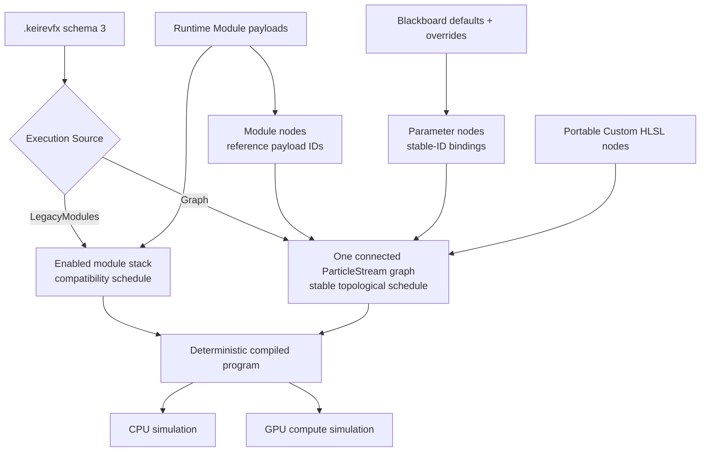
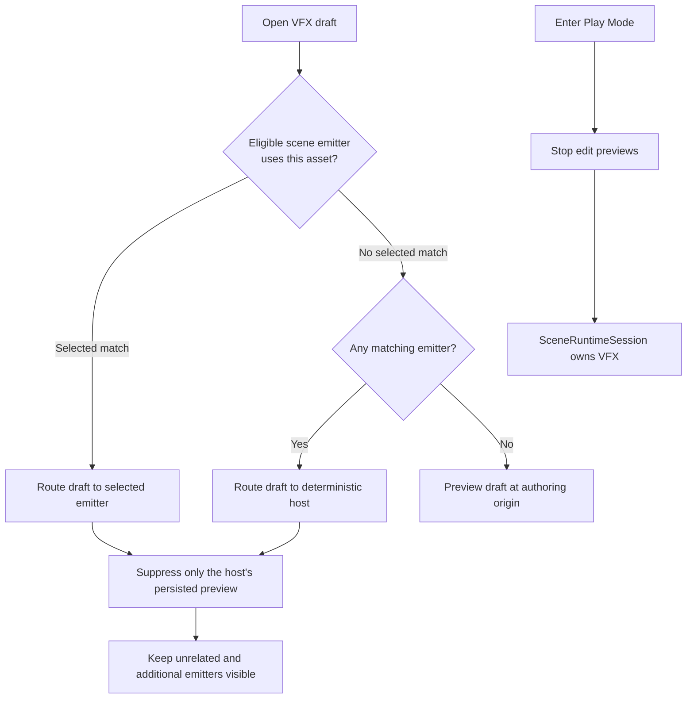
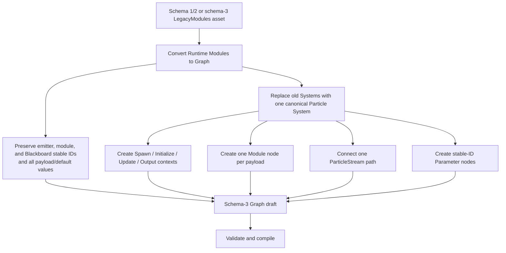
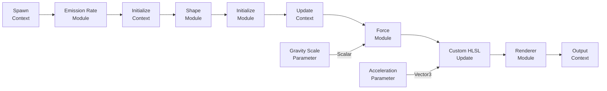
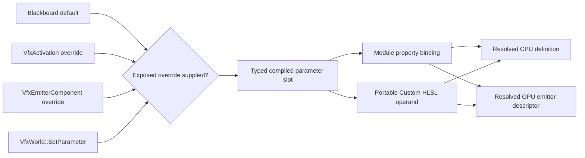
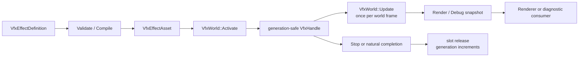
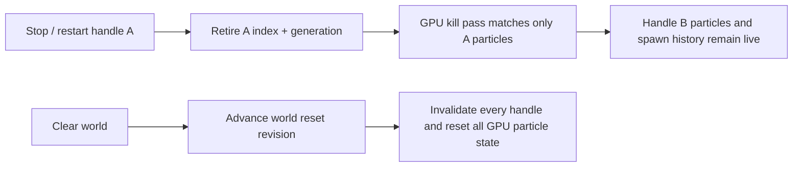

# VFX Authoring And Runtime

Kéire's VFX system combines an executable visual graph, bounded modular particle payloads, typed Blackboard
parameters, Portable Custom HLSL, scene components, native C++ control, and managed C# playback control. This guide
covers the complete supported workflow and identifies the deliberately bounded parts of the graph runtime.

Related guides cover [Scene Authoring](SceneAuthoring.md), [Rendering](Rendering.md), and
[managed Gameplay Services](Scripting/GameplayServices.md).

The execution badge in the VFX Effect panel is authoritative:

> **Schema-v3 Graph assets execute their connected graph. LegacyModules assets execute the compatibility module
> stack.** Conversion is explicit, deterministic, and undoable; merely saving an older asset does not silently change
> its behavior.

## Mental Model

Every `.keirevfx` asset contains one `Keire::VfxEffectDefinition` with four major parts and an explicit
`VfxExecutionSource`:



The graph and module payload list are related, but they are not interchangeable:

- A Graph asset has exactly one executable particle **system**. Multiple systems and Event execution are not supported.
- **Context nodes** delimit Spawn, Initialize, Update, and Output stages.
- A **Module node** references one stable Runtime Module payload. In Graph mode, an unreferenced payload does not run.
- `ParticleStream` cables establish executable flow and deterministic node order.
- A **Parameter node** references a Blackboard parameter by stable ID. Its typed cable binds a module property or
  Portable Custom HLSL input.
- A **Custom HLSL node** lowers a small, verified statement language into the same bounded instructions on CPU and GPU.
- LegacyModules mode ignores graph scheduling and directly lowers enabled module payloads for source compatibility.

## Quick Start

Use this workflow for a first effect:

1. In the Project panel, open the create menu and choose **VFX Effect**.
2. Name the asset. Kéire creates a schema-v3 Graph asset with connected Spawn, Initialize, Update, and Output contexts
   and module nodes for its default payloads.
3. Double-click the asset to open the **VFX Effect** panel.
4. Confirm the header says **EXECUTION: GRAPH**.
5. Open **Runtime Modules** to edit payload values. In Graph mode, only payloads represented by connected Module nodes
   execute.
6. In **Graph**, use **Add Node** to add Module, Blackboard, or Custom HLSL nodes and connect their typed pins.
7. Open **Effect Settings**. Choose Loop, Duration, Simulation Space, Seed, and Capacity.
8. Select **Compile**, then use the default **CPU (Authoring)** preview while tuning the effect.
9. Add a **VFX Emitter** component to a scene entity and assign the `.keirevfx` asset.
10. Enable **Preview In Edit Mode** to see the scene emitter without entering Play Mode.
11. Choose **Local** simulation space for an aura or other effect that must follow the entity. Choose **World** for
    smoke, sparks, or trails that should remain where they were emitted.
12. Enter Play Mode and verify the effect on the GPU runtime backend.

The default asset already contains an enabled Emission Rate module and Renderer, so it is valid immediately. Saving is
not required to see a transient authoring preview, but it is required to publish changes to the asset source.

## VFX Effect Panel

At a wide dock size, the Graph tab uses a three-column layout:

```text
┌ VFX GRAPH ─ Assets/Effect.keirevfx * ─ Save Discard Reload Undo Redo Compile ┐
│ PREVIEW LIVE  [Restart] [Pause] [Loop Preview] [CPU/GPU] [Speed] [Statistics]│
├ Graph ───────── Runtime Modules ───────── Blackboard ─────── Effect Settings ┤
│ ┌ Systems / Blackboard ┐ ┌──────────── Canvas ────────────┐ ┌ Inspector ┐   │
│ │ Particle System      │ │ Spawn -> Initialize -> Update │ │ Node name │   │
│ │ + Add System         │ │                  -> Output     │ │ Context   │   │
│ │ exposed properties   │ │ pan / zoom / drag / frame all │ │ Pins      │   │
│ └──────────────────────┘ └────────────────────────────────┘ │ Links     │   │
│                                                           └───────────┘   │
└────────────────────────────────────────────────────────────────────────────┘
```

When the panel is narrower than the full three-column layout, the Graph tab presents **Canvas**, **Systems**, and
**Inspector** as nested tabs. No authoring functionality is removed; it is only rearranged.

### Document Header

The header displays the asset path and appends `*` when the document contains unsaved changes.

| Control | Behavior |
| --- | --- |
| **Save** | Validates, encodes, and atomically persists the current draft. `Ctrl+S` also saves a dirty document. |
| **Discard** | Restores the last saved definition and its preview. |
| **Reload Source** | Reads the source again. Reload is skipped if unsaved local edits would be overwritten. |
| **Undo** | Reverts the most recent edit in the VFX document's undo context. |
| **Redo** | Reapplies the most recently undone edit. |
| **Compile** | Validates the current definition and produces canonical backend-tagged IR plus diagnostics. |

Edits are transactional. Kéire validates a candidate definition and its transient preview before replacing the current
draft. If validation or preview creation fails, the document keeps its last-good state. Removing a node or pin removes
its incident links in the same undoable transaction.

Compile validates and lowers the selected execution source. For Graph assets it checks canonical node shapes,
references, cable types, stage order, acyclic topology, the connected main particle stream, parameter bindings, and
Portable Custom HLSL before producing a backend-labeled program and canonical IR. `Hash` changes with program values;
`StateLayoutHash` identifies topology/layout compatibility. Runtime GPU-baked value changes can separately require a
handle-local simulation restart.

### Preview Toolbar

The preview toolbar controls the transient preview for the open VFX asset.

| Control | Behavior |
| --- | --- |
| **PREVIEW LIVE / IDLE** | Reports whether the asset-authoring preview handle is currently alive. |
| **Restart** | Stops and reactivates the open asset's transient preview. |
| **Pause / Resume** | Sets the asset preview's simulation speed to zero or restores the selected preview speed. |
| **Loop Preview** | Automatically restarts a completed asset preview. This does not edit the effect's Loop setting. |
| **Backend** | Selects **CPU (Authoring)** or **GPU (Runtime)** preview. |
| **Speed** | Scales the asset preview from `0.05` to `4.0`. |
| **Active / spawned estimate** | CPU reports active particles. GPU reports a spawn-based estimate. |
| **Dropped** | Reports particles rejected by the effect or world capacity. |

Use CPU preview for deterministic authoring and complete debug snapshots. Switch to GPU preview to inspect the current
runtime compute path before shipping. Changing backend rebuilds transient editor preview state.

The open draft and persisted scene emitter previews have coordinated presentation roles:

- Kéire first looks for an eligible scene emitter whose Effect matches the open VFX asset.
- The selected matching emitter is preferred. If selection does not provide a match, Kéire chooses the matching
  emitter with the lowest stable entity ID.
- The open draft preview handle is positioned and rotated at that host emitter. The host's persisted preview handle is
  suppressed so the same effect is not drawn twice.
- The routed draft uses the host's transform and Seed Offset, but its Pause and Speed still come from the VFX Effect
  preview toolbar. Other scene emitters use their component Simulation Speed.
- The host displays the unsaved draft definition. Additional emitters continue to display the last imported/persisted
  asset revision until the draft is saved and reimported.
- Unrelated emitters and additional matching emitters keep their own persisted previews and remain visible.
- If no eligible matching host exists, the open draft remains visible at the authoring origin.
- Pausing the draft preview does not pause other scene emitter previews.
- Hiding the VFX Effect panel stops its transient draft handle; checked scene emitters continue through their persisted
  preview handles.
- Entering Play Mode stops all edit-scene preview handles and lets the runtime scene own VFX presentation.



## Graph Workflow

The Graph tab is the executable authoring surface for schema-v3 Graph assets. It shows the current schema and execution
source in the Systems pane. If the header says **EXECUTION: LEGACY RUNTIME MODULES**, graph edits remain descriptive
until the asset is explicitly converted.

### Systems And Contexts

The left pane lists systems and node counts. The current graph compiler requires exactly one executable particle system;
one effect asset still creates one emitter. Multiple executable systems, system-to-system events, and Event contexts are
not implemented. A Graph asset therefore needs one system containing one canonical context for every supported stage:

```mermaid
flowchart LR
    Spawn["Spawn Context"] --> SpawnModules["Emission Rate / Burst nodes"]
    SpawnModules --> Initialize["Initialize Context"]
    Initialize --> InitModules["Shape / Initialize nodes"]
    InitModules --> Update["Update Context"]
    Update --> UpdateModules["Force / Size / Color / Collision nodes"]
    UpdateModules --> Renderer["Renderer node<br/>Output context"]
    Renderer --> Output["Output Context"]
    Event["Event Context"] -. "not executable" .-> Spawn
```



The context colors are consistent throughout the editor:

- Spawn: teal
- Initialize: purple
- Update: blue
- Output: orange
- Event: red

The Context enum is part of executable semantics, not just presentation. `ParticleStream` cables may stay in the same
stage or move forward from Spawn to Initialize to Update to Output; they may not travel backward. Event nodes are
persistable in LegacyModules documents, but selecting Graph execution with an Event node fails compilation.
The four canonical Graph Context nodes are structural anchors and cannot be deleted.

### Execution Source And Migration

New effects are Graph assets. Schema-v1 and schema-v2 effects always open as `LegacyModules`, even if schema-v2 contains
an older presentation graph. Saving such an effect publishes schema 3 with `executionSource: "legacyModules"` and
preserves compatibility behavior; Save alone does not opt in to cable execution.

Select **Convert Runtime Modules to Graph** in the header to migrate:



Conversion is deterministic and undoable. It replaces the previous `Systems` collection instead of trying to infer
execution from arbitrary old node names or decorative links. If an older presentation graph contains design notes you
want to retain, duplicate the asset before conversion or inspect the converted draft before saving.

There is no ambiguous automatic mode selection: `VfxExecutionSource::LegacyModules` executes enabled payloads directly,
while `VfxExecutionSource::Graph` executes only the program reachable through the validated graph.
Native import or migration tools can perform the same conversion with
`Keire::ConvertVfxEffectToGraph(legacyDefinition)`.

### Node Kinds

Use **Add Node** above the canvas in Graph mode:

| Node kind | Purpose | Executable requirements |
| --- | --- | --- |
| Context | Delimits Spawn, Initialize, Update, or Output | Canonical `ParticleStream` pins; exactly one of each supported stage |
| Module | Runs a Runtime Module payload | References one payload stable ID; canonical flow pins and property-input pins |
| Blackboard Parameter | Supplies one typed value | References a Blackboard stable ID and has one typed `value` output |
| Custom HLSL | Mutates bounded particle attributes | Flow input/output, optional typed value inputs, and valid Portable Custom HLSL |

A Module node is not a copy of its payload. The Runtime Modules tab remains the payload editor, while the graph stores
the payload's stable ID in `VfxGraphNode::Reference`. Deleting the graph node stops that payload from executing in Graph
mode; deleting the payload also makes its referencing node invalid. The same payload may not be referenced by two nodes
in the executable system.

Adding a new Runtime Module payload does not automatically place it on an existing Graph. Add the matching
**Module / ...** node; the editor transactionally splices it into the particle stream at its canonical context
boundary. Adding a Custom HLSL node similarly splices it at the selected stage. Conversely, an unreferenced payload can
remain in the asset as inactive authoring data.

### Canvas Navigation

Use the canvas controls as follows:

- Click a card to select it.
- Left-drag a card to move it. Its new graph position is committed when the drag completes.
- Middle-drag the canvas to pan.
- Use the mouse wheel to zoom.
- Click the background to clear node selection.
- Select **Frame All** to fit every card in the available canvas.

The Inspector also exposes **Graph Position** for precise placement.

### Editing A Node

Selecting a node opens its stable identity, reference where applicable, stage, graph position, typed pins, and touching
connections. Context and Custom HLSL nodes can be renamed. Module and Parameter labels come from their referenced
payload or Blackboard property so a display rename does not break the stable-ID binding.

Module node contexts and property semantics are compiler-owned and match the referenced payload type. Custom HLSL nodes
may select Spawn, Initialize, Update, or Output. Moving a card changes editor layout only; changing a stage changes
program order and must still satisfy the forward-flow rules.

Deleting a Module or Custom HLSL node removes its incident cables and reconnects its particle-stream predecessor to its
successor in the same undoable edit. Canonical Context nodes are not deletable. Parameter nodes may remain unconnected.

### Typed Pins

Each pin has:

- A stable ID
- A display name
- A `VfxValueType`
- An Input or Output direction
- A compiler semantic such as `particles`, `value`, `gravityMultiplier`, or a Custom HLSL input identifier
- An optional typed fallback for a Custom HLSL input

Available graph types are Boolean, Integer, Scalar, Vector 2, Vector 3, Color, Texture, Mesh, Asset, and
`ParticleStream`. `ParticleStream` represents execution flow; it is not a Blackboard value and has no literal default.

Context, Module, Parameter, and flow pins have canonical compiler-owned shapes. Custom HLSL value inputs are editable
and may be Scalar, Vector 2, Vector 3, or Color. Their semantic is the identifier used in source. An unconnected Custom
HLSL input uses its typed fallback; a connected input must be driven by a matching Parameter node.

Editing a Runtime Module payload refreshes its Module node's canonical property-pin defaults without replacing stable
pin IDs. Context, Module, Parameter, and stream pins are read-only; only Custom HLSL data inputs can be added, renamed,
retyped, assigned a fallback, or removed.

### Creating A Link

Links are created from an output pin to a compatible input pin:

1. Select the source node.
2. Click **Start Link** on its output pin.
3. Select the target node.
4. Find an input pin with the same value type.
5. Click **Connect Here**.

The editor disables **Connect Here** when the source is missing, direction is invalid, value types differ, or that exact
connection already exists. Connecting to an input that already has a writer replaces its old cable transactionally.
Compile additionally rejects multiple drivers in hand-authored data, cycles, backward flow, invalid node/pin ownership,
and value cables whose source is not a Parameter node. Use **Cancel Link** above the canvas to abandon an in-progress
link.

Connections touching the selected node appear under **CONNECTIONS**. Use **Remove Link** to delete one. Deleting a node
automatically deletes every connection that references it.

### Building The Main Particle Stream

Every Context, Module, and Custom HLSL node that should execute must be on one connected `ParticleStream` path from
Spawn to Output. Cables determine the schedule; screen position does not.



The compiler performs a stable topological sort; stable IDs break ties when independent parameter nodes are ready at the
same time. It then lowers enabled connected Module nodes in that order. Graph compilation still requires at least one
connected enabled Emission Rate or Burst payload and one connected enabled Renderer payload.

Built-in payload types retain their defined stage semantics: emission schedules Spawn, shape/initialization configure
creation, force/collision/curves run Update, and Renderer supplies Output. Within those constraints, cables control
reachability and deterministic Module/Custom operation order; they do not turn a payload into an arbitrary operator or
move it outside its canonical context.

Use Compile before Save. The editor's candidate-preview validation is transactional, so an invalid edit reports an
error and retains the last-good draft instead of publishing half-valid topology.

### Portable Custom HLSL

Portable Custom HLSL is a deliberately small HLSL-like statement language, not unrestricted shader source. It lowers
to verified, backend-neutral instructions and executes on both CPU and GPU. This keeps authoring deterministic and
avoids runtime shader compilation, arbitrary resource access, or backend-specific behavior.

Write semicolon-separated assignment statements:

```hlsl
Velocity += Acceleration * DeltaTime;
Position += float3(0.0, 0.25, 0.0) * DeltaTime;
Tint *= float4(1.0, 0.8, 0.5, 1.0);
Size = 0.75;
Rotation += SpinDegrees * DeltaTime;
```

`Acceleration` and `SpinDegrees` are Custom HLSL input-pin semantics. Cable those inputs from matching Parameter nodes,
or give each input a typed fallback.

The supported grammar is:

```text
Statement := Target Operator Operand [ "*" "DeltaTime" ]
Target    := Position | Velocity | Rotation | Tint | Size
Operator  := "=" | "+=" | "*="
Operand   := InputSemantic | ScalarLiteral | float2(...) | float3(...) | float4(...)
```

Statements are separated by semicolons; a newline by itself is only whitespace. The optional `* DeltaTime` must be the
trailing form shown above. Names and literal constructors are case-sensitive. `DeltaTime * value`, compound
expressions, and multiple operands are not accepted.

| Target | Native value | Accepted operand |
| --- | --- | --- |
| `Position` | `Vector3` | Scalar broadcast or `float3` / Vector3 input |
| `Velocity` | `Vector3` | Scalar broadcast or `float3` / Vector3 input |
| `Rotation` | Particle Z Euler/billboard rotation in degrees | Scalar |
| `Tint` | `Color` | Scalar broadcast or `float4` / Color input |
| `Size` | Scalar | Scalar |

Numeric literals must be finite and have magnitude at most `1,000,000`. Custom inputs may be Scalar, Vector 2,
Vector 3, or Color, but a Vector 2 operand currently has no matching writable target. Input semantics must be unique
identifier names using letters, digits, and underscores, and may not begin with a digit.

The limit is eight non-empty Custom HLSL statements across the entire effect, not eight per node. Empty programs are
invalid. The following are intentionally forbidden:

- Functions, declarations, structs, macros, `#include`, and preprocessor directives
- `if`, `switch`, loops, recursion, and function calls other than the literal forms `float2/3/4(...)`
- Textures, samplers, buffers, atomics, thread IDs, and other resource access
- Swizzles, indexing, arbitrary arithmetic expressions, and chained operators
- Writes to particle age, lifetime, identity, renderer, free lists, or emission counts
- Cables from non-Parameter value nodes

Portable instructions execute at their compiled cable position within the selected stage. Spawn, Initialize, and the
first Output evaluation run when a particle is created; Update and Output run during per-frame simulation. `DeltaTime`
is zero in creation stages and is the effect's scaled step in Update/Output. Local-space Position and Velocity writes
use local semantics on both backends.

On GPU, Custom instructions and built-in Modules execute together in cable order inside that emitter's normal spawn or
simulation dispatch. Each active emitter uses one handle-filtered simulation dispatch over the world particle
capacity, even when it owns few live particles. The cost therefore grows with
`world particle capacity × active emitters`. Keep world capacities intentional and profile scenes with many emitters.

### Current Graph Limits

Graph execution currently supports:

- One particle system with Spawn, Initialize, Update, and Output contexts
- Module payload references scheduled by `ParticleStream` cables
- Blackboard Parameter nodes bound to canonical module-property inputs
- Portable Custom HLSL nodes and typed defaults or Parameter inputs
- Deterministic CPU and GPU lowering from the same canonical program

It does not currently support multiple executable systems, Event contexts, general arithmetic/operator nodes,
subgraphs, ribbons, trails, decals, volumetric outputs, arbitrary shader HLSL, or custom GPU resources.

## Runtime Modules

The Runtime Modules tab edits module payload records. The left pane selects, adds, removes, and reorders them; the right
pane edits the selected payload.

Every module has a stable ID and an **Enabled** checkbox. A disabled module remains in the asset but is ignored by
simulation. In LegacyModules mode, enabled payloads lower directly in stack order. In Graph mode, only enabled payloads
referenced by connected Module nodes lower into the program, and cable topology supplies their deterministic order.

### Module Multiplicity

| Module type | Allowed count |
| --- | ---: |
| Emission Rate | 0 or 1 |
| Burst | 0 to 32 |
| Shape | 0 or 1 |
| Initialize | 0 or 1 |
| Forces | 0 or 1 |
| Size over Lifetime | 0 or 1 |
| Color over Lifetime | 0 or 1 |
| Collision | 0 or 1 |
| Renderer | Exactly 1 |

The effect must contain at least one enabled Emission Rate or Burst and one enabled Renderer. Removing or disabling the
last usable emission source or renderer is rejected transactionally.

### Emission Rate

Emission Rate continuously requests particles while the emitter is emitting.

| Field | Meaning |
| --- | --- |
| **Particles per Second** | Continuous rate from `0` to `1,000,000`. Fractional particles accumulate deterministically. |

For a one-shot effect driven only by bursts, remove or disable Emission Rate.

### Burst

A Burst requests a fixed number of particles at one or more times within each effect duration.

| Field | Meaning |
| --- | --- |
| **Time (s)** | First burst time. It must be at least zero and earlier than Duration. |
| **Count** | Particles requested per cycle, from `1` to `1,000,000`. |
| **Cycles** | Number of repetitions, from `1` to `1024`. |
| **Interval (s)** | Delay between cycles. It must be positive when Cycles is greater than one. |

The final cycle must occur before the effect Duration. A burst at time zero is emitted on the first non-zero update.
Looping effects repeat their bursts once per Duration.

### Shape

Shape chooses the initial particle position relative to the emitter.

| Field | Meaning |
| --- | --- |
| **Shape** | Point, Box, Sphere, Cone, Mesh, or Volume. |
| **Box Half Extent** | Positive X, Y, and Z half extents for Box emission. |
| **Radius** | Sphere radius. |
| **Cone Angle** | Cone half-angle in degrees, greater than zero and less than 90. |
| **Cone Length** | Positive Cone length. |
| **Mesh** | Mesh sampled when Shape is Mesh. |
| **Volume Asset** | Asset sampled when Shape is Volume. |

Point needs no shape data. CPU Box, Sphere, and Cone sampling are built in. CPU Mesh and Volume sampling require a
`VfxWorldSpecification::ShapeSample` callback. Without that callback, particles use the emitter origin and report
`ShapeAssetSamplerUnavailable`.

The GPU path currently supports Point, Box, and Sphere directly. Cone is an approximation and does not consume the full
authored cone parameters. GPU Mesh and Volume asset sampling are not implemented.

### Initialize

Initialize chooses each new particle's lifetime, velocity, and Euler rotation from deterministic ranges.

| Field | Meaning |
| --- | --- |
| **Lifetime Minimum / Maximum** | Ordered positive range from `0.001` to `86,400` seconds. |
| **Velocity Minimum / Maximum** | Ordered component-wise initial velocity range. |
| **Rotation Minimum / Maximum** | Ordered component-wise Euler-degree range. |

The effect seed and emitter Seed Offset determine the random sequence. Equal definitions, seeds, offsets, activation
transforms, and update deltas produce equal CPU particle results.

GPU initialization currently uses lifetime and velocity ranges. Initial rotation-range parity is incomplete.

### Forces

Forces applies acceleration during Update.

| Field | Meaning |
| --- | --- |
| **Force** | Constant authored acceleration vector. |
| **Gravity Multiplier** | Multiplier applied to Kéire's gravity vector; accepted range is `-1000` to `1000`. |

The final acceleration is the authored Force plus gravity multiplied by Gravity Multiplier.

### Size Over Lifetime

Size over Lifetime evaluates a `Curve1D` using normalized particle age:

```text
normalized age = particle age / particle lifetime
```

The CPU backend evaluates the full curve, including its keys and interpolation. Negative evaluated size is clamped to
zero. The GPU path currently publishes and interpolates the curve's values at ages zero and one; intermediate keys and
tangents do not have full parity.

The current Inspector lists each existing curve key as editable **Time** and **Value** fields. Key times remain ordered
and are clamped between their neighbors. The UI does not yet add/remove keys or expose interpolation/tangent editing;
multi-key curves created through the native asset API or existing source remain preserved and editable by value.

### Color Over Lifetime

Color over Lifetime evaluates a `ColorGradient` using normalized particle age. The CPU backend evaluates the complete
gradient. The GPU path currently interpolates the gradient values sampled at ages zero and one.

The current Inspector lists each existing gradient key as **Time** plus **Color**. Times remain ordered from zero to one.
The UI does not yet add/remove gradient keys or expose gradient interpolation selection. Use alpha in existing keys to
fade particles in or out; multi-key gradients authored through the native asset API remain preserved.

### Collision

Collision tests particle movement through the collision callback configured on the `VfxWorld`.

| Field | Meaning |
| --- | --- |
| **Mode** | None, CPU, GPU Depth, or Scene Physics. |
| **Restitution** | Bounce response from `0` to `1`. |
| **Kill on Collision** | Removes the particle at the first valid hit instead of reflecting velocity. |

The CPU implementation sends each non-None collision mode through
`VfxWorldSpecification::CollisionQuery`. A Play Mode `SceneRuntimeSession` installs a physics ray-cast query when a
physics world exists. If no query is available, the effect continues without collision and reports
`CollisionQueryUnavailable`.

True GPU depth collision and GPU scene-physics collision are not implemented by the current compute path. Use the CPU
backend when collision behavior must be inspected precisely.

### Renderer

Renderer selects particle output.

| Field | Meaning |
| --- | --- |
| **Renderer** | Sprite or Mesh. |
| **Sprite** | Texture asset retained for Sprite output. |
| **Mesh** | Mesh asset required for Mesh output. |

Both asset pickers remain visible, but only the asset selected by Renderer is used. CPU rendering supports billboarding
Sprite particles and Mesh particles. The Sprite asset reference is persisted, emitted in CPU render packets, and tracked
as a dependency, but the current built-in billboard path does not sample a custom Sprite texture yet. The GPU compute
path currently produces indirect tinted billboard output; GPU indirect Mesh output is not implemented.

## Blackboard

The Blackboard tab authors typed defaults for graph bindings and per-emitter overrides.

The left pane lists properties. Use **+ Add Property** to create one, select it to edit, and use **Remove Property** to
delete it. The Graph tab's Systems pane also provides a compact list and **+ Parameter** shortcut. Use
**Add Node / Blackboard / _Name_** to create a Parameter node for a property, then cable its output to a same-typed
Module or Custom HLSL input.

| Blackboard type | C++ default-value type |
| --- | --- |
| Boolean | `bool` |
| Integer | `std::int64_t` |
| Scalar | `float` |
| Vector 2 | `Keire::Vector2` |
| Vector 3 | `Keire::Vector3` |
| Color | `Keire::Color` |
| Texture | `Keire::AssetId` |
| Mesh | `Keire::AssetId` |
| Asset | `Keire::AssetId` |

Each property contains:

- A globally stable ID
- A unique, non-empty Name
- A Type
- A type-matching Default value
- An **Exposed** flag that controls whether activation/live overrides are accepted and whether a stored component
  override is applied

Changing Type resets Default to that type's zero value. Texture and Mesh defaults use typed asset filtering; general
Asset accepts any asset type. Asset-valued defaults participate in VFX dependency extraction and cooking.

Renaming or retyping a property updates every referencing Parameter node's output name/type. Incompatible outgoing
cables are removed in the same undoable edit. Removing a property removes its Parameter nodes and all incident cables.

Names are display-only. Parameter nodes, scene components, activation overrides, and live runtime calls all bind by the
parameter's stable `AssetId`, so renaming a property does not break its consumers. Changing or regenerating that ID does.

### Binding A Module Property

Module nodes expose canonical typed property inputs. Connect a Parameter node directly to one of these inputs:

| Module | Bindable property inputs |
| --- | --- |
| Emission Rate | Particles Per Second |
| Burst | Time, Count, Cycles, Interval |
| Shape | Box Half Extent, Radius, Cone Angle, Cone Length, Mesh, Volume |
| Initialize | Lifetime Minimum/Maximum, Velocity Minimum/Maximum, Rotation Minimum/Maximum |
| Force | Force, Gravity Multiplier |
| Size over Lifetime | Size |
| Color over Lifetime | Color |
| Collision | Restitution, Kill On Collision |
| Renderer | Sprite, Mesh |

The cable type must match exactly. Shape type, collision mode, renderer type, module Enabled, and other structural
choices are not bindable. A bound Size value replaces the authored size curve with a constant for that emitter; a bound
Color value likewise replaces the gradient with a constant. Leave those inputs unconnected when the full curve or
gradient should remain authoritative.



Hidden parameters may still drive graph bindings, but external overrides are rejected. Overrides must use a known,
Exposed stable ID and an exactly matching `VfxParameterValue` alternative. Duplicate IDs, non-finite values, unknown
IDs, hidden parameters, and type mismatches are rejected transactionally by direct `VfxWorld` APIs.

### Scene-Component Overrides

`VfxEmitterComponent` stores overrides with the scene and synchronizes them into Edit Mode and Play Mode instances.
Use the native component API for typed authoring:

```cpp
#include <Keire/Core.h>

void ConfigureAura(Keire::VfxEmitterComponent& emitter, const Keire::AssetId intensityParameter,
                   const Keire::AssetId tintParameter)
{
    emitter.SetParameterOverride({intensityParameter, 48.0F});
    emitter.SetParameterOverride({tintParameter, Keire::Color{0.2F, 0.6F, 1.0F, 1.0F}});

    // Remove one value to reveal the asset default again.
    (void)emitter.RemoveParameterOverride(intensityParameter);

    // Or reset every serialized override.
    emitter.ClearParameterOverrides();
}
```

The component schema stores a bounded canonical stable-ID array in its `Parameter Overrides` text property. In the
scene Inspector, assign an effect and use the generated type-appropriate controls for its Exposed parameters. Each
active override shows the authored default and a **Reset** action. Overrides whose stable ID was removed, hidden, or
changed to an incompatible type remain visible as stale entries until **Remove** is selected. Scene loading and preview
synchronization apply only overrides that are still known, Exposed, and type-compatible with the assigned effect.
Asset-valued component overrides participate in scene dependency extraction and cooking.

The managed C# VFX service currently exposes playback controls, not Blackboard mutation. Use native component/world
APIs for parameter changes in this milestone.

## Effect Settings

Effect Settings control the emitter-level simulation contract.

| Setting | Meaning |
| --- | --- |
| **Emitter ID** | Stable identity used to decide whether a revision can preserve live state. It is displayed, not edited. |
| **Name** | Non-empty authored effect name, at most 128 UTF-8 bytes. |
| **Loop** | Repeats emission across successive Duration periods. |
| **Duration (s)** | Emission period from `0.001` to `3600` seconds. |
| **Simulation Space** | Local or World particle coordinates. |
| **Deterministic Seed** | Base `std::uint32_t` random seed. |
| **Capacity** | Per-effect live-particle budget from `1` to `1,000,000`. |

Loop controls the effect itself. **Loop Preview** in the toolbar is a separate transport option that can repeatedly
reactivate a completed non-looping asset preview.

### Local Versus World Space

Simulation Space determines what happens to particles that are already alive when the emitter moves.

```text
LOCAL SPACE

Before move:  emitter ★  • • •
After move:                         emitter ★  • • •

Existing particles are stored relative to the emitter and follow its current position/rotation.


WORLD SPACE

Before move:  emitter ★  • • •
After move:   • • •                         emitter ★  •

Existing particles stay where they spawned. New particles use the new position/rotation.
```

Use Local for:

- Character auras
- Weapon glows
- Engine exhaust that must remain attached
- Effects whose complete particle field should follow a parent

Use World for:

- Smoke left behind by a moving object
- Sparks and debris
- Rain or environmental volumes
- Trails built from ordinary particles

In Play Mode and direct runtime use, seeing particles at both the old and new locations after moving a World-space
emitter is expected: old particles remain until their lifetime expires while new particles spawn at the moved emitter.

Edit Mode deliberately favors clear placement authoring. When a gizmo edit changes the position or rotation of a
World-space preview emitter, Kéire restarts that emitter's preview at the new transform. The old cloud is removed instead
of remaining beside the newly positioned cloud. Local-space previews update their transform without needing that
World-space discontinuity restart.

Use Play Mode when the goal is to inspect the runtime trail left by a moving World-space emitter. Use Local space when
following is the intended runtime behavior.

`VfxActivation` and scene synchronization carry position and rotation only. Entity scale does not scale the VFX shape,
particle size, or velocity. Author dimensions explicitly in the Shape, Initialize, and Size over Lifetime modules.

Local-space particles follow `SetTransform` on both backends. The GPU renderer applies the emitter's rigid
position/rotation delta to that handle's existing particle positions, velocities, and accelerations before simulation;
particles belonging to other handles are untouched. Scale is not part of the VFX transform contract on either backend.

### Determinism

The runtime combines the asset and component seeds as:

```text
effective seed = effect Seed XOR emitter Seed Offset
```

Use the same Seed Offset for repeatable copies or different offsets for deterministic variation. A combined zero seed
is replaced internally with a fixed non-zero random state.

## VFX Emitter Component

Add **VFX Emitter** from the Effects component category. A Transform component is required and is added or enforced by
the component registry.

| Inspector field | Meaning and current status |
| --- | --- |
| **Effect** | Typed reference to a `.keirevfx` asset. |
| **Play On Awake** | Automatically activates the effect in Play Mode. It does not gate edit-mode preview. |
| **Auto Destroy** | Destroys the entire runtime entity after its effect handle finishes. |
| **Simulation Speed** | Per-emitter speed from `0` to `8`; zero pauses simulation. |
| **Seed Offset** | Per-emitter deterministic variation. |
| **Quality Tier** | Low, Medium, High, or Cinematic. Persisted, but not consumed by runtime policy yet. |
| **Culling Mode** | Automatic, Fixed Bounds, or Always Simulate. Persisted, but not consumed by runtime culling yet. |
| **Bounds Center** | Authored culling center. Validated and persisted, but not consumed yet. |
| **Bounds Extent** | Positive authored culling extents. Validated and persisted, but not consumed yet. |
| **Preview In Edit Mode** | Enables transient preview for this scene emitter outside Play Mode. |
| **Parameter Overrides** | Typed controls for the assigned effect's Exposed Blackboard parameters, with default reset and stale-entry cleanup; serialized canonically by stable ID. |

### Edit-Mode Eligibility

A scene emitter is previewed only while all of these are true:

- An editing scene is available.
- The entity is active in its hierarchy.
- The VFX Emitter component is enabled.
- Preview In Edit Mode is checked.
- Effect references a valid asset ID.
- The effect is available as the open matching draft or as a successfully loaded persisted asset revision.
- The entity's world transform can be decomposed into finite position and rotation.

The editor synchronizes scene identity, entity identity, effect and revision, compatible parameter overrides, seed
offset, simulation speed, enabled state, and world position/rotation. It routes the open draft to one selected or
deterministic matching host and suppresses only that host's persisted duplicate. It also restarts a World-space edit
preview when an authored position/rotation change would otherwise leave an old particle cloud behind. It stops the
preview when the emitter is unchecked, disabled, deleted, moved to a different scene, or superseded by Play Mode.

On the GPU preview backend, that restart is handle-scoped. The renderer retires only particles carrying the restarted
handle's index and generation, so moving one World-space editor emitter does not clear, replay, or blink unrelated
emitters in the shared editor world.

### Play Mode

Play Mode clones the edit scene and creates a scene-owned `Keire::VfxWorld`. Every active, enabled VFX Emitter with
Play On Awake and a loaded Effect receives a runtime handle. The session synchronizes effect revisions, world
position/rotation, compatible parameter overrides, Seed Offset, and Simulation Speed.

The current scene session selects the GPU backend when it is constructed with an Asset System and the bounded CPU
backend for its headless compatibility configuration. Use a directly owned `VfxWorld` when a tool or test needs an
explicit backend choice.

Non-looping effects remain alive after emission stops until their final particle dies. If Auto Destroy is checked, the
runtime scene destroys the entire entity after that handle finishes. Do not enable Auto Destroy on a persistent player,
camera, or gameplay entity merely to clean up a one-shot effect. Put disposable effects on disposable child entities.

Looping effects do not finish naturally, so Auto Destroy does not run until playback is explicitly stopped or the
effect becomes non-looping.

## Managed C# Usage

The managed API defines the typed `VfxEffect` asset marker, entity-scoped `VfxEmitterHandle`, and static `Vfx` service
in the `Keire` namespace.

### Serialized Effect And Playback

```csharp
using Keire;

namespace MyGame;

[StableComponentId("aef16be3-bf65-47f9-93f1-d62553a409f4")]
public sealed class ImpactVfx : Behaviour
{
    [SerializeField, StableFieldId("813ae003-fd0d-4e5b-b277-c309ba07f289")]
    private AssetReference<VfxEffect> _impact;

    private VfxEmitterHandle _emitter;

    public void PlayImpact()
    {
        if (!_impact.IsValid)
        {
            Debug.Warn("Impact VFX is not assigned.");
            return;
        }

        _emitter = Vfx.Play(Entity, _impact, restart: true);
        if (!_emitter.IsValid)
            Debug.Warn("VFX playback request was rejected.");
    }

    public void PauseImpact()
    {
        if (!_emitter.Pause())
            Debug.Warn("VFX pause was rejected.");
    }

    public void ResumeImpact()
    {
        if (!_emitter.Resume())
            Debug.Warn("VFX resume was rejected.");
    }

    protected override void OnDisable()
    {
        _emitter.Stop();
    }
}
```

`Vfx.Play` validates the entity and effect, then asks the runtime scene to create or configure a VFX Emitter on that
entity. A valid returned `VfxEmitterHandle` means the request was accepted. Asset loading is asynchronous, so
`handle.IsAlive` may remain false until the native effect instance activates.

### Managed API Reference

```csharp
VfxEmitterHandle handle = Vfx.Play(entity, effectReference);
VfxEmitterHandle restarted = Vfx.Play(entity, effectReference, restart: true);

bool paused = Vfx.Pause(entity);
bool resumed = Vfx.Resume(entity);
bool alive = Vfx.IsAlive(entity);
bool stopped = Vfx.Stop(entity);

bool handleAlive = handle.IsAlive;
handle.Pause();
handle.Resume();
handle.Restart(effectReference);
handle.Stop();
```

Important behavior:

- `VfxEmitterHandle.IsValid` requires a valid entity that has a VFX Emitter component.
- The managed handle is entity-scoped. The lower-level native `Keire::VfxHandle` contains the generation used to reject
  stale pooled handles.
- `Restart` requires the effect because it can replace the emitter's current Effect.
- Pause sets Simulation Speed to zero.
- Resume currently restores Simulation Speed to `1.0`, not an earlier custom speed.
- Stop disables automatic playback and releases the runtime instance but leaves the component attached.
- Calling `Vfx.Play` with an invalid entity or effect throws `ArgumentException`.

## Native C++ Scene Usage

The public native VFX API is exported through `<Keire/Core.h>`.

### Configure A Scene Component

```cpp
#include <Keire/Core.h>

#include <stdexcept>

namespace MyGame
{
    void ConfigureVfxEmitter(Keire::Entity entity, const Keire::AssetId effect)
    {
        auto emitter = entity.GetComponent<Keire::VfxEmitterComponent>();
        if (!emitter)
            emitter = entity.AddComponent<Keire::VfxEmitterComponent>();

        if (!emitter)
            throw std::runtime_error("The VFX Emitter could not be added.");

        emitter->SetEffect(effect);
        emitter->SetPlayOnAwake(true);
        emitter->SetAutoDestroy(false);
        emitter->SetSimulationSpeed(1.0F);
        emitter->SetSeedOffset(17);
        emitter->SetQuality(Keire::VfxQualityTier::High);
        emitter->SetCulling(Keire::VfxCullingMode::Automatic);
        emitter->SetBounds({}, {5.0F, 5.0F, 5.0F});
        emitter->SetEditModePreview(false);
    }
} // namespace MyGame
```

These setters call the component change notification and validate bounded values. Editing-scene mutations become
persistent only through the normal scene-document save workflow.

### Control A Running Scene Session

`SceneRuntimeSession` controls VFX on the runtime-scene clone:

```cpp
#include <Keire/Core.h>

#include <stdexcept>

namespace MyGame
{
    void PlayImpact(const Keire::Ref<Keire::SceneRuntimeSession>& session, const Keire::EntityId entity,
                    const Keire::AssetId effect)
    {
        if (!session || session->State() == Keire::ScenePlayState::Stopped)
            throw std::runtime_error("A playing scene session is required.");

        if (!session->PlayVfx(entity, effect, true))
            throw std::runtime_error("VFX playback was rejected.");
    }

    void PauseImpact(const Keire::Ref<Keire::SceneRuntimeSession>& session, const Keire::EntityId entity)
    {
        if (!session->PauseVfx(entity, true))
            throw std::runtime_error("VFX pause was rejected.");
    }

    [[nodiscard]] bool ImpactIsAlive(const Keire::Ref<Keire::SceneRuntimeSession>& session,
                                     const Keire::EntityId entity)
    {
        return session && session->IsVfxAlive(entity);
    }

    void StopImpact(const Keire::Ref<Keire::SceneRuntimeSession>& session, const Keire::EntityId entity)
    {
        if (session)
            (void)session->StopVfx(entity);
    }
} // namespace MyGame
```

`PlayVfx` creates a VFX Emitter when the runtime entity does not already have one, sets Effect, enables Play On Awake,
restores Simulation Speed to `1.0`, and enables the component. Passing `restart = true` first releases any current
runtime instance. `IsVfxAlive` becomes true only after an actual native `VfxHandle` is active.

Scene runtime operations belong to the session's owning application thread.

## Direct Native `VfxWorld` Usage

Most gameplay should use `VfxEmitterComponent` or `SceneRuntimeSession`. A rendering subsystem, headless tool, or focused
test can own a `VfxWorld` directly.



### Build A Parameter Binding In C++

The graph schema is public through `<Keire/Core.h>`. This example adds an exposed Scalar parameter and connects its
Parameter node to the default Emission Rate Module node:

```cpp
#include <Keire/Core.h>

#include <algorithm>
#include <optional>
#include <stdexcept>
#include <string>
#include <utility>
#include <variant>

namespace MyGame
{
    // One-time authoring helper: encode and save the result so generated graph IDs remain stable.
    [[nodiscard]] Keire::VfxEffectDefinition MakeRateControlledEffect(const Keire::AssetId rateParameter)
    {
        auto definition = Keire::VfxEffectAsset::DefaultDefinition();
        definition.Name = "Rate Controlled";
        definition.Blackboard.push_back(
            {.Id = rateParameter,
             .Name = "Spawn Rate",
             .Type = Keire::VfxValueType::Scalar,
             .DefaultValue = 24.0F,
             .Exposed = true});

        auto& system = definition.Systems.front();
        const auto emission = std::ranges::find_if(
            definition.Modules, [](const Keire::VfxModuleDefinition& module)
            { return std::holds_alternative<Keire::VfxEmissionRateModule>(module.Payload); });
        if (emission == definition.Modules.end())
            throw std::runtime_error("The effect has no Emission Rate payload.");

        const auto emissionNode =
            std::ranges::find(system.Nodes, emission->Id, &Keire::VfxGraphNode::Reference);
        if (emissionNode == system.Nodes.end())
            throw std::runtime_error("The Emission Rate payload is not represented in the graph.");

        const auto rateInput =
            std::ranges::find(emissionNode->Pins, std::string("particlesPerSecond"), &Keire::VfxGraphPin::Semantic);
        if (rateInput == emissionNode->Pins.end())
            throw std::runtime_error("The Emission Rate node has no canonical rate input.");
        const auto emissionNodeId = emissionNode->Id;
        const auto rateInputId = rateInput->Id;

        Keire::VfxGraphNode parameterNode;
        parameterNode.Id = Keire::AssetId::Generate();
        parameterNode.Type = "Spawn Rate";
        parameterNode.Context = Keire::VfxContextType::Spawn;
        parameterNode.EditorPosition = {-280.0F, -120.0F};
        parameterNode.Kind = Keire::VfxGraphNodeKind::Parameter;
        parameterNode.Reference = rateParameter;
        parameterNode.Pins.push_back({Keire::AssetId::Generate(),
                                      "Spawn Rate",
                                      Keire::VfxValueType::Scalar,
                                      false,
                                      "value",
                                      std::nullopt});

        const auto parameterNodeId = parameterNode.Id;
        const auto parameterPinId = parameterNode.Pins.front().Id;
        system.Nodes.push_back(std::move(parameterNode));
        system.Connections.push_back({Keire::AssetId::Generate(),
                                      parameterNodeId,
                                      parameterPinId,
                                      emissionNodeId,
                                      rateInputId});

        Keire::ValidateVfxEffect(definition);
        return definition;
    }
} // namespace MyGame
```

Stable IDs are serialized program identity. Generate them once while authoring and keep them in the saved asset; do not
regenerate IDs each time a source-built definition loads.

### Create, Activate, Update, And Stop

```cpp
#include <Keire/Core.h>

#include <stdexcept>
#include <string>
#include <utility>

namespace MyGame
{
    class StandaloneVfx final
    {
      public:
        StandaloneVfx()
        {
            auto definition = Keire::VfxEffectAsset::DefaultDefinition();
            definition.Name = "Standalone Sparks";
            definition.Space = Keire::VfxSimulationSpace::World;
            definition.Seed = 42;
            definition.Capacity = 2048;

            const auto compiled = Keire::CompileVfxEffect(definition, Keire::VfxBackend::Cpu);
            if (!compiled.Valid)
            {
                const auto message =
                    compiled.Diagnostics.empty() ? std::string("VFX compilation failed.")
                                                 : compiled.Diagnostics.front().Message;
                throw std::runtime_error(message);
            }

            m_Effect = Keire::CreateRef<Keire::VfxEffectAsset>(std::move(definition));
            m_World = Keire::CreateRef<Keire::VfxWorld>(
                Keire::VfxWorldSpecification{
                    .MaximumEffects = 64,
                    .MaximumParticles = 65'536,
                    .Backend = Keire::VfxBackend::Cpu,
                });

            m_Handle = m_World->Activate(
                {.Effect = m_Effect,
                 .Revision = 1,
                 .Position = {0.0F, 1.0F, 0.0F},
                 .Rotation = {},
                 .SeedOffset = 7});
            if (!m_Handle)
                throw std::runtime_error("The VFX world effect budget is exhausted.");
        }

        void Update(const float deltaSeconds, const Keire::Vector3 position, const Keire::Quaternion rotation)
        {
            if (!m_World->IsAlive(m_Handle))
                return;

            m_World->SetTransform(m_Handle, position, rotation);
            m_World->Update(deltaSeconds);
            m_RenderSnapshot = m_World->CaptureRenderSnapshot();
        }

        void Stop()
        {
            m_World->Stop(m_Handle);
            m_Handle = {};
        }

        [[nodiscard]] const Keire::VfxRenderSnapshot& RenderSnapshot() const noexcept
        {
            return m_RenderSnapshot;
        }

      private:
        Keire::Ref<const Keire::VfxEffectAsset> m_Effect;
        Keire::Ref<Keire::VfxWorld> m_World;
        Keire::VfxHandle m_Handle;
        Keire::VfxRenderSnapshot m_RenderSnapshot;
    };
} // namespace MyGame
```

The renderer consumes the immutable `VfxRenderSnapshot`. CPU snapshots contain `VfxRenderParticle` values. GPU
snapshots contain compact `VfxGpuEmitter` work descriptors and cumulative spawn sequences; the renderer owns the
persistent GPU particle buffers. Call `VfxWorld::Update` once per owning world frame, not once per active handle.
`Revision()` identifies any snapshot-visible change, while `SimulationStepRevision()` advances only after a positive
`Update`. The GPU renderer applies lifecycle, transform, restart, and spawn-sequence changes from each new snapshot, but
consumes a simulation delta only once per Simulation Step Revision. A newer mutation-only snapshot rebuilds the alive
index with a zero delta. Replaying an equal or stale snapshot leaves persistent GPU buffers unchanged, so it cannot
advance or hide newer particles.

### `VfxWorldSpecification`

| Field | Default | Meaning |
| --- | ---: | --- |
| `MaximumEffects` | 256 | Number of simultaneously allocated effect slots. |
| `MaximumParticles` | 65,536 | Global particle budget. |
| `Backend` | CPU | CPU particle storage or GPU emitter-work publication. |
| `CollisionQuery` | Empty | Optional segment query for CPU collision. |
| `ShapeSample` | Empty | Optional Mesh/Volume asset sampler for CPU initialization. |

Construction rejects zero capacities, more than `1,000,000` effects, or more than `10,000,000` particles.

### Activation And Handles

`VfxActivation` contains:

- `Ref<const VfxEffectAsset> Effect`
- Non-zero `Revision`
- Finite Position
- Finite, non-zero Rotation
- Seed Offset
- Optional `std::vector<VfxParameterOverride>` values keyed by exposed Blackboard stable ID

The world normalizes Rotation and retains the Effect reference for the active slot. `Activate` throws for invalid
activation data. It returns an empty handle, increments `DroppedEffects`, and leaves the world unchanged when no effect
slot is available.

`VfxHandle` contains a pool index and generation:

- `IsAlive` returns false for empty, stale, out-of-range, or released handles.
- `Stop` is idempotent for stale handles.
- `SetTransform` and `SetSimulationSpeed` throw for a stale handle.
- Reusing a pool index increments its generation so an old handle cannot target the new effect.

### Activation And Live Parameter Overrides

Supply initial values in `VfxActivation::ParameterOverrides`, or mutate a live handle without restarting it:

```cpp
#include <Keire/Core.h>

#include <array>
#include <cstdint>
#include <stdexcept>
#include <utility>

namespace MyGame
{
    [[nodiscard]] Keire::VfxHandle StartParameterizedEffect(
        const Keire::Ref<Keire::VfxWorld>& world, Keire::Ref<const Keire::VfxEffectAsset> effect,
        const std::uint64_t revision, const Keire::AssetId rateParameter, const Keire::AssetId tintParameter)
    {
        const auto handle = world->Activate(
            {.Effect = std::move(effect),
             .Revision = revision,
             .Position = {},
             .Rotation = {},
             .SeedOffset = 0,
             .ParameterOverrides = {
                 {rateParameter, 40.0F},
                 {tintParameter, Keire::Color{1.0F, 0.35F, 0.1F, 1.0F}},
             }});
        if (!handle)
            throw std::runtime_error("The VFX world effect budget is exhausted.");

        world->SetParameter(handle, rateParameter, 72.0F);
        world->ResetParameter(handle, tintParameter);

        const std::array replacements{
            Keire::VfxParameterOverride{rateParameter, 16.0F},
            Keire::VfxParameterOverride{tintParameter, Keire::Color{0.2F, 0.8F, 1.0F, 1.0F}},
        };
        world->SetParameterOverrides(handle, replacements);
        return handle;
    }
} // namespace MyGame
```

`SetParameter` adds or replaces one override. `ResetParameter` removes one override so the asset default becomes
visible again. `SetParameterOverrides` replaces the complete override set as one transaction. All three require a live
handle. An unknown, hidden, duplicate, or type-mismatched parameter rejects the candidate and leaves the previous
resolved values intact.

Parameter changes immediately rebuild that handle's resolved module values and Portable Custom HLSL operands. They do
not change the source asset or another handle using the same asset. Emission and creation properties affect future
work. CPU simulation reads resolved Force, Size, Color, and Collision module values on later updates. The GPU path
bakes Force, size/color endpoints, and Renderer data into particles when they spawn; changing one of those values
advances only that handle's GPU simulation revision and retires its prior particles so stale baked state is not mixed
with the new value. Other creation-property changes affect future GPU particles. Portable Custom HLSL Update/Output
operands are resolved per emitter and affect existing particles on both backends without a handle restart.

On `Reload`, compatible overrides with the same stable ID, exact type, and Exposed status are preserved. Removed,
hidden, or type-changed parameters fall back to the new asset and set
`VfxRuntimeDiagnostic::ParameterOverrideRejected`. Program layout changes can restart that handle's simulation while
value-only changes preserve compatible state except for GPU-baked Force, Size, Color, or Renderer changes, which
intentionally restart only that GPU handle.

### Handle-Scoped GPU Lifetime

`VfxWorld` can be shared by many emitters. `Stop(handle)`, an explicit stop-then-activate restart, and natural completion
retire only the affected GPU handle generation. An incompatible `Reload` keeps the public handle alive but advances its
per-handle simulation revision. In both cases, the renderer kills only particles whose stored handle index and
generation match the affected instance and preserves every unrelated emitter in the world.



`Clear()` is intentionally different: it is the world-wide operation. It invalidates every handle, advances the GPU
world reset revision, and causes all persistent particle and per-emitter tracking for that world to be rebuilt. Use
`Stop` for an individual effect and reserve `Clear` for scene teardown or an intentional whole-world reset.

### Simulation Speed And Update

`SetSimulationSpeed` accepts a finite value from `0` to `8`. Zero pauses both emission and particle aging for that
handle. `VfxWorld::Update` accepts a finite delta from `0` to `10` seconds. A zero update is inert.

Non-looping CPU effects stop emitting at Duration and remain alive until their last CPU particle dies. Non-looping GPU
effects remain alive through their estimated last-particle death time before releasing their generation-safe handle.

### Revision-Aware Reload

```cpp
const bool reloaded = world->Reload(handle, newerEffect, newerRevision);
```

Reload returns false when:

- The handle is stale
- The effect reference is empty
- The revision is not newer than the active revision

When the old and new definitions have the same Emitter ID and compiled `StateLayoutHash`, the runtime preserves elapsed
time and compatible live particles; the CPU backend also trims particles if Capacity shrank. On GPU, compatible reload
also requires unchanged baked Force, Size, Color, and Renderer state. Changing the Emitter ID, Simulation Space, Seed,
renderer representation/type, graph schedule, parameter layout, binding layout, portable instruction shape, or GPU-baked
state resets emission and random state for the affected handle. CPU particles owned by an incompatible handle are
released immediately. On GPU, the handle's simulation revision advances, so the next render preparation kills only
particles belonging to that handle and resets only its spawn tracking. Other handles in the shared world keep their
particles and progress.

### Render, Debug, And Statistics APIs

| API | Use |
| --- | --- |
| `Statistics()` | Aggregate active effects/particles and dropped effect/particle counts. |
| `CopyRenderPackets(span)` | Copies bounded CPU `VfxRenderParticle` values and reports written/dropped counts. GPU worlds have no CPU particles to copy. |
| `CaptureRenderSnapshot(maximumParticles)` | Immutable CPU render particles or GPU emitter work for rendering. |
| `CaptureDebugSnapshot()` | Bounded effect and CPU particle samples plus diagnostics. |
| `Clear()` | Performs a world-wide reset: stops every effect, releases every particle, and invalidates all handles. |

`VfxRenderSnapshot::MaximumParticles` is `65,536`. `VfxDebugSnapshot` samples at most 256 effects and 2,048 CPU
particles, recording how many samples could not fit. GPU debug effect entries report spawn-based particle estimates and
do not include per-particle CPU samples. The world's aggregate ActiveParticles value is authoritative for CPU storage,
not an exact GPU alive-particle query.

## Collision And Shape Callbacks

Standalone CPU worlds can install collision and asset-shape callbacks:

```cpp
#include <Keire/Core.h>

#include <cstdint>
#include <optional>

[[nodiscard]] Keire::VfxWorldSpecification MakeVfxWorldSpecification()
{
    Keire::VfxWorldSpecification specification;
    specification.CollisionQuery =
        [](const Keire::Vector3 start, const Keire::Vector3 end) -> std::optional<Keire::VfxCollisionHit>
    {
        if (start.Y < 0.0F || end.Y >= 0.0F || start.Y == end.Y)
            return std::nullopt;

        const float time = start.Y / (start.Y - end.Y);
        const Keire::Vector3 position{
            start.X + (end.X - start.X) * time,
            0.0F,
            start.Z + (end.Z - start.Z) * time,
        };
        return Keire::VfxCollisionHit{position, {0.0F, 1.0F, 0.0F}};
    };
    specification.ShapeSample =
        [](const Keire::AssetId shapeAsset,
           const std::uint32_t randomValue) -> std::optional<Keire::Vector3>
    {
        if (!shapeAsset)
            return std::nullopt;

        const float unit = static_cast<float>(randomValue & 0xffffU) / 65535.0F;
        return Keire::Vector3{unit - 0.5F, 0.0F, 0.0F};
    };
    return specification;
}
```

The example ShapeSample returns a simple deterministic line sample. A production callback should resolve `shapeAsset`
and sample the corresponding mesh surface or volume. Callbacks must return finite values. The runtime contains callback
exceptions and invalid results, marks the effect diagnostic, and continues safely. A collision normal is normalized
before reflection.

`SceneRuntimeSession` installs its physics ray-cast collision query when a Physics world is available. It does not
currently install a Mesh/Volume ShapeSample callback.

## Diagnostics

### Compile Diagnostics

`Keire::CompileVfxEffect` returns `Keire::VfxCompiledProgram`:

- `Valid` reports whether schema validation and lowering succeeded.
- `Hash` is a deterministic byte hash of canonical executable IR, including current defaults and payload values.
- `StateLayoutHash` identifies topology/layout compatibility for revision-aware reload.
- `Backend` records the requested backend.
- `CanonicalIr` stores the lowered execution source, parameters, payload references, bindings, custom instructions,
  and interleaved operation schedule.
- `Parameters` contains stable-ID slots and typed defaults.
- `Modules` contains the connected, enabled Runtime Module payload references.
- `Bindings` maps parameter slots to canonical module properties.
- `CustomInstructions` contains verified Portable Custom HLSL operations.
- `Operations` is the authoritative cable-ordered Module/Custom execution schedule.
- `Diagnostics` contains Information, Warning, or Error entries with optional node/module stable IDs.

Both backends compile the same graph and Portable Custom HLSL semantics. CPU compilation warns when GPU Depth collision
must degrade to the configured CPU collision query. Structural graph, binding, and portable-language errors set
`Valid` to false and are returned as Error diagnostics instead of partially executing the program. Bound Blackboard
defaults are resolved during compilation and must leave every affected module within its normal validation range.

### Runtime Diagnostics

Each `VfxDebugEffect` contains a `VfxRuntimeDiagnostic` bit field. Test flags with
`Keire::HasVfxDiagnostic`.

| Flag | Meaning |
| --- | --- |
| `GpuDepthFellBackToCpu` | GPU Depth was requested but true GPU depth collision is unavailable in the selected compatibility path. |
| `ScenePhysicsSelectedCpu` | Scene Physics collision requires the CPU collision-query path. |
| `CollisionQueryUnavailable` | Collision was requested but no query was installed, the callback failed, or it returned invalid data. |
| `ShapeAssetSamplerUnavailable` | Mesh/Volume sampling had no usable shape sampler. |
| `SimulationValueInvalid` | Non-finite particle state was detected; affected particles are dropped safely. |
| `ParameterOverrideRejected` | Reload discarded an override whose stable ID, Exposed status, or type no longer matches. |

Example:

```cpp
#include <Keire/Core.h>

#include <cstddef>

[[nodiscard]] bool HasMissingCollisionQuery(const Keire::Ref<Keire::VfxWorld>& world)
{
    if (!world)
        return false;

    const auto snapshot = world->CaptureDebugSnapshot();
    for (std::size_t index = 0; index < snapshot.EffectCount; ++index)
    {
        const auto diagnostics = snapshot.Effects[index].Diagnostics;
        if (Keire::HasVfxDiagnostic(diagnostics, Keire::VfxRuntimeDiagnostic::CollisionQueryUnavailable))
            return true;
    }
    return false;
}
```

### Dropped Counts

`VfxWorldStatistics::DroppedEffects` increases when `MaximumEffects` is exhausted.
`VfxWorldStatistics::DroppedParticles` increases when:

- An effect reaches its Capacity
- The CPU world reaches `MaximumParticles`
- A newly spawned or simulated particle produces a non-finite position, velocity, rotation, tint, or size

`VfxRenderPacketCopyResult::Dropped`, `VfxRenderSnapshot::DroppedParticles`, and the debug snapshot's dropped-sample
fields separately report values that did not fit their requested presentation or sampling bounds. Those truncation
counts do not mutate the world's aggregate dropped-particle statistic.

Treat sustained dropped counts as content or budget problems, not normal output.

## CPU And GPU Capability Matrix

The GPU backend is a runtime acceleration path, not a promise that every authored field has CPU parity.

| Feature | CPU backend | GPU backend |
| --- | --- | --- |
| Emission Rate and Burst scheduling | Yes | Yes, published as cumulative spawn work |
| Point / Box / Sphere shape | Yes | Yes |
| Cone shape | Full authored CPU cone | Approximation; full cone fields are not consumed |
| Mesh / Volume shape | With `ShapeSample` callback | Not implemented |
| Lifetime and velocity ranges | Yes | Yes |
| Initial rotation ranges | Yes | Incomplete |
| Forces and gravity | Yes | Yes |
| Size curve | Full curve | Age-zero to age-one values |
| Color gradient | Full gradient | Age-zero to age-one values |
| Collision callback | Yes | No compute collision |
| Sprite output | Tinted billboard; Sprite ID is retained but custom texture sampling is not wired | Indirect tinted billboard; custom texture sampling is not wired |
| Mesh particle output | Yes | No indirect Mesh output |
| Local-space following | Yes | Yes; rigid position/rotation changes transform existing particles |
| Per-handle stop, restart, and incompatible-reload isolation | Yes | Yes; matching handle generation only |
| Exact active particle count | Yes | Spawn-based estimate |
| Per-particle debug samples | Yes | No |
| Schema-v3 Graph cable scheduling | Yes | Yes |
| Module-property Blackboard binding | Yes | Yes |
| Activation/component/live parameter overrides | Yes | Yes |
| Live module override on existing particles | Update modules are read on later CPU steps | Force/Size/Color/Renderer changes restart only that handle; other creation fields affect future particles |
| Portable Custom HLSL | Yes; bounded instructions run in cable order inside particle loops | Yes; cable-ordered Module and Custom operations share the per-emitter spawn/simulation dispatches |
| Event contexts | No | No |
| Multiple executable graph systems | No | No |
| Arbitrary shader HLSL/resources | No | No |

Author and diagnose on CPU, then deliberately verify the effect on GPU. If a required feature is absent from the GPU
column, keep that effect on a supported compatibility path until parity is implemented.

## Production Recipes

### Continuous Smoke

1. Enable Loop.
2. Set Duration to a convenient repeat period such as `2`.
3. Use Emission Rate at a moderate rate.
4. Use Sphere or Cone Shape.
5. Initialize with upward velocity and a multi-second lifetime.
6. Add a small Force and Gravity Multiplier near zero.
7. Fade alpha to zero in Color over Lifetime.
8. Grow Size over Lifetime.
9. Use World space so smoke remains behind a moving source.

### Character Aura

1. Enable Loop and Emission Rate.
2. Use Sphere Shape around the character.
3. Use low velocity and a short lifetime.
4. Choose Local space so every active particle follows the character.
5. Disable Auto Destroy on the character.
6. Use different Seed Offsets for deterministic visual variation between characters.

### One-Shot Impact

1. Disable Loop.
2. Add an enabled Burst at time zero.
3. Remove or disable Emission Rate after the Burst exists.
4. Keep Duration long enough to contain every Burst cycle.
5. Initialize with a short lifetime and outward velocity range.
6. Use World space so debris stays at the impact point.
7. Fade size and alpha to zero.
8. Put the emitter on a disposable entity before enabling Auto Destroy.

### Bouncing Sparks

1. Author a time-zero Burst.
2. Use Cone Shape and a narrow angle.
3. Initialize with upward and outward velocity.
4. Add positive gravity.
5. Add Collision with restitution between `0.3` and `0.7`.
6. Keep Kill on Collision off for bouncing or on for one-hit sparks.
7. Inspect this effect on CPU, where the collision callback is supported.

### Attached Engine Exhaust

1. Use Local space.
2. Enable Loop and Emission Rate.
3. Use Cone Shape aligned with the entity's authored rotation.
4. Use a negative or positive axis velocity appropriate for the model.
5. Fade Color and Size over Lifetime.
6. Parent the emitter entity to the engine socket.

## Troubleshooting

| Symptom | Likely cause and correction |
| --- | --- |
| The effect appears at both the old and new gizmo positions | In Play Mode this is normal World-space behavior. Edit Mode restarts World-space previews on authored position/rotation changes, so a persistent edit-mode duplicate indicates a preview synchronization error rather than expected trail behavior. |
| The open draft appears at world origin | No eligible scene emitter using that asset is available. Assign the open effect to an active, enabled emitter and check Preview In Edit Mode to host the draft at that emitter. |
| No edit-mode particles | Assign Effect, activate the entity hierarchy, enable the component, and check Preview In Edit Mode. |
| No Play Mode particles | Enable Play On Awake or call `Vfx.Play`; then allow the asset to finish loading. |
| Graph changes do not alter the effect | Check the header execution badge. LegacyModules ignores graph scheduling until explicit conversion. In Graph mode, put the enabled Module node on the Spawn-to-Output `ParticleStream` path and Compile. |
| A new Runtime Module has no effect in Graph mode | Adding a payload does not add an executable node. Use **Add Node / Module** to splice it into the main stream, then Compile. |
| Blackboard changes do nothing | Add a Parameter node and cable its typed output to a canonical Module or Custom HLSL input. A property existing only in the Blackboard has no consumer. |
| A parameter override is rejected | Use the parameter's stable ID, exact `VfxParameterValue` type, and an Exposed parameter. Direct world APIs also reject duplicate IDs and stale handles. |
| Custom HLSL does nothing | Confirm Graph mode, connect the node to the main `ParticleStream`, use only the portable grammar, and Compile. `DeltaTime` is zero in creation stages; use Update for per-frame motion. |
| GPU effects are expensive with many emitters | Each active emitter uses one handle-filtered, world-capacity simulation dispatch. Reduce active emitters or lower the owning world's particle capacity. |
| Mesh or Volume particles spawn at the emitter origin | The current world has no `ShapeSample` callback. |
| GPU preview differs from CPU | Consult the capability matrix; several advanced module fields have partial GPU parity. |
| Restarting one GPU effect disturbs another | This is not expected. Stop and restart are isolated by handle generation, while incompatible reload uses a per-handle simulation revision; `Clear()` is the world-wide reset operation. |
| A non-looping preview keeps restarting | Disable Loop Preview in the preview toolbar. |
| A runtime entity unexpectedly disappears | Auto Destroy destroys the entire entity when its effect finishes. |
| Dropped count increases | Reduce emission/lifetime, raise effect Capacity, or raise the owning world's particle budget. |
| Scale has no visible effect | VFX synchronization uses position and rotation only. Author dimensions in VFX modules. |
| Collision has no effect | Use CPU, provide a CollisionQuery or Play Mode physics world, and inspect runtime diagnostics. |
| Compile reports an invalid header | Check Name, Duration, Capacity, module count, enabled emission, and Renderer. |
| Compile reports duplicate stable IDs | Do not hand-copy IDs between modules, systems, nodes, pins, links, or parameters. |
| Compile requires one particle system | Graph execution supports exactly one system. Remove extra systems or keep the asset in LegacyModules compatibility mode. |
| Compile reports a disconnected executable node | Cable every Module and Custom HLSL node that should execute into the one Spawn-to-Output `ParticleStream` path. |
| Compile reports a cycle or backward context | Remove the cycle and keep flow ordered Spawn → Initialize → Update → Output. |
| A link cannot be completed | Output/input direction and `VfxValueType` must match. An input may have only one driver, and executable value inputs accept Parameter-node sources. |
| Reload does not apply | The revision must increase; the editor also refuses source reload over unsaved local changes. |
| Pause then Resume loses a custom speed in C# | Managed Resume currently restores Simulation Speed to `1.0`. |

## Validation And File Limits

VFX assets use JSON source with a bounded schema. The editor and asset importer should be the normal way to create and
modify them; hand editing can easily break stable identity.

| Limit | Value |
| --- | ---: |
| Source document size | 4 MiB |
| Runtime Modules | 128 |
| Graph systems | 64 |
| Graph nodes across all systems | 4,096 |
| Graph connections across all systems | 16,384 |
| Blackboard parameters | 1,024 |
| Serialized scene-component parameter overrides | 1,024 |
| Portable Custom HLSL instructions per executable Graph effect | 8 |
| Burst modules | 32 |
| Cycles per Burst | 1,024 |
| Name, system, node, pin, or parameter name | 128 UTF-8 bytes |
| Effect Capacity | 1 to 1,000,000 |
| Duration | 0.001 to 3,600 seconds |

Stable IDs must be non-empty and globally unique across the emitter, modules, systems, nodes, pins, links, and
blackboard parameters in one definition. Blackboard names must also be unique. Every connection must reference existing
pins, originate at an output, terminate at an input, connect equal `VfxValueType` values, and be the only driver of its
input.

Graph execution adds these publish-time requirements:

- Exactly one system and exactly one Spawn, Initialize, Update, and Output Context node
- No Event nodes, cycles, backward `ParticleStream` stage transitions, or disconnected executable nodes
- One connected Spawn-to-Output particle stream
- Unique valid Module references with canonical context, flow pins, property semantics, and types
- Valid Parameter references whose output type matches the Blackboard definition
- Parameter-only value sources for Module and Custom HLSL inputs
- At least one connected enabled emission payload and one connected enabled Renderer
- At most eight valid Portable Custom HLSL statements

Schema versions 1, 2, and 3 are readable. Saving publishes schema version 3. Schema 1/2 always decode as
`LegacyModules`; opening, previewing, or saving does not convert execution. Use the explicit conversion command to
replace old Systems with a schema-v3 executable Graph.

## API And Implementation Reference

Use these files as the final source of truth:

| Area | Source |
| --- | --- |
| Public definitions, modules, graph schema, compiler, world, handles, snapshots | `KeireCore/Include/Keire/Vfx/VfxSystem.h` |
| Validation, schema migration, graph lowering, Portable Custom HLSL, encoding, and dependencies | `KeireCore/Source/Vfx/VfxAssets.cpp` |
| Shared compiled-binding resolution and executable payload materialization | `KeireCore/Source/Vfx/VfxExecutionInternal.h` |
| CPU execution, parameter resolution, pooling, reload, statistics, and snapshots | `KeireCore/Source/Vfx/VfxSystem.cpp` |
| GPU portable-instruction implementation | `KeireCore/Shaders/BuiltinVfx.hlsl` |
| GPU operation schedule upload, per-emitter dispatch, and render handoff | `KeireCore/Source/Rendering/RenderSceneRecording.cpp` |
| Scene component API | `KeireCore/Include/Keire/ECS/Components/VfxEmitterComponent.h` |
| Component validation and serialized Inspector fields | `KeireCore/Source/ECS/Components/VfxEmitterComponent.cpp` |
| Scene and override dependency extraction | `KeireCore/Source/Scenes/SceneAsset.cpp` |
| Play Mode VFX session API | `KeireCore/Include/Keire/Scenes/Scene.h` |
| Play Mode emitter synchronization and C++ control | `KeireCore/Source/Scenes/SceneRuntime.cpp` |
| Transactional editor document | `KeireClient/Include/KeireClient/Editor/VfxEffectDocument.h` |
| Graph, module, blackboard, settings, and preview UI | `KeireClient/Source/Editor/VfxEffectPanel.cpp` |
| Typed scene-emitter Blackboard override Inspector | `KeireClient/Include/KeireClient/Editor/VfxEmitterInspector.h`, `KeireClient/Source/Editor/VfxEmitterInspector.cpp` |
| Edit-mode emitter eligibility | `KeireClient/Include/KeireClient/Editor/EditModeVfxPreview.h` |
| Editor asset and scene preview ownership | `KeireClient/Source/Editor/EditorWorkspaceAssets.cpp` |
| Managed VFX API | `KeireManaged/RuntimeApi.cs` |
| Managed VFX component marker | `KeireManaged/BuiltInComponents.cs` |
| Runtime and schema tests | `KeireTests/Source/Vfx/VfxTests.cpp` |
| Executable graph, cable order, binding, Custom HLSL, and component override tests | `KeireTests/Source/Vfx/VfxGraphRuntimeTests.cpp` |
| Editor document and edit-preview tests | `KeireEditorTests/Source/VfxEffectDocumentTests.cpp` |
